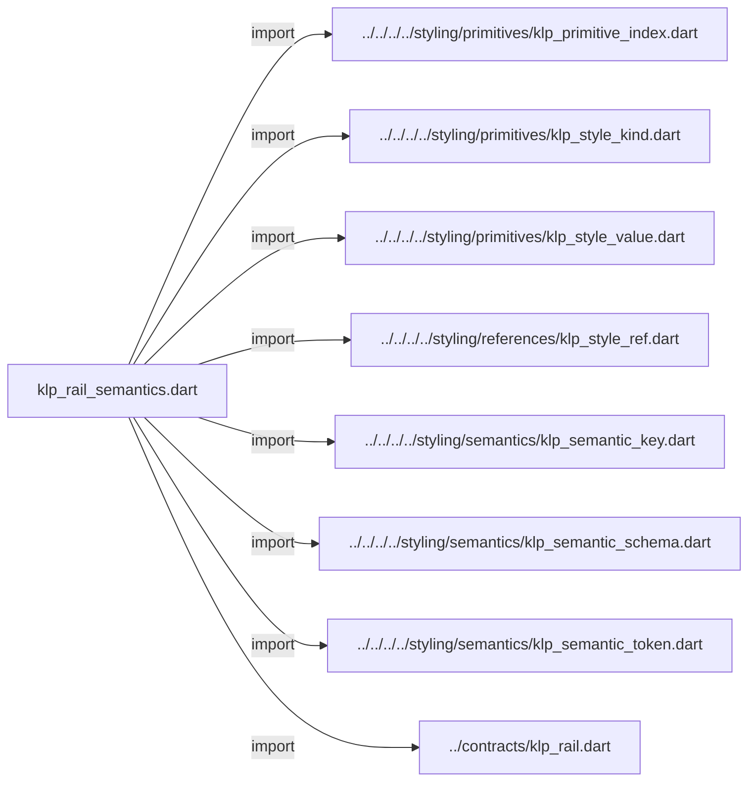
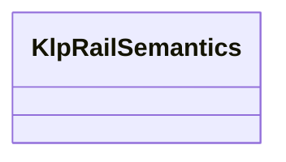

# klp_rail_semantics.dart：直接依賴與宣告架構

[回到目錄](README.md) · [來源檔案](../../../../../../../lib/src/features/navigation/rail/internal/klp_rail_semantics.dart)

## 範圍

核心是 `lib/src/features/navigation/rail/internal/klp_rail_semantics.dart`。主要視角為該檔案明寫的 import／export／part；輔助視角為本檔宣告及 extends／implements／with／on 關係。只展開一層外部邊界。

## 直接依賴圖

## 依賴證據

| 關係 | 原始 directive | 來源 |
|---|---|---|
| import | <code>import &#x27;../../../../styling/primitives/klp_primitive_index.dart&#x27;;</code> | [lib/src/features/navigation/rail/internal/klp_rail_semantics.dart:1](../../../../../../../lib/src/features/navigation/rail/internal/klp_rail_semantics.dart#L1) |
| import | <code>import &#x27;../../../../styling/primitives/klp_style_kind.dart&#x27;;</code> | [lib/src/features/navigation/rail/internal/klp_rail_semantics.dart:2](../../../../../../../lib/src/features/navigation/rail/internal/klp_rail_semantics.dart#L2) |
| import | <code>import &#x27;../../../../styling/primitives/klp_style_value.dart&#x27;;</code> | [lib/src/features/navigation/rail/internal/klp_rail_semantics.dart:3](../../../../../../../lib/src/features/navigation/rail/internal/klp_rail_semantics.dart#L3) |
| import | <code>import &#x27;../../../../styling/references/klp_style_ref.dart&#x27;;</code> | [lib/src/features/navigation/rail/internal/klp_rail_semantics.dart:4](../../../../../../../lib/src/features/navigation/rail/internal/klp_rail_semantics.dart#L4) |
| import | <code>import &#x27;../../../../styling/semantics/klp_semantic_key.dart&#x27;;</code> | [lib/src/features/navigation/rail/internal/klp_rail_semantics.dart:5](../../../../../../../lib/src/features/navigation/rail/internal/klp_rail_semantics.dart#L5) |
| import | <code>import &#x27;../../../../styling/semantics/klp_semantic_schema.dart&#x27;;</code> | [lib/src/features/navigation/rail/internal/klp_rail_semantics.dart:6](../../../../../../../lib/src/features/navigation/rail/internal/klp_rail_semantics.dart#L6) |
| import | <code>import &#x27;../../../../styling/semantics/klp_semantic_token.dart&#x27;;</code> | [lib/src/features/navigation/rail/internal/klp_rail_semantics.dart:7](../../../../../../../lib/src/features/navigation/rail/internal/klp_rail_semantics.dart#L7) |
| import | <code>import &#x27;../contracts/klp_rail.dart&#x27;;</code> | [lib/src/features/navigation/rail/internal/klp_rail_semantics.dart:8](../../../../../../../lib/src/features/navigation/rail/internal/klp_rail_semantics.dart#L8) |

## 宣告關係圖

本組節點是本檔宣告；沒有箭頭的宣告未在此圖主張互相依賴。

## 宣告與成員證據

成員包含 public 與 private；簽章取自來源，省略函式本體與欄位初始值。`(inferred)` 表示來源未明寫型別；建構子只顯示參數部分，不含初始化列表。

### KlpRailSemantics

ClassDeclaration · public · [lib/src/features/navigation/rail/internal/klp_rail_semantics.dart:10](../../../../../../../lib/src/features/navigation/rail/internal/klp_rail_semantics.dart#L10)

<code>final class KlpRailSemantics</code>

來源註解摘要：本庫內部實驗映射；不是正式預設風格，也不授權消費端覆寫用途。

| 成員 | 可見性 | 簽章／型別 | 來源註解摘要 | 證據 |
|---|---|---|---|---|
| field <code>background</code> | public | <code>static final (inferred) background</code> |  | [lib/src/features/navigation/rail/internal/klp_rail_semantics.dart:13](../../../../../../../lib/src/features/navigation/rail/internal/klp_rail_semantics.dart#L13) |
| field <code>itemBackground</code> | public | <code>static final (inferred) itemBackground</code> |  | [lib/src/features/navigation/rail/internal/klp_rail_semantics.dart:14](../../../../../../../lib/src/features/navigation/rail/internal/klp_rail_semantics.dart#L14) |
| field <code>selectedBackground</code> | public | <code>static final (inferred) selectedBackground</code> |  | [lib/src/features/navigation/rail/internal/klp_rail_semantics.dart:15](../../../../../../../lib/src/features/navigation/rail/internal/klp_rail_semantics.dart#L15) |
| field <code>focusColor</code> | public | <code>static final (inferred) focusColor</code> |  | [lib/src/features/navigation/rail/internal/klp_rail_semantics.dart:16](../../../../../../../lib/src/features/navigation/rail/internal/klp_rail_semantics.dart#L16) |
| field <code>width</code> | public | <code>static final (inferred) width</code> |  | [lib/src/features/navigation/rail/internal/klp_rail_semantics.dart:17](../../../../../../../lib/src/features/navigation/rail/internal/klp_rail_semantics.dart#L17) |
| field <code>itemExtent</code> | public | <code>static final (inferred) itemExtent</code> |  | [lib/src/features/navigation/rail/internal/klp_rail_semantics.dart:18](../../../../../../../lib/src/features/navigation/rail/internal/klp_rail_semantics.dart#L18) |
| field <code>inset</code> | public | <code>static final (inferred) inset</code> |  | [lib/src/features/navigation/rail/internal/klp_rail_semantics.dart:19](../../../../../../../lib/src/features/navigation/rail/internal/klp_rail_semantics.dart#L19) |
| field <code>gap</code> | public | <code>static final (inferred) gap</code> |  | [lib/src/features/navigation/rail/internal/klp_rail_semantics.dart:20](../../../../../../../lib/src/features/navigation/rail/internal/klp_rail_semantics.dart#L20) |
| field <code>radius</code> | public | <code>static final (inferred) radius</code> |  | [lib/src/features/navigation/rail/internal/klp_rail_semantics.dart:21](../../../../../../../lib/src/features/navigation/rail/internal/klp_rail_semantics.dart#L21) |
| field <code>focusWidth</code> | public | <code>static final (inferred) focusWidth</code> |  | [lib/src/features/navigation/rail/internal/klp_rail_semantics.dart:22](../../../../../../../lib/src/features/navigation/rail/internal/klp_rail_semantics.dart#L22) |
| method <code>_token</code> | private | <code>static KlpSemanticToken&lt;T&gt; _token&lt;T extends KlpStyleValue&gt;(KlpSemanticKey&lt;T&gt; key, KlpPrimitiveIndex index)</code> |  | [lib/src/features/navigation/rail/internal/klp_rail_semantics.dart:24](../../../../../../../lib/src/features/navigation/rail/internal/klp_rail_semantics.dart#L24) |
| method <code>createSchema</code> | public | <code>static KlpSemanticSchema createSchema()</code> |  | [lib/src/features/navigation/rail/internal/klp_rail_semantics.dart:26](../../../../../../../lib/src/features/navigation/rail/internal/klp_rail_semantics.dart#L26) |

## 閱讀說明與限制

箭頭只表示來源明寫的靜態關係；import 不等於呼叫。未分析動態呼叫、欄位的實際物件擁有權、狀態轉移或渲染流程；型別未進行語意解析，繼承目標保留原始型別拼寫。public／private 依 Dart 名稱前綴判斷；public 宣告不代表已由 `lib/kallopis.dart` 匯出。

本頁由 `tool/architecture_atlas` 產生；編輯來源或生成工具後重新產生，避免手改本頁。
