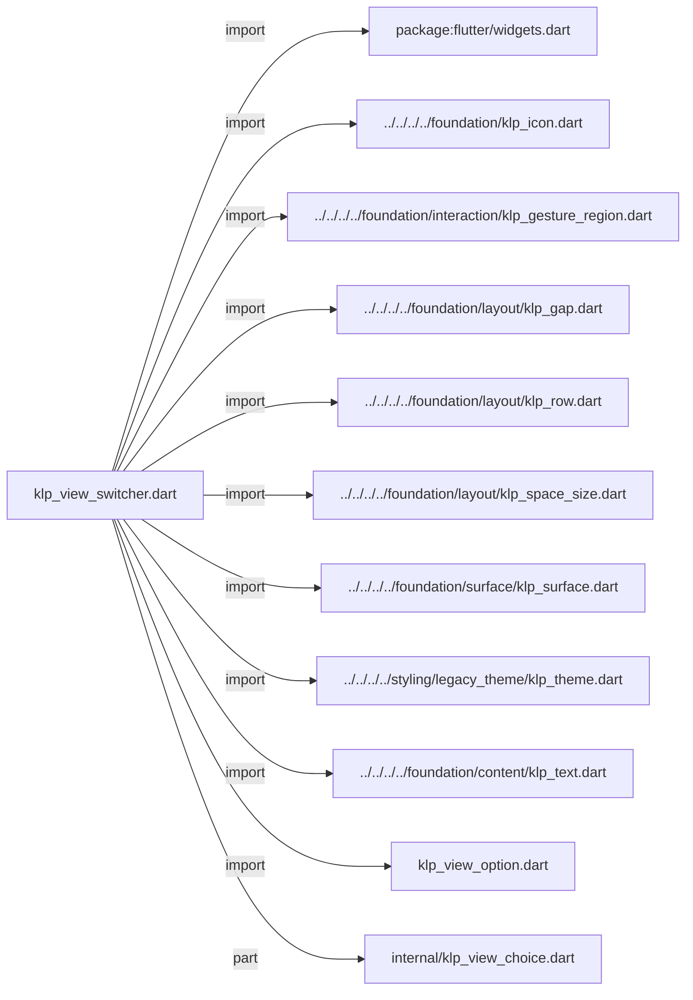
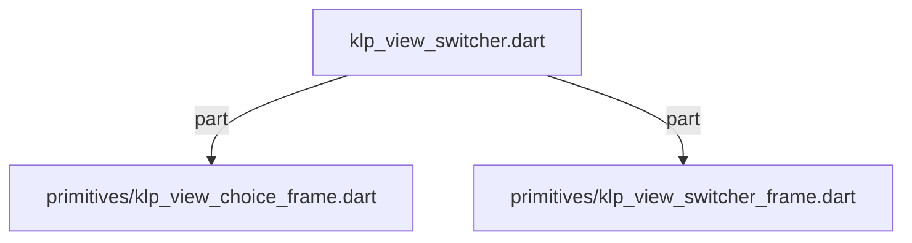
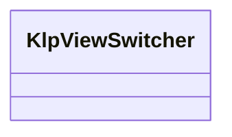
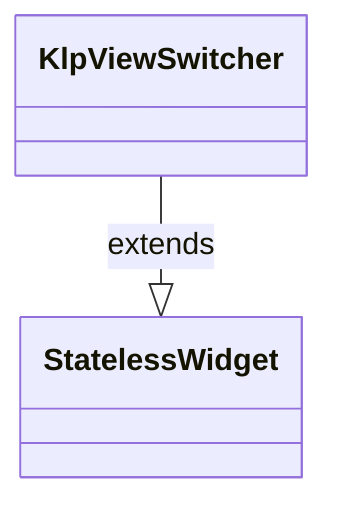

# klp_view_switcher.dart：直接依賴與宣告架構

[回到目錄](README.md) · [來源檔案](../../../../../../../lib/src/features/navigation/widgets/controls/klp_view_switcher.dart)

## 範圍

核心是 `lib/src/features/navigation/widgets/controls/klp_view_switcher.dart`。主要視角為該檔案明寫的 import／export／part；輔助視角為本檔宣告及 extends／implements／with／on 關係。只展開一層外部邊界。

## 直接依賴圖

## 依賴證據

| 關係 | 原始 directive | 來源 |
|---|---|---|
| import | <code>import &#x27;package:flutter/widgets.dart&#x27;;</code> | [lib/src/features/navigation/widgets/controls/klp_view_switcher.dart:1](../../../../../../../lib/src/features/navigation/widgets/controls/klp_view_switcher.dart#L1) |
| import | <code>import &#x27;../../../../foundation/klp_icon.dart&#x27;;</code> | [lib/src/features/navigation/widgets/controls/klp_view_switcher.dart:3](../../../../../../../lib/src/features/navigation/widgets/controls/klp_view_switcher.dart#L3) |
| import | <code>import &#x27;../../../../foundation/interaction/klp_gesture_region.dart&#x27;;</code> | [lib/src/features/navigation/widgets/controls/klp_view_switcher.dart:4](../../../../../../../lib/src/features/navigation/widgets/controls/klp_view_switcher.dart#L4) |
| import | <code>import &#x27;../../../../foundation/layout/klp_gap.dart&#x27;;</code> | [lib/src/features/navigation/widgets/controls/klp_view_switcher.dart:5](../../../../../../../lib/src/features/navigation/widgets/controls/klp_view_switcher.dart#L5) |
| import | <code>import &#x27;../../../../foundation/layout/klp_row.dart&#x27;;</code> | [lib/src/features/navigation/widgets/controls/klp_view_switcher.dart:6](../../../../../../../lib/src/features/navigation/widgets/controls/klp_view_switcher.dart#L6) |
| import | <code>import &#x27;../../../../foundation/layout/klp_space_size.dart&#x27;;</code> | [lib/src/features/navigation/widgets/controls/klp_view_switcher.dart:7](../../../../../../../lib/src/features/navigation/widgets/controls/klp_view_switcher.dart#L7) |
| import | <code>import &#x27;../../../../foundation/surface/klp_surface.dart&#x27;;</code> | [lib/src/features/navigation/widgets/controls/klp_view_switcher.dart:8](../../../../../../../lib/src/features/navigation/widgets/controls/klp_view_switcher.dart#L8) |
| import | <code>import &#x27;../../../../styling/legacy_theme/klp_theme.dart&#x27;;</code> | [lib/src/features/navigation/widgets/controls/klp_view_switcher.dart:9](../../../../../../../lib/src/features/navigation/widgets/controls/klp_view_switcher.dart#L9) |
| import | <code>import &#x27;../../../../foundation/content/klp_text.dart&#x27;;</code> | [lib/src/features/navigation/widgets/controls/klp_view_switcher.dart:10](../../../../../../../lib/src/features/navigation/widgets/controls/klp_view_switcher.dart#L10) |
| import | <code>import &#x27;klp_view_option.dart&#x27;;</code> | [lib/src/features/navigation/widgets/controls/klp_view_switcher.dart:11](../../../../../../../lib/src/features/navigation/widgets/controls/klp_view_switcher.dart#L11) |
| part | <code>part &#x27;internal/klp_view_choice.dart&#x27;;</code> | [lib/src/features/navigation/widgets/controls/klp_view_switcher.dart:13](../../../../../../../lib/src/features/navigation/widgets/controls/klp_view_switcher.dart#L13) |
| part | <code>part &#x27;primitives/klp_view_choice_frame.dart&#x27;;</code> | [lib/src/features/navigation/widgets/controls/klp_view_switcher.dart:14](../../../../../../../lib/src/features/navigation/widgets/controls/klp_view_switcher.dart#L14) |
| part | <code>part &#x27;primitives/klp_view_switcher_frame.dart&#x27;;</code> | [lib/src/features/navigation/widgets/controls/klp_view_switcher.dart:15](../../../../../../../lib/src/features/navigation/widgets/controls/klp_view_switcher.dart#L15) |

## 宣告關係圖

本組節點是本檔宣告；沒有箭頭的宣告未在此圖主張互相依賴。

## 宣告與成員證據

成員包含 public 與 private；簽章取自來源，省略函式本體與欄位初始值。`(inferred)` 表示來源未明寫型別；建構子只顯示參數部分，不含初始化列表。

### KlpViewSwitcher

ClassDeclaration · public · [lib/src/features/navigation/widgets/controls/klp_view_switcher.dart:17](../../../../../../../lib/src/features/navigation/widgets/controls/klp_view_switcher.dart#L17)

<code>class KlpViewSwitcher extends StatelessWidget</code>

來源註解摘要：以輕量分段表面呈現同層級檢視的受控切換器。

- `extends` → <code>StatelessWidget</code>：[lib/src/features/navigation/widgets/controls/klp_view_switcher.dart:18](../../../../../../../lib/src/features/navigation/widgets/controls/klp_view_switcher.dart#L18)

| 成員 | 可見性 | 簽章／型別 | 來源註解摘要 | 證據 |
|---|---|---|---|---|
| constructor <code>KlpViewSwitcher</code> | public | <code>const KlpViewSwitcher({ super.key, required this.options, required this.selectedId, required this.onSelected, })</code> |  | [lib/src/features/navigation/widgets/controls/klp_view_switcher.dart:19](../../../../../../../lib/src/features/navigation/widgets/controls/klp_view_switcher.dart#L19) |
| field <code>options</code> | public | <code>final List&lt;KlpViewOption&gt; options</code> |  | [lib/src/features/navigation/widgets/controls/klp_view_switcher.dart:26](../../../../../../../lib/src/features/navigation/widgets/controls/klp_view_switcher.dart#L26) |
| field <code>selectedId</code> | public | <code>final String selectedId</code> |  | [lib/src/features/navigation/widgets/controls/klp_view_switcher.dart:27](../../../../../../../lib/src/features/navigation/widgets/controls/klp_view_switcher.dart#L27) |
| field <code>onSelected</code> | public | <code>final ValueChanged&lt;String&gt;? onSelected</code> |  | [lib/src/features/navigation/widgets/controls/klp_view_switcher.dart:28](../../../../../../../lib/src/features/navigation/widgets/controls/klp_view_switcher.dart#L28) |
| method <code>build</code> | public | <code>Widget build(BuildContext context)</code> |  | [lib/src/features/navigation/widgets/controls/klp_view_switcher.dart:30](../../../../../../../lib/src/features/navigation/widgets/controls/klp_view_switcher.dart#L30) |

## 閱讀說明與限制

箭頭只表示來源明寫的靜態關係；import 不等於呼叫。未分析動態呼叫、欄位的實際物件擁有權、狀態轉移或渲染流程；型別未進行語意解析，繼承目標保留原始型別拼寫。public／private 依 Dart 名稱前綴判斷；public 宣告不代表已由 `lib/kallopis.dart` 匯出。

本頁由 `tool/architecture_atlas` 產生；編輯來源或生成工具後重新產生，避免手改本頁。
