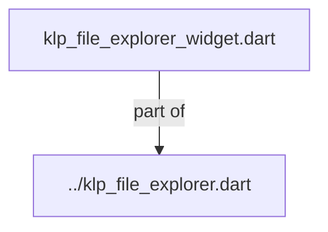
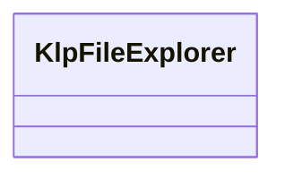
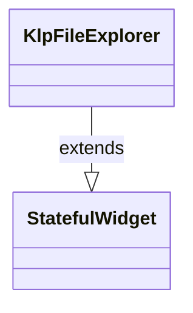

# klp_file_explorer_widget.dart：直接依賴與宣告架構

[回到目錄](README.md) · [來源檔案](../../../../../../../../lib/src/features/navigation/widgets/explorer/internal/klp_file_explorer_widget.dart)

## 範圍

核心是 `lib/src/features/navigation/widgets/explorer/internal/klp_file_explorer_widget.dart`。主要視角為該檔案明寫的 import／export／part；輔助視角為本檔宣告及 extends／implements／with／on 關係。只展開一層外部邊界。

## 直接依賴圖

## 依賴證據

| 關係 | 原始 directive | 來源 |
|---|---|---|
| part of | <code>part of &#x27;../klp_file_explorer.dart&#x27;;</code> | [lib/src/features/navigation/widgets/explorer/internal/klp_file_explorer_widget.dart:1](../../../../../../../../lib/src/features/navigation/widgets/explorer/internal/klp_file_explorer_widget.dart#L1) |

## 宣告關係圖

本組節點是本檔宣告；沒有箭頭的宣告未在此圖主張互相依賴。

## 宣告與成員證據

成員包含 public 與 private；簽章取自來源，省略函式本體與欄位初始值。`(inferred)` 表示來源未明寫型別；建構子只顯示參數部分，不含初始化列表。

### KlpFileExplorer

ClassDeclaration · public · [lib/src/features/navigation/widgets/explorer/internal/klp_file_explorer_widget.dart:3](../../../../../../../../lib/src/features/navigation/widgets/explorer/internal/klp_file_explorer_widget.dart#L3)

<code>class KlpFileExplorer extends StatefulWidget</code>

來源註解摘要：檔案瀏覽器（File Explorer）。 支援分類分組（可折疊）、資料夾樹狀結構（可展開）與一般檔案節點選取。 支援受控（傳入 `expandedSectionIds` / `expandedItemIds` / `selectedId`） 與非受控（讀取各 Section 與 Item 的 `expanded` / `selected` 屬性）兩種模式。

- `extends` → <code>StatefulWidget</code>：[lib/src/features/navigation/widgets/explorer/internal/klp_file_explorer_widget.dart:8](../../../../../../../../lib/src/features/navigation/widgets/explorer/internal/klp_file_explorer_widget.dart#L8)

| 成員 | 可見性 | 簽章／型別 | 來源註解摘要 | 證據 |
|---|---|---|---|---|
| constructor <code>KlpFileExplorer</code> | public | <code>const KlpFileExplorer({ super.key, required this.sections, this.expandedSectionIds, this.expandedItemIds, this.selectedId, this.onSectionToggle, this.onItemToggle, this.onItemSelected, this.spacing = KlpFileExplorerSpacing.standard, this.emptyStateSections = const [], this.scrollController, })</code> |  | [lib/src/features/navigation/widgets/explorer/internal/klp_file_explorer_widget.dart:9](../../../../../../../../lib/src/features/navigation/widgets/explorer/internal/klp_file_explorer_widget.dart#L9) |
| field <code>sections</code> | public | <code>final List&lt;KlpFileExplorerSection&gt; sections</code> |  | [lib/src/features/navigation/widgets/explorer/internal/klp_file_explorer_widget.dart:23](../../../../../../../../lib/src/features/navigation/widgets/explorer/internal/klp_file_explorer_widget.dart#L23) |
| field <code>expandedSectionIds</code> | public | <code>final Set&lt;String&gt;? expandedSectionIds</code> |  | [lib/src/features/navigation/widgets/explorer/internal/klp_file_explorer_widget.dart:24](../../../../../../../../lib/src/features/navigation/widgets/explorer/internal/klp_file_explorer_widget.dart#L24) |
| field <code>expandedItemIds</code> | public | <code>final Set&lt;String&gt;? expandedItemIds</code> |  | [lib/src/features/navigation/widgets/explorer/internal/klp_file_explorer_widget.dart:25](../../../../../../../../lib/src/features/navigation/widgets/explorer/internal/klp_file_explorer_widget.dart#L25) |
| field <code>selectedId</code> | public | <code>final String? selectedId</code> |  | [lib/src/features/navigation/widgets/explorer/internal/klp_file_explorer_widget.dart:26](../../../../../../../../lib/src/features/navigation/widgets/explorer/internal/klp_file_explorer_widget.dart#L26) |
| field <code>onSectionToggle</code> | public | <code>final ValueChanged&lt;String&gt;? onSectionToggle</code> |  | [lib/src/features/navigation/widgets/explorer/internal/klp_file_explorer_widget.dart:27](../../../../../../../../lib/src/features/navigation/widgets/explorer/internal/klp_file_explorer_widget.dart#L27) |
| field <code>onItemToggle</code> | public | <code>final ValueChanged&lt;String&gt;? onItemToggle</code> |  | [lib/src/features/navigation/widgets/explorer/internal/klp_file_explorer_widget.dart:28](../../../../../../../../lib/src/features/navigation/widgets/explorer/internal/klp_file_explorer_widget.dart#L28) |
| field <code>onItemSelected</code> | public | <code>final ValueChanged&lt;String&gt;? onItemSelected</code> |  | [lib/src/features/navigation/widgets/explorer/internal/klp_file_explorer_widget.dart:29](../../../../../../../../lib/src/features/navigation/widgets/explorer/internal/klp_file_explorer_widget.dart#L29) |
| field <code>spacing</code> | public | <code>final KlpFileExplorerSpacing spacing</code> |  | [lib/src/features/navigation/widgets/explorer/internal/klp_file_explorer_widget.dart:30](../../../../../../../../lib/src/features/navigation/widgets/explorer/internal/klp_file_explorer_widget.dart#L30) |
| field <code>scrollController</code> | public | <code>final ScrollController? scrollController</code> |  | [lib/src/features/navigation/widgets/explorer/internal/klp_file_explorer_widget.dart:31](../../../../../../../../lib/src/features/navigation/widgets/explorer/internal/klp_file_explorer_widget.dart#L31) |
| field <code>emptyStateSections</code> | public | <code>final List&lt;KlpFileExplorerSection&gt; emptyStateSections</code> | [sections] 沒有資料時仍需保留的視覺分區。 這只描述 Explorer 結構，不會把 placeholder section 寫回資料模型。 | [lib/src/features/navigation/widgets/explorer/internal/klp_file_explorer_widget.dart:36](../../../../../../../../lib/src/features/navigation/widgets/explorer/internal/klp_file_explorer_widget.dart#L36) |
| method <code>createState</code> | public | <code>State&lt;KlpFileExplorer&gt; createState()</code> |  | [lib/src/features/navigation/widgets/explorer/internal/klp_file_explorer_widget.dart:38](../../../../../../../../lib/src/features/navigation/widgets/explorer/internal/klp_file_explorer_widget.dart#L38) |

## 閱讀說明與限制

箭頭只表示來源明寫的靜態關係；import 不等於呼叫。未分析動態呼叫、欄位的實際物件擁有權、狀態轉移或渲染流程；型別未進行語意解析，繼承目標保留原始型別拼寫。public／private 依 Dart 名稱前綴判斷；public 宣告不代表已由 `lib/kallopis.dart` 匯出。

本頁由 `tool/architecture_atlas` 產生；編輯來源或生成工具後重新產生，避免手改本頁。
