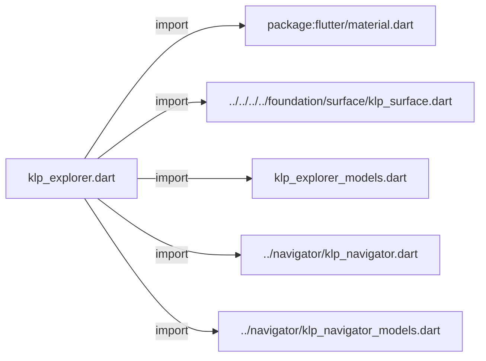
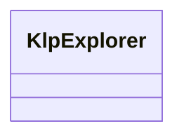
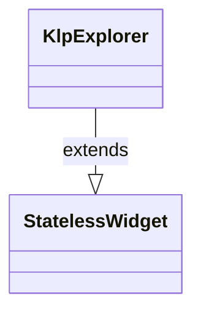

# klp_explorer.dart：直接依賴與宣告架構

[回到目錄](README.md) · [來源檔案](../../../../../../../lib/src/features/navigation/widgets/explorer/klp_explorer.dart)

## 範圍

核心是 `lib/src/features/navigation/widgets/explorer/klp_explorer.dart`。主要視角為該檔案明寫的 import／export／part；輔助視角為本檔宣告及 extends／implements／with／on 關係。只展開一層外部邊界。

## 直接依賴圖

## 依賴證據

| 關係 | 原始 directive | 來源 |
|---|---|---|
| import | <code>import &#x27;package:flutter/material.dart&#x27;;</code> | [lib/src/features/navigation/widgets/explorer/klp_explorer.dart:1](../../../../../../../lib/src/features/navigation/widgets/explorer/klp_explorer.dart#L1) |
| import | <code>import &#x27;../../../../foundation/surface/klp_surface.dart&#x27;;</code> | [lib/src/features/navigation/widgets/explorer/klp_explorer.dart:3](../../../../../../../lib/src/features/navigation/widgets/explorer/klp_explorer.dart#L3) |
| import | <code>import &#x27;klp_explorer_models.dart&#x27;;</code> | [lib/src/features/navigation/widgets/explorer/klp_explorer.dart:4](../../../../../../../lib/src/features/navigation/widgets/explorer/klp_explorer.dart#L4) |
| import | <code>import &#x27;../navigator/klp_navigator.dart&#x27;;</code> | [lib/src/features/navigation/widgets/explorer/klp_explorer.dart:5](../../../../../../../lib/src/features/navigation/widgets/explorer/klp_explorer.dart#L5) |
| import | <code>import &#x27;../navigator/klp_navigator_models.dart&#x27;;</code> | [lib/src/features/navigation/widgets/explorer/klp_explorer.dart:6](../../../../../../../lib/src/features/navigation/widgets/explorer/klp_explorer.dart#L6) |

## 宣告關係圖

本組節點是本檔宣告；沒有箭頭的宣告未在此圖主張互相依賴。

## 宣告與成員證據

成員包含 public 與 private；簽章取自來源，省略函式本體與欄位初始值。`(inferred)` 表示來源未明寫型別；建構子只顯示參數部分，不含初始化列表。

### KlpExplorer

ClassDeclaration · public · [lib/src/features/navigation/widgets/explorer/klp_explorer.dart:8](../../../../../../../lib/src/features/navigation/widgets/explorer/klp_explorer.dart#L8)

<code>class KlpExplorer extends StatelessWidget</code>

來源註解摘要：具有統一表面、分類與節點排版的 Explorer。 產品只提供 [categories] 與互動 callback。分類節奏、節點列高、縮排與 表面層級全由 Kallopis 管理；查詢、搜尋 UI 與後端資料取得由產品負責。

- `extends` → <code>StatelessWidget</code>：[lib/src/features/navigation/widgets/explorer/klp_explorer.dart:12](../../../../../../../lib/src/features/navigation/widgets/explorer/klp_explorer.dart#L12)

| 成員 | 可見性 | 簽章／型別 | 來源註解摘要 | 證據 |
|---|---|---|---|---|
| constructor <code>KlpExplorer</code> | public | <code>const KlpExplorer({ super.key, required this.categories, this.allowNesting = true, this.selectedNodeId, this.expandedCategoryIds, this.expandedNodeIds, this.onCategoryToggle, this.onNodeToggle, this.onNodeSelected, this.surfaceTone = KlpSurfaceTone.inset, this.scrollKey, this.scrollController, })</code> |  | [lib/src/features/navigation/widgets/explorer/klp_explorer.dart:13](../../../../../../../lib/src/features/navigation/widgets/explorer/klp_explorer.dart#L13) |
| field <code>categories</code> | public | <code>final List&lt;KlpExplorerCategory&gt; categories</code> |  | [lib/src/features/navigation/widgets/explorer/klp_explorer.dart:28](../../../../../../../lib/src/features/navigation/widgets/explorer/klp_explorer.dart#L28) |
| field <code>allowNesting</code> | public | <code>final bool allowNesting</code> | 是否以樹狀階層呈現節點。 `false` 時會以穩定的前序順序展平既有子節點，並且不顯示 展開控制；資料夾與檔案仍保留各自的 icon 語意。 | [lib/src/features/navigation/widgets/explorer/klp_explorer.dart:34](../../../../../../../lib/src/features/navigation/widgets/explorer/klp_explorer.dart#L34) |
| field <code>selectedNodeId</code> | public | <code>final String? selectedNodeId</code> |  | [lib/src/features/navigation/widgets/explorer/klp_explorer.dart:35](../../../../../../../lib/src/features/navigation/widgets/explorer/klp_explorer.dart#L35) |
| field <code>expandedCategoryIds</code> | public | <code>final Set&lt;String&gt;? expandedCategoryIds</code> |  | [lib/src/features/navigation/widgets/explorer/klp_explorer.dart:36](../../../../../../../lib/src/features/navigation/widgets/explorer/klp_explorer.dart#L36) |
| field <code>expandedNodeIds</code> | public | <code>final Set&lt;String&gt;? expandedNodeIds</code> |  | [lib/src/features/navigation/widgets/explorer/klp_explorer.dart:37](../../../../../../../lib/src/features/navigation/widgets/explorer/klp_explorer.dart#L37) |
| field <code>onCategoryToggle</code> | public | <code>final ValueChanged&lt;String&gt;? onCategoryToggle</code> |  | [lib/src/features/navigation/widgets/explorer/klp_explorer.dart:38](../../../../../../../lib/src/features/navigation/widgets/explorer/klp_explorer.dart#L38) |
| field <code>onNodeToggle</code> | public | <code>final ValueChanged&lt;String&gt;? onNodeToggle</code> |  | [lib/src/features/navigation/widgets/explorer/klp_explorer.dart:39](../../../../../../../lib/src/features/navigation/widgets/explorer/klp_explorer.dart#L39) |
| field <code>onNodeSelected</code> | public | <code>final ValueChanged&lt;String&gt;? onNodeSelected</code> |  | [lib/src/features/navigation/widgets/explorer/klp_explorer.dart:40](../../../../../../../lib/src/features/navigation/widgets/explorer/klp_explorer.dart#L40) |
| field <code>surfaceTone</code> | public | <code>final KlpSurfaceTone surfaceTone</code> |  | [lib/src/features/navigation/widgets/explorer/klp_explorer.dart:41](../../../../../../../lib/src/features/navigation/widgets/explorer/klp_explorer.dart#L41) |
| field <code>scrollKey</code> | public | <code>final Key? scrollKey</code> |  | [lib/src/features/navigation/widgets/explorer/klp_explorer.dart:42](../../../../../../../lib/src/features/navigation/widgets/explorer/klp_explorer.dart#L42) |
| field <code>scrollController</code> | public | <code>final ScrollController? scrollController</code> |  | [lib/src/features/navigation/widgets/explorer/klp_explorer.dart:43](../../../../../../../lib/src/features/navigation/widgets/explorer/klp_explorer.dart#L43) |
| method <code>build</code> | public | <code>Widget build(BuildContext context)</code> |  | [lib/src/features/navigation/widgets/explorer/klp_explorer.dart:45](../../../../../../../lib/src/features/navigation/widgets/explorer/klp_explorer.dart#L45) |
| method <code>_nodesForNestingPolicy</code> | private | <code>List&lt;KlpExplorerNode&gt; _nodesForNestingPolicy(List&lt;KlpExplorerNode&gt; nodes)</code> |  | [lib/src/features/navigation/widgets/explorer/klp_explorer.dart:73](../../../../../../../lib/src/features/navigation/widgets/explorer/klp_explorer.dart#L73) |
| method <code>_toNavigatorElement</code> | private | <code>KlpNavigatorElement _toNavigatorElement(KlpExplorerNode node)</code> |  | [lib/src/features/navigation/widgets/explorer/klp_explorer.dart:100](../../../../../../../lib/src/features/navigation/widgets/explorer/klp_explorer.dart#L100) |

## 閱讀說明與限制

箭頭只表示來源明寫的靜態關係；import 不等於呼叫。未分析動態呼叫、欄位的實際物件擁有權、狀態轉移或渲染流程；型別未進行語意解析，繼承目標保留原始型別拼寫。public／private 依 Dart 名稱前綴判斷；public 宣告不代表已由 `lib/kallopis.dart` 匯出。

本頁由 `tool/architecture_atlas` 產生；編輯來源或生成工具後重新產生，避免手改本頁。
