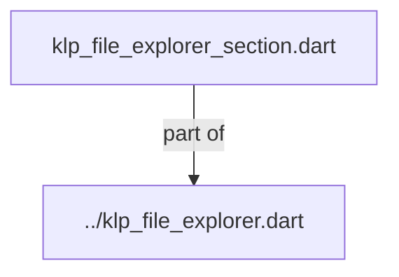
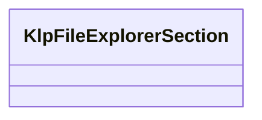
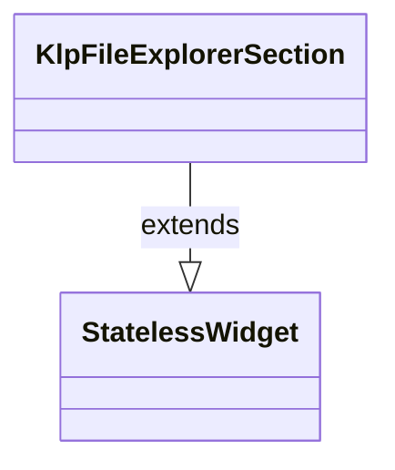

# klp_file_explorer_section.dart：直接依賴與宣告架構

[回到目錄](README.md) · [來源檔案](../../../../../../../../lib/src/features/navigation/widgets/explorer/models/klp_file_explorer_section.dart)

## 範圍

核心是 `lib/src/features/navigation/widgets/explorer/models/klp_file_explorer_section.dart`。主要視角為該檔案明寫的 import／export／part；輔助視角為本檔宣告及 extends／implements／with／on 關係。只展開一層外部邊界。

## 直接依賴圖

## 依賴證據

| 關係 | 原始 directive | 來源 |
|---|---|---|
| part of | <code>part of &#x27;../klp_file_explorer.dart&#x27;;</code> | [lib/src/features/navigation/widgets/explorer/models/klp_file_explorer_section.dart:1](../../../../../../../../lib/src/features/navigation/widgets/explorer/models/klp_file_explorer_section.dart#L1) |

## 宣告關係圖

本組節點是本檔宣告；沒有箭頭的宣告未在此圖主張互相依賴。

## 宣告與成員證據

成員包含 public 與 private；簽章取自來源，省略函式本體與欄位初始值。`(inferred)` 表示來源未明寫型別；建構子只顯示參數部分，不含初始化列表。

### KlpFileExplorerSection

ClassDeclaration · public · [lib/src/features/navigation/widgets/explorer/models/klp_file_explorer_section.dart:3](../../../../../../../../lib/src/features/navigation/widgets/explorer/models/klp_file_explorer_section.dart#L3)

<code>class KlpFileExplorerSection extends StatelessWidget</code>

來源註解摘要：檔案瀏覽器中的分類資料模型（例如「釘選」、「筆記」）。

- `extends` → <code>StatelessWidget</code>：[lib/src/features/navigation/widgets/explorer/models/klp_file_explorer_section.dart:5](../../../../../../../../lib/src/features/navigation/widgets/explorer/models/klp_file_explorer_section.dart#L5)

| 成員 | 可見性 | 簽章／型別 | 來源註解摘要 | 證據 |
|---|---|---|---|---|
| constructor <code>KlpFileExplorerSection</code> | public | <code>const KlpFileExplorerSection({ super.key, required this.id, required this.title, this.items = const [], this.expanded = true, this.collapsible = true, this.trailing, })</code> |  | [lib/src/features/navigation/widgets/explorer/models/klp_file_explorer_section.dart:6](../../../../../../../../lib/src/features/navigation/widgets/explorer/models/klp_file_explorer_section.dart#L6) |
| constructor <code>_render</code> | private | <code>KlpFileExplorerSection._render({ required KlpFileExplorerSection section, required Widget child, })</code> |  | [lib/src/features/navigation/widgets/explorer/models/klp_file_explorer_section.dart:16](../../../../../../../../lib/src/features/navigation/widgets/explorer/models/klp_file_explorer_section.dart#L16) |
| field <code>id</code> | public | <code>final String id</code> |  | [lib/src/features/navigation/widgets/explorer/models/klp_file_explorer_section.dart:28](../../../../../../../../lib/src/features/navigation/widgets/explorer/models/klp_file_explorer_section.dart#L28) |
| field <code>title</code> | public | <code>final String title</code> |  | [lib/src/features/navigation/widgets/explorer/models/klp_file_explorer_section.dart:29](../../../../../../../../lib/src/features/navigation/widgets/explorer/models/klp_file_explorer_section.dart#L29) |
| field <code>items</code> | public | <code>final List&lt;KlpFileExplorerItem&gt; items</code> |  | [lib/src/features/navigation/widgets/explorer/models/klp_file_explorer_section.dart:30](../../../../../../../../lib/src/features/navigation/widgets/explorer/models/klp_file_explorer_section.dart#L30) |
| field <code>expanded</code> | public | <code>final bool expanded</code> |  | [lib/src/features/navigation/widgets/explorer/models/klp_file_explorer_section.dart:31](../../../../../../../../lib/src/features/navigation/widgets/explorer/models/klp_file_explorer_section.dart#L31) |
| field <code>collapsible</code> | public | <code>final bool collapsible</code> |  | [lib/src/features/navigation/widgets/explorer/models/klp_file_explorer_section.dart:32](../../../../../../../../lib/src/features/navigation/widgets/explorer/models/klp_file_explorer_section.dart#L32) |
| field <code>trailing</code> | public | <code>final Widget? trailing</code> |  | [lib/src/features/navigation/widgets/explorer/models/klp_file_explorer_section.dart:33](../../../../../../../../lib/src/features/navigation/widgets/explorer/models/klp_file_explorer_section.dart#L33) |
| field <code>_renderedChild</code> | private | <code>final Widget? _renderedChild</code> |  | [lib/src/features/navigation/widgets/explorer/models/klp_file_explorer_section.dart:34](../../../../../../../../lib/src/features/navigation/widgets/explorer/models/klp_file_explorer_section.dart#L34) |
| method <code>build</code> | public | <code>Widget build(BuildContext context)</code> |  | [lib/src/features/navigation/widgets/explorer/models/klp_file_explorer_section.dart:36](../../../../../../../../lib/src/features/navigation/widgets/explorer/models/klp_file_explorer_section.dart#L36) |

## 閱讀說明與限制

箭頭只表示來源明寫的靜態關係；import 不等於呼叫。未分析動態呼叫、欄位的實際物件擁有權、狀態轉移或渲染流程；型別未進行語意解析，繼承目標保留原始型別拼寫。public／private 依 Dart 名稱前綴判斷；public 宣告不代表已由 `lib/kallopis.dart` 匯出。

本頁由 `tool/architecture_atlas` 產生；編輯來源或生成工具後重新產生，避免手改本頁。
