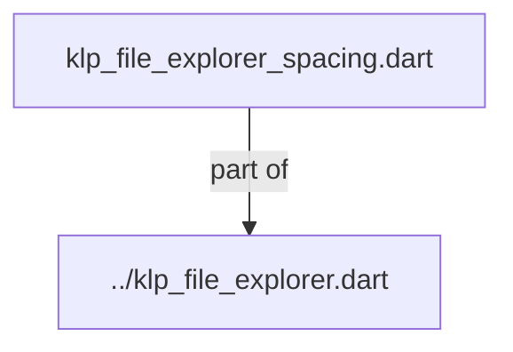
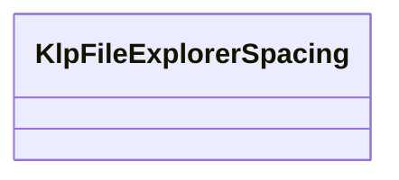

# klp_file_explorer_spacing.dart：直接依賴與宣告架構

[回到目錄](README.md) · [來源檔案](../../../../../../../../lib/src/features/navigation/widgets/explorer/models/klp_file_explorer_spacing.dart)

## 範圍

核心是 `lib/src/features/navigation/widgets/explorer/models/klp_file_explorer_spacing.dart`。主要視角為該檔案明寫的 import／export／part；輔助視角為本檔宣告及 extends／implements／with／on 關係。只展開一層外部邊界。

## 直接依賴圖

## 依賴證據

| 關係 | 原始 directive | 來源 |
|---|---|---|
| part of | <code>part of &#x27;../klp_file_explorer.dart&#x27;;</code> | [lib/src/features/navigation/widgets/explorer/models/klp_file_explorer_spacing.dart:1](../../../../../../../../lib/src/features/navigation/widgets/explorer/models/klp_file_explorer_spacing.dart#L1) |

## 宣告關係圖

本組節點是本檔宣告；沒有箭頭的宣告未在此圖主張互相依賴。

## 宣告與成員證據

成員包含 public 與 private；簽章取自來源，省略函式本體與欄位初始值。`(inferred)` 表示來源未明寫型別；建構子只顯示參數部分，不含初始化列表。

### KlpFileExplorerSpacing

EnumDeclaration · public · [lib/src/features/navigation/widgets/explorer/models/klp_file_explorer_spacing.dart:3](../../../../../../../../lib/src/features/navigation/widgets/explorer/models/klp_file_explorer_spacing.dart#L3)

<code>enum KlpFileExplorerSpacing</code>

來源註解摘要：Explorer 的語意間距配方，避免消費者注入 Flutter 幾何物件。

| 成員 | 可見性 | 簽章／型別 | 來源註解摘要 | 證據 |
|---|---|---|---|---|
| enum value <code>standard</code> | public | <code>standard</code> | 一般獨立 Explorer 的導覽內距。 | [lib/src/features/navigation/widgets/explorer/models/klp_file_explorer_spacing.dart:5](../../../../../../../../lib/src/features/navigation/widgets/explorer/models/klp_file_explorer_spacing.dart#L5) |
| enum value <code>relaxed</code> | public | <code>relaxed</code> | 需要較寬樹狀層級節奏的 Explorer。 | [lib/src/features/navigation/widgets/explorer/models/klp_file_explorer_spacing.dart:8](../../../../../../../../lib/src/features/navigation/widgets/explorer/models/klp_file_explorer_spacing.dart#L8) |
| enum value <code>flush</code> | public | <code>flush</code> | 已由外層 Panel 提供 gutter 時使用的貼齊配方。 | [lib/src/features/navigation/widgets/explorer/models/klp_file_explorer_spacing.dart:11](../../../../../../../../lib/src/features/navigation/widgets/explorer/models/klp_file_explorer_spacing.dart#L11) |
| method <code>indent</code> | public | <code>double indent(BuildContext context)</code> |  | [lib/src/features/navigation/widgets/explorer/models/klp_file_explorer_spacing.dart:14](../../../../../../../../lib/src/features/navigation/widgets/explorer/models/klp_file_explorer_spacing.dart#L14) |
| method <code>sectionPadding</code> | public | <code>KlpBoxInsets sectionPadding(BuildContext context)</code> |  | [lib/src/features/navigation/widgets/explorer/models/klp_file_explorer_spacing.dart:20](../../../../../../../../lib/src/features/navigation/widgets/explorer/models/klp_file_explorer_spacing.dart#L20) |
| method <code>sectionMargin</code> | public | <code>KlpBoxInsets sectionMargin(BuildContext context)</code> |  | [lib/src/features/navigation/widgets/explorer/models/klp_file_explorer_spacing.dart:32](../../../../../../../../lib/src/features/navigation/widgets/explorer/models/klp_file_explorer_spacing.dart#L32) |
| method <code>itemPadding</code> | public | <code>KlpBoxInsets itemPadding(BuildContext context)</code> |  | [lib/src/features/navigation/widgets/explorer/models/klp_file_explorer_spacing.dart:41](../../../../../../../../lib/src/features/navigation/widgets/explorer/models/klp_file_explorer_spacing.dart#L41) |

## 閱讀說明與限制

箭頭只表示來源明寫的靜態關係；import 不等於呼叫。未分析動態呼叫、欄位的實際物件擁有權、狀態轉移或渲染流程；型別未進行語意解析，繼承目標保留原始型別拼寫。public／private 依 Dart 名稱前綴判斷；public 宣告不代表已由 `lib/kallopis.dart` 匯出。

本頁由 `tool/architecture_atlas` 產生；編輯來源或生成工具後重新產生，避免手改本頁。
