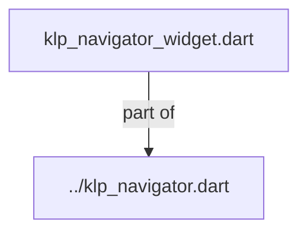
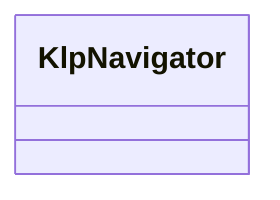
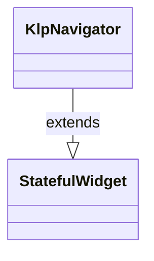

# klp_navigator_widget.dart：直接依賴與宣告架構

[回到目錄](README.md) · [來源檔案](../../../../../../../../lib/src/features/navigation/widgets/navigator/internal/klp_navigator_widget.dart)

## 範圍

核心是 `lib/src/features/navigation/widgets/navigator/internal/klp_navigator_widget.dart`。主要視角為該檔案明寫的 import／export／part；輔助視角為本檔宣告及 extends／implements／with／on 關係。只展開一層外部邊界。

## 直接依賴圖

## 依賴證據

| 關係 | 原始 directive | 來源 |
|---|---|---|
| part of | <code>part of &#x27;../klp_navigator.dart&#x27;;</code> | [lib/src/features/navigation/widgets/navigator/internal/klp_navigator_widget.dart:1](../../../../../../../../lib/src/features/navigation/widgets/navigator/internal/klp_navigator_widget.dart#L1) |

## 宣告關係圖

本組節點是本檔宣告；沒有箭頭的宣告未在此圖主張互相依賴。

## 宣告與成員證據

成員包含 public 與 private；簽章取自來源，省略函式本體與欄位初始值。`(inferred)` 表示來源未明寫型別；建構子只顯示參數部分，不含初始化列表。

### KlpNavigator

ClassDeclaration · public · [lib/src/features/navigation/widgets/navigator/internal/klp_navigator_widget.dart:3](../../../../../../../../lib/src/features/navigation/widgets/navigator/internal/klp_navigator_widget.dart#L3)

<code>class KlpNavigator extends StatefulWidget</code>

來源註解摘要：Sidebar 的通用導覽組成。 Category 與 Element 沿用 Kallopis Catalog 目錄的視覺與高度；Component 是 不受固定列高限制的插槽。產品只提供資料、受控狀態與事件。

- `extends` → <code>StatefulWidget</code>：[lib/src/features/navigation/widgets/navigator/internal/klp_navigator_widget.dart:7](../../../../../../../../lib/src/features/navigation/widgets/navigator/internal/klp_navigator_widget.dart#L7)

| 成員 | 可見性 | 簽章／型別 | 來源註解摘要 | 證據 |
|---|---|---|---|---|
| constructor <code>KlpNavigator</code> | public | <code>const KlpNavigator({ super.key, required this.items, this.expandedCategoryIds, this.expandedElementIds, this.selectedElementId, this.onCategoryToggle, this.onElementToggle, this.onElementSelected, this.surfaceTone = KlpSurfaceTone.inset, this.scrollKey, this.scrollController, })</code> |  | [lib/src/features/navigation/widgets/navigator/internal/klp_navigator_widget.dart:8](../../../../../../../../lib/src/features/navigation/widgets/navigator/internal/klp_navigator_widget.dart#L8) |
| field <code>items</code> | public | <code>final List&lt;KlpNavigatorItem&gt; items</code> |  | [lib/src/features/navigation/widgets/navigator/internal/klp_navigator_widget.dart:22](../../../../../../../../lib/src/features/navigation/widgets/navigator/internal/klp_navigator_widget.dart#L22) |
| field <code>expandedCategoryIds</code> | public | <code>final Set&lt;String&gt;? expandedCategoryIds</code> |  | [lib/src/features/navigation/widgets/navigator/internal/klp_navigator_widget.dart:23](../../../../../../../../lib/src/features/navigation/widgets/navigator/internal/klp_navigator_widget.dart#L23) |
| field <code>expandedElementIds</code> | public | <code>final Set&lt;String&gt;? expandedElementIds</code> |  | [lib/src/features/navigation/widgets/navigator/internal/klp_navigator_widget.dart:24](../../../../../../../../lib/src/features/navigation/widgets/navigator/internal/klp_navigator_widget.dart#L24) |
| field <code>selectedElementId</code> | public | <code>final String? selectedElementId</code> |  | [lib/src/features/navigation/widgets/navigator/internal/klp_navigator_widget.dart:25](../../../../../../../../lib/src/features/navigation/widgets/navigator/internal/klp_navigator_widget.dart#L25) |
| field <code>onCategoryToggle</code> | public | <code>final ValueChanged&lt;String&gt;? onCategoryToggle</code> |  | [lib/src/features/navigation/widgets/navigator/internal/klp_navigator_widget.dart:26](../../../../../../../../lib/src/features/navigation/widgets/navigator/internal/klp_navigator_widget.dart#L26) |
| field <code>onElementToggle</code> | public | <code>final ValueChanged&lt;String&gt;? onElementToggle</code> |  | [lib/src/features/navigation/widgets/navigator/internal/klp_navigator_widget.dart:27](../../../../../../../../lib/src/features/navigation/widgets/navigator/internal/klp_navigator_widget.dart#L27) |
| field <code>onElementSelected</code> | public | <code>final ValueChanged&lt;String&gt;? onElementSelected</code> |  | [lib/src/features/navigation/widgets/navigator/internal/klp_navigator_widget.dart:28](../../../../../../../../lib/src/features/navigation/widgets/navigator/internal/klp_navigator_widget.dart#L28) |
| field <code>surfaceTone</code> | public | <code>final KlpSurfaceTone surfaceTone</code> |  | [lib/src/features/navigation/widgets/navigator/internal/klp_navigator_widget.dart:29](../../../../../../../../lib/src/features/navigation/widgets/navigator/internal/klp_navigator_widget.dart#L29) |
| field <code>scrollKey</code> | public | <code>final Key? scrollKey</code> |  | [lib/src/features/navigation/widgets/navigator/internal/klp_navigator_widget.dart:30](../../../../../../../../lib/src/features/navigation/widgets/navigator/internal/klp_navigator_widget.dart#L30) |
| field <code>scrollController</code> | public | <code>final ScrollController? scrollController</code> |  | [lib/src/features/navigation/widgets/navigator/internal/klp_navigator_widget.dart:31](../../../../../../../../lib/src/features/navigation/widgets/navigator/internal/klp_navigator_widget.dart#L31) |
| method <code>createState</code> | public | <code>State&lt;KlpNavigator&gt; createState()</code> |  | [lib/src/features/navigation/widgets/navigator/internal/klp_navigator_widget.dart:33](../../../../../../../../lib/src/features/navigation/widgets/navigator/internal/klp_navigator_widget.dart#L33) |

## 閱讀說明與限制

箭頭只表示來源明寫的靜態關係；import 不等於呼叫。未分析動態呼叫、欄位的實際物件擁有權、狀態轉移或渲染流程；型別未進行語意解析，繼承目標保留原始型別拼寫。public／private 依 Dart 名稱前綴判斷；public 宣告不代表已由 `lib/kallopis.dart` 匯出。

本頁由 `tool/architecture_atlas` 產生；編輯來源或生成工具後重新產生，避免手改本頁。
