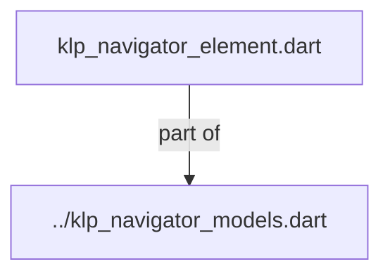
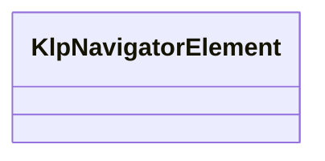
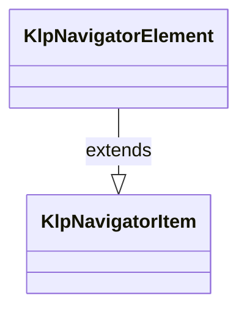

# klp_navigator_element.dart：直接依賴與宣告架構

[回到目錄](README.md) · [來源檔案](../../../../../../../../lib/src/features/navigation/widgets/navigator/models/klp_navigator_element.dart)

## 範圍

核心是 `lib/src/features/navigation/widgets/navigator/models/klp_navigator_element.dart`。主要視角為該檔案明寫的 import／export／part；輔助視角為本檔宣告及 extends／implements／with／on 關係。只展開一層外部邊界。

## 直接依賴圖

## 依賴證據

| 關係 | 原始 directive | 來源 |
|---|---|---|
| part of | <code>part of &#x27;../klp_navigator_models.dart&#x27;;</code> | [lib/src/features/navigation/widgets/navigator/models/klp_navigator_element.dart:1](../../../../../../../../lib/src/features/navigation/widgets/navigator/models/klp_navigator_element.dart#L1) |

## 宣告關係圖

本組節點是本檔宣告；沒有箭頭的宣告未在此圖主張互相依賴。

## 宣告與成員證據

成員包含 public 與 private；簽章取自來源，省略函式本體與欄位初始值。`(inferred)` 表示來源未明寫型別；建構子只顯示參數部分，不含初始化列表。

### KlpNavigatorElement

ClassDeclaration · public · [lib/src/features/navigation/widgets/navigator/models/klp_navigator_element.dart:3](../../../../../../../../lib/src/features/navigation/widgets/navigator/models/klp_navigator_element.dart#L3)

<code>final class KlpNavigatorElement extends KlpNavigatorItem</code>

來源註解摘要：可在根層或分類內出現，並可遞迴包含子元素的 Navigator 節點。

- `extends` → <code>KlpNavigatorItem</code>：[lib/src/features/navigation/widgets/navigator/models/klp_navigator_element.dart:5](../../../../../../../../lib/src/features/navigation/widgets/navigator/models/klp_navigator_element.dart#L5)

| 成員 | 可見性 | 簽章／型別 | 來源註解摘要 | 證據 |
|---|---|---|---|---|
| constructor <code>KlpNavigatorElement</code> | public | <code>const KlpNavigatorElement({ required super.id, required this.label, this.icon, this.children = const [], this.expandable = false, this.expanded = false, this.selected = false, this.badge, this.trailing, this.data, })</code> |  | [lib/src/features/navigation/widgets/navigator/models/klp_navigator_element.dart:6](../../../../../../../../lib/src/features/navigation/widgets/navigator/models/klp_navigator_element.dart#L6) |
| field <code>label</code> | public | <code>final String label</code> |  | [lib/src/features/navigation/widgets/navigator/models/klp_navigator_element.dart:19](../../../../../../../../lib/src/features/navigation/widgets/navigator/models/klp_navigator_element.dart#L19) |
| field <code>icon</code> | public | <code>final KlpIconData? icon</code> |  | [lib/src/features/navigation/widgets/navigator/models/klp_navigator_element.dart:20](../../../../../../../../lib/src/features/navigation/widgets/navigator/models/klp_navigator_element.dart#L20) |
| field <code>children</code> | public | <code>final List&lt;KlpNavigatorElement&gt; children</code> |  | [lib/src/features/navigation/widgets/navigator/models/klp_navigator_element.dart:21](../../../../../../../../lib/src/features/navigation/widgets/navigator/models/klp_navigator_element.dart#L21) |
| field <code>expandable</code> | public | <code>final bool expandable</code> |  | [lib/src/features/navigation/widgets/navigator/models/klp_navigator_element.dart:22](../../../../../../../../lib/src/features/navigation/widgets/navigator/models/klp_navigator_element.dart#L22) |
| field <code>expanded</code> | public | <code>final bool expanded</code> |  | [lib/src/features/navigation/widgets/navigator/models/klp_navigator_element.dart:23](../../../../../../../../lib/src/features/navigation/widgets/navigator/models/klp_navigator_element.dart#L23) |
| field <code>selected</code> | public | <code>final bool selected</code> |  | [lib/src/features/navigation/widgets/navigator/models/klp_navigator_element.dart:24](../../../../../../../../lib/src/features/navigation/widgets/navigator/models/klp_navigator_element.dart#L24) |
| field <code>badge</code> | public | <code>final String? badge</code> |  | [lib/src/features/navigation/widgets/navigator/models/klp_navigator_element.dart:25](../../../../../../../../lib/src/features/navigation/widgets/navigator/models/klp_navigator_element.dart#L25) |
| field <code>trailing</code> | public | <code>final Widget? trailing</code> |  | [lib/src/features/navigation/widgets/navigator/models/klp_navigator_element.dart:26](../../../../../../../../lib/src/features/navigation/widgets/navigator/models/klp_navigator_element.dart#L26) |
| field <code>data</code> | public | <code>final Object? data</code> |  | [lib/src/features/navigation/widgets/navigator/models/klp_navigator_element.dart:27](../../../../../../../../lib/src/features/navigation/widgets/navigator/models/klp_navigator_element.dart#L27) |
| getter <code>isBranch</code> | public | <code>bool get isBranch</code> |  | [lib/src/features/navigation/widgets/navigator/models/klp_navigator_element.dart:29](../../../../../../../../lib/src/features/navigation/widgets/navigator/models/klp_navigator_element.dart#L29) |

## 閱讀說明與限制

箭頭只表示來源明寫的靜態關係；import 不等於呼叫。未分析動態呼叫、欄位的實際物件擁有權、狀態轉移或渲染流程；型別未進行語意解析，繼承目標保留原始型別拼寫。public／private 依 Dart 名稱前綴判斷；public 宣告不代表已由 `lib/kallopis.dart` 匯出。

本頁由 `tool/architecture_atlas` 產生；編輯來源或生成工具後重新產生，避免手改本頁。
