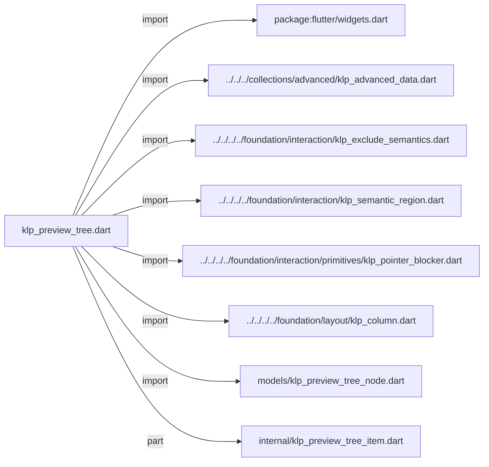
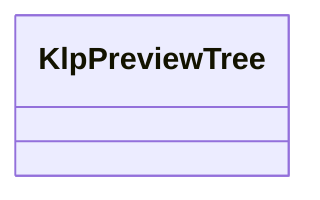
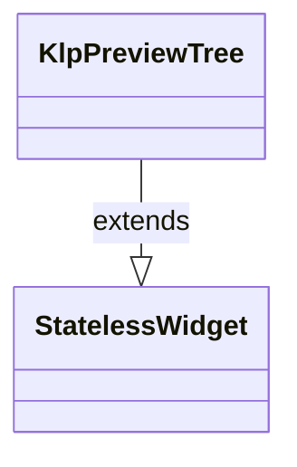

# klp_preview_tree.dart：直接依賴與宣告架構

[回到目錄](README.md) · [來源檔案](../../../../../../../lib/src/features/navigation/widgets/preview_tree/klp_preview_tree.dart)

## 範圍

核心是 `lib/src/features/navigation/widgets/preview_tree/klp_preview_tree.dart`。主要視角為該檔案明寫的 import／export／part；輔助視角為本檔宣告及 extends／implements／with／on 關係。只展開一層外部邊界。

## 直接依賴圖

## 依賴證據

| 關係 | 原始 directive | 來源 |
|---|---|---|
| import | <code>import &#x27;package:flutter/widgets.dart&#x27;;</code> | [lib/src/features/navigation/widgets/preview_tree/klp_preview_tree.dart:1](../../../../../../../lib/src/features/navigation/widgets/preview_tree/klp_preview_tree.dart#L1) |
| import | <code>import &#x27;../../../collections/advanced/klp_advanced_data.dart&#x27;;</code> | [lib/src/features/navigation/widgets/preview_tree/klp_preview_tree.dart:3](../../../../../../../lib/src/features/navigation/widgets/preview_tree/klp_preview_tree.dart#L3) |
| import | <code>import &#x27;../../../../foundation/interaction/klp_exclude_semantics.dart&#x27;;</code> | [lib/src/features/navigation/widgets/preview_tree/klp_preview_tree.dart:4](../../../../../../../lib/src/features/navigation/widgets/preview_tree/klp_preview_tree.dart#L4) |
| import | <code>import &#x27;../../../../foundation/interaction/klp_semantic_region.dart&#x27;;</code> | [lib/src/features/navigation/widgets/preview_tree/klp_preview_tree.dart:5](../../../../../../../lib/src/features/navigation/widgets/preview_tree/klp_preview_tree.dart#L5) |
| import | <code>import &#x27;../../../../foundation/interaction/primitives/klp_pointer_blocker.dart&#x27;;</code> | [lib/src/features/navigation/widgets/preview_tree/klp_preview_tree.dart:6](../../../../../../../lib/src/features/navigation/widgets/preview_tree/klp_preview_tree.dart#L6) |
| import | <code>import &#x27;../../../../foundation/layout/klp_column.dart&#x27;;</code> | [lib/src/features/navigation/widgets/preview_tree/klp_preview_tree.dart:7](../../../../../../../lib/src/features/navigation/widgets/preview_tree/klp_preview_tree.dart#L7) |
| import | <code>import &#x27;models/klp_preview_tree_node.dart&#x27;;</code> | [lib/src/features/navigation/widgets/preview_tree/klp_preview_tree.dart:8](../../../../../../../lib/src/features/navigation/widgets/preview_tree/klp_preview_tree.dart#L8) |
| part | <code>part &#x27;internal/klp_preview_tree_item.dart&#x27;;</code> | [lib/src/features/navigation/widgets/preview_tree/klp_preview_tree.dart:10](../../../../../../../lib/src/features/navigation/widgets/preview_tree/klp_preview_tree.dart#L10) |

## 宣告關係圖

本組節點是本檔宣告；沒有箭頭的宣告未在此圖主張互相依賴。

## 宣告與成員證據

成員包含 public 與 private；簽章取自來源，省略函式本體與欄位初始值。`(inferred)` 表示來源未明寫型別；建構子只顯示參數部分，不含初始化列表。

### KlpPreviewTree

ClassDeclaration · public · [lib/src/features/navigation/widgets/preview_tree/klp_preview_tree.dart:12](../../../../../../../lib/src/features/navigation/widgets/preview_tree/klp_preview_tree.dart#L12)

<code>class KlpPreviewTree extends StatelessWidget</code>

來源註解摘要：非 canonical 內容的預覽樹，與正式導覽節點維持明確語意區隔。

- `extends` → <code>StatelessWidget</code>：[lib/src/features/navigation/widgets/preview_tree/klp_preview_tree.dart:13](../../../../../../../lib/src/features/navigation/widgets/preview_tree/klp_preview_tree.dart#L13)

| 成員 | 可見性 | 簽章／型別 | 來源註解摘要 | 證據 |
|---|---|---|---|---|
| constructor <code>KlpPreviewTree</code> | public | <code>const KlpPreviewTree({super.key, required this.label, required this.nodes, this.enabled = true, this.onSelected})</code> |  | [lib/src/features/navigation/widgets/preview_tree/klp_preview_tree.dart:14](../../../../../../../lib/src/features/navigation/widgets/preview_tree/klp_preview_tree.dart#L14) |
| field <code>label</code> | public | <code>final String label</code> |  | [lib/src/features/navigation/widgets/preview_tree/klp_preview_tree.dart:16](../../../../../../../lib/src/features/navigation/widgets/preview_tree/klp_preview_tree.dart#L16) |
| field <code>nodes</code> | public | <code>final List&lt;KlpPreviewTreeNode&gt; nodes</code> |  | [lib/src/features/navigation/widgets/preview_tree/klp_preview_tree.dart:17](../../../../../../../lib/src/features/navigation/widgets/preview_tree/klp_preview_tree.dart#L17) |
| field <code>enabled</code> | public | <code>final bool enabled</code> |  | [lib/src/features/navigation/widgets/preview_tree/klp_preview_tree.dart:18](../../../../../../../lib/src/features/navigation/widgets/preview_tree/klp_preview_tree.dart#L18) |
| field <code>onSelected</code> | public | <code>final ValueChanged&lt;String&gt;? onSelected</code> |  | [lib/src/features/navigation/widgets/preview_tree/klp_preview_tree.dart:19](../../../../../../../lib/src/features/navigation/widgets/preview_tree/klp_preview_tree.dart#L19) |
| method <code>build</code> | public | <code>Widget build(BuildContext context)</code> |  | [lib/src/features/navigation/widgets/preview_tree/klp_preview_tree.dart:21](../../../../../../../lib/src/features/navigation/widgets/preview_tree/klp_preview_tree.dart#L21) |

## 閱讀說明與限制

箭頭只表示來源明寫的靜態關係；import 不等於呼叫。未分析動態呼叫、欄位的實際物件擁有權、狀態轉移或渲染流程；型別未進行語意解析，繼承目標保留原始型別拼寫。public／private 依 Dart 名稱前綴判斷；public 宣告不代表已由 `lib/kallopis.dart` 匯出。

本頁由 `tool/architecture_atlas` 產生；編輯來源或生成工具後重新產生，避免手改本頁。
