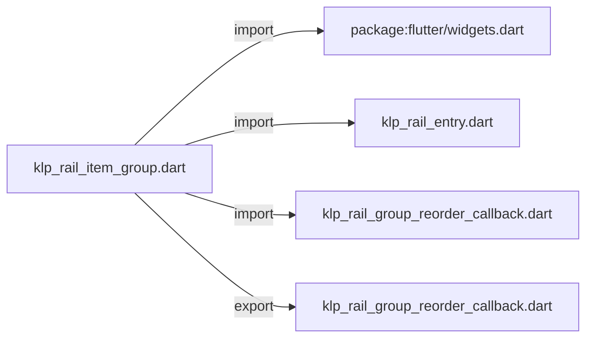
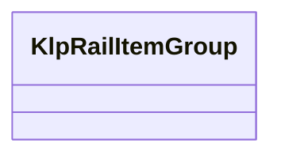

# klp_rail_item_group.dart：直接依賴與宣告架構

[回到目錄](README.md) · [來源檔案](../../../../../../../lib/src/features/navigation/widgets/rail/klp_rail_item_group.dart)

## 範圍

核心是 `lib/src/features/navigation/widgets/rail/klp_rail_item_group.dart`。主要視角為該檔案明寫的 import／export／part；輔助視角為本檔宣告及 extends／implements／with／on 關係。只展開一層外部邊界。

## 直接依賴圖

## 依賴證據

| 關係 | 原始 directive | 來源 |
|---|---|---|
| import | <code>import &#x27;package:flutter/widgets.dart&#x27;;</code> | [lib/src/features/navigation/widgets/rail/klp_rail_item_group.dart:1](../../../../../../../lib/src/features/navigation/widgets/rail/klp_rail_item_group.dart#L1) |
| import | <code>import &#x27;klp_rail_entry.dart&#x27;;</code> | [lib/src/features/navigation/widgets/rail/klp_rail_item_group.dart:3](../../../../../../../lib/src/features/navigation/widgets/rail/klp_rail_item_group.dart#L3) |
| import | <code>import &#x27;klp_rail_group_reorder_callback.dart&#x27;;</code> | [lib/src/features/navigation/widgets/rail/klp_rail_item_group.dart:4](../../../../../../../lib/src/features/navigation/widgets/rail/klp_rail_item_group.dart#L4) |
| export | <code>export &#x27;klp_rail_group_reorder_callback.dart&#x27;;</code> | [lib/src/features/navigation/widgets/rail/klp_rail_item_group.dart:6](../../../../../../../lib/src/features/navigation/widgets/rail/klp_rail_item_group.dart#L6) |

## 宣告關係圖

本組節點是本檔宣告；沒有箭頭的宣告未在此圖主張互相依賴。

## 宣告與成員證據

成員包含 public 與 private；簽章取自來源，省略函式本體與欄位初始值。`(inferred)` 表示來源未明寫型別；建構子只顯示參數部分，不含初始化列表。

### KlpRailItemGroup

ClassDeclaration · public · [lib/src/features/navigation/widgets/rail/klp_rail_item_group.dart:8](../../../../../../../lib/src/features/navigation/widgets/rail/klp_rail_item_group.dart#L8)

<code>class KlpRailItemGroup</code>

| 成員 | 可見性 | 簽章／型別 | 來源註解摘要 | 證據 |
|---|---|---|---|---|
| field <code>id</code> | public | <code>final String id</code> |  | [lib/src/features/navigation/widgets/rail/klp_rail_item_group.dart:10](../../../../../../../lib/src/features/navigation/widgets/rail/klp_rail_item_group.dart#L10) |
| field <code>items</code> | public | <code>final List&lt;KlpRailEntry&gt; items</code> |  | [lib/src/features/navigation/widgets/rail/klp_rail_item_group.dart:11](../../../../../../../lib/src/features/navigation/widgets/rail/klp_rail_item_group.dart#L11) |
| field <code>onReorder</code> | public | <code>final KlpRailGroupReorderCallback? onReorder</code> |  | [lib/src/features/navigation/widgets/rail/klp_rail_item_group.dart:12](../../../../../../../lib/src/features/navigation/widgets/rail/klp_rail_item_group.dart#L12) |
| field <code>isReorderable</code> | public | <code>final bool isReorderable</code> | 是否允許此群組內的項目拖曳排序。 | [lib/src/features/navigation/widgets/rail/klp_rail_item_group.dart:15](../../../../../../../lib/src/features/navigation/widgets/rail/klp_rail_item_group.dart#L15) |
| constructor <code>KlpRailItemGroup</code> | public | <code>const KlpRailItemGroup({ required this.id, required this.items, this.onReorder, this.isReorderable = true, })</code> |  | [lib/src/features/navigation/widgets/rail/klp_rail_item_group.dart:17](../../../../../../../lib/src/features/navigation/widgets/rail/klp_rail_item_group.dart#L17) |

## 閱讀說明與限制

箭頭只表示來源明寫的靜態關係；import 不等於呼叫。未分析動態呼叫、欄位的實際物件擁有權、狀態轉移或渲染流程；型別未進行語意解析，繼承目標保留原始型別拼寫。public／private 依 Dart 名稱前綴判斷；public 宣告不代表已由 `lib/kallopis.dart` 匯出。

本頁由 `tool/architecture_atlas` 產生；編輯來源或生成工具後重新產生，避免手改本頁。
