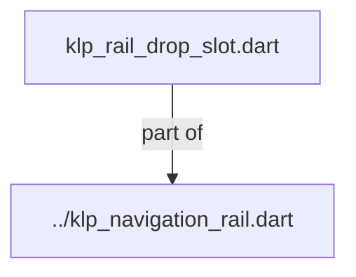
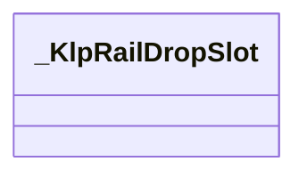
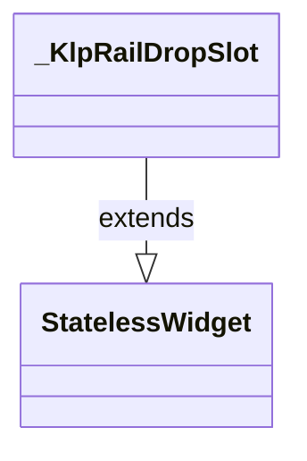

# klp_rail_drop_slot.dart：直接依賴與宣告架構

[回到目錄](README.md) · [來源檔案](../../../../../../../../lib/src/features/navigation/widgets/rail/primitives/klp_rail_drop_slot.dart)

## 範圍

核心是 `lib/src/features/navigation/widgets/rail/primitives/klp_rail_drop_slot.dart`。主要視角為該檔案明寫的 import／export／part；輔助視角為本檔宣告及 extends／implements／with／on 關係。只展開一層外部邊界。

## 直接依賴圖

## 依賴證據

| 關係 | 原始 directive | 來源 |
|---|---|---|
| part of | <code>part of &#x27;../klp_navigation_rail.dart&#x27;;</code> | [lib/src/features/navigation/widgets/rail/primitives/klp_rail_drop_slot.dart:1](../../../../../../../../lib/src/features/navigation/widgets/rail/primitives/klp_rail_drop_slot.dart#L1) |

## 宣告關係圖

本組節點是本檔宣告；沒有箭頭的宣告未在此圖主張互相依賴。

## 宣告與成員證據

成員包含 public 與 private；簽章取自來源，省略函式本體與欄位初始值。`(inferred)` 表示來源未明寫型別；建構子只顯示參數部分，不含初始化列表。

### _KlpRailDropSlot

ClassDeclaration · private · [lib/src/features/navigation/widgets/rail/primitives/klp_rail_drop_slot.dart:3](../../../../../../../../lib/src/features/navigation/widgets/rail/primitives/klp_rail_drop_slot.dart#L3)

<code>class _KlpRailDropSlot extends StatelessWidget</code>

- `extends` → <code>StatelessWidget</code>：[lib/src/features/navigation/widgets/rail/primitives/klp_rail_drop_slot.dart:3](../../../../../../../../lib/src/features/navigation/widgets/rail/primitives/klp_rail_drop_slot.dart#L3)

| 成員 | 可見性 | 簽章／型別 | 來源註解摘要 | 證據 |
|---|---|---|---|---|
| constructor <code>_KlpRailDropSlot</code> | private | <code>const _KlpRailDropSlot({ required this.active, required this.onWillAccept, required this.onMove, required this.onAccepted, })</code> |  | [lib/src/features/navigation/widgets/rail/primitives/klp_rail_drop_slot.dart:4](../../../../../../../../lib/src/features/navigation/widgets/rail/primitives/klp_rail_drop_slot.dart#L4) |
| field <code>active</code> | public | <code>final bool active</code> |  | [lib/src/features/navigation/widgets/rail/primitives/klp_rail_drop_slot.dart:11](../../../../../../../../lib/src/features/navigation/widgets/rail/primitives/klp_rail_drop_slot.dart#L11) |
| field <code>onWillAccept</code> | public | <code>final bool Function(_KlpRailDragData) onWillAccept</code> |  | [lib/src/features/navigation/widgets/rail/primitives/klp_rail_drop_slot.dart:12](../../../../../../../../lib/src/features/navigation/widgets/rail/primitives/klp_rail_drop_slot.dart#L12) |
| field <code>onMove</code> | public | <code>final VoidCallback onMove</code> |  | [lib/src/features/navigation/widgets/rail/primitives/klp_rail_drop_slot.dart:13](../../../../../../../../lib/src/features/navigation/widgets/rail/primitives/klp_rail_drop_slot.dart#L13) |
| field <code>onAccepted</code> | public | <code>final ValueChanged&lt;_KlpRailDragData&gt; onAccepted</code> |  | [lib/src/features/navigation/widgets/rail/primitives/klp_rail_drop_slot.dart:14](../../../../../../../../lib/src/features/navigation/widgets/rail/primitives/klp_rail_drop_slot.dart#L14) |
| method <code>build</code> | public | <code>Widget build(BuildContext context)</code> |  | [lib/src/features/navigation/widgets/rail/primitives/klp_rail_drop_slot.dart:16](../../../../../../../../lib/src/features/navigation/widgets/rail/primitives/klp_rail_drop_slot.dart#L16) |

## 閱讀說明與限制

箭頭只表示來源明寫的靜態關係；import 不等於呼叫。未分析動態呼叫、欄位的實際物件擁有權、狀態轉移或渲染流程；型別未進行語意解析，繼承目標保留原始型別拼寫。public／private 依 Dart 名稱前綴判斷；public 宣告不代表已由 `lib/kallopis.dart` 匯出。

本頁由 `tool/architecture_atlas` 產生；編輯來源或生成工具後重新產生，避免手改本頁。
