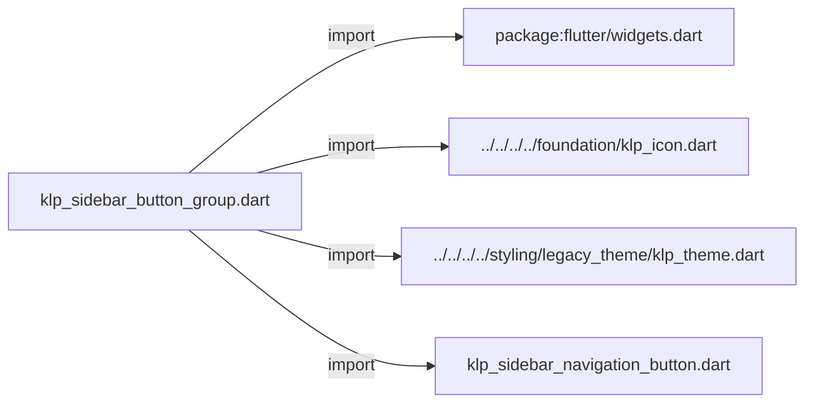
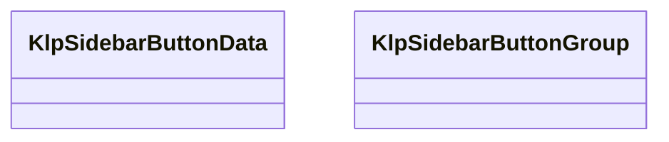
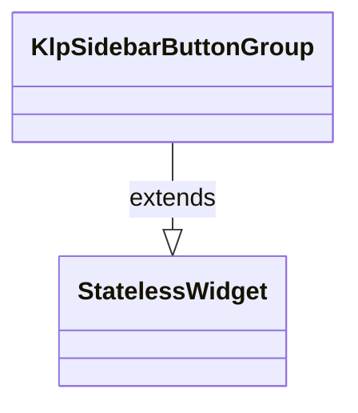

# klp_sidebar_button_group.dart：直接依賴與宣告架構

[回到目錄](README.md) · [來源檔案](../../../../../../../lib/src/features/navigation/widgets/sidebar/klp_sidebar_button_group.dart)

## 範圍

核心是 `lib/src/features/navigation/widgets/sidebar/klp_sidebar_button_group.dart`。主要視角為該檔案明寫的 import／export／part；輔助視角為本檔宣告及 extends／implements／with／on 關係。只展開一層外部邊界。

## 直接依賴圖

## 依賴證據

| 關係 | 原始 directive | 來源 |
|---|---|---|
| import | <code>import &#x27;package:flutter/widgets.dart&#x27;;</code> | [lib/src/features/navigation/widgets/sidebar/klp_sidebar_button_group.dart:1](../../../../../../../lib/src/features/navigation/widgets/sidebar/klp_sidebar_button_group.dart#L1) |
| import | <code>import &#x27;../../../../foundation/klp_icon.dart&#x27;;</code> | [lib/src/features/navigation/widgets/sidebar/klp_sidebar_button_group.dart:3](../../../../../../../lib/src/features/navigation/widgets/sidebar/klp_sidebar_button_group.dart#L3) |
| import | <code>import &#x27;../../../../styling/legacy_theme/klp_theme.dart&#x27;;</code> | [lib/src/features/navigation/widgets/sidebar/klp_sidebar_button_group.dart:4](../../../../../../../lib/src/features/navigation/widgets/sidebar/klp_sidebar_button_group.dart#L4) |
| import | <code>import &#x27;klp_sidebar_navigation_button.dart&#x27;;</code> | [lib/src/features/navigation/widgets/sidebar/klp_sidebar_button_group.dart:5](../../../../../../../lib/src/features/navigation/widgets/sidebar/klp_sidebar_button_group.dart#L5) |

## 宣告關係圖

本組節點是本檔宣告；沒有箭頭的宣告未在此圖主張互相依賴。

## 宣告與成員證據

成員包含 public 與 private；簽章取自來源，省略函式本體與欄位初始值。`(inferred)` 表示來源未明寫型別；建構子只顯示參數部分，不含初始化列表。

### KlpSidebarButtonData

ClassDeclaration · public · [lib/src/features/navigation/widgets/sidebar/klp_sidebar_button_group.dart:7](../../../../../../../lib/src/features/navigation/widgets/sidebar/klp_sidebar_button_group.dart#L7)

<code>final class KlpSidebarButtonData</code>

來源註解摘要：Sidebar 按鈕群組中的單一呈現資料。

| 成員 | 可見性 | 簽章／型別 | 來源註解摘要 | 證據 |
|---|---|---|---|---|
| field <code>label</code> | public | <code>final String label</code> |  | [lib/src/features/navigation/widgets/sidebar/klp_sidebar_button_group.dart:10](../../../../../../../lib/src/features/navigation/widgets/sidebar/klp_sidebar_button_group.dart#L10) |
| field <code>icon</code> | public | <code>final KlpIconData icon</code> |  | [lib/src/features/navigation/widgets/sidebar/klp_sidebar_button_group.dart:11](../../../../../../../lib/src/features/navigation/widgets/sidebar/klp_sidebar_button_group.dart#L11) |
| field <code>onPressed</code> | public | <code>final VoidCallback? onPressed</code> |  | [lib/src/features/navigation/widgets/sidebar/klp_sidebar_button_group.dart:12](../../../../../../../lib/src/features/navigation/widgets/sidebar/klp_sidebar_button_group.dart#L12) |
| field <code>selected</code> | public | <code>final bool selected</code> |  | [lib/src/features/navigation/widgets/sidebar/klp_sidebar_button_group.dart:13](../../../../../../../lib/src/features/navigation/widgets/sidebar/klp_sidebar_button_group.dart#L13) |
| constructor <code>KlpSidebarButtonData</code> | public | <code>const KlpSidebarButtonData({ required this.label, required this.icon, required this.onPressed, this.selected = false, })</code> |  | [lib/src/features/navigation/widgets/sidebar/klp_sidebar_button_group.dart:15](../../../../../../../lib/src/features/navigation/widgets/sidebar/klp_sidebar_button_group.dart#L15) |

### KlpSidebarButtonGroup

ClassDeclaration · public · [lib/src/features/navigation/widgets/sidebar/klp_sidebar_button_group.dart:23](../../../../../../../lib/src/features/navigation/widgets/sidebar/klp_sidebar_button_group.dart#L23)

<code>final class KlpSidebarButtonGroup extends StatelessWidget</code>

來源註解摘要：使用 Sidebar chrome 留白與按鈕樣式呈現一組動作。 消費端只注入資料與事件；群組負責邊界留白、滿寬排列及共通按鈕外觀。

- `extends` → <code>StatelessWidget</code>：[lib/src/features/navigation/widgets/sidebar/klp_sidebar_button_group.dart:26](../../../../../../../lib/src/features/navigation/widgets/sidebar/klp_sidebar_button_group.dart#L26)

| 成員 | 可見性 | 簽章／型別 | 來源註解摘要 | 證據 |
|---|---|---|---|---|
| field <code>items</code> | public | <code>final List&lt;KlpSidebarButtonData&gt; items</code> |  | [lib/src/features/navigation/widgets/sidebar/klp_sidebar_button_group.dart:28](../../../../../../../lib/src/features/navigation/widgets/sidebar/klp_sidebar_button_group.dart#L28) |
| field <code>padding</code> | public | <code>final EdgeInsetsGeometry? padding</code> |  | [lib/src/features/navigation/widgets/sidebar/klp_sidebar_button_group.dart:29](../../../../../../../lib/src/features/navigation/widgets/sidebar/klp_sidebar_button_group.dart#L29) |
| constructor <code>KlpSidebarButtonGroup</code> | public | <code>const KlpSidebarButtonGroup({ super.key, required this.items, this.padding, })</code> |  | [lib/src/features/navigation/widgets/sidebar/klp_sidebar_button_group.dart:31](../../../../../../../lib/src/features/navigation/widgets/sidebar/klp_sidebar_button_group.dart#L31) |
| method <code>build</code> | public | <code>Widget build(BuildContext context)</code> |  | [lib/src/features/navigation/widgets/sidebar/klp_sidebar_button_group.dart:37](../../../../../../../lib/src/features/navigation/widgets/sidebar/klp_sidebar_button_group.dart#L37) |
| method <code>_buildButtons</code> | private | <code>Widget _buildButtons()</code> |  | [lib/src/features/navigation/widgets/sidebar/klp_sidebar_button_group.dart:47](../../../../../../../lib/src/features/navigation/widgets/sidebar/klp_sidebar_button_group.dart#L47) |
| method <code>_buildButton</code> | private | <code>Widget _buildButton(KlpSidebarButtonData item)</code> |  | [lib/src/features/navigation/widgets/sidebar/klp_sidebar_button_group.dart:58](../../../../../../../lib/src/features/navigation/widgets/sidebar/klp_sidebar_button_group.dart#L58) |

## 閱讀說明與限制

箭頭只表示來源明寫的靜態關係；import 不等於呼叫。未分析動態呼叫、欄位的實際物件擁有權、狀態轉移或渲染流程；型別未進行語意解析，繼承目標保留原始型別拼寫。public／private 依 Dart 名稱前綴判斷；public 宣告不代表已由 `lib/kallopis.dart` 匯出。

本頁由 `tool/architecture_atlas` 產生；編輯來源或生成工具後重新產生，避免手改本頁。
