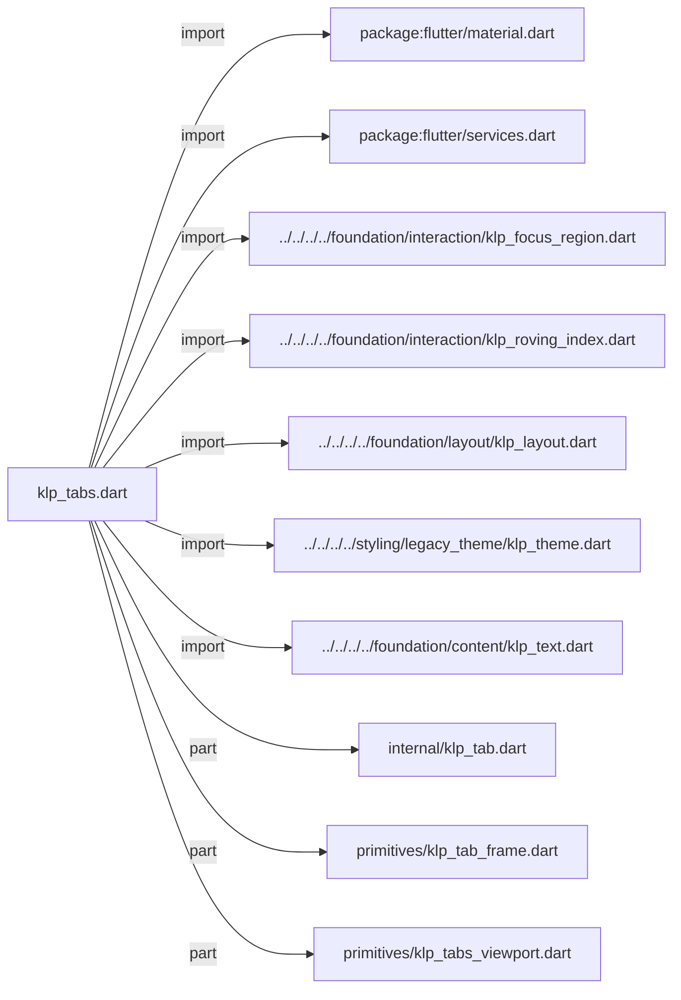
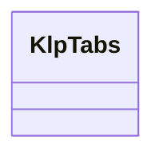
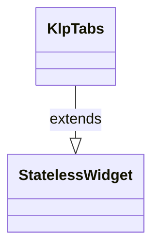

# klp_tabs.dart：直接依賴與宣告架構

[回到目錄](README.md) · [來源檔案](../../../../../../../lib/src/features/navigation/widgets/tabs/klp_tabs.dart)

## 範圍

核心是 `lib/src/features/navigation/widgets/tabs/klp_tabs.dart`。主要視角為該檔案明寫的 import／export／part；輔助視角為本檔宣告及 extends／implements／with／on 關係。只展開一層外部邊界。

## 直接依賴圖

## 依賴證據

| 關係 | 原始 directive | 來源 |
|---|---|---|
| import | <code>import &#x27;package:flutter/material.dart&#x27;;</code> | [lib/src/features/navigation/widgets/tabs/klp_tabs.dart:1](../../../../../../../lib/src/features/navigation/widgets/tabs/klp_tabs.dart#L1) |
| import | <code>import &#x27;package:flutter/services.dart&#x27;;</code> | [lib/src/features/navigation/widgets/tabs/klp_tabs.dart:2](../../../../../../../lib/src/features/navigation/widgets/tabs/klp_tabs.dart#L2) |
| import | <code>import &#x27;../../../../foundation/interaction/klp_focus_region.dart&#x27;;</code> | [lib/src/features/navigation/widgets/tabs/klp_tabs.dart:4](../../../../../../../lib/src/features/navigation/widgets/tabs/klp_tabs.dart#L4) |
| import | <code>import &#x27;../../../../foundation/interaction/klp_roving_index.dart&#x27;;</code> | [lib/src/features/navigation/widgets/tabs/klp_tabs.dart:5](../../../../../../../lib/src/features/navigation/widgets/tabs/klp_tabs.dart#L5) |
| import | <code>import &#x27;../../../../foundation/layout/klp_layout.dart&#x27;;</code> | [lib/src/features/navigation/widgets/tabs/klp_tabs.dart:6](../../../../../../../lib/src/features/navigation/widgets/tabs/klp_tabs.dart#L6) |
| import | <code>import &#x27;../../../../styling/legacy_theme/klp_theme.dart&#x27;;</code> | [lib/src/features/navigation/widgets/tabs/klp_tabs.dart:7](../../../../../../../lib/src/features/navigation/widgets/tabs/klp_tabs.dart#L7) |
| import | <code>import &#x27;../../../../foundation/content/klp_text.dart&#x27;;</code> | [lib/src/features/navigation/widgets/tabs/klp_tabs.dart:8](../../../../../../../lib/src/features/navigation/widgets/tabs/klp_tabs.dart#L8) |
| part | <code>part &#x27;internal/klp_tab.dart&#x27;;</code> | [lib/src/features/navigation/widgets/tabs/klp_tabs.dart:10](../../../../../../../lib/src/features/navigation/widgets/tabs/klp_tabs.dart#L10) |
| part | <code>part &#x27;primitives/klp_tab_frame.dart&#x27;;</code> | [lib/src/features/navigation/widgets/tabs/klp_tabs.dart:11](../../../../../../../lib/src/features/navigation/widgets/tabs/klp_tabs.dart#L11) |
| part | <code>part &#x27;primitives/klp_tabs_viewport.dart&#x27;;</code> | [lib/src/features/navigation/widgets/tabs/klp_tabs.dart:12](../../../../../../../lib/src/features/navigation/widgets/tabs/klp_tabs.dart#L12) |

## 宣告關係圖

本組節點是本檔宣告；沒有箭頭的宣告未在此圖主張互相依賴。

## 宣告與成員證據

成員包含 public 與 private；簽章取自來源，省略函式本體與欄位初始值。`(inferred)` 表示來源未明寫型別；建構子只顯示參數部分，不含初始化列表。

### KlpTabs

ClassDeclaration · public · [lib/src/features/navigation/widgets/tabs/klp_tabs.dart:14](../../../../../../../lib/src/features/navigation/widgets/tabs/klp_tabs.dart#L14)

<code>class KlpTabs extends StatelessWidget</code>

來源註解摘要：分頁列。`selected` 是索引，`tabs` 是顯示文字；本元件不持有狀態。 **鍵盤**：任一分頁取得焦點後，`←`／`→` 會在分頁之間移動並直接切換選取 （在頭尾之間循環），沿用 [KlpRovingIndex]，與 [KlpMenu]、[KlpCombobox] 共用 同一套索引移動規則。

- `extends` → <code>StatelessWidget</code>：[lib/src/features/navigation/widgets/tabs/klp_tabs.dart:19](../../../../../../../lib/src/features/navigation/widgets/tabs/klp_tabs.dart#L19)

| 成員 | 可見性 | 簽章／型別 | 來源註解摘要 | 證據 |
|---|---|---|---|---|
| constructor <code>KlpTabs</code> | public | <code>const KlpTabs({ super.key, required this.tabs, required this.selected, required this.onSelected, })</code> |  | [lib/src/features/navigation/widgets/tabs/klp_tabs.dart:20](../../../../../../../lib/src/features/navigation/widgets/tabs/klp_tabs.dart#L20) |
| field <code>tabs</code> | public | <code>final List&lt;String&gt; tabs</code> |  | [lib/src/features/navigation/widgets/tabs/klp_tabs.dart:27](../../../../../../../lib/src/features/navigation/widgets/tabs/klp_tabs.dart#L27) |
| field <code>selected</code> | public | <code>final int selected</code> |  | [lib/src/features/navigation/widgets/tabs/klp_tabs.dart:28](../../../../../../../lib/src/features/navigation/widgets/tabs/klp_tabs.dart#L28) |
| field <code>onSelected</code> | public | <code>final ValueChanged&lt;int&gt; onSelected</code> |  | [lib/src/features/navigation/widgets/tabs/klp_tabs.dart:29](../../../../../../../lib/src/features/navigation/widgets/tabs/klp_tabs.dart#L29) |
| method <code>_handleKey</code> | private | <code>KeyEventResult _handleKey(FocusNode node, KeyEvent event)</code> |  | [lib/src/features/navigation/widgets/tabs/klp_tabs.dart:31](../../../../../../../lib/src/features/navigation/widgets/tabs/klp_tabs.dart#L31) |
| method <code>build</code> | public | <code>Widget build(BuildContext context)</code> |  | [lib/src/features/navigation/widgets/tabs/klp_tabs.dart:59](../../../../../../../lib/src/features/navigation/widgets/tabs/klp_tabs.dart#L59) |

## 閱讀說明與限制

箭頭只表示來源明寫的靜態關係；import 不等於呼叫。未分析動態呼叫、欄位的實際物件擁有權、狀態轉移或渲染流程；型別未進行語意解析，繼承目標保留原始型別拼寫。public／private 依 Dart 名稱前綴判斷；public 宣告不代表已由 `lib/kallopis.dart` 匯出。

本頁由 `tool/architecture_atlas` 產生；編輯來源或生成工具後重新產生，避免手改本頁。
