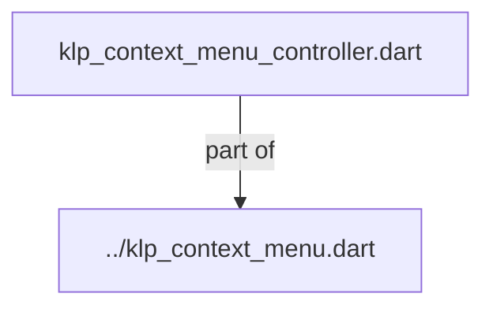
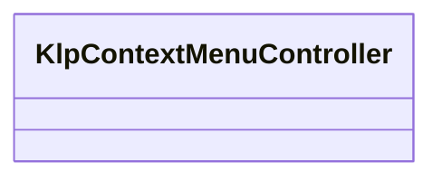

# klp_context_menu_controller.dart：直接依賴與宣告架構

[回到目錄](README.md) · [來源檔案](../../../../../../lib/src/features/overlays/context_menu/klp_context_menu_controller.dart)

## 範圍

核心是 `lib/src/features/overlays/context_menu/klp_context_menu_controller.dart`。主要視角為該檔案明寫的 import／export／part；輔助視角為本檔宣告及 extends／implements／with／on 關係。只展開一層外部邊界。

## 直接依賴圖

## 依賴證據

| 關係 | 原始 directive | 來源 |
|---|---|---|
| part of | <code>part of &#x27;../klp_context_menu.dart&#x27;;</code> | [lib/src/features/overlays/context_menu/klp_context_menu_controller.dart:1](../../../../../../lib/src/features/overlays/context_menu/klp_context_menu_controller.dart#L1) |

## 宣告關係圖

本組節點是本檔宣告；沒有箭頭的宣告未在此圖主張互相依賴。

## 宣告與成員證據

成員包含 public 與 private；簽章取自來源，省略函式本體與欄位初始值。`(inferred)` 表示來源未明寫型別；建構子只顯示參數部分，不含初始化列表。

### KlpContextMenuController

ClassDeclaration · public · [lib/src/features/overlays/context_menu/klp_context_menu_controller.dart:3](../../../../../../lib/src/features/overlays/context_menu/klp_context_menu_controller.dart#L3)

<code>class KlpContextMenuController</code>

來源註解摘要：讓子元件以既有 [KlpContextMenu] 的定位與外觀主動開啟選單。 controller 尚未掛載時呼叫不會產生作用；同一時間只應掛載到一個 context menu。

| 成員 | 可見性 | 簽章／型別 | 來源註解摘要 | 證據 |
|---|---|---|---|---|
| field <code>_open</code> | private | <code>void Function(Offset)? _open</code> |  | [lib/src/features/overlays/context_menu/klp_context_menu_controller.dart:7](../../../../../../lib/src/features/overlays/context_menu/klp_context_menu_controller.dart#L7) |
| field <code>_close</code> | private | <code>VoidCallback? _close</code> |  | [lib/src/features/overlays/context_menu/klp_context_menu_controller.dart:8](../../../../../../lib/src/features/overlays/context_menu/klp_context_menu_controller.dart#L8) |
| getter <code>isAttached</code> | public | <code>bool get isAttached</code> |  | [lib/src/features/overlays/context_menu/klp_context_menu_controller.dart:10](../../../../../../lib/src/features/overlays/context_menu/klp_context_menu_controller.dart#L10) |
| method <code>openAt</code> | public | <code>void openAt(Offset globalPosition)</code> |  | [lib/src/features/overlays/context_menu/klp_context_menu_controller.dart:12](../../../../../../lib/src/features/overlays/context_menu/klp_context_menu_controller.dart#L12) |
| method <code>close</code> | public | <code>void close()</code> |  | [lib/src/features/overlays/context_menu/klp_context_menu_controller.dart:14](../../../../../../lib/src/features/overlays/context_menu/klp_context_menu_controller.dart#L14) |
| method <code>_attach</code> | private | <code>void _attach({ required void Function(Offset) open, required VoidCallback close, })</code> |  | [lib/src/features/overlays/context_menu/klp_context_menu_controller.dart:16](../../../../../../lib/src/features/overlays/context_menu/klp_context_menu_controller.dart#L16) |
| method <code>_detach</code> | private | <code>void _detach()</code> |  | [lib/src/features/overlays/context_menu/klp_context_menu_controller.dart:25](../../../../../../lib/src/features/overlays/context_menu/klp_context_menu_controller.dart#L25) |

## 閱讀說明與限制

箭頭只表示來源明寫的靜態關係；import 不等於呼叫。未分析動態呼叫、欄位的實際物件擁有權、狀態轉移或渲染流程；型別未進行語意解析，繼承目標保留原始型別拼寫。public／private 依 Dart 名稱前綴判斷；public 宣告不代表已由 `lib/kallopis.dart` 匯出。

本頁由 `tool/architecture_atlas` 產生；編輯來源或生成工具後重新產生，避免手改本頁。
