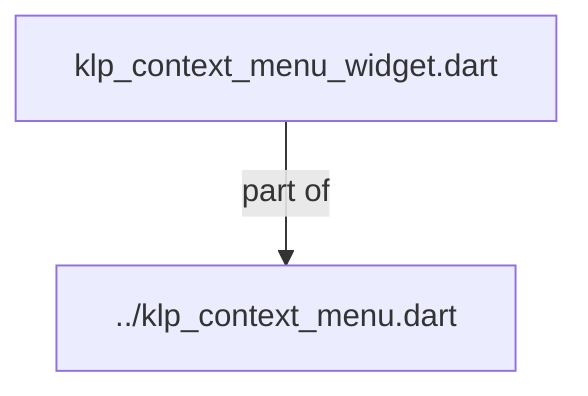
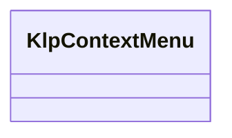
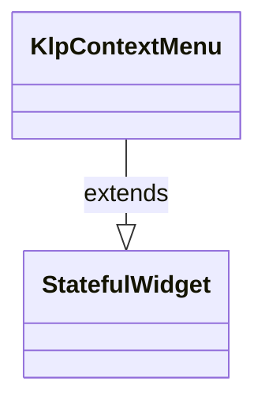

# klp_context_menu_widget.dart：直接依賴與宣告架構

[回到目錄](README.md) · [來源檔案](../../../../../../lib/src/features/overlays/context_menu/klp_context_menu_widget.dart)

## 範圍

核心是 `lib/src/features/overlays/context_menu/klp_context_menu_widget.dart`。主要視角為該檔案明寫的 import／export／part；輔助視角為本檔宣告及 extends／implements／with／on 關係。只展開一層外部邊界。

## 直接依賴圖

## 依賴證據

| 關係 | 原始 directive | 來源 |
|---|---|---|
| part of | <code>part of &#x27;../klp_context_menu.dart&#x27;;</code> | [lib/src/features/overlays/context_menu/klp_context_menu_widget.dart:1](../../../../../../lib/src/features/overlays/context_menu/klp_context_menu_widget.dart#L1) |

## 宣告關係圖

本組節點是本檔宣告；沒有箭頭的宣告未在此圖主張互相依賴。

## 宣告與成員證據

成員包含 public 與 private；簽章取自來源，省略函式本體與欄位初始值。`(inferred)` 表示來源未明寫型別；建構子只顯示參數部分，不含初始化列表。

### KlpContextMenu

ClassDeclaration · public · [lib/src/features/overlays/context_menu/klp_context_menu_widget.dart:3](../../../../../../lib/src/features/overlays/context_menu/klp_context_menu_widget.dart#L3)

<code>class KlpContextMenu extends StatefulWidget</code>

來源註解摘要：右鍵選單：掛在任意子樹上，滑鼠右鍵或觸控長按於指標位置彈出。 選單本體重用既有的 [KlpMenu] 與 [KlpMenuItemData]——本元件只負責觸發時機、 指標定位與點外部關閉，**不重新實作選單外觀**（一條規則只能有一個實作）。 彈出位置沿用 [KlpMenuLayout.resolvePosition]，與 [KlpMenu] 在其他彈出場景 使用同一套定位邏輯，才不會有兩份互相分岔的擺放規則。

- `extends` → <code>StatefulWidget</code>：[lib/src/features/overlays/context_menu/klp_context_menu_widget.dart:9](../../../../../../lib/src/features/overlays/context_menu/klp_context_menu_widget.dart#L9)

| 成員 | 可見性 | 簽章／型別 | 來源註解摘要 | 證據 |
|---|---|---|---|---|
| constructor <code>KlpContextMenu</code> | public | <code>const KlpContextMenu({ super.key, required this.child, required this.label, required this.items, this.controller, })</code> |  | [lib/src/features/overlays/context_menu/klp_context_menu_widget.dart:10](../../../../../../lib/src/features/overlays/context_menu/klp_context_menu_widget.dart#L10) |
| field <code>child</code> | public | <code>final Widget child</code> | 掛載右鍵選單行為的子樹。 | [lib/src/features/overlays/context_menu/klp_context_menu_widget.dart:19](../../../../../../lib/src/features/overlays/context_menu/klp_context_menu_widget.dart#L19) |
| field <code>label</code> | public | <code>final String label</code> | 選單標題。庫不替產品決定用什麼語言說明這組動作——呼叫端必須提供。 | [lib/src/features/overlays/context_menu/klp_context_menu_widget.dart:22](../../../../../../lib/src/features/overlays/context_menu/klp_context_menu_widget.dart#L22) |
| field <code>items</code> | public | <code>final List&lt;KlpMenuItemData&gt; items</code> | 選單項目，重用 [KlpMenu] 既有的資料模型。 | [lib/src/features/overlays/context_menu/klp_context_menu_widget.dart:25](../../../../../../lib/src/features/overlays/context_menu/klp_context_menu_widget.dart#L25) |
| field <code>controller</code> | public | <code>final KlpContextMenuController? controller</code> |  | [lib/src/features/overlays/context_menu/klp_context_menu_widget.dart:26](../../../../../../lib/src/features/overlays/context_menu/klp_context_menu_widget.dart#L26) |
| method <code>createState</code> | public | <code>State&lt;KlpContextMenu&gt; createState()</code> |  | [lib/src/features/overlays/context_menu/klp_context_menu_widget.dart:28](../../../../../../lib/src/features/overlays/context_menu/klp_context_menu_widget.dart#L28) |

## 閱讀說明與限制

箭頭只表示來源明寫的靜態關係；import 不等於呼叫。未分析動態呼叫、欄位的實際物件擁有權、狀態轉移或渲染流程；型別未進行語意解析，繼承目標保留原始型別拼寫。public／private 依 Dart 名稱前綴判斷；public 宣告不代表已由 `lib/kallopis.dart` 匯出。

本頁由 `tool/architecture_atlas` 產生；編輯來源或生成工具後重新產生，避免手改本頁。
