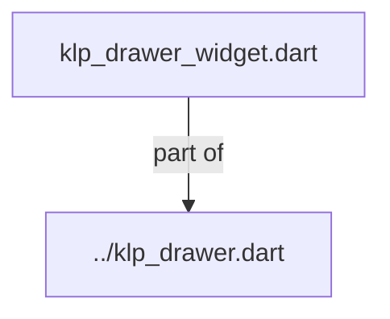
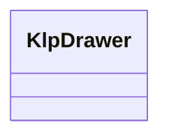
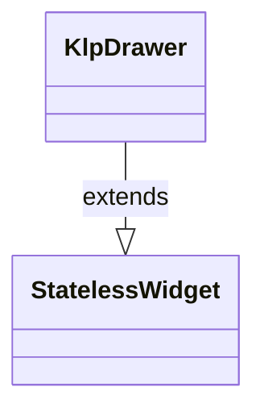

# klp_drawer_widget.dart：直接依賴與宣告架構

[回到目錄](README.md) · [來源檔案](../../../../../../lib/src/features/overlays/drawer/klp_drawer_widget.dart)

## 範圍

核心是 `lib/src/features/overlays/drawer/klp_drawer_widget.dart`。主要視角為該檔案明寫的 import／export／part；輔助視角為本檔宣告及 extends／implements／with／on 關係。只展開一層外部邊界。

## 直接依賴圖

## 依賴證據

| 關係 | 原始 directive | 來源 |
|---|---|---|
| part of | <code>part of &#x27;../klp_drawer.dart&#x27;;</code> | [lib/src/features/overlays/drawer/klp_drawer_widget.dart:1](../../../../../../lib/src/features/overlays/drawer/klp_drawer_widget.dart#L1) |

## 宣告關係圖

本組節點是本檔宣告；沒有箭頭的宣告未在此圖主張互相依賴。

## 宣告與成員證據

成員包含 public 與 private；簽章取自來源，省略函式本體與欄位初始值。`(inferred)` 表示來源未明寫型別；建構子只顯示參數部分，不含初始化列表。

### KlpDrawer

ClassDeclaration · public · [lib/src/features/overlays/drawer/klp_drawer_widget.dart:3](../../../../../../lib/src/features/overlays/drawer/klp_drawer_widget.dart#L3)

<code>class KlpDrawer extends StatelessWidget</code>

來源註解摘要：從邊緣滑入的面板：側邊欄、篩選面板，或（[KlpDrawerEdge.bottom] 方向）行動裝置 常見的 sheet。 **不負責彈出**——呼叫端決定用什麼容器承載這個 widget（例如 `KlpOverlayHost`、`KlpStack` 或 `Overlay`），並透過 [open] 驅動顯示與否； 本元件只負責滑入滑出的動畫、遮罩與「點遮罩關閉」這個互動。呼叫端持有 [open] 的狀態，本元件本身不追蹤開關。

- `extends` → <code>StatelessWidget</code>：[lib/src/features/overlays/drawer/klp_drawer_widget.dart:10](../../../../../../lib/src/features/overlays/drawer/klp_drawer_widget.dart#L10)

| 成員 | 可見性 | 簽章／型別 | 來源註解摘要 | 證據 |
|---|---|---|---|---|
| constructor <code>KlpDrawer</code> | public | <code>const KlpDrawer({ super.key, required this.open, required this.child, this.edge = KlpDrawerEdge.right, this.size, this.onScrimTap, this.barrierDismissible = true, })</code> |  | [lib/src/features/overlays/drawer/klp_drawer_widget.dart:11](../../../../../../lib/src/features/overlays/drawer/klp_drawer_widget.dart#L11) |
| field <code>open</code> | public | <code>final bool open</code> | 是否展開。 | [lib/src/features/overlays/drawer/klp_drawer_widget.dart:22](../../../../../../lib/src/features/overlays/drawer/klp_drawer_widget.dart#L22) |
| field <code>child</code> | public | <code>final Widget child</code> | 面板內容。 | [lib/src/features/overlays/drawer/klp_drawer_widget.dart:25](../../../../../../lib/src/features/overlays/drawer/klp_drawer_widget.dart#L25) |
| field <code>edge</code> | public | <code>final KlpDrawerEdge edge</code> | 從哪個邊緣滑入。`bottom` 即一般所稱的 sheet。 | [lib/src/features/overlays/drawer/klp_drawer_widget.dart:28](../../../../../../lib/src/features/overlays/drawer/klp_drawer_widget.dart#L28) |
| field <code>size</code> | public | <code>final double? size</code> | 面板尺寸：[KlpDrawerEdge.left]／[KlpDrawerEdge.right] 為寬度， [KlpDrawerEdge.top]／[KlpDrawerEdge.bottom] 為高度。 `null` 表示沿用 theme 的預設面板尺寸。 | [lib/src/features/overlays/drawer/klp_drawer_widget.dart:33](../../../../../../lib/src/features/overlays/drawer/klp_drawer_widget.dart#L33) |
| field <code>onScrimTap</code> | public | <code>final VoidCallback? onScrimTap</code> | 點遮罩時呼叫，用於關閉面板。 | [lib/src/features/overlays/drawer/klp_drawer_widget.dart:36](../../../../../../lib/src/features/overlays/drawer/klp_drawer_widget.dart#L36) |
| field <code>barrierDismissible</code> | public | <code>final bool barrierDismissible</code> | 點遮罩是否關閉——即遮罩是否攔截點擊事件。收合時遮罩一律不攔截， 不受此旗標影響。 | [lib/src/features/overlays/drawer/klp_drawer_widget.dart:40](../../../../../../lib/src/features/overlays/drawer/klp_drawer_widget.dart#L40) |
| method <code>build</code> | public | <code>Widget build(BuildContext context)</code> |  | [lib/src/features/overlays/drawer/klp_drawer_widget.dart:42](../../../../../../lib/src/features/overlays/drawer/klp_drawer_widget.dart#L42) |

## 閱讀說明與限制

箭頭只表示來源明寫的靜態關係；import 不等於呼叫。未分析動態呼叫、欄位的實際物件擁有權、狀態轉移或渲染流程；型別未進行語意解析，繼承目標保留原始型別拼寫。public／private 依 Dart 名稱前綴判斷；public 宣告不代表已由 `lib/kallopis.dart` 匯出。

本頁由 `tool/architecture_atlas` 產生；編輯來源或生成工具後重新產生，避免手改本頁。
