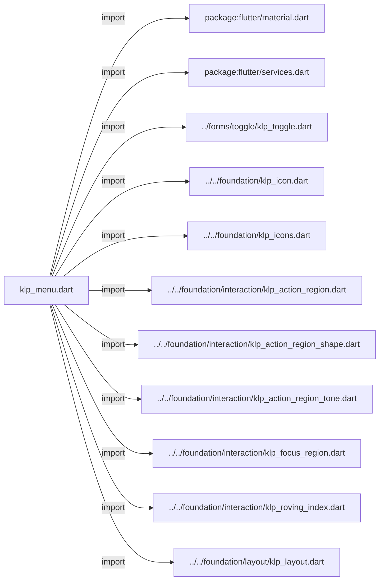
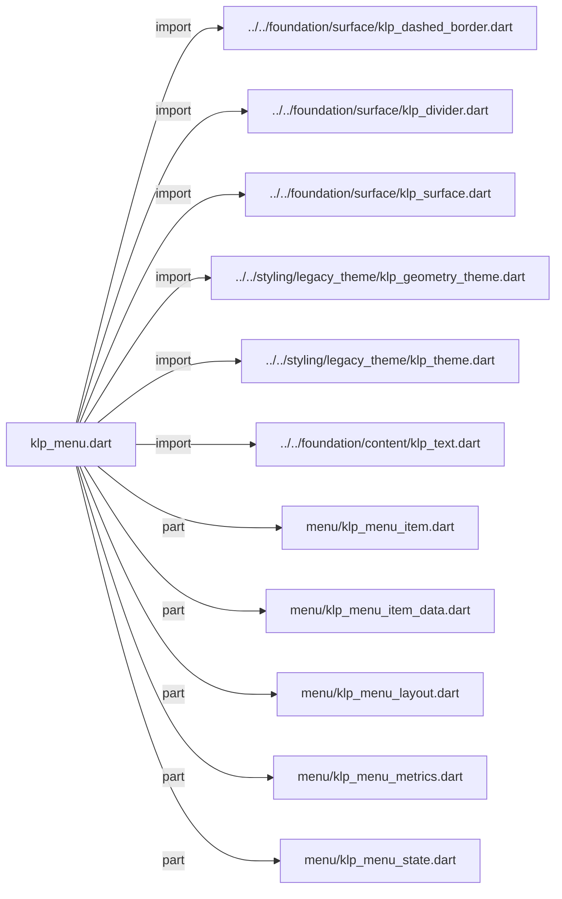
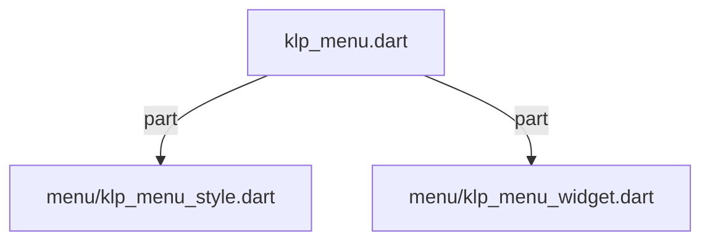

# klp_menu.dart：直接依賴與宣告架構

[回到目錄](README.md) · [來源檔案](../../../../../lib/src/features/overlays/klp_menu.dart)

## 範圍

核心是 `lib/src/features/overlays/klp_menu.dart`。主要視角為該檔案明寫的 import／export／part；輔助視角為本檔宣告及 extends／implements／with／on 關係。只展開一層外部邊界。

## 直接依賴圖

## 依賴證據

| 關係 | 原始 directive | 來源 |
|---|---|---|
| import | <code>import &#x27;package:flutter/material.dart&#x27;;</code> | [lib/src/features/overlays/klp_menu.dart:1](../../../../../lib/src/features/overlays/klp_menu.dart#L1) |
| import | <code>import &#x27;package:flutter/services.dart&#x27;;</code> | [lib/src/features/overlays/klp_menu.dart:2](../../../../../lib/src/features/overlays/klp_menu.dart#L2) |
| import | <code>import &#x27;../forms/toggle/klp_toggle.dart&#x27;;</code> | [lib/src/features/overlays/klp_menu.dart:4](../../../../../lib/src/features/overlays/klp_menu.dart#L4) |
| import | <code>import &#x27;../../foundation/klp_icon.dart&#x27;;</code> | [lib/src/features/overlays/klp_menu.dart:5](../../../../../lib/src/features/overlays/klp_menu.dart#L5) |
| import | <code>import &#x27;../../foundation/klp_icons.dart&#x27;;</code> | [lib/src/features/overlays/klp_menu.dart:6](../../../../../lib/src/features/overlays/klp_menu.dart#L6) |
| import | <code>import &#x27;../../foundation/interaction/klp_action_region.dart&#x27;;</code> | [lib/src/features/overlays/klp_menu.dart:7](../../../../../lib/src/features/overlays/klp_menu.dart#L7) |
| import | <code>import &#x27;../../foundation/interaction/klp_action_region_shape.dart&#x27;;</code> | [lib/src/features/overlays/klp_menu.dart:8](../../../../../lib/src/features/overlays/klp_menu.dart#L8) |
| import | <code>import &#x27;../../foundation/interaction/klp_action_region_tone.dart&#x27;;</code> | [lib/src/features/overlays/klp_menu.dart:9](../../../../../lib/src/features/overlays/klp_menu.dart#L9) |
| import | <code>import &#x27;../../foundation/interaction/klp_focus_region.dart&#x27;;</code> | [lib/src/features/overlays/klp_menu.dart:10](../../../../../lib/src/features/overlays/klp_menu.dart#L10) |
| import | <code>import &#x27;../../foundation/interaction/klp_roving_index.dart&#x27;;</code> | [lib/src/features/overlays/klp_menu.dart:11](../../../../../lib/src/features/overlays/klp_menu.dart#L11) |
| import | <code>import &#x27;../../foundation/layout/klp_layout.dart&#x27;;</code> | [lib/src/features/overlays/klp_menu.dart:12](../../../../../lib/src/features/overlays/klp_menu.dart#L12) |
| import | <code>import &#x27;../../foundation/surface/klp_dashed_border.dart&#x27;;</code> | [lib/src/features/overlays/klp_menu.dart:13](../../../../../lib/src/features/overlays/klp_menu.dart#L13) |
| import | <code>import &#x27;../../foundation/surface/klp_divider.dart&#x27;;</code> | [lib/src/features/overlays/klp_menu.dart:14](../../../../../lib/src/features/overlays/klp_menu.dart#L14) |
| import | <code>import &#x27;../../foundation/surface/klp_surface.dart&#x27;;</code> | [lib/src/features/overlays/klp_menu.dart:15](../../../../../lib/src/features/overlays/klp_menu.dart#L15) |
| import | <code>import &#x27;../../styling/legacy_theme/klp_geometry_theme.dart&#x27;;</code> | [lib/src/features/overlays/klp_menu.dart:16](../../../../../lib/src/features/overlays/klp_menu.dart#L16) |
| import | <code>import &#x27;../../styling/legacy_theme/klp_theme.dart&#x27;;</code> | [lib/src/features/overlays/klp_menu.dart:17](../../../../../lib/src/features/overlays/klp_menu.dart#L17) |
| import | <code>import &#x27;../../foundation/content/klp_text.dart&#x27;;</code> | [lib/src/features/overlays/klp_menu.dart:18](../../../../../lib/src/features/overlays/klp_menu.dart#L18) |
| part | <code>part &#x27;menu/klp_menu_item.dart&#x27;;</code> | [lib/src/features/overlays/klp_menu.dart:20](../../../../../lib/src/features/overlays/klp_menu.dart#L20) |
| part | <code>part &#x27;menu/klp_menu_item_data.dart&#x27;;</code> | [lib/src/features/overlays/klp_menu.dart:21](../../../../../lib/src/features/overlays/klp_menu.dart#L21) |
| part | <code>part &#x27;menu/klp_menu_layout.dart&#x27;;</code> | [lib/src/features/overlays/klp_menu.dart:22](../../../../../lib/src/features/overlays/klp_menu.dart#L22) |
| part | <code>part &#x27;menu/klp_menu_metrics.dart&#x27;;</code> | [lib/src/features/overlays/klp_menu.dart:23](../../../../../lib/src/features/overlays/klp_menu.dart#L23) |
| part | <code>part &#x27;menu/klp_menu_state.dart&#x27;;</code> | [lib/src/features/overlays/klp_menu.dart:24](../../../../../lib/src/features/overlays/klp_menu.dart#L24) |
| part | <code>part &#x27;menu/klp_menu_style.dart&#x27;;</code> | [lib/src/features/overlays/klp_menu.dart:25](../../../../../lib/src/features/overlays/klp_menu.dart#L25) |
| part | <code>part &#x27;menu/klp_menu_widget.dart&#x27;;</code> | [lib/src/features/overlays/klp_menu.dart:26](../../../../../lib/src/features/overlays/klp_menu.dart#L26) |

## 宣告關係圖

本檔沒有 class／enum／mixin／extension 宣告；頂層函式、變數與 typedef 見下表。

## 宣告與成員證據

成員包含 public 與 private；簽章取自來源，省略函式本體與欄位初始值。`(inferred)` 表示來源未明寫型別；建構子只顯示參數部分，不含初始化列表。

## 閱讀說明與限制

箭頭只表示來源明寫的靜態關係；import 不等於呼叫。未分析動態呼叫、欄位的實際物件擁有權、狀態轉移或渲染流程；型別未進行語意解析，繼承目標保留原始型別拼寫。public／private 依 Dart 名稱前綴判斷；public 宣告不代表已由 `lib/kallopis.dart` 匯出。

本頁由 `tool/architecture_atlas` 產生；編輯來源或生成工具後重新產生，避免手改本頁。
