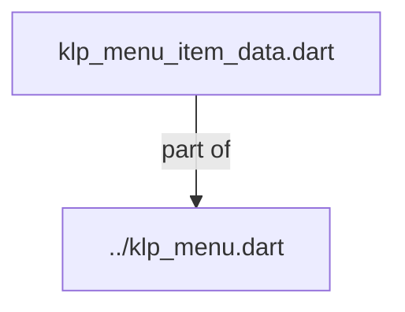
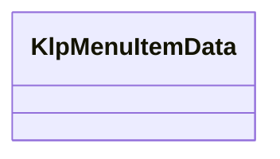

# klp_menu_item_data.dart：直接依賴與宣告架構

[回到目錄](README.md) · [來源檔案](../../../../../../lib/src/features/overlays/menu/klp_menu_item_data.dart)

## 範圍

核心是 `lib/src/features/overlays/menu/klp_menu_item_data.dart`。主要視角為該檔案明寫的 import／export／part；輔助視角為本檔宣告及 extends／implements／with／on 關係。只展開一層外部邊界。

## 直接依賴圖

## 依賴證據

| 關係 | 原始 directive | 來源 |
|---|---|---|
| part of | <code>part of &#x27;../klp_menu.dart&#x27;;</code> | [lib/src/features/overlays/menu/klp_menu_item_data.dart:1](../../../../../../lib/src/features/overlays/menu/klp_menu_item_data.dart#L1) |

## 宣告關係圖

本組節點是本檔宣告；沒有箭頭的宣告未在此圖主張互相依賴。

## 宣告與成員證據

成員包含 public 與 private；簽章取自來源，省略函式本體與欄位初始值。`(inferred)` 表示來源未明寫型別；建構子只顯示參數部分，不含初始化列表。

### KlpMenuItemData

ClassDeclaration · public · [lib/src/features/overlays/menu/klp_menu_item_data.dart:3](../../../../../../lib/src/features/overlays/menu/klp_menu_item_data.dart#L3)

<code>class KlpMenuItemData</code>

來源註解摘要：[KlpMenu] 裡的一個項目。 [toggleValue] 非 null 時項目會額外畫出一個開關指示，用於「這個選項本身是 一個可切換設定」的情境（例如選單裡的「顯示隱藏檔案」）；[hasSubmenu] 只是 畫出展開箭頭的視覺提示，實際的子選單彈出邏輯不歸這個資料類別管，由呼叫端 自行處理 [onPressed]。[separatedBefore] 在這個項目之前插入一條分隔線， 用來把選單切成語意上的幾組。

| 成員 | 可見性 | 簽章／型別 | 來源註解摘要 | 證據 |
|---|---|---|---|---|
| constructor <code>KlpMenuItemData</code> | public | <code>const KlpMenuItemData({ required this.label, required this.onPressed, this.key, this.icon, this.shortcut, this.toggleValue, this.hasSubmenu = false, this.danger = false, this.separatedBefore = false, this.dashedSeparatorBefore = false, this.selected = false, this.enabled = true, })</code> |  | [lib/src/features/overlays/menu/klp_menu_item_data.dart:11](../../../../../../lib/src/features/overlays/menu/klp_menu_item_data.dart#L11) |
| field <code>label</code> | public | <code>final String label</code> |  | [lib/src/features/overlays/menu/klp_menu_item_data.dart:29](../../../../../../lib/src/features/overlays/menu/klp_menu_item_data.dart#L29) |
| field <code>onPressed</code> | public | <code>final VoidCallback onPressed</code> |  | [lib/src/features/overlays/menu/klp_menu_item_data.dart:30](../../../../../../lib/src/features/overlays/menu/klp_menu_item_data.dart#L30) |
| field <code>key</code> | public | <code>final Key? key</code> |  | [lib/src/features/overlays/menu/klp_menu_item_data.dart:31](../../../../../../lib/src/features/overlays/menu/klp_menu_item_data.dart#L31) |
| field <code>icon</code> | public | <code>final KlpIconData? icon</code> |  | [lib/src/features/overlays/menu/klp_menu_item_data.dart:32](../../../../../../lib/src/features/overlays/menu/klp_menu_item_data.dart#L32) |
| field <code>shortcut</code> | public | <code>final String? shortcut</code> |  | [lib/src/features/overlays/menu/klp_menu_item_data.dart:33](../../../../../../lib/src/features/overlays/menu/klp_menu_item_data.dart#L33) |
| field <code>toggleValue</code> | public | <code>final bool? toggleValue</code> |  | [lib/src/features/overlays/menu/klp_menu_item_data.dart:34](../../../../../../lib/src/features/overlays/menu/klp_menu_item_data.dart#L34) |
| field <code>hasSubmenu</code> | public | <code>final bool hasSubmenu</code> |  | [lib/src/features/overlays/menu/klp_menu_item_data.dart:35](../../../../../../lib/src/features/overlays/menu/klp_menu_item_data.dart#L35) |
| field <code>danger</code> | public | <code>final bool danger</code> |  | [lib/src/features/overlays/menu/klp_menu_item_data.dart:36](../../../../../../lib/src/features/overlays/menu/klp_menu_item_data.dart#L36) |
| field <code>separatedBefore</code> | public | <code>final bool separatedBefore</code> |  | [lib/src/features/overlays/menu/klp_menu_item_data.dart:37](../../../../../../lib/src/features/overlays/menu/klp_menu_item_data.dart#L37) |
| field <code>dashedSeparatorBefore</code> | public | <code>final bool dashedSeparatorBefore</code> | 在此項目前以虛線分組；不可與 [separatedBefore] 同時使用。 | [lib/src/features/overlays/menu/klp_menu_item_data.dart:40](../../../../../../lib/src/features/overlays/menu/klp_menu_item_data.dart#L40) |
| field <code>selected</code> | public | <code>final bool selected</code> |  | [lib/src/features/overlays/menu/klp_menu_item_data.dart:41](../../../../../../lib/src/features/overlays/menu/klp_menu_item_data.dart#L41) |
| field <code>enabled</code> | public | <code>final bool enabled</code> |  | [lib/src/features/overlays/menu/klp_menu_item_data.dart:42](../../../../../../lib/src/features/overlays/menu/klp_menu_item_data.dart#L42) |

## 閱讀說明與限制

箭頭只表示來源明寫的靜態關係；import 不等於呼叫。未分析動態呼叫、欄位的實際物件擁有權、狀態轉移或渲染流程；型別未進行語意解析，繼承目標保留原始型別拼寫。public／private 依 Dart 名稱前綴判斷；public 宣告不代表已由 `lib/kallopis.dart` 匯出。

本頁由 `tool/architecture_atlas` 產生；編輯來源或生成工具後重新產生，避免手改本頁。
