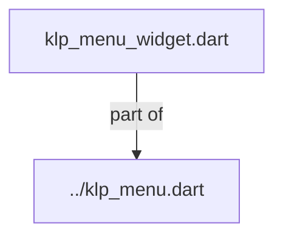
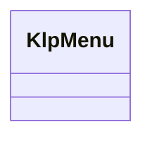
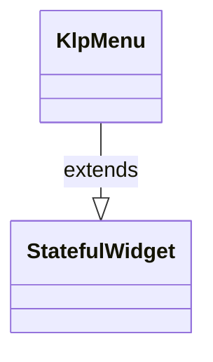

# klp_menu_widget.dart：直接依賴與宣告架構

[回到目錄](README.md) · [來源檔案](../../../../../../lib/src/features/overlays/menu/klp_menu_widget.dart)

## 範圍

核心是 `lib/src/features/overlays/menu/klp_menu_widget.dart`。主要視角為該檔案明寫的 import／export／part；輔助視角為本檔宣告及 extends／implements／with／on 關係。只展開一層外部邊界。

## 直接依賴圖

## 依賴證據

| 關係 | 原始 directive | 來源 |
|---|---|---|
| part of | <code>part of &#x27;../klp_menu.dart&#x27;;</code> | [lib/src/features/overlays/menu/klp_menu_widget.dart:1](../../../../../../lib/src/features/overlays/menu/klp_menu_widget.dart#L1) |

## 宣告關係圖

本組節點是本檔宣告；沒有箭頭的宣告未在此圖主張互相依賴。

## 宣告與成員證據

成員包含 public 與 private；簽章取自來源，省略函式本體與欄位初始值。`(inferred)` 表示來源未明寫型別；建構子只顯示參數部分，不含初始化列表。

### KlpMenu

ClassDeclaration · public · [lib/src/features/overlays/menu/klp_menu_widget.dart:3](../../../../../../lib/src/features/overlays/menu/klp_menu_widget.dart#L3)

<code>class KlpMenu extends StatefulWidget</code>

來源註解摘要：彈出式選單面板：標題列加上一組 [KlpMenuItemData]。 只畫面板本身（含陰影與圓角），不處理定位或觸發——插入 overlay 的位置請用 [KlpMenuLayout] 先算好，選單的顯示／關閉時機也由呼叫端控制。

- `extends` → <code>StatefulWidget</code>：[lib/src/features/overlays/menu/klp_menu_widget.dart:7](../../../../../../lib/src/features/overlays/menu/klp_menu_widget.dart#L7)

| 成員 | 可見性 | 簽章／型別 | 來源註解摘要 | 證據 |
|---|---|---|---|---|
| constructor <code>KlpMenu</code> | public | <code>const KlpMenu({ super.key, required this.label, required this.items, this.autofocus = true, this.onEscape, })</code> |  | [lib/src/features/overlays/menu/klp_menu_widget.dart:8](../../../../../../lib/src/features/overlays/menu/klp_menu_widget.dart#L8) |
| field <code>label</code> | public | <code>final String label</code> |  | [lib/src/features/overlays/menu/klp_menu_widget.dart:16](../../../../../../lib/src/features/overlays/menu/klp_menu_widget.dart#L16) |
| field <code>items</code> | public | <code>final List&lt;KlpMenuItemData&gt; items</code> |  | [lib/src/features/overlays/menu/klp_menu_widget.dart:17](../../../../../../lib/src/features/overlays/menu/klp_menu_widget.dart#L17) |
| field <code>autofocus</code> | public | <code>final bool autofocus</code> | 是否在選單出現時自動取得鍵盤焦點，才能立刻用方向鍵操作。預設 `true`。 | [lib/src/features/overlays/menu/klp_menu_widget.dart:20](../../../../../../lib/src/features/overlays/menu/klp_menu_widget.dart#L20) |
| field <code>onEscape</code> | public | <code>final VoidCallback? onEscape</code> | 按下 `Escape` 時呼叫；未提供時不產生作用。 | [lib/src/features/overlays/menu/klp_menu_widget.dart:23](../../../../../../lib/src/features/overlays/menu/klp_menu_widget.dart#L23) |
| method <code>createState</code> | public | <code>State&lt;KlpMenu&gt; createState()</code> |  | [lib/src/features/overlays/menu/klp_menu_widget.dart:25](../../../../../../lib/src/features/overlays/menu/klp_menu_widget.dart#L25) |

## 閱讀說明與限制

箭頭只表示來源明寫的靜態關係；import 不等於呼叫。未分析動態呼叫、欄位的實際物件擁有權、狀態轉移或渲染流程；型別未進行語意解析，繼承目標保留原始型別拼寫。public／private 依 Dart 名稱前綴判斷；public 宣告不代表已由 `lib/kallopis.dart` 匯出。

本頁由 `tool/architecture_atlas` 產生；編輯來源或生成工具後重新產生，避免手改本頁。
