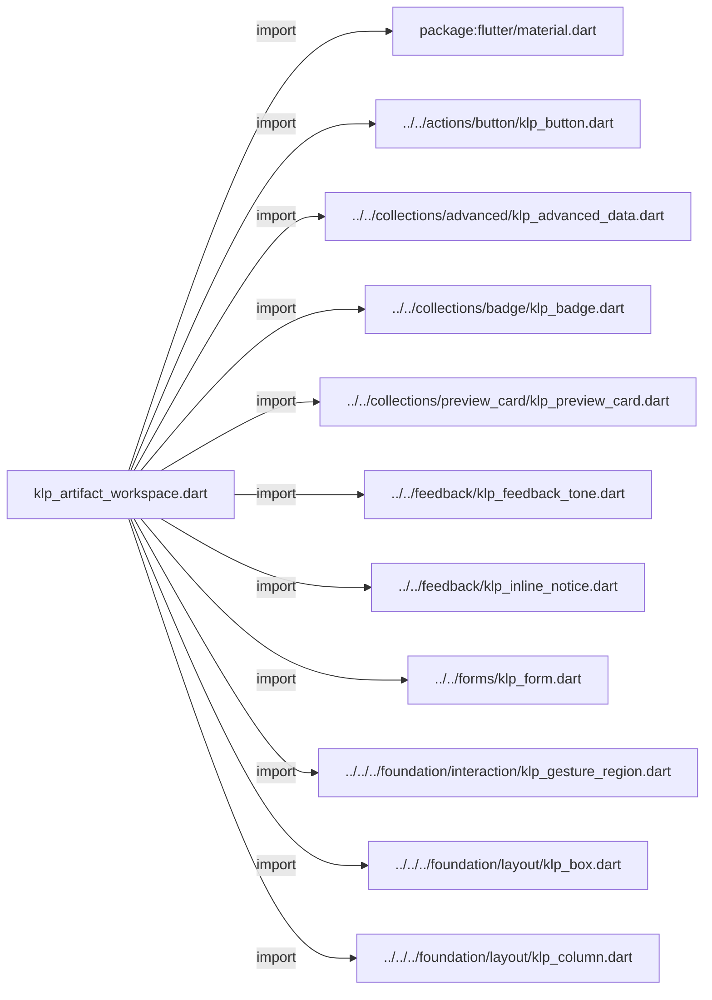
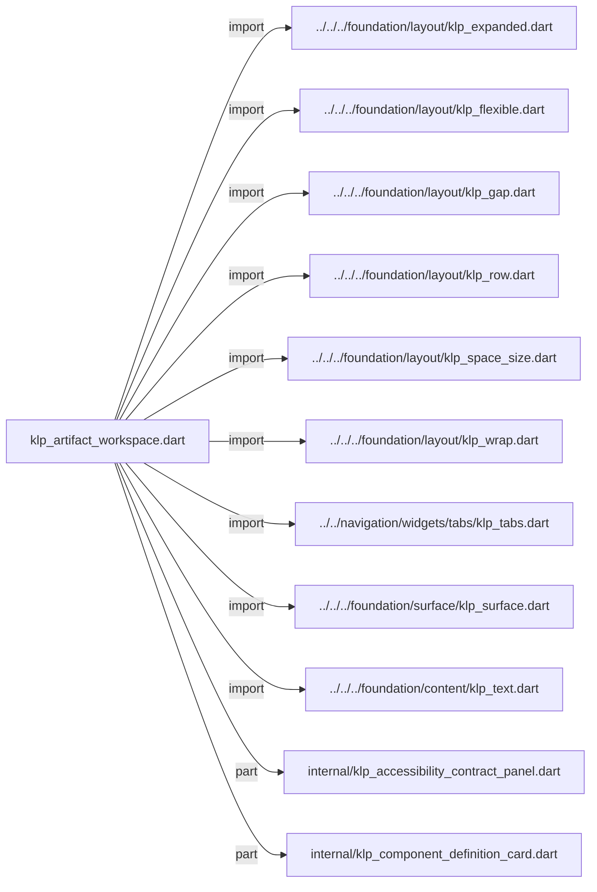
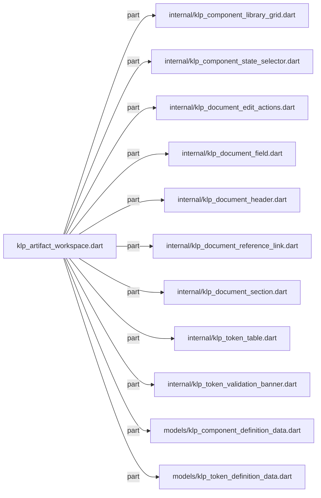
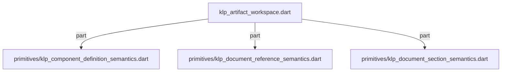

# klp_artifact_workspace.dart：直接依賴與宣告架構

[回到目錄](README.md) · [來源檔案](../../../../../../lib/src/features/workspace/artifact/klp_artifact_workspace.dart)

## 範圍

核心是 `lib/src/features/workspace/artifact/klp_artifact_workspace.dart`。主要視角為該檔案明寫的 import／export／part；輔助視角為本檔宣告及 extends／implements／with／on 關係。只展開一層外部邊界。

## 直接依賴圖

## 依賴證據

| 關係 | 原始 directive | 來源 |
|---|---|---|
| import | <code>import &#x27;package:flutter/material.dart&#x27;;</code> | [lib/src/features/workspace/artifact/klp_artifact_workspace.dart:1](../../../../../../lib/src/features/workspace/artifact/klp_artifact_workspace.dart#L1) |
| import | <code>import &#x27;../../actions/button/klp_button.dart&#x27;;</code> | [lib/src/features/workspace/artifact/klp_artifact_workspace.dart:3](../../../../../../lib/src/features/workspace/artifact/klp_artifact_workspace.dart#L3) |
| import | <code>import &#x27;../../collections/advanced/klp_advanced_data.dart&#x27;;</code> | [lib/src/features/workspace/artifact/klp_artifact_workspace.dart:4](../../../../../../lib/src/features/workspace/artifact/klp_artifact_workspace.dart#L4) |
| import | <code>import &#x27;../../collections/badge/klp_badge.dart&#x27;;</code> | [lib/src/features/workspace/artifact/klp_artifact_workspace.dart:5](../../../../../../lib/src/features/workspace/artifact/klp_artifact_workspace.dart#L5) |
| import | <code>import &#x27;../../collections/preview_card/klp_preview_card.dart&#x27;;</code> | [lib/src/features/workspace/artifact/klp_artifact_workspace.dart:6](../../../../../../lib/src/features/workspace/artifact/klp_artifact_workspace.dart#L6) |
| import | <code>import &#x27;../../feedback/klp_feedback_tone.dart&#x27;;</code> | [lib/src/features/workspace/artifact/klp_artifact_workspace.dart:7](../../../../../../lib/src/features/workspace/artifact/klp_artifact_workspace.dart#L7) |
| import | <code>import &#x27;../../feedback/klp_inline_notice.dart&#x27;;</code> | [lib/src/features/workspace/artifact/klp_artifact_workspace.dart:8](../../../../../../lib/src/features/workspace/artifact/klp_artifact_workspace.dart#L8) |
| import | <code>import &#x27;../../forms/klp_form.dart&#x27;;</code> | [lib/src/features/workspace/artifact/klp_artifact_workspace.dart:9](../../../../../../lib/src/features/workspace/artifact/klp_artifact_workspace.dart#L9) |
| import | <code>import &#x27;../../../foundation/interaction/klp_gesture_region.dart&#x27;;</code> | [lib/src/features/workspace/artifact/klp_artifact_workspace.dart:10](../../../../../../lib/src/features/workspace/artifact/klp_artifact_workspace.dart#L10) |
| import | <code>import &#x27;../../../foundation/layout/klp_box.dart&#x27;;</code> | [lib/src/features/workspace/artifact/klp_artifact_workspace.dart:11](../../../../../../lib/src/features/workspace/artifact/klp_artifact_workspace.dart#L11) |
| import | <code>import &#x27;../../../foundation/layout/klp_column.dart&#x27;;</code> | [lib/src/features/workspace/artifact/klp_artifact_workspace.dart:12](../../../../../../lib/src/features/workspace/artifact/klp_artifact_workspace.dart#L12) |
| import | <code>import &#x27;../../../foundation/layout/klp_expanded.dart&#x27;;</code> | [lib/src/features/workspace/artifact/klp_artifact_workspace.dart:13](../../../../../../lib/src/features/workspace/artifact/klp_artifact_workspace.dart#L13) |
| import | <code>import &#x27;../../../foundation/layout/klp_flexible.dart&#x27;;</code> | [lib/src/features/workspace/artifact/klp_artifact_workspace.dart:14](../../../../../../lib/src/features/workspace/artifact/klp_artifact_workspace.dart#L14) |
| import | <code>import &#x27;../../../foundation/layout/klp_gap.dart&#x27;;</code> | [lib/src/features/workspace/artifact/klp_artifact_workspace.dart:15](../../../../../../lib/src/features/workspace/artifact/klp_artifact_workspace.dart#L15) |
| import | <code>import &#x27;../../../foundation/layout/klp_row.dart&#x27;;</code> | [lib/src/features/workspace/artifact/klp_artifact_workspace.dart:16](../../../../../../lib/src/features/workspace/artifact/klp_artifact_workspace.dart#L16) |
| import | <code>import &#x27;../../../foundation/layout/klp_space_size.dart&#x27;;</code> | [lib/src/features/workspace/artifact/klp_artifact_workspace.dart:17](../../../../../../lib/src/features/workspace/artifact/klp_artifact_workspace.dart#L17) |
| import | <code>import &#x27;../../../foundation/layout/klp_wrap.dart&#x27;;</code> | [lib/src/features/workspace/artifact/klp_artifact_workspace.dart:18](../../../../../../lib/src/features/workspace/artifact/klp_artifact_workspace.dart#L18) |
| import | <code>import &#x27;../../navigation/widgets/tabs/klp_tabs.dart&#x27;;</code> | [lib/src/features/workspace/artifact/klp_artifact_workspace.dart:19](../../../../../../lib/src/features/workspace/artifact/klp_artifact_workspace.dart#L19) |
| import | <code>import &#x27;../../../foundation/surface/klp_surface.dart&#x27;;</code> | [lib/src/features/workspace/artifact/klp_artifact_workspace.dart:20](../../../../../../lib/src/features/workspace/artifact/klp_artifact_workspace.dart#L20) |
| import | <code>import &#x27;../../../foundation/content/klp_text.dart&#x27;;</code> | [lib/src/features/workspace/artifact/klp_artifact_workspace.dart:21](../../../../../../lib/src/features/workspace/artifact/klp_artifact_workspace.dart#L21) |
| part | <code>part &#x27;internal/klp_accessibility_contract_panel.dart&#x27;;</code> | [lib/src/features/workspace/artifact/klp_artifact_workspace.dart:23](../../../../../../lib/src/features/workspace/artifact/klp_artifact_workspace.dart#L23) |
| part | <code>part &#x27;internal/klp_component_definition_card.dart&#x27;;</code> | [lib/src/features/workspace/artifact/klp_artifact_workspace.dart:24](../../../../../../lib/src/features/workspace/artifact/klp_artifact_workspace.dart#L24) |
| part | <code>part &#x27;internal/klp_component_library_grid.dart&#x27;;</code> | [lib/src/features/workspace/artifact/klp_artifact_workspace.dart:25](../../../../../../lib/src/features/workspace/artifact/klp_artifact_workspace.dart#L25) |
| part | <code>part &#x27;internal/klp_component_state_selector.dart&#x27;;</code> | [lib/src/features/workspace/artifact/klp_artifact_workspace.dart:26](../../../../../../lib/src/features/workspace/artifact/klp_artifact_workspace.dart#L26) |
| part | <code>part &#x27;internal/klp_document_edit_actions.dart&#x27;;</code> | [lib/src/features/workspace/artifact/klp_artifact_workspace.dart:27](../../../../../../lib/src/features/workspace/artifact/klp_artifact_workspace.dart#L27) |
| part | <code>part &#x27;internal/klp_document_field.dart&#x27;;</code> | [lib/src/features/workspace/artifact/klp_artifact_workspace.dart:28](../../../../../../lib/src/features/workspace/artifact/klp_artifact_workspace.dart#L28) |
| part | <code>part &#x27;internal/klp_document_header.dart&#x27;;</code> | [lib/src/features/workspace/artifact/klp_artifact_workspace.dart:29](../../../../../../lib/src/features/workspace/artifact/klp_artifact_workspace.dart#L29) |
| part | <code>part &#x27;internal/klp_document_reference_link.dart&#x27;;</code> | [lib/src/features/workspace/artifact/klp_artifact_workspace.dart:30](../../../../../../lib/src/features/workspace/artifact/klp_artifact_workspace.dart#L30) |
| part | <code>part &#x27;internal/klp_document_section.dart&#x27;;</code> | [lib/src/features/workspace/artifact/klp_artifact_workspace.dart:31](../../../../../../lib/src/features/workspace/artifact/klp_artifact_workspace.dart#L31) |
| part | <code>part &#x27;internal/klp_token_table.dart&#x27;;</code> | [lib/src/features/workspace/artifact/klp_artifact_workspace.dart:32](../../../../../../lib/src/features/workspace/artifact/klp_artifact_workspace.dart#L32) |
| part | <code>part &#x27;internal/klp_token_validation_banner.dart&#x27;;</code> | [lib/src/features/workspace/artifact/klp_artifact_workspace.dart:33](../../../../../../lib/src/features/workspace/artifact/klp_artifact_workspace.dart#L33) |
| part | <code>part &#x27;models/klp_component_definition_data.dart&#x27;;</code> | [lib/src/features/workspace/artifact/klp_artifact_workspace.dart:34](../../../../../../lib/src/features/workspace/artifact/klp_artifact_workspace.dart#L34) |
| part | <code>part &#x27;models/klp_token_definition_data.dart&#x27;;</code> | [lib/src/features/workspace/artifact/klp_artifact_workspace.dart:35](../../../../../../lib/src/features/workspace/artifact/klp_artifact_workspace.dart#L35) |
| part | <code>part &#x27;primitives/klp_component_definition_semantics.dart&#x27;;</code> | [lib/src/features/workspace/artifact/klp_artifact_workspace.dart:36](../../../../../../lib/src/features/workspace/artifact/klp_artifact_workspace.dart#L36) |
| part | <code>part &#x27;primitives/klp_document_reference_semantics.dart&#x27;;</code> | [lib/src/features/workspace/artifact/klp_artifact_workspace.dart:37](../../../../../../lib/src/features/workspace/artifact/klp_artifact_workspace.dart#L37) |
| part | <code>part &#x27;primitives/klp_document_section_semantics.dart&#x27;;</code> | [lib/src/features/workspace/artifact/klp_artifact_workspace.dart:38](../../../../../../lib/src/features/workspace/artifact/klp_artifact_workspace.dart#L38) |

## 宣告關係圖

本檔沒有 class／enum／mixin／extension 宣告；頂層函式、變數與 typedef 見下表。

## 宣告與成員證據

成員包含 public 與 private；簽章取自來源，省略函式本體與欄位初始值。`(inferred)` 表示來源未明寫型別；建構子只顯示參數部分，不含初始化列表。

## 閱讀說明與限制

箭頭只表示來源明寫的靜態關係；import 不等於呼叫。未分析動態呼叫、欄位的實際物件擁有權、狀態轉移或渲染流程；型別未進行語意解析，繼承目標保留原始型別拼寫。public／private 依 Dart 名稱前綴判斷；public 宣告不代表已由 `lib/kallopis.dart` 匯出。

本頁由 `tool/architecture_atlas` 產生；編輯來源或生成工具後重新產生，避免手改本頁。
