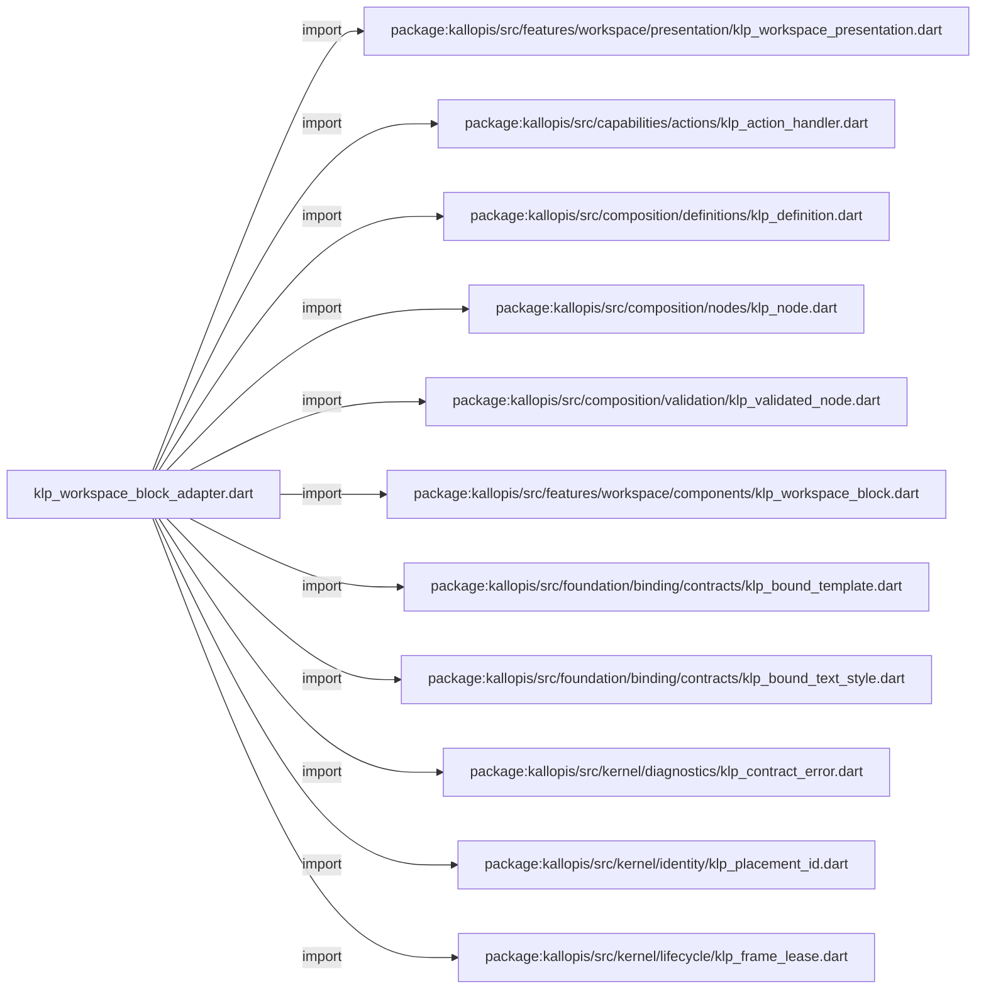
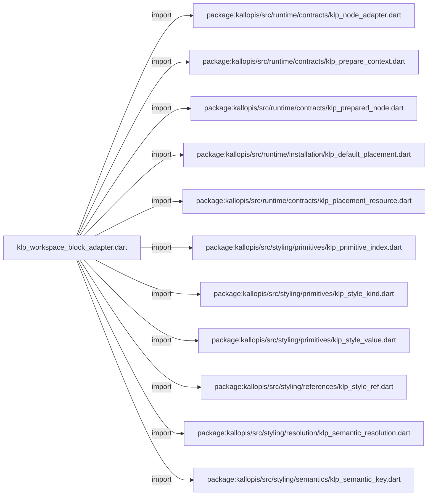
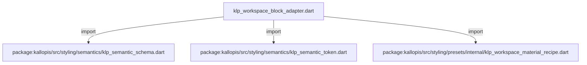
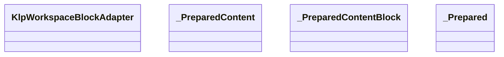
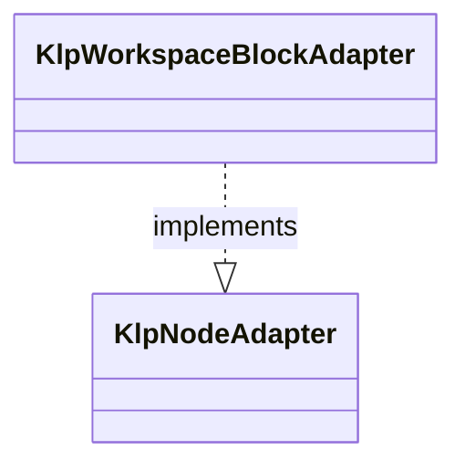
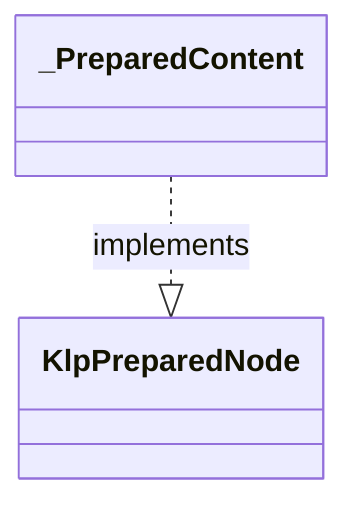
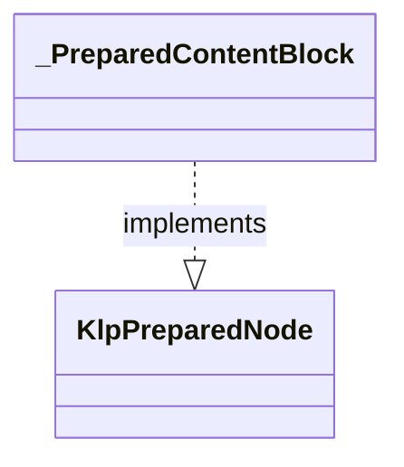
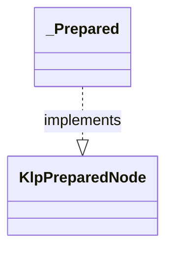

# klp_workspace_block_adapter.dart：直接依賴與宣告架構

[回到目錄](README.md) · [來源檔案](../../../../../../../lib/src/features/workspace/components/adapters/klp_workspace_block_adapter.dart)

## 範圍

核心是 `lib/src/features/workspace/components/adapters/klp_workspace_block_adapter.dart`。主要視角為該檔案明寫的 import／export／part；輔助視角為本檔宣告及 extends／implements／with／on 關係。只展開一層外部邊界。

## 直接依賴圖

## 依賴證據

| 關係 | 原始 directive | 來源 |
|---|---|---|
| import | <code>import &#x27;package:kallopis/src/features/workspace/presentation/klp_workspace_presentation.dart&#x27;;</code> | [lib/src/features/workspace/components/adapters/klp_workspace_block_adapter.dart:1](../../../../../../../lib/src/features/workspace/components/adapters/klp_workspace_block_adapter.dart#L1) |
| import | <code>import &#x27;package:kallopis/src/capabilities/actions/klp_action_handler.dart&#x27;;</code> | [lib/src/features/workspace/components/adapters/klp_workspace_block_adapter.dart:2](../../../../../../../lib/src/features/workspace/components/adapters/klp_workspace_block_adapter.dart#L2) |
| import | <code>import &#x27;package:kallopis/src/composition/definitions/klp_definition.dart&#x27;;</code> | [lib/src/features/workspace/components/adapters/klp_workspace_block_adapter.dart:3](../../../../../../../lib/src/features/workspace/components/adapters/klp_workspace_block_adapter.dart#L3) |
| import | <code>import &#x27;package:kallopis/src/composition/nodes/klp_node.dart&#x27;;</code> | [lib/src/features/workspace/components/adapters/klp_workspace_block_adapter.dart:4](../../../../../../../lib/src/features/workspace/components/adapters/klp_workspace_block_adapter.dart#L4) |
| import | <code>import &#x27;package:kallopis/src/composition/validation/klp_validated_node.dart&#x27;;</code> | [lib/src/features/workspace/components/adapters/klp_workspace_block_adapter.dart:5](../../../../../../../lib/src/features/workspace/components/adapters/klp_workspace_block_adapter.dart#L5) |
| import | <code>import &#x27;package:kallopis/src/features/workspace/components/klp_workspace_block.dart&#x27;;</code> | [lib/src/features/workspace/components/adapters/klp_workspace_block_adapter.dart:6](../../../../../../../lib/src/features/workspace/components/adapters/klp_workspace_block_adapter.dart#L6) |
| import | <code>import &#x27;package:kallopis/src/foundation/binding/contracts/klp_bound_template.dart&#x27;;</code> | [lib/src/features/workspace/components/adapters/klp_workspace_block_adapter.dart:7](../../../../../../../lib/src/features/workspace/components/adapters/klp_workspace_block_adapter.dart#L7) |
| import | <code>import &#x27;package:kallopis/src/foundation/binding/contracts/klp_bound_text_style.dart&#x27;;</code> | [lib/src/features/workspace/components/adapters/klp_workspace_block_adapter.dart:8](../../../../../../../lib/src/features/workspace/components/adapters/klp_workspace_block_adapter.dart#L8) |
| import | <code>import &#x27;package:kallopis/src/kernel/diagnostics/klp_contract_error.dart&#x27;;</code> | [lib/src/features/workspace/components/adapters/klp_workspace_block_adapter.dart:9](../../../../../../../lib/src/features/workspace/components/adapters/klp_workspace_block_adapter.dart#L9) |
| import | <code>import &#x27;package:kallopis/src/kernel/identity/klp_placement_id.dart&#x27;;</code> | [lib/src/features/workspace/components/adapters/klp_workspace_block_adapter.dart:10](../../../../../../../lib/src/features/workspace/components/adapters/klp_workspace_block_adapter.dart#L10) |
| import | <code>import &#x27;package:kallopis/src/kernel/lifecycle/klp_frame_lease.dart&#x27;;</code> | [lib/src/features/workspace/components/adapters/klp_workspace_block_adapter.dart:11](../../../../../../../lib/src/features/workspace/components/adapters/klp_workspace_block_adapter.dart#L11) |
| import | <code>import &#x27;package:kallopis/src/runtime/contracts/klp_node_adapter.dart&#x27;;</code> | [lib/src/features/workspace/components/adapters/klp_workspace_block_adapter.dart:12](../../../../../../../lib/src/features/workspace/components/adapters/klp_workspace_block_adapter.dart#L12) |
| import | <code>import &#x27;package:kallopis/src/runtime/contracts/klp_prepare_context.dart&#x27;;</code> | [lib/src/features/workspace/components/adapters/klp_workspace_block_adapter.dart:13](../../../../../../../lib/src/features/workspace/components/adapters/klp_workspace_block_adapter.dart#L13) |
| import | <code>import &#x27;package:kallopis/src/runtime/contracts/klp_prepared_node.dart&#x27;;</code> | [lib/src/features/workspace/components/adapters/klp_workspace_block_adapter.dart:14](../../../../../../../lib/src/features/workspace/components/adapters/klp_workspace_block_adapter.dart#L14) |
| import | <code>import &#x27;package:kallopis/src/runtime/installation/klp_default_placement.dart&#x27;;</code> | [lib/src/features/workspace/components/adapters/klp_workspace_block_adapter.dart:15](../../../../../../../lib/src/features/workspace/components/adapters/klp_workspace_block_adapter.dart#L15) |
| import | <code>import &#x27;package:kallopis/src/runtime/contracts/klp_placement_resource.dart&#x27;;</code> | [lib/src/features/workspace/components/adapters/klp_workspace_block_adapter.dart:16](../../../../../../../lib/src/features/workspace/components/adapters/klp_workspace_block_adapter.dart#L16) |
| import | <code>import &#x27;package:kallopis/src/styling/primitives/klp_primitive_index.dart&#x27;;</code> | [lib/src/features/workspace/components/adapters/klp_workspace_block_adapter.dart:17](../../../../../../../lib/src/features/workspace/components/adapters/klp_workspace_block_adapter.dart#L17) |
| import | <code>import &#x27;package:kallopis/src/styling/primitives/klp_style_kind.dart&#x27;;</code> | [lib/src/features/workspace/components/adapters/klp_workspace_block_adapter.dart:18](../../../../../../../lib/src/features/workspace/components/adapters/klp_workspace_block_adapter.dart#L18) |
| import | <code>import &#x27;package:kallopis/src/styling/primitives/klp_style_value.dart&#x27;;</code> | [lib/src/features/workspace/components/adapters/klp_workspace_block_adapter.dart:19](../../../../../../../lib/src/features/workspace/components/adapters/klp_workspace_block_adapter.dart#L19) |
| import | <code>import &#x27;package:kallopis/src/styling/references/klp_style_ref.dart&#x27;;</code> | [lib/src/features/workspace/components/adapters/klp_workspace_block_adapter.dart:20](../../../../../../../lib/src/features/workspace/components/adapters/klp_workspace_block_adapter.dart#L20) |
| import | <code>import &#x27;package:kallopis/src/styling/resolution/klp_semantic_resolution.dart&#x27;;</code> | [lib/src/features/workspace/components/adapters/klp_workspace_block_adapter.dart:21](../../../../../../../lib/src/features/workspace/components/adapters/klp_workspace_block_adapter.dart#L21) |
| import | <code>import &#x27;package:kallopis/src/styling/semantics/klp_semantic_key.dart&#x27;;</code> | [lib/src/features/workspace/components/adapters/klp_workspace_block_adapter.dart:22](../../../../../../../lib/src/features/workspace/components/adapters/klp_workspace_block_adapter.dart#L22) |
| import | <code>import &#x27;package:kallopis/src/styling/semantics/klp_semantic_schema.dart&#x27;;</code> | [lib/src/features/workspace/components/adapters/klp_workspace_block_adapter.dart:23](../../../../../../../lib/src/features/workspace/components/adapters/klp_workspace_block_adapter.dart#L23) |
| import | <code>import &#x27;package:kallopis/src/styling/semantics/klp_semantic_token.dart&#x27;;</code> | [lib/src/features/workspace/components/adapters/klp_workspace_block_adapter.dart:24](../../../../../../../lib/src/features/workspace/components/adapters/klp_workspace_block_adapter.dart#L24) |
| import | <code>import &#x27;package:kallopis/src/styling/presets/internal/klp_workspace_material_recipe.dart&#x27;;</code> | [lib/src/features/workspace/components/adapters/klp_workspace_block_adapter.dart:25](../../../../../../../lib/src/features/workspace/components/adapters/klp_workspace_block_adapter.dart#L25) |

## 宣告關係圖

本組節點是本檔宣告；沒有箭頭的宣告未在此圖主張互相依賴。

## 宣告與成員證據

成員包含 public 與 private；簽章取自來源，省略函式本體與欄位初始值。`(inferred)` 表示來源未明寫型別；建構子只顯示參數部分，不含初始化列表。

### KlpWorkspaceBlockAdapter

ClassDeclaration · public · [lib/src/features/workspace/components/adapters/klp_workspace_block_adapter.dart:27](../../../../../../../lib/src/features/workspace/components/adapters/klp_workspace_block_adapter.dart#L27)

<code>final class KlpWorkspaceBlockAdapter implements KlpNodeAdapter</code>

來源註解摘要：內建工作區區塊與內容的語意繫結轉接器；產品資料和事件仍由使用端提供。

- `implements` → <code>KlpNodeAdapter</code>：[lib/src/features/workspace/components/adapters/klp_workspace_block_adapter.dart:28](../../../../../../../lib/src/features/workspace/components/adapters/klp_workspace_block_adapter.dart#L28)

| 成員 | 可見性 | 簽章／型別 | 來源註解摘要 | 證據 |
|---|---|---|---|---|
| field <code>_owner</code> | private | <code>static const (inferred) _owner</code> |  | [lib/src/features/workspace/components/adapters/klp_workspace_block_adapter.dart:29](../../../../../../../lib/src/features/workspace/components/adapters/klp_workspace_block_adapter.dart#L29) |
| method <code>_key</code> | private | <code>static KlpSemanticKey&lt;T&gt; _key&lt;T extends KlpStyleValue&gt;(String name, KlpStyleKind&lt;T&gt; kind)</code> |  | [lib/src/features/workspace/components/adapters/klp_workspace_block_adapter.dart:30](../../../../../../../lib/src/features/workspace/components/adapters/klp_workspace_block_adapter.dart#L30) |
| field <code>background</code> | public | <code>static final (inferred) background</code> |  | [lib/src/features/workspace/components/adapters/klp_workspace_block_adapter.dart:31](../../../../../../../lib/src/features/workspace/components/adapters/klp_workspace_block_adapter.dart#L31) |
| field <code>foreground</code> | public | <code>static final (inferred) foreground</code> |  | [lib/src/features/workspace/components/adapters/klp_workspace_block_adapter.dart:32](../../../../../../../lib/src/features/workspace/components/adapters/klp_workspace_block_adapter.dart#L32) |
| field <code>muted</code> | public | <code>static final (inferred) muted</code> |  | [lib/src/features/workspace/components/adapters/klp_workspace_block_adapter.dart:33](../../../../../../../lib/src/features/workspace/components/adapters/klp_workspace_block_adapter.dart#L33) |
| field <code>selected</code> | public | <code>static final (inferred) selected</code> |  | [lib/src/features/workspace/components/adapters/klp_workspace_block_adapter.dart:34](../../../../../../../lib/src/features/workspace/components/adapters/klp_workspace_block_adapter.dart#L34) |
| field <code>shadow</code> | public | <code>static final (inferred) shadow</code> |  | [lib/src/features/workspace/components/adapters/klp_workspace_block_adapter.dart:35](../../../../../../../lib/src/features/workspace/components/adapters/klp_workspace_block_adapter.dart#L35) |
| field <code>compactGap</code> | public | <code>static final (inferred) compactGap</code> |  | [lib/src/features/workspace/components/adapters/klp_workspace_block_adapter.dart:36](../../../../../../../lib/src/features/workspace/components/adapters/klp_workspace_block_adapter.dart#L36) |
| field <code>gap</code> | public | <code>static final (inferred) gap</code> |  | [lib/src/features/workspace/components/adapters/klp_workspace_block_adapter.dart:37](../../../../../../../lib/src/features/workspace/components/adapters/klp_workspace_block_adapter.dart#L37) |
| field <code>row</code> | public | <code>static final (inferred) row</code> |  | [lib/src/features/workspace/components/adapters/klp_workspace_block_adapter.dart:38](../../../../../../../lib/src/features/workspace/components/adapters/klp_workspace_block_adapter.dart#L38) |
| field <code>header</code> | public | <code>static final (inferred) header</code> |  | [lib/src/features/workspace/components/adapters/klp_workspace_block_adapter.dart:39](../../../../../../../lib/src/features/workspace/components/adapters/klp_workspace_block_adapter.dart#L39) |
| field <code>inset</code> | public | <code>static final (inferred) inset</code> |  | [lib/src/features/workspace/components/adapters/klp_workspace_block_adapter.dart:40](../../../../../../../lib/src/features/workspace/components/adapters/klp_workspace_block_adapter.dart#L40) |
| field <code>radius</code> | public | <code>static final (inferred) radius</code> |  | [lib/src/features/workspace/components/adapters/klp_workspace_block_adapter.dart:41](../../../../../../../lib/src/features/workspace/components/adapters/klp_workspace_block_adapter.dart#L41) |
| field <code>family</code> | public | <code>static final (inferred) family</code> |  | [lib/src/features/workspace/components/adapters/klp_workspace_block_adapter.dart:42](../../../../../../../lib/src/features/workspace/components/adapters/klp_workspace_block_adapter.dart#L42) |
| field <code>size</code> | public | <code>static final (inferred) size</code> |  | [lib/src/features/workspace/components/adapters/klp_workspace_block_adapter.dart:43](../../../../../../../lib/src/features/workspace/components/adapters/klp_workspace_block_adapter.dart#L43) |
| field <code>weight</code> | public | <code>static final (inferred) weight</code> |  | [lib/src/features/workspace/components/adapters/klp_workspace_block_adapter.dart:44](../../../../../../../lib/src/features/workspace/components/adapters/klp_workspace_block_adapter.dart#L44) |
| field <code>height</code> | public | <code>static final (inferred) height</code> |  | [lib/src/features/workspace/components/adapters/klp_workspace_block_adapter.dart:45](../../../../../../../lib/src/features/workspace/components/adapters/klp_workspace_block_adapter.dart#L45) |
| field <code>spacing</code> | public | <code>static final (inferred) spacing</code> |  | [lib/src/features/workspace/components/adapters/klp_workspace_block_adapter.dart:46](../../../../../../../lib/src/features/workspace/components/adapters/klp_workspace_block_adapter.dart#L46) |
| field <code>eyebrowSize</code> | public | <code>static final (inferred) eyebrowSize</code> |  | [lib/src/features/workspace/components/adapters/klp_workspace_block_adapter.dart:47](../../../../../../../lib/src/features/workspace/components/adapters/klp_workspace_block_adapter.dart#L47) |
| field <code>titleSize</code> | public | <code>static final (inferred) titleSize</code> |  | [lib/src/features/workspace/components/adapters/klp_workspace_block_adapter.dart:48](../../../../../../../lib/src/features/workspace/components/adapters/klp_workspace_block_adapter.dart#L48) |
| field <code>bodySize</code> | public | <code>static final (inferred) bodySize</code> |  | [lib/src/features/workspace/components/adapters/klp_workspace_block_adapter.dart:49](../../../../../../../lib/src/features/workspace/components/adapters/klp_workspace_block_adapter.dart#L49) |
| field <code>sectionSize</code> | public | <code>static final (inferred) sectionSize</code> |  | [lib/src/features/workspace/components/adapters/klp_workspace_block_adapter.dart:50](../../../../../../../lib/src/features/workspace/components/adapters/klp_workspace_block_adapter.dart#L50) |
| field <code>bodyHeight</code> | public | <code>static final (inferred) bodyHeight</code> |  | [lib/src/features/workspace/components/adapters/klp_workspace_block_adapter.dart:51](../../../../../../../lib/src/features/workspace/components/adapters/klp_workspace_block_adapter.dart#L51) |
| field <code>dividerStroke</code> | public | <code>static final (inferred) dividerStroke</code> |  | [lib/src/features/workspace/components/adapters/klp_workspace_block_adapter.dart:52](../../../../../../../lib/src/features/workspace/components/adapters/klp_workspace_block_adapter.dart#L52) |
| field <code>brandFamily</code> | public | <code>static final (inferred) brandFamily</code> |  | [lib/src/features/workspace/components/adapters/klp_workspace_block_adapter.dart:53](../../../../../../../lib/src/features/workspace/components/adapters/klp_workspace_block_adapter.dart#L53) |
| field <code>brandMarkSize</code> | public | <code>static final (inferred) brandMarkSize</code> |  | [lib/src/features/workspace/components/adapters/klp_workspace_block_adapter.dart:54](../../../../../../../lib/src/features/workspace/components/adapters/klp_workspace_block_adapter.dart#L54) |
| field <code>brandNameSize</code> | public | <code>static final (inferred) brandNameSize</code> |  | [lib/src/features/workspace/components/adapters/klp_workspace_block_adapter.dart:55](../../../../../../../lib/src/features/workspace/components/adapters/klp_workspace_block_adapter.dart#L55) |
| field <code>_contract</code> | private | <code>final KlpDefinition&lt;KlpNode&gt; _contract</code> |  | [lib/src/features/workspace/components/adapters/klp_workspace_block_adapter.dart:57](../../../../../../../lib/src/features/workspace/components/adapters/klp_workspace_block_adapter.dart#L57) |
| constructor <code>_</code> | private | <code>KlpWorkspaceBlockAdapter._(this._contract)</code> |  | [lib/src/features/workspace/components/adapters/klp_workspace_block_adapter.dart:58](../../../../../../../lib/src/features/workspace/components/adapters/klp_workspace_block_adapter.dart#L58) |
| getter <code>contract</code> | public | <code>KlpDefinition&lt;KlpNode&gt; get contract</code> |  | [lib/src/features/workspace/components/adapters/klp_workspace_block_adapter.dart:59](../../../../../../../lib/src/features/workspace/components/adapters/klp_workspace_block_adapter.dart#L59) |
| method <code>createAll</code> | public | <code>static List&lt;KlpNodeAdapter&gt; createAll()</code> |  | [lib/src/features/workspace/components/adapters/klp_workspace_block_adapter.dart:62](../../../../../../../lib/src/features/workspace/components/adapters/klp_workspace_block_adapter.dart#L62) |
| method <code>_token</code> | private | <code>static KlpSemanticToken&lt;T&gt; _token&lt;T extends KlpStyleValue&gt;(KlpSemanticKey&lt;T&gt; key, KlpPrimitiveIndex index)</code> |  | [lib/src/features/workspace/components/adapters/klp_workspace_block_adapter.dart:74](../../../../../../../lib/src/features/workspace/components/adapters/klp_workspace_block_adapter.dart#L74) |
| method <code>prepare</code> | public | <code>KlpPreparedNode prepare(KlpNode node, KlpValidatedNode snapshot, KlpPrepareContext context)</code> |  | [lib/src/features/workspace/components/adapters/klp_workspace_block_adapter.dart:76](../../../../../../../lib/src/features/workspace/components/adapters/klp_workspace_block_adapter.dart#L76) |
| method <code>_prepareBlock</code> | private | <code>KlpPreparedNode _prepareBlock(KlpWorkspaceBlock block, KlpValidatedNode snapshot, KlpPrepareContext context)</code> |  | [lib/src/features/workspace/components/adapters/klp_workspace_block_adapter.dart:84](../../../../../../../lib/src/features/workspace/components/adapters/klp_workspace_block_adapter.dart#L84) |

### _PreparedContent

ClassDeclaration · private · [lib/src/features/workspace/components/adapters/klp_workspace_block_adapter.dart:91](../../../../../../../lib/src/features/workspace/components/adapters/klp_workspace_block_adapter.dart#L91)

<code>final class _PreparedContent implements KlpPreparedNode</code>

- `implements` → <code>KlpPreparedNode</code>：[lib/src/features/workspace/components/adapters/klp_workspace_block_adapter.dart:91](../../../../../../../lib/src/features/workspace/components/adapters/klp_workspace_block_adapter.dart#L91)

| 成員 | 可見性 | 簽章／型別 | 來源註解摘要 | 證據 |
|---|---|---|---|---|
| field <code>content</code> | public | <code>final KlpWorkspaceContent content</code> |  | [lib/src/features/workspace/components/adapters/klp_workspace_block_adapter.dart:92](../../../../../../../lib/src/features/workspace/components/adapters/klp_workspace_block_adapter.dart#L92) |
| constructor <code>_PreparedContent</code> | private | <code>const _PreparedContent(this.content)</code> |  | [lib/src/features/workspace/components/adapters/klp_workspace_block_adapter.dart:93](../../../../../../../lib/src/features/workspace/components/adapters/klp_workspace_block_adapter.dart#L93) |
| method <code>createResource</code> | public | <code>KlpPlacementResource createResource(KlpValidatedNode node)</code> |  | [lib/src/features/workspace/components/adapters/klp_workspace_block_adapter.dart:94](../../../../../../../lib/src/features/workspace/components/adapters/klp_workspace_block_adapter.dart#L94) |
| method <code>materialize</code> | public | <code>KlpBoundTemplate materialize(KlpPlacementResource resource, List&lt;KlpBoundTemplate&gt; children, KlpFrameLease lease)</code> |  | [lib/src/features/workspace/components/adapters/klp_workspace_block_adapter.dart:96](../../../../../../../lib/src/features/workspace/components/adapters/klp_workspace_block_adapter.dart#L96) |

### _PreparedContentBlock

ClassDeclaration · private · [lib/src/features/workspace/components/adapters/klp_workspace_block_adapter.dart:100](../../../../../../../lib/src/features/workspace/components/adapters/klp_workspace_block_adapter.dart#L100)

<code>final class _PreparedContentBlock implements KlpPreparedNode</code>

- `implements` → <code>KlpPreparedNode</code>：[lib/src/features/workspace/components/adapters/klp_workspace_block_adapter.dart:100](../../../../../../../lib/src/features/workspace/components/adapters/klp_workspace_block_adapter.dart#L100)

| 成員 | 可見性 | 簽章／型別 | 來源註解摘要 | 證據 |
|---|---|---|---|---|
| field <code>block</code> | public | <code>final KlpWorkspaceContentBlock block</code> |  | [lib/src/features/workspace/components/adapters/klp_workspace_block_adapter.dart:101](../../../../../../../lib/src/features/workspace/components/adapters/klp_workspace_block_adapter.dart#L101) |
| constructor <code>_PreparedContentBlock</code> | private | <code>const _PreparedContentBlock(this.block)</code> |  | [lib/src/features/workspace/components/adapters/klp_workspace_block_adapter.dart:102](../../../../../../../lib/src/features/workspace/components/adapters/klp_workspace_block_adapter.dart#L102) |
| method <code>createResource</code> | public | <code>KlpPlacementResource createResource(KlpValidatedNode node)</code> |  | [lib/src/features/workspace/components/adapters/klp_workspace_block_adapter.dart:103](../../../../../../../lib/src/features/workspace/components/adapters/klp_workspace_block_adapter.dart#L103) |
| method <code>materialize</code> | public | <code>KlpBoundTemplate materialize(KlpPlacementResource resource, List&lt;KlpBoundTemplate&gt; children, KlpFrameLease lease)</code> |  | [lib/src/features/workspace/components/adapters/klp_workspace_block_adapter.dart:105](../../../../../../../lib/src/features/workspace/components/adapters/klp_workspace_block_adapter.dart#L105) |

### _Prepared

ClassDeclaration · private · [lib/src/features/workspace/components/adapters/klp_workspace_block_adapter.dart:109](../../../../../../../lib/src/features/workspace/components/adapters/klp_workspace_block_adapter.dart#L109)

<code>final class _Prepared implements KlpPreparedNode</code>

- `implements` → <code>KlpPreparedNode</code>：[lib/src/features/workspace/components/adapters/klp_workspace_block_adapter.dart:109](../../../../../../../lib/src/features/workspace/components/adapters/klp_workspace_block_adapter.dart#L109)

| 成員 | 可見性 | 簽章／型別 | 來源註解摘要 | 證據 |
|---|---|---|---|---|
| field <code>block</code> | public | <code>final KlpWorkspaceBlock block</code> |  | [lib/src/features/workspace/components/adapters/klp_workspace_block_adapter.dart:110](../../../../../../../lib/src/features/workspace/components/adapters/klp_workspace_block_adapter.dart#L110) |
| field <code>style</code> | public | <code>final KlpSemanticResolution style</code> |  | [lib/src/features/workspace/components/adapters/klp_workspace_block_adapter.dart:111](../../../../../../../lib/src/features/workspace/components/adapters/klp_workspace_block_adapter.dart#L111) |
| field <code>placementId</code> | public | <code>final KlpPlacementId placementId</code> |  | [lib/src/features/workspace/components/adapters/klp_workspace_block_adapter.dart:112](../../../../../../../lib/src/features/workspace/components/adapters/klp_workspace_block_adapter.dart#L112) |
| field <code>actionHandler</code> | public | <code>final KlpActionHandler? actionHandler</code> |  | [lib/src/features/workspace/components/adapters/klp_workspace_block_adapter.dart:113](../../../../../../../lib/src/features/workspace/components/adapters/klp_workspace_block_adapter.dart#L113) |
| constructor <code>_Prepared</code> | private | <code>const _Prepared(this.block, this.style, this.placementId, this.actionHandler)</code> |  | [lib/src/features/workspace/components/adapters/klp_workspace_block_adapter.dart:114](../../../../../../../lib/src/features/workspace/components/adapters/klp_workspace_block_adapter.dart#L114) |
| method <code>createResource</code> | public | <code>KlpPlacementResource createResource(KlpValidatedNode node)</code> |  | [lib/src/features/workspace/components/adapters/klp_workspace_block_adapter.dart:116](../../../../../../../lib/src/features/workspace/components/adapters/klp_workspace_block_adapter.dart#L116) |
| method <code>materialize</code> | public | <code>KlpBoundTemplate materialize(KlpPlacementResource resource, List&lt;KlpBoundTemplate&gt; children, KlpFrameLease lease)</code> |  | [lib/src/features/workspace/components/adapters/klp_workspace_block_adapter.dart:119](../../../../../../../lib/src/features/workspace/components/adapters/klp_workspace_block_adapter.dart#L119) |

## 閱讀說明與限制

箭頭只表示來源明寫的靜態關係；import 不等於呼叫。未分析動態呼叫、欄位的實際物件擁有權、狀態轉移或渲染流程；型別未進行語意解析，繼承目標保留原始型別拼寫。public／private 依 Dart 名稱前綴判斷；public 宣告不代表已由 `lib/kallopis.dart` 匯出。

本頁由 `tool/architecture_atlas` 產生；編輯來源或生成工具後重新產生，避免手改本頁。
