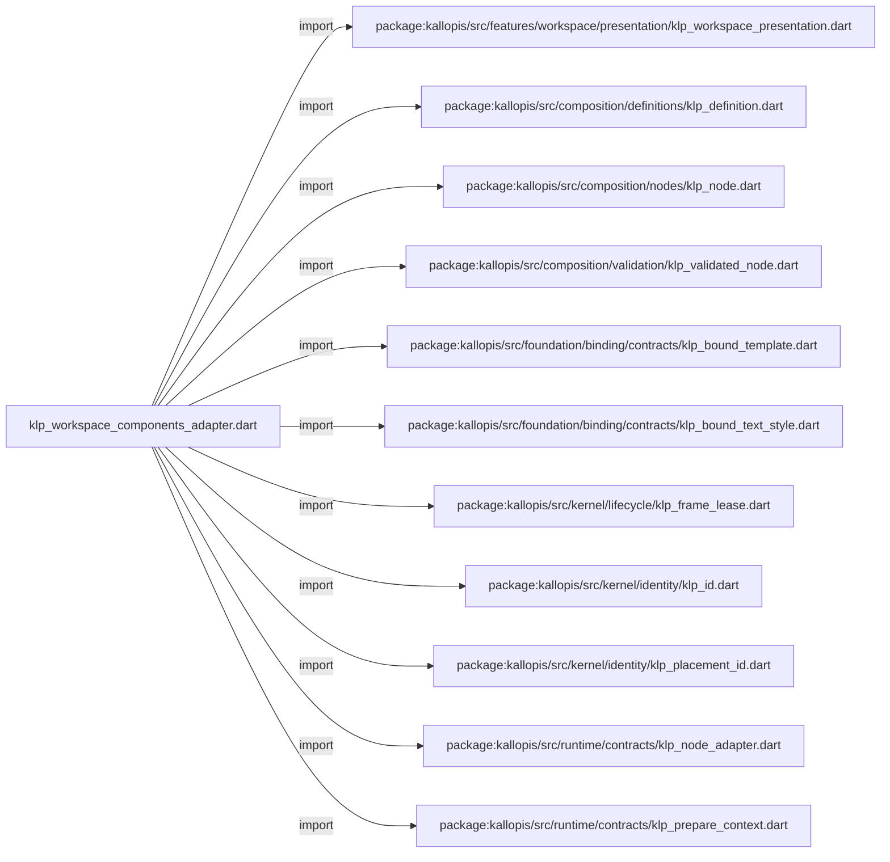
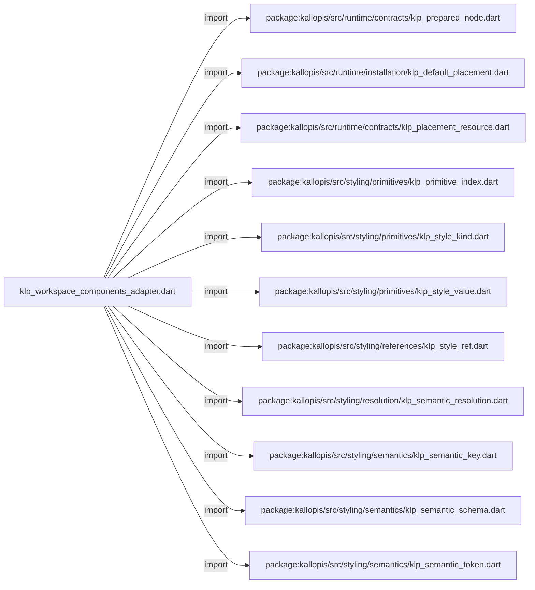
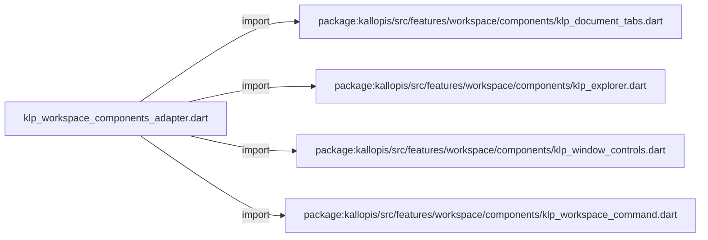
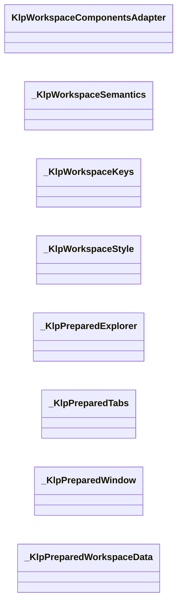
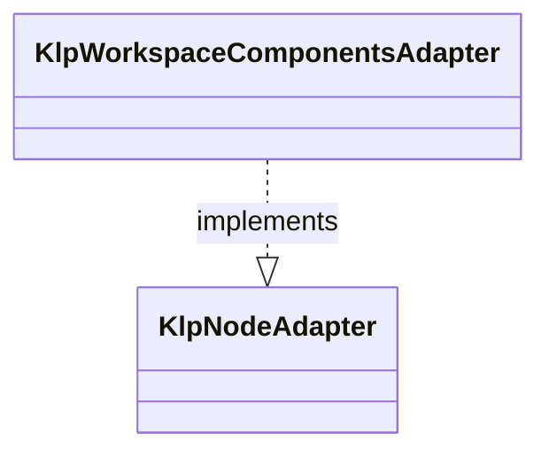
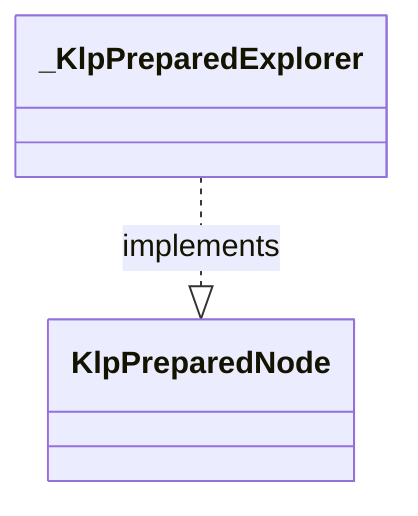
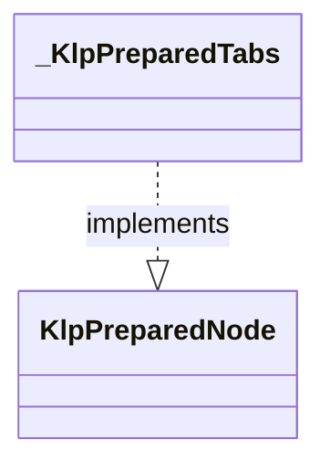
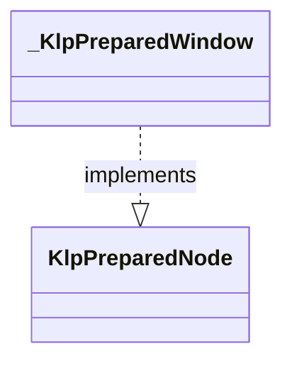
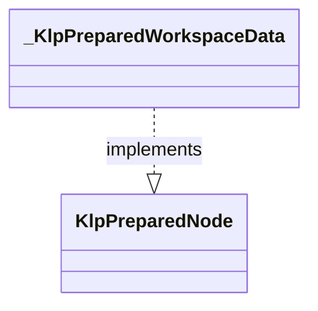

# klp_workspace_components_adapter.dart：直接依賴與宣告架構

[回到目錄](README.md) · [來源檔案](../../../../../../../lib/src/features/workspace/components/adapters/klp_workspace_components_adapter.dart)

## 範圍

核心是 `lib/src/features/workspace/components/adapters/klp_workspace_components_adapter.dart`。主要視角為該檔案明寫的 import／export／part；輔助視角為本檔宣告及 extends／implements／with／on 關係。只展開一層外部邊界。

## 直接依賴圖

## 依賴證據

| 關係 | 原始 directive | 來源 |
|---|---|---|
| import | <code>import &#x27;package:kallopis/src/features/workspace/presentation/klp_workspace_presentation.dart&#x27;;</code> | [lib/src/features/workspace/components/adapters/klp_workspace_components_adapter.dart:1](../../../../../../../lib/src/features/workspace/components/adapters/klp_workspace_components_adapter.dart#L1) |
| import | <code>import &#x27;package:kallopis/src/composition/definitions/klp_definition.dart&#x27;;</code> | [lib/src/features/workspace/components/adapters/klp_workspace_components_adapter.dart:2](../../../../../../../lib/src/features/workspace/components/adapters/klp_workspace_components_adapter.dart#L2) |
| import | <code>import &#x27;package:kallopis/src/composition/nodes/klp_node.dart&#x27;;</code> | [lib/src/features/workspace/components/adapters/klp_workspace_components_adapter.dart:3](../../../../../../../lib/src/features/workspace/components/adapters/klp_workspace_components_adapter.dart#L3) |
| import | <code>import &#x27;package:kallopis/src/composition/validation/klp_validated_node.dart&#x27;;</code> | [lib/src/features/workspace/components/adapters/klp_workspace_components_adapter.dart:4](../../../../../../../lib/src/features/workspace/components/adapters/klp_workspace_components_adapter.dart#L4) |
| import | <code>import &#x27;package:kallopis/src/foundation/binding/contracts/klp_bound_template.dart&#x27;;</code> | [lib/src/features/workspace/components/adapters/klp_workspace_components_adapter.dart:5](../../../../../../../lib/src/features/workspace/components/adapters/klp_workspace_components_adapter.dart#L5) |
| import | <code>import &#x27;package:kallopis/src/foundation/binding/contracts/klp_bound_text_style.dart&#x27;;</code> | [lib/src/features/workspace/components/adapters/klp_workspace_components_adapter.dart:6](../../../../../../../lib/src/features/workspace/components/adapters/klp_workspace_components_adapter.dart#L6) |
| import | <code>import &#x27;package:kallopis/src/kernel/lifecycle/klp_frame_lease.dart&#x27;;</code> | [lib/src/features/workspace/components/adapters/klp_workspace_components_adapter.dart:7](../../../../../../../lib/src/features/workspace/components/adapters/klp_workspace_components_adapter.dart#L7) |
| import | <code>import &#x27;package:kallopis/src/kernel/identity/klp_id.dart&#x27;;</code> | [lib/src/features/workspace/components/adapters/klp_workspace_components_adapter.dart:8](../../../../../../../lib/src/features/workspace/components/adapters/klp_workspace_components_adapter.dart#L8) |
| import | <code>import &#x27;package:kallopis/src/kernel/identity/klp_placement_id.dart&#x27;;</code> | [lib/src/features/workspace/components/adapters/klp_workspace_components_adapter.dart:9](../../../../../../../lib/src/features/workspace/components/adapters/klp_workspace_components_adapter.dart#L9) |
| import | <code>import &#x27;package:kallopis/src/runtime/contracts/klp_node_adapter.dart&#x27;;</code> | [lib/src/features/workspace/components/adapters/klp_workspace_components_adapter.dart:10](../../../../../../../lib/src/features/workspace/components/adapters/klp_workspace_components_adapter.dart#L10) |
| import | <code>import &#x27;package:kallopis/src/runtime/contracts/klp_prepare_context.dart&#x27;;</code> | [lib/src/features/workspace/components/adapters/klp_workspace_components_adapter.dart:11](../../../../../../../lib/src/features/workspace/components/adapters/klp_workspace_components_adapter.dart#L11) |
| import | <code>import &#x27;package:kallopis/src/runtime/contracts/klp_prepared_node.dart&#x27;;</code> | [lib/src/features/workspace/components/adapters/klp_workspace_components_adapter.dart:12](../../../../../../../lib/src/features/workspace/components/adapters/klp_workspace_components_adapter.dart#L12) |
| import | <code>import &#x27;package:kallopis/src/runtime/installation/klp_default_placement.dart&#x27;;</code> | [lib/src/features/workspace/components/adapters/klp_workspace_components_adapter.dart:13](../../../../../../../lib/src/features/workspace/components/adapters/klp_workspace_components_adapter.dart#L13) |
| import | <code>import &#x27;package:kallopis/src/runtime/contracts/klp_placement_resource.dart&#x27;;</code> | [lib/src/features/workspace/components/adapters/klp_workspace_components_adapter.dart:14](../../../../../../../lib/src/features/workspace/components/adapters/klp_workspace_components_adapter.dart#L14) |
| import | <code>import &#x27;package:kallopis/src/styling/primitives/klp_primitive_index.dart&#x27;;</code> | [lib/src/features/workspace/components/adapters/klp_workspace_components_adapter.dart:15](../../../../../../../lib/src/features/workspace/components/adapters/klp_workspace_components_adapter.dart#L15) |
| import | <code>import &#x27;package:kallopis/src/styling/primitives/klp_style_kind.dart&#x27;;</code> | [lib/src/features/workspace/components/adapters/klp_workspace_components_adapter.dart:16](../../../../../../../lib/src/features/workspace/components/adapters/klp_workspace_components_adapter.dart#L16) |
| import | <code>import &#x27;package:kallopis/src/styling/primitives/klp_style_value.dart&#x27;;</code> | [lib/src/features/workspace/components/adapters/klp_workspace_components_adapter.dart:17](../../../../../../../lib/src/features/workspace/components/adapters/klp_workspace_components_adapter.dart#L17) |
| import | <code>import &#x27;package:kallopis/src/styling/references/klp_style_ref.dart&#x27;;</code> | [lib/src/features/workspace/components/adapters/klp_workspace_components_adapter.dart:18](../../../../../../../lib/src/features/workspace/components/adapters/klp_workspace_components_adapter.dart#L18) |
| import | <code>import &#x27;package:kallopis/src/styling/resolution/klp_semantic_resolution.dart&#x27;;</code> | [lib/src/features/workspace/components/adapters/klp_workspace_components_adapter.dart:19](../../../../../../../lib/src/features/workspace/components/adapters/klp_workspace_components_adapter.dart#L19) |
| import | <code>import &#x27;package:kallopis/src/styling/semantics/klp_semantic_key.dart&#x27;;</code> | [lib/src/features/workspace/components/adapters/klp_workspace_components_adapter.dart:20](../../../../../../../lib/src/features/workspace/components/adapters/klp_workspace_components_adapter.dart#L20) |
| import | <code>import &#x27;package:kallopis/src/styling/semantics/klp_semantic_schema.dart&#x27;;</code> | [lib/src/features/workspace/components/adapters/klp_workspace_components_adapter.dart:21](../../../../../../../lib/src/features/workspace/components/adapters/klp_workspace_components_adapter.dart#L21) |
| import | <code>import &#x27;package:kallopis/src/styling/semantics/klp_semantic_token.dart&#x27;;</code> | [lib/src/features/workspace/components/adapters/klp_workspace_components_adapter.dart:22](../../../../../../../lib/src/features/workspace/components/adapters/klp_workspace_components_adapter.dart#L22) |
| import | <code>import &#x27;package:kallopis/src/features/workspace/components/klp_document_tabs.dart&#x27;;</code> | [lib/src/features/workspace/components/adapters/klp_workspace_components_adapter.dart:23](../../../../../../../lib/src/features/workspace/components/adapters/klp_workspace_components_adapter.dart#L23) |
| import | <code>import &#x27;package:kallopis/src/features/workspace/components/klp_explorer.dart&#x27;;</code> | [lib/src/features/workspace/components/adapters/klp_workspace_components_adapter.dart:24](../../../../../../../lib/src/features/workspace/components/adapters/klp_workspace_components_adapter.dart#L24) |
| import | <code>import &#x27;package:kallopis/src/features/workspace/components/klp_window_controls.dart&#x27;;</code> | [lib/src/features/workspace/components/adapters/klp_workspace_components_adapter.dart:25](../../../../../../../lib/src/features/workspace/components/adapters/klp_workspace_components_adapter.dart#L25) |
| import | <code>import &#x27;package:kallopis/src/features/workspace/components/klp_workspace_command.dart&#x27;;</code> | [lib/src/features/workspace/components/adapters/klp_workspace_components_adapter.dart:26](../../../../../../../lib/src/features/workspace/components/adapters/klp_workspace_components_adapter.dart#L26) |

## 宣告關係圖

本組節點是本檔宣告；沒有箭頭的宣告未在此圖主張互相依賴。

## 宣告與成員證據

成員包含 public 與 private；簽章取自來源，省略函式本體與欄位初始值。`(inferred)` 表示來源未明寫型別；建構子只顯示參數部分，不含初始化列表。

### KlpWorkspaceComponentsAdapter

ClassDeclaration · public · [lib/src/features/workspace/components/adapters/klp_workspace_components_adapter.dart:28](../../../../../../../lib/src/features/workspace/components/adapters/klp_workspace_components_adapter.dart#L28)

<code>final class KlpWorkspaceComponentsAdapter implements KlpNodeAdapter</code>

來源註解摘要：內建 Explorer、分頁、視窗控制與工作區資料的封閉轉接器目錄；不接受使用端元件定義。

- `implements` → <code>KlpNodeAdapter</code>：[lib/src/features/workspace/components/adapters/klp_workspace_components_adapter.dart:29](../../../../../../../lib/src/features/workspace/components/adapters/klp_workspace_components_adapter.dart#L29)

| 成員 | 可見性 | 簽章／型別 | 來源註解摘要 | 證據 |
|---|---|---|---|---|
| field <code>_contract</code> | private | <code>final KlpDefinition&lt;KlpNode&gt; _contract</code> |  | [lib/src/features/workspace/components/adapters/klp_workspace_components_adapter.dart:30](../../../../../../../lib/src/features/workspace/components/adapters/klp_workspace_components_adapter.dart#L30) |
| constructor <code>_</code> | private | <code>KlpWorkspaceComponentsAdapter._(this._contract)</code> |  | [lib/src/features/workspace/components/adapters/klp_workspace_components_adapter.dart:31](../../../../../../../lib/src/features/workspace/components/adapters/klp_workspace_components_adapter.dart#L31) |
| getter <code>contract</code> | public | <code>KlpDefinition&lt;KlpNode&gt; get contract</code> |  | [lib/src/features/workspace/components/adapters/klp_workspace_components_adapter.dart:32](../../../../../../../lib/src/features/workspace/components/adapters/klp_workspace_components_adapter.dart#L32) |
| method <code>createAll</code> | public | <code>static List&lt;KlpNodeAdapter&gt; createAll()</code> |  | [lib/src/features/workspace/components/adapters/klp_workspace_components_adapter.dart:35](../../../../../../../lib/src/features/workspace/components/adapters/klp_workspace_components_adapter.dart#L35) |
| method <code>prepare</code> | public | <code>KlpPreparedNode prepare(KlpNode node, KlpValidatedNode snapshot, KlpPrepareContext context)</code> |  | [lib/src/features/workspace/components/adapters/klp_workspace_components_adapter.dart:43](../../../../../../../lib/src/features/workspace/components/adapters/klp_workspace_components_adapter.dart#L43) |
| method <code>_prepareExplorer</code> | private | <code>KlpPreparedNode _prepareExplorer(KlpExplorer explorer, KlpValidatedNode snapshot, KlpPrepareContext context)</code> |  | [lib/src/features/workspace/components/adapters/klp_workspace_components_adapter.dart:51](../../../../../../../lib/src/features/workspace/components/adapters/klp_workspace_components_adapter.dart#L51) |
| method <code>_prepareTabs</code> | private | <code>KlpPreparedNode _prepareTabs(KlpDocumentTabs tabs, KlpValidatedNode snapshot, KlpPrepareContext context)</code> |  | [lib/src/features/workspace/components/adapters/klp_workspace_components_adapter.dart:71](../../../../../../../lib/src/features/workspace/components/adapters/klp_workspace_components_adapter.dart#L71) |
| method <code>_tabData</code> | private | <code>KlpBoundDocumentTabData _tabData(KlpDocumentTab tab, KlpPlacementId placement, KlpId? selectedId)</code> |  | [lib/src/features/workspace/components/adapters/klp_workspace_components_adapter.dart:83](../../../../../../../lib/src/features/workspace/components/adapters/klp_workspace_components_adapter.dart#L83) |
| method <code>_prepareWindow</code> | private | <code>KlpPreparedNode _prepareWindow(KlpWindowControls controls, KlpPrepareContext context)</code> |  | [lib/src/features/workspace/components/adapters/klp_workspace_components_adapter.dart:85](../../../../../../../lib/src/features/workspace/components/adapters/klp_workspace_components_adapter.dart#L85) |

### _command

FunctionDeclaration · private · [lib/src/features/workspace/components/adapters/klp_workspace_components_adapter.dart:88](../../../../../../../lib/src/features/workspace/components/adapters/klp_workspace_components_adapter.dart#L88)

<code>KlpBoundWorkspaceCommand _command(KlpWorkspaceCommand command)</code>

### _KlpWorkspaceSemantics

ClassDeclaration · private · [lib/src/features/workspace/components/adapters/klp_workspace_components_adapter.dart:90](../../../../../../../lib/src/features/workspace/components/adapters/klp_workspace_components_adapter.dart#L90)

<code>final class _KlpWorkspaceSemantics</code>

| 成員 | 可見性 | 簽章／型別 | 來源註解摘要 | 證據 |
|---|---|---|---|---|
| method <code>key</code> | public | <code>static KlpSemanticKey&lt;T&gt; key&lt;T extends KlpStyleValue&gt;(String owner, String name, KlpStyleKind&lt;T&gt; kind)</code> |  | [lib/src/features/workspace/components/adapters/klp_workspace_components_adapter.dart:91](../../../../../../../lib/src/features/workspace/components/adapters/klp_workspace_components_adapter.dart#L91) |
| method <code>schema</code> | public | <code>static KlpSemanticSchema schema(String owner)</code> |  | [lib/src/features/workspace/components/adapters/klp_workspace_components_adapter.dart:92](../../../../../../../lib/src/features/workspace/components/adapters/klp_workspace_components_adapter.dart#L92) |

### _KlpWorkspaceKeys

ClassDeclaration · private · [lib/src/features/workspace/components/adapters/klp_workspace_components_adapter.dart:103](../../../../../../../lib/src/features/workspace/components/adapters/klp_workspace_components_adapter.dart#L103)

<code>final class _KlpWorkspaceKeys</code>

| 成員 | 可見性 | 簽章／型別 | 來源註解摘要 | 證據 |
|---|---|---|---|---|
| field <code>owner</code> | public | <code>final String owner</code> |  | [lib/src/features/workspace/components/adapters/klp_workspace_components_adapter.dart:104](../../../../../../../lib/src/features/workspace/components/adapters/klp_workspace_components_adapter.dart#L104) |
| field <code>background</code> | public | <code>late final (inferred) background</code> |  | [lib/src/features/workspace/components/adapters/klp_workspace_components_adapter.dart:105](../../../../../../../lib/src/features/workspace/components/adapters/klp_workspace_components_adapter.dart#L105) |
| field <code>foreground</code> | public | <code>late final (inferred) foreground</code> |  | [lib/src/features/workspace/components/adapters/klp_workspace_components_adapter.dart:106](../../../../../../../lib/src/features/workspace/components/adapters/klp_workspace_components_adapter.dart#L106) |
| field <code>selectedBackground</code> | public | <code>late final (inferred) selectedBackground</code> |  | [lib/src/features/workspace/components/adapters/klp_workspace_components_adapter.dart:107](../../../../../../../lib/src/features/workspace/components/adapters/klp_workspace_components_adapter.dart#L107) |
| field <code>mutedForeground</code> | public | <code>late final (inferred) mutedForeground</code> |  | [lib/src/features/workspace/components/adapters/klp_workspace_components_adapter.dart:108](../../../../../../../lib/src/features/workspace/components/adapters/klp_workspace_components_adapter.dart#L108) |
| field <code>focusColor</code> | public | <code>late final (inferred) focusColor</code> |  | [lib/src/features/workspace/components/adapters/klp_workspace_components_adapter.dart:109](../../../../../../../lib/src/features/workspace/components/adapters/klp_workspace_components_adapter.dart#L109) |
| field <code>closeHover</code> | public | <code>late final (inferred) closeHover</code> |  | [lib/src/features/workspace/components/adapters/klp_workspace_components_adapter.dart:110](../../../../../../../lib/src/features/workspace/components/adapters/klp_workspace_components_adapter.dart#L110) |
| field <code>extent</code> | public | <code>late final (inferred) extent</code> |  | [lib/src/features/workspace/components/adapters/klp_workspace_components_adapter.dart:111](../../../../../../../lib/src/features/workspace/components/adapters/klp_workspace_components_adapter.dart#L111) |
| field <code>indent</code> | public | <code>late final (inferred) indent</code> |  | [lib/src/features/workspace/components/adapters/klp_workspace_components_adapter.dart:112](../../../../../../../lib/src/features/workspace/components/adapters/klp_workspace_components_adapter.dart#L112) |
| field <code>inset</code> | public | <code>late final (inferred) inset</code> |  | [lib/src/features/workspace/components/adapters/klp_workspace_components_adapter.dart:113](../../../../../../../lib/src/features/workspace/components/adapters/klp_workspace_components_adapter.dart#L113) |
| field <code>gap</code> | public | <code>late final (inferred) gap</code> |  | [lib/src/features/workspace/components/adapters/klp_workspace_components_adapter.dart:114](../../../../../../../lib/src/features/workspace/components/adapters/klp_workspace_components_adapter.dart#L114) |
| field <code>radius</code> | public | <code>late final (inferred) radius</code> |  | [lib/src/features/workspace/components/adapters/klp_workspace_components_adapter.dart:115](../../../../../../../lib/src/features/workspace/components/adapters/klp_workspace_components_adapter.dart#L115) |
| field <code>focusWidth</code> | public | <code>late final (inferred) focusWidth</code> |  | [lib/src/features/workspace/components/adapters/klp_workspace_components_adapter.dart:116](../../../../../../../lib/src/features/workspace/components/adapters/klp_workspace_components_adapter.dart#L116) |
| field <code>fontFamily</code> | public | <code>late final (inferred) fontFamily</code> |  | [lib/src/features/workspace/components/adapters/klp_workspace_components_adapter.dart:117](../../../../../../../lib/src/features/workspace/components/adapters/klp_workspace_components_adapter.dart#L117) |
| field <code>fontSize</code> | public | <code>late final (inferred) fontSize</code> |  | [lib/src/features/workspace/components/adapters/klp_workspace_components_adapter.dart:118](../../../../../../../lib/src/features/workspace/components/adapters/klp_workspace_components_adapter.dart#L118) |
| field <code>fontWeight</code> | public | <code>late final (inferred) fontWeight</code> |  | [lib/src/features/workspace/components/adapters/klp_workspace_components_adapter.dart:119](../../../../../../../lib/src/features/workspace/components/adapters/klp_workspace_components_adapter.dart#L119) |
| field <code>lineHeight</code> | public | <code>late final (inferred) lineHeight</code> |  | [lib/src/features/workspace/components/adapters/klp_workspace_components_adapter.dart:120](../../../../../../../lib/src/features/workspace/components/adapters/klp_workspace_components_adapter.dart#L120) |
| field <code>letterSpacing</code> | public | <code>late final (inferred) letterSpacing</code> |  | [lib/src/features/workspace/components/adapters/klp_workspace_components_adapter.dart:121](../../../../../../../lib/src/features/workspace/components/adapters/klp_workspace_components_adapter.dart#L121) |
| constructor <code>_KlpWorkspaceKeys</code> | private | <code>_KlpWorkspaceKeys(this.owner)</code> |  | [lib/src/features/workspace/components/adapters/klp_workspace_components_adapter.dart:122](../../../../../../../lib/src/features/workspace/components/adapters/klp_workspace_components_adapter.dart#L122) |

### _KlpWorkspaceStyle

ClassDeclaration · private · [lib/src/features/workspace/components/adapters/klp_workspace_components_adapter.dart:125](../../../../../../../lib/src/features/workspace/components/adapters/klp_workspace_components_adapter.dart#L125)

<code>final class _KlpWorkspaceStyle</code>

| 成員 | 可見性 | 簽章／型別 | 來源註解摘要 | 證據 |
|---|---|---|---|---|
| field <code>background</code> | public | <code>final KlpColor background</code> |  | [lib/src/features/workspace/components/adapters/klp_workspace_components_adapter.dart:126](../../../../../../../lib/src/features/workspace/components/adapters/klp_workspace_components_adapter.dart#L126) |
| field <code>foreground</code> | public | <code>final KlpColor foreground</code> |  | [lib/src/features/workspace/components/adapters/klp_workspace_components_adapter.dart:126](../../../../../../../lib/src/features/workspace/components/adapters/klp_workspace_components_adapter.dart#L126) |
| field <code>selectedBackground</code> | public | <code>final KlpColor selectedBackground</code> |  | [lib/src/features/workspace/components/adapters/klp_workspace_components_adapter.dart:126](../../../../../../../lib/src/features/workspace/components/adapters/klp_workspace_components_adapter.dart#L126) |
| field <code>mutedForeground</code> | public | <code>final KlpColor mutedForeground</code> |  | [lib/src/features/workspace/components/adapters/klp_workspace_components_adapter.dart:126](../../../../../../../lib/src/features/workspace/components/adapters/klp_workspace_components_adapter.dart#L126) |
| field <code>focusColor</code> | public | <code>final KlpColor focusColor</code> |  | [lib/src/features/workspace/components/adapters/klp_workspace_components_adapter.dart:126](../../../../../../../lib/src/features/workspace/components/adapters/klp_workspace_components_adapter.dart#L126) |
| field <code>closeHover</code> | public | <code>final KlpColor closeHover</code> |  | [lib/src/features/workspace/components/adapters/klp_workspace_components_adapter.dart:126](../../../../../../../lib/src/features/workspace/components/adapters/klp_workspace_components_adapter.dart#L126) |
| field <code>extent</code> | public | <code>final KlpDistance extent</code> |  | [lib/src/features/workspace/components/adapters/klp_workspace_components_adapter.dart:127](../../../../../../../lib/src/features/workspace/components/adapters/klp_workspace_components_adapter.dart#L127) |
| field <code>indent</code> | public | <code>final KlpDistance indent</code> |  | [lib/src/features/workspace/components/adapters/klp_workspace_components_adapter.dart:127](../../../../../../../lib/src/features/workspace/components/adapters/klp_workspace_components_adapter.dart#L127) |
| field <code>inset</code> | public | <code>final KlpDistance inset</code> |  | [lib/src/features/workspace/components/adapters/klp_workspace_components_adapter.dart:127](../../../../../../../lib/src/features/workspace/components/adapters/klp_workspace_components_adapter.dart#L127) |
| field <code>gap</code> | public | <code>final KlpDistance gap</code> |  | [lib/src/features/workspace/components/adapters/klp_workspace_components_adapter.dart:127](../../../../../../../lib/src/features/workspace/components/adapters/klp_workspace_components_adapter.dart#L127) |
| field <code>radius</code> | public | <code>final KlpRadius radius</code> |  | [lib/src/features/workspace/components/adapters/klp_workspace_components_adapter.dart:128](../../../../../../../lib/src/features/workspace/components/adapters/klp_workspace_components_adapter.dart#L128) |
| field <code>focusWidth</code> | public | <code>final KlpStrokeWidth focusWidth</code> |  | [lib/src/features/workspace/components/adapters/klp_workspace_components_adapter.dart:129](../../../../../../../lib/src/features/workspace/components/adapters/klp_workspace_components_adapter.dart#L129) |
| field <code>text</code> | public | <code>final KlpBoundTextStyle text</code> |  | [lib/src/features/workspace/components/adapters/klp_workspace_components_adapter.dart:130](../../../../../../../lib/src/features/workspace/components/adapters/klp_workspace_components_adapter.dart#L130) |
| constructor <code>_KlpWorkspaceStyle</code> | private | <code>const _KlpWorkspaceStyle({required this.background, required this.foreground, required this.selectedBackground, required this.mutedForeground, required this.focusColor, required this.closeHover, required this.extent, required this.indent, required this.inset, required this.gap, required this.radius, required this.focusWidth, required this.text})</code> |  | [lib/src/features/workspace/components/adapters/klp_workspace_components_adapter.dart:131](../../../../../../../lib/src/features/workspace/components/adapters/klp_workspace_components_adapter.dart#L131) |
| method <code>read</code> | public | <code>static _KlpWorkspaceStyle read(KlpSemanticResolution style, String owner)</code> |  | [lib/src/features/workspace/components/adapters/klp_workspace_components_adapter.dart:132](../../../../../../../lib/src/features/workspace/components/adapters/klp_workspace_components_adapter.dart#L132) |

### _KlpPreparedExplorer

ClassDeclaration · private · [lib/src/features/workspace/components/adapters/klp_workspace_components_adapter.dart:142](../../../../../../../lib/src/features/workspace/components/adapters/klp_workspace_components_adapter.dart#L142)

<code>final class _KlpPreparedExplorer implements KlpPreparedNode</code>

- `implements` → <code>KlpPreparedNode</code>：[lib/src/features/workspace/components/adapters/klp_workspace_components_adapter.dart:142](../../../../../../../lib/src/features/workspace/components/adapters/klp_workspace_components_adapter.dart#L142)

| 成員 | 可見性 | 簽章／型別 | 來源註解摘要 | 證據 |
|---|---|---|---|---|
| field <code>allowNesting</code> | public | <code>final bool allowNesting</code> |  | [lib/src/features/workspace/components/adapters/klp_workspace_components_adapter.dart:143](../../../../../../../lib/src/features/workspace/components/adapters/klp_workspace_components_adapter.dart#L143) |
| field <code>actionsLabel</code> | public | <code>final String actionsLabel</code> |  | [lib/src/features/workspace/components/adapters/klp_workspace_components_adapter.dart:144](../../../../../../../lib/src/features/workspace/components/adapters/klp_workspace_components_adapter.dart#L144) |
| field <code>expandLabel</code> | public | <code>final String expandLabel</code> |  | [lib/src/features/workspace/components/adapters/klp_workspace_components_adapter.dart:144](../../../../../../../lib/src/features/workspace/components/adapters/klp_workspace_components_adapter.dart#L144) |
| field <code>collapseLabel</code> | public | <code>final String collapseLabel</code> |  | [lib/src/features/workspace/components/adapters/klp_workspace_components_adapter.dart:144](../../../../../../../lib/src/features/workspace/components/adapters/klp_workspace_components_adapter.dart#L144) |
| field <code>spacing</code> | public | <code>final int spacing</code> |  | [lib/src/features/workspace/components/adapters/klp_workspace_components_adapter.dart:145](../../../../../../../lib/src/features/workspace/components/adapters/klp_workspace_components_adapter.dart#L145) |
| field <code>items</code> | public | <code>final List&lt;KlpBoundExplorerItemData&gt; items</code> |  | [lib/src/features/workspace/components/adapters/klp_workspace_components_adapter.dart:146](../../../../../../../lib/src/features/workspace/components/adapters/klp_workspace_components_adapter.dart#L146) |
| field <code>onSelected</code> | public | <code>final void Function(KlpPlacementId)? onSelected</code> |  | [lib/src/features/workspace/components/adapters/klp_workspace_components_adapter.dart:147](../../../../../../../lib/src/features/workspace/components/adapters/klp_workspace_components_adapter.dart#L147) |
| field <code>onExpandedChanged</code> | public | <code>final void Function(KlpPlacementId, bool)? onExpandedChanged</code> |  | [lib/src/features/workspace/components/adapters/klp_workspace_components_adapter.dart:148](../../../../../../../lib/src/features/workspace/components/adapters/klp_workspace_components_adapter.dart#L148) |
| field <code>onSelectionChanged</code> | public | <code>final void Function(Set&lt;KlpPlacementId&gt;)? onSelectionChanged</code> |  | [lib/src/features/workspace/components/adapters/klp_workspace_components_adapter.dart:149](../../../../../../../lib/src/features/workspace/components/adapters/klp_workspace_components_adapter.dart#L149) |
| field <code>canMove</code> | public | <code>final bool Function(Set&lt;KlpId&gt;, KlpPlacementId, int)? canMove</code> |  | [lib/src/features/workspace/components/adapters/klp_workspace_components_adapter.dart:150](../../../../../../../lib/src/features/workspace/components/adapters/klp_workspace_components_adapter.dart#L150) |
| field <code>onMove</code> | public | <code>final void Function(Set&lt;KlpId&gt;, KlpPlacementId, int)? onMove</code> |  | [lib/src/features/workspace/components/adapters/klp_workspace_components_adapter.dart:151](../../../../../../../lib/src/features/workspace/components/adapters/klp_workspace_components_adapter.dart#L151) |
| field <code>style</code> | public | <code>final _KlpWorkspaceStyle style</code> |  | [lib/src/features/workspace/components/adapters/klp_workspace_components_adapter.dart:152](../../../../../../../lib/src/features/workspace/components/adapters/klp_workspace_components_adapter.dart#L152) |
| constructor <code>_KlpPreparedExplorer</code> | private | <code>const _KlpPreparedExplorer({required this.actionsLabel, required this.expandLabel, required this.collapseLabel, required this.allowNesting, required this.spacing, required this.items, required this.onSelected, required this.onExpandedChanged, required this.onSelectionChanged, required this.canMove, required this.onMove, required this.style})</code> |  | [lib/src/features/workspace/components/adapters/klp_workspace_components_adapter.dart:153](../../../../../../../lib/src/features/workspace/components/adapters/klp_workspace_components_adapter.dart#L153) |
| method <code>createResource</code> | public | <code>KlpPlacementResource createResource(KlpValidatedNode node)</code> |  | [lib/src/features/workspace/components/adapters/klp_workspace_components_adapter.dart:154](../../../../../../../lib/src/features/workspace/components/adapters/klp_workspace_components_adapter.dart#L154) |
| method <code>materialize</code> | public | <code>KlpBoundTemplate materialize(KlpPlacementResource resource, List&lt;KlpBoundTemplate&gt; children, KlpFrameLease lease)</code> |  | [lib/src/features/workspace/components/adapters/klp_workspace_components_adapter.dart:156](../../../../../../../lib/src/features/workspace/components/adapters/klp_workspace_components_adapter.dart#L156) |

### _KlpPreparedTabs

ClassDeclaration · private · [lib/src/features/workspace/components/adapters/klp_workspace_components_adapter.dart:160](../../../../../../../lib/src/features/workspace/components/adapters/klp_workspace_components_adapter.dart#L160)

<code>final class _KlpPreparedTabs implements KlpPreparedNode</code>

- `implements` → <code>KlpPreparedNode</code>：[lib/src/features/workspace/components/adapters/klp_workspace_components_adapter.dart:160](../../../../../../../lib/src/features/workspace/components/adapters/klp_workspace_components_adapter.dart#L160)

| 成員 | 可見性 | 簽章／型別 | 來源註解摘要 | 證據 |
|---|---|---|---|---|
| field <code>tabs</code> | public | <code>final List&lt;KlpBoundDocumentTabData&gt; tabs</code> |  | [lib/src/features/workspace/components/adapters/klp_workspace_components_adapter.dart:161](../../../../../../../lib/src/features/workspace/components/adapters/klp_workspace_components_adapter.dart#L161) |
| field <code>onSelected</code> | public | <code>final void Function(KlpPlacementId)? onSelected</code> |  | [lib/src/features/workspace/components/adapters/klp_workspace_components_adapter.dart:162](../../../../../../../lib/src/features/workspace/components/adapters/klp_workspace_components_adapter.dart#L162) |
| field <code>onClose</code> | public | <code>final void Function(KlpPlacementId)? onClose</code> |  | [lib/src/features/workspace/components/adapters/klp_workspace_components_adapter.dart:163](../../../../../../../lib/src/features/workspace/components/adapters/klp_workspace_components_adapter.dart#L163) |
| field <code>onPinnedChanged</code> | public | <code>final void Function(KlpPlacementId, bool)? onPinnedChanged</code> |  | [lib/src/features/workspace/components/adapters/klp_workspace_components_adapter.dart:164](../../../../../../../lib/src/features/workspace/components/adapters/klp_workspace_components_adapter.dart#L164) |
| field <code>style</code> | public | <code>final _KlpWorkspaceStyle style</code> |  | [lib/src/features/workspace/components/adapters/klp_workspace_components_adapter.dart:165](../../../../../../../lib/src/features/workspace/components/adapters/klp_workspace_components_adapter.dart#L165) |
| constructor <code>_KlpPreparedTabs</code> | private | <code>const _KlpPreparedTabs({required this.tabs, required this.onSelected, required this.onClose, required this.onPinnedChanged, required this.style})</code> |  | [lib/src/features/workspace/components/adapters/klp_workspace_components_adapter.dart:166](../../../../../../../lib/src/features/workspace/components/adapters/klp_workspace_components_adapter.dart#L166) |
| method <code>createResource</code> | public | <code>KlpPlacementResource createResource(KlpValidatedNode node)</code> |  | [lib/src/features/workspace/components/adapters/klp_workspace_components_adapter.dart:167](../../../../../../../lib/src/features/workspace/components/adapters/klp_workspace_components_adapter.dart#L167) |
| method <code>materialize</code> | public | <code>KlpBoundTemplate materialize(KlpPlacementResource resource, List&lt;KlpBoundTemplate&gt; children, KlpFrameLease lease)</code> |  | [lib/src/features/workspace/components/adapters/klp_workspace_components_adapter.dart:169](../../../../../../../lib/src/features/workspace/components/adapters/klp_workspace_components_adapter.dart#L169) |

### _KlpPreparedWindow

ClassDeclaration · private · [lib/src/features/workspace/components/adapters/klp_workspace_components_adapter.dart:173](../../../../../../../lib/src/features/workspace/components/adapters/klp_workspace_components_adapter.dart#L173)

<code>final class _KlpPreparedWindow implements KlpPreparedNode</code>

- `implements` → <code>KlpPreparedNode</code>：[lib/src/features/workspace/components/adapters/klp_workspace_components_adapter.dart:173](../../../../../../../lib/src/features/workspace/components/adapters/klp_workspace_components_adapter.dart#L173)

| 成員 | 可見性 | 簽章／型別 | 來源註解摘要 | 證據 |
|---|---|---|---|---|
| field <code>controls</code> | public | <code>final KlpWindowControls controls</code> |  | [lib/src/features/workspace/components/adapters/klp_workspace_components_adapter.dart:174](../../../../../../../lib/src/features/workspace/components/adapters/klp_workspace_components_adapter.dart#L174) |
| field <code>style</code> | public | <code>final _KlpWorkspaceStyle style</code> |  | [lib/src/features/workspace/components/adapters/klp_workspace_components_adapter.dart:175](../../../../../../../lib/src/features/workspace/components/adapters/klp_workspace_components_adapter.dart#L175) |
| constructor <code>_KlpPreparedWindow</code> | private | <code>const _KlpPreparedWindow({required this.controls, required this.style})</code> |  | [lib/src/features/workspace/components/adapters/klp_workspace_components_adapter.dart:176](../../../../../../../lib/src/features/workspace/components/adapters/klp_workspace_components_adapter.dart#L176) |
| method <code>createResource</code> | public | <code>KlpPlacementResource createResource(KlpValidatedNode node)</code> |  | [lib/src/features/workspace/components/adapters/klp_workspace_components_adapter.dart:177](../../../../../../../lib/src/features/workspace/components/adapters/klp_workspace_components_adapter.dart#L177) |
| method <code>materialize</code> | public | <code>KlpBoundTemplate materialize(KlpPlacementResource resource, List&lt;KlpBoundTemplate&gt; children, KlpFrameLease lease)</code> |  | [lib/src/features/workspace/components/adapters/klp_workspace_components_adapter.dart:179](../../../../../../../lib/src/features/workspace/components/adapters/klp_workspace_components_adapter.dart#L179) |

### _KlpPreparedWorkspaceData

ClassDeclaration · private · [lib/src/features/workspace/components/adapters/klp_workspace_components_adapter.dart:183](../../../../../../../lib/src/features/workspace/components/adapters/klp_workspace_components_adapter.dart#L183)

<code>final class _KlpPreparedWorkspaceData implements KlpPreparedNode</code>

- `implements` → <code>KlpPreparedNode</code>：[lib/src/features/workspace/components/adapters/klp_workspace_components_adapter.dart:183](../../../../../../../lib/src/features/workspace/components/adapters/klp_workspace_components_adapter.dart#L183)

| 成員 | 可見性 | 簽章／型別 | 來源註解摘要 | 證據 |
|---|---|---|---|---|
| constructor <code>_KlpPreparedWorkspaceData</code> | private | <code>const _KlpPreparedWorkspaceData()</code> |  | [lib/src/features/workspace/components/adapters/klp_workspace_components_adapter.dart:184](../../../../../../../lib/src/features/workspace/components/adapters/klp_workspace_components_adapter.dart#L184) |
| method <code>createResource</code> | public | <code>KlpPlacementResource createResource(KlpValidatedNode node)</code> |  | [lib/src/features/workspace/components/adapters/klp_workspace_components_adapter.dart:185](../../../../../../../lib/src/features/workspace/components/adapters/klp_workspace_components_adapter.dart#L185) |
| method <code>materialize</code> | public | <code>KlpBoundTemplate materialize(KlpPlacementResource resource, List&lt;KlpBoundTemplate&gt; children, KlpFrameLease lease)</code> |  | [lib/src/features/workspace/components/adapters/klp_workspace_components_adapter.dart:187](../../../../../../../lib/src/features/workspace/components/adapters/klp_workspace_components_adapter.dart#L187) |

## 閱讀說明與限制

箭頭只表示來源明寫的靜態關係；import 不等於呼叫。未分析動態呼叫、欄位的實際物件擁有權、狀態轉移或渲染流程；型別未進行語意解析，繼承目標保留原始型別拼寫。public／private 依 Dart 名稱前綴判斷；public 宣告不代表已由 `lib/kallopis.dart` 匯出。

本頁由 `tool/architecture_atlas` 產生；編輯來源或生成工具後重新產生，避免手改本頁。
