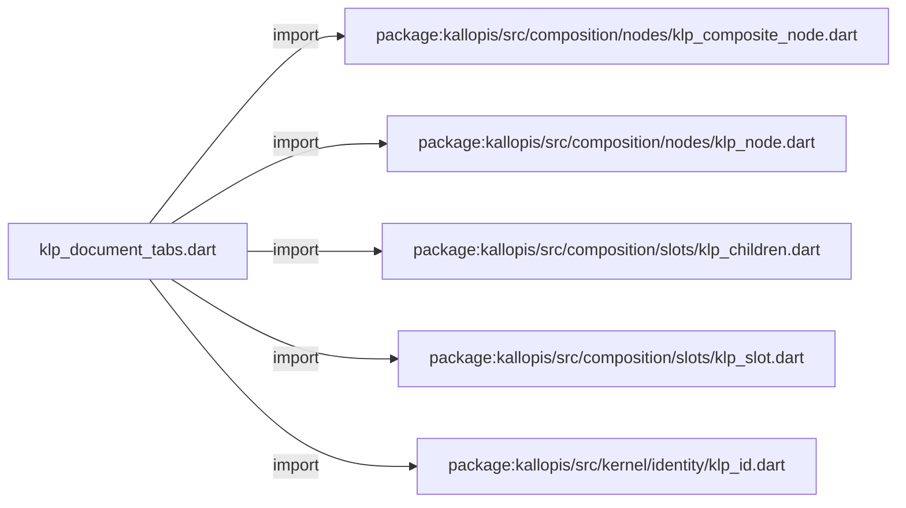
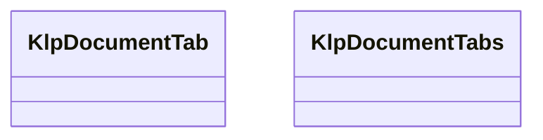
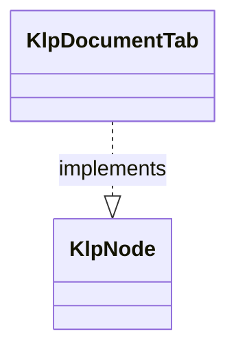
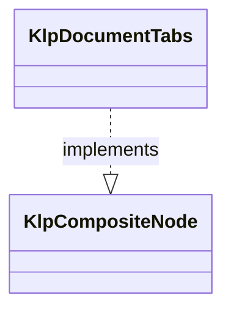

# klp_document_tabs.dart：直接依賴與宣告架構

[回到目錄](README.md) · [來源檔案](../../../../../../lib/src/features/workspace/components/klp_document_tabs.dart)

## 範圍

核心是 `lib/src/features/workspace/components/klp_document_tabs.dart`。主要視角為該檔案明寫的 import／export／part；輔助視角為本檔宣告及 extends／implements／with／on 關係。只展開一層外部邊界。

## 直接依賴圖

## 依賴證據

| 關係 | 原始 directive | 來源 |
|---|---|---|
| import | <code>import &#x27;package:kallopis/src/composition/nodes/klp_composite_node.dart&#x27;;</code> | [lib/src/features/workspace/components/klp_document_tabs.dart:1](../../../../../../lib/src/features/workspace/components/klp_document_tabs.dart#L1) |
| import | <code>import &#x27;package:kallopis/src/composition/nodes/klp_node.dart&#x27;;</code> | [lib/src/features/workspace/components/klp_document_tabs.dart:2](../../../../../../lib/src/features/workspace/components/klp_document_tabs.dart#L2) |
| import | <code>import &#x27;package:kallopis/src/composition/slots/klp_children.dart&#x27;;</code> | [lib/src/features/workspace/components/klp_document_tabs.dart:3](../../../../../../lib/src/features/workspace/components/klp_document_tabs.dart#L3) |
| import | <code>import &#x27;package:kallopis/src/composition/slots/klp_slot.dart&#x27;;</code> | [lib/src/features/workspace/components/klp_document_tabs.dart:4](../../../../../../lib/src/features/workspace/components/klp_document_tabs.dart#L4) |
| import | <code>import &#x27;package:kallopis/src/kernel/identity/klp_id.dart&#x27;;</code> | [lib/src/features/workspace/components/klp_document_tabs.dart:5](../../../../../../lib/src/features/workspace/components/klp_document_tabs.dart#L5) |

## 宣告關係圖

本組節點是本檔宣告；沒有箭頭的宣告未在此圖主張互相依賴。

## 宣告與成員證據

成員包含 public 與 private；簽章取自來源，省略函式本體與欄位初始值。`(inferred)` 表示來源未明寫型別；建構子只顯示參數部分，不含初始化列表。

### KlpDocumentTab

ClassDeclaration · public · [lib/src/features/workspace/components/klp_document_tabs.dart:7](../../../../../../lib/src/features/workspace/components/klp_document_tabs.dart#L7)

<code>final class KlpDocumentTab implements KlpNode</code>

來源註解摘要：一份文件分頁的資料；選取與關閉意圖歸消費端管理。

- `implements` → <code>KlpNode</code>：[lib/src/features/workspace/components/klp_document_tabs.dart:8](../../../../../../lib/src/features/workspace/components/klp_document_tabs.dart#L8)

| 成員 | 可見性 | 簽章／型別 | 來源註解摘要 | 證據 |
|---|---|---|---|---|
| field <code>typeId</code> | public | <code>static const (inferred) typeId</code> |  | [lib/src/features/workspace/components/klp_document_tabs.dart:9](../../../../../../lib/src/features/workspace/components/klp_document_tabs.dart#L9) |
| field <code>id</code> | public | <code>final KlpId id</code> |  | [lib/src/features/workspace/components/klp_document_tabs.dart:11](../../../../../../lib/src/features/workspace/components/klp_document_tabs.dart#L11) |
| field <code>label</code> | public | <code>final String label</code> |  | [lib/src/features/workspace/components/klp_document_tabs.dart:12](../../../../../../lib/src/features/workspace/components/klp_document_tabs.dart#L12) |
| field <code>dirty</code> | public | <code>final bool dirty</code> |  | [lib/src/features/workspace/components/klp_document_tabs.dart:13](../../../../../../lib/src/features/workspace/components/klp_document_tabs.dart#L13) |
| field <code>closable</code> | public | <code>final bool closable</code> |  | [lib/src/features/workspace/components/klp_document_tabs.dart:14](../../../../../../lib/src/features/workspace/components/klp_document_tabs.dart#L14) |
| field <code>pinned</code> | public | <code>final bool pinned</code> |  | [lib/src/features/workspace/components/klp_document_tabs.dart:15](../../../../../../lib/src/features/workspace/components/klp_document_tabs.dart#L15) |
| constructor <code>KlpDocumentTab</code> | public | <code>KlpDocumentTab({required this.id, required this.label, this.dirty = false, this.closable = true, this.pinned = false})</code> |  | [lib/src/features/workspace/components/klp_document_tabs.dart:17](../../../../../../lib/src/features/workspace/components/klp_document_tabs.dart#L17) |
| getter <code>children</code> | public | <code>Iterable&lt;KlpNode&gt; get children</code> |  | [lib/src/features/workspace/components/klp_document_tabs.dart:21](../../../../../../lib/src/features/workspace/components/klp_document_tabs.dart#L21) |
| getter <code>definitionId</code> | public | <code>String get definitionId</code> |  | [lib/src/features/workspace/components/klp_document_tabs.dart:23](../../../../../../lib/src/features/workspace/components/klp_document_tabs.dart#L23) |

### KlpDocumentTabs

ClassDeclaration · public · [lib/src/features/workspace/components/klp_document_tabs.dart:27](../../../../../../lib/src/features/workspace/components/klp_document_tabs.dart#L27)

<code>final class KlpDocumentTabs implements KlpCompositeNode</code>

來源註解摘要：文件分頁列；關閉只回報意圖，不刪除 consumer 的文件資料。

- `implements` → <code>KlpCompositeNode</code>：[lib/src/features/workspace/components/klp_document_tabs.dart:28](../../../../../../lib/src/features/workspace/components/klp_document_tabs.dart#L28)

| 成員 | 可見性 | 簽章／型別 | 來源註解摘要 | 證據 |
|---|---|---|---|---|
| field <code>typeId</code> | public | <code>static const (inferred) typeId</code> |  | [lib/src/features/workspace/components/klp_document_tabs.dart:29](../../../../../../lib/src/features/workspace/components/klp_document_tabs.dart#L29) |
| field <code>tabSlot</code> | public | <code>static final (inferred) tabSlot</code> |  | [lib/src/features/workspace/components/klp_document_tabs.dart:30](../../../../../../lib/src/features/workspace/components/klp_document_tabs.dart#L30) |
| field <code>id</code> | public | <code>final KlpId id</code> |  | [lib/src/features/workspace/components/klp_document_tabs.dart:32](../../../../../../lib/src/features/workspace/components/klp_document_tabs.dart#L32) |
| field <code>tabs</code> | public | <code>final List&lt;KlpDocumentTab&gt; tabs</code> |  | [lib/src/features/workspace/components/klp_document_tabs.dart:33](../../../../../../lib/src/features/workspace/components/klp_document_tabs.dart#L33) |
| field <code>selectedId</code> | public | <code>final KlpId? selectedId</code> |  | [lib/src/features/workspace/components/klp_document_tabs.dart:34](../../../../../../lib/src/features/workspace/components/klp_document_tabs.dart#L34) |
| field <code>onSelected</code> | public | <code>final void Function(KlpId)? onSelected</code> |  | [lib/src/features/workspace/components/klp_document_tabs.dart:35](../../../../../../lib/src/features/workspace/components/klp_document_tabs.dart#L35) |
| field <code>onClose</code> | public | <code>final void Function(KlpId)? onClose</code> |  | [lib/src/features/workspace/components/klp_document_tabs.dart:36](../../../../../../lib/src/features/workspace/components/klp_document_tabs.dart#L36) |
| field <code>onPinnedChanged</code> | public | <code>final void Function(KlpId, bool)? onPinnedChanged</code> |  | [lib/src/features/workspace/components/klp_document_tabs.dart:37](../../../../../../lib/src/features/workspace/components/klp_document_tabs.dart#L37) |
| field <code>children</code> | public | <code>final KlpChildren children</code> |  | [lib/src/features/workspace/components/klp_document_tabs.dart:39](../../../../../../lib/src/features/workspace/components/klp_document_tabs.dart#L39) |
| constructor <code>KlpDocumentTabs</code> | public | <code>KlpDocumentTabs({required this.id, required List&lt;KlpDocumentTab&gt; tabs, this.selectedId, this.onSelected, this.onClose, this.onPinnedChanged})</code> |  | [lib/src/features/workspace/components/klp_document_tabs.dart:41](../../../../../../lib/src/features/workspace/components/klp_document_tabs.dart#L41) |
| getter <code>definitionId</code> | public | <code>String get definitionId</code> |  | [lib/src/features/workspace/components/klp_document_tabs.dart:45](../../../../../../lib/src/features/workspace/components/klp_document_tabs.dart#L45) |

## 閱讀說明與限制

箭頭只表示來源明寫的靜態關係；import 不等於呼叫。未分析動態呼叫、欄位的實際物件擁有權、狀態轉移或渲染流程；型別未進行語意解析，繼承目標保留原始型別拼寫。public／private 依 Dart 名稱前綴判斷；public 宣告不代表已由 `lib/kallopis.dart` 匯出。

本頁由 `tool/architecture_atlas` 產生；編輯來源或生成工具後重新產生，避免手改本頁。
