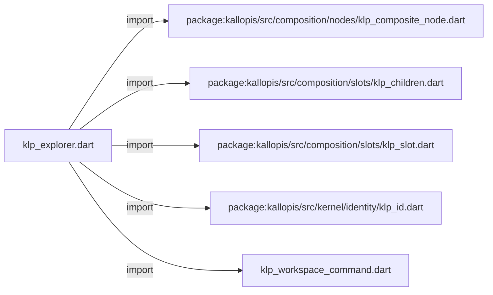
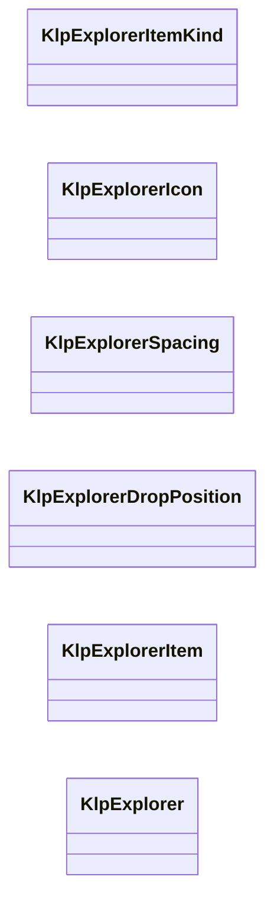
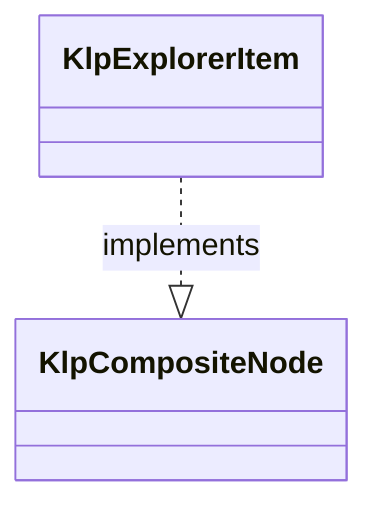
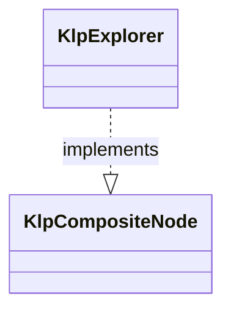

# klp_explorer.dart：直接依賴與宣告架構

[回到目錄](README.md) · [來源檔案](../../../../../../lib/src/features/workspace/components/klp_explorer.dart)

## 範圍

核心是 `lib/src/features/workspace/components/klp_explorer.dart`。主要視角為該檔案明寫的 import／export／part；輔助視角為本檔宣告及 extends／implements／with／on 關係。只展開一層外部邊界。

## 直接依賴圖

## 依賴證據

| 關係 | 原始 directive | 來源 |
|---|---|---|
| import | <code>import &#x27;package:kallopis/src/composition/nodes/klp_composite_node.dart&#x27;;</code> | [lib/src/features/workspace/components/klp_explorer.dart:1](../../../../../../lib/src/features/workspace/components/klp_explorer.dart#L1) |
| import | <code>import &#x27;package:kallopis/src/composition/slots/klp_children.dart&#x27;;</code> | [lib/src/features/workspace/components/klp_explorer.dart:2](../../../../../../lib/src/features/workspace/components/klp_explorer.dart#L2) |
| import | <code>import &#x27;package:kallopis/src/composition/slots/klp_slot.dart&#x27;;</code> | [lib/src/features/workspace/components/klp_explorer.dart:3](../../../../../../lib/src/features/workspace/components/klp_explorer.dart#L3) |
| import | <code>import &#x27;package:kallopis/src/kernel/identity/klp_id.dart&#x27;;</code> | [lib/src/features/workspace/components/klp_explorer.dart:4](../../../../../../lib/src/features/workspace/components/klp_explorer.dart#L4) |
| import | <code>import &#x27;klp_workspace_command.dart&#x27;;</code> | [lib/src/features/workspace/components/klp_explorer.dart:5](../../../../../../lib/src/features/workspace/components/klp_explorer.dart#L5) |

## 宣告關係圖

本組節點是本檔宣告；沒有箭頭的宣告未在此圖主張互相依賴。

## 宣告與成員證據

成員包含 public 與 private；簽章取自來源，省略函式本體與欄位初始值。`(inferred)` 表示來源未明寫型別；建構子只顯示參數部分，不含初始化列表。

### KlpExplorerItemKind

EnumDeclaration · public · [lib/src/features/workspace/components/klp_explorer.dart:7](../../../../../../lib/src/features/workspace/components/klp_explorer.dart#L7)

<code>enum KlpExplorerItemKind</code>

來源註解摘要：Explorer 項目的封閉種類；不定義產品的檔案副檔名或資料來源。

| 成員 | 可見性 | 簽章／型別 | 來源註解摘要 | 證據 |
|---|---|---|---|---|
| enum value <code>file</code> | public | <code>file</code> |  | [lib/src/features/workspace/components/klp_explorer.dart:8](../../../../../../lib/src/features/workspace/components/klp_explorer.dart#L8) |
| enum value <code>folder</code> | public | <code>folder</code> |  | [lib/src/features/workspace/components/klp_explorer.dart:8](../../../../../../lib/src/features/workspace/components/klp_explorer.dart#L8) |
| enum value <code>category</code> | public | <code>category</code> |  | [lib/src/features/workspace/components/klp_explorer.dart:8](../../../../../../lib/src/features/workspace/components/klp_explorer.dart#L8) |

### KlpExplorerIcon

EnumDeclaration · public · [lib/src/features/workspace/components/klp_explorer.dart:10](../../../../../../lib/src/features/workspace/components/klp_explorer.dart#L10)

<code>enum KlpExplorerIcon</code>

來源註解摘要：受控圖示語意，避免消費端注入 Widget 或資產路徑。

| 成員 | 可見性 | 簽章／型別 | 來源註解摘要 | 證據 |
|---|---|---|---|---|
| enum value <code>file</code> | public | <code>file</code> |  | [lib/src/features/workspace/components/klp_explorer.dart:11](../../../../../../lib/src/features/workspace/components/klp_explorer.dart#L11) |
| enum value <code>folder</code> | public | <code>folder</code> |  | [lib/src/features/workspace/components/klp_explorer.dart:11](../../../../../../lib/src/features/workspace/components/klp_explorer.dart#L11) |
| enum value <code>image</code> | public | <code>image</code> |  | [lib/src/features/workspace/components/klp_explorer.dart:11](../../../../../../lib/src/features/workspace/components/klp_explorer.dart#L11) |
| enum value <code>music</code> | public | <code>music</code> |  | [lib/src/features/workspace/components/klp_explorer.dart:11](../../../../../../lib/src/features/workspace/components/klp_explorer.dart#L11) |
| enum value <code>board</code> | public | <code>board</code> |  | [lib/src/features/workspace/components/klp_explorer.dart:11](../../../../../../lib/src/features/workspace/components/klp_explorer.dart#L11) |

### KlpExplorerSpacing

EnumDeclaration · public · [lib/src/features/workspace/components/klp_explorer.dart:12](../../../../../../lib/src/features/workspace/components/klp_explorer.dart#L12)

<code>enum KlpExplorerSpacing</code>

來源註解摘要：Explorer 項目間距的語意選項；實際距離由本庫呈現契約決定，不承載原始尺寸。

| 成員 | 可見性 | 簽章／型別 | 來源註解摘要 | 證據 |
|---|---|---|---|---|
| enum value <code>standard</code> | public | <code>standard</code> |  | [lib/src/features/workspace/components/klp_explorer.dart:13](../../../../../../lib/src/features/workspace/components/klp_explorer.dart#L13) |
| enum value <code>relaxed</code> | public | <code>relaxed</code> |  | [lib/src/features/workspace/components/klp_explorer.dart:13](../../../../../../lib/src/features/workspace/components/klp_explorer.dart#L13) |
| enum value <code>flush</code> | public | <code>flush</code> |  | [lib/src/features/workspace/components/klp_explorer.dart:13](../../../../../../lib/src/features/workspace/components/klp_explorer.dart#L13) |

### KlpExplorerDropPosition

EnumDeclaration · public · [lib/src/features/workspace/components/klp_explorer.dart:14](../../../../../../lib/src/features/workspace/components/klp_explorer.dart#L14)

<code>enum KlpExplorerDropPosition</code>

來源註解摘要：Explorer 移動請求相對目標的位置；不執行資料搬移或決定移動權限。

| 成員 | 可見性 | 簽章／型別 | 來源註解摘要 | 證據 |
|---|---|---|---|---|
| enum value <code>before</code> | public | <code>before</code> |  | [lib/src/features/workspace/components/klp_explorer.dart:15](../../../../../../lib/src/features/workspace/components/klp_explorer.dart#L15) |
| enum value <code>inside</code> | public | <code>inside</code> |  | [lib/src/features/workspace/components/klp_explorer.dart:15](../../../../../../lib/src/features/workspace/components/klp_explorer.dart#L15) |
| enum value <code>after</code> | public | <code>after</code> |  | [lib/src/features/workspace/components/klp_explorer.dart:15](../../../../../../lib/src/features/workspace/components/klp_explorer.dart#L15) |

### KlpExplorerItem

ClassDeclaration · public · [lib/src/features/workspace/components/klp_explorer.dart:17](../../../../../../lib/src/features/workspace/components/klp_explorer.dart#L17)

<code>final class KlpExplorerItem implements KlpCompositeNode</code>

來源註解摘要：Explorer 的資料節點；階層、選取與展開狀態均由 consumer 擁有。

- `implements` → <code>KlpCompositeNode</code>：[lib/src/features/workspace/components/klp_explorer.dart:18](../../../../../../lib/src/features/workspace/components/klp_explorer.dart#L18)

| 成員 | 可見性 | 簽章／型別 | 來源註解摘要 | 證據 |
|---|---|---|---|---|
| field <code>typeId</code> | public | <code>static const (inferred) typeId</code> |  | [lib/src/features/workspace/components/klp_explorer.dart:19](../../../../../../lib/src/features/workspace/components/klp_explorer.dart#L19) |
| field <code>childSlot</code> | public | <code>static final (inferred) childSlot</code> |  | [lib/src/features/workspace/components/klp_explorer.dart:20](../../../../../../lib/src/features/workspace/components/klp_explorer.dart#L20) |
| field <code>id</code> | public | <code>final KlpId id</code> |  | [lib/src/features/workspace/components/klp_explorer.dart:23](../../../../../../lib/src/features/workspace/components/klp_explorer.dart#L23) |
| field <code>label</code> | public | <code>final String label</code> |  | [lib/src/features/workspace/components/klp_explorer.dart:24](../../../../../../lib/src/features/workspace/components/klp_explorer.dart#L24) |
| field <code>kind</code> | public | <code>final KlpExplorerItemKind kind</code> |  | [lib/src/features/workspace/components/klp_explorer.dart:25](../../../../../../lib/src/features/workspace/components/klp_explorer.dart#L25) |
| field <code>icon</code> | public | <code>final KlpExplorerIcon? icon</code> |  | [lib/src/features/workspace/components/klp_explorer.dart:26](../../../../../../lib/src/features/workspace/components/klp_explorer.dart#L26) |
| field <code>badge</code> | public | <code>final String? badge</code> |  | [lib/src/features/workspace/components/klp_explorer.dart:27](../../../../../../lib/src/features/workspace/components/klp_explorer.dart#L27) |
| field <code>collapsible</code> | public | <code>final bool collapsible</code> |  | [lib/src/features/workspace/components/klp_explorer.dart:28](../../../../../../lib/src/features/workspace/components/klp_explorer.dart#L28) |
| field <code>actions</code> | public | <code>final List&lt;KlpWorkspaceCommand&gt; actions</code> |  | [lib/src/features/workspace/components/klp_explorer.dart:29](../../../../../../lib/src/features/workspace/components/klp_explorer.dart#L29) |
| field <code>items</code> | public | <code>final List&lt;KlpExplorerItem&gt; items</code> |  | [lib/src/features/workspace/components/klp_explorer.dart:30](../../../../../../lib/src/features/workspace/components/klp_explorer.dart#L30) |
| field <code>children</code> | public | <code>final KlpChildren children</code> |  | [lib/src/features/workspace/components/klp_explorer.dart:32](../../../../../../lib/src/features/workspace/components/klp_explorer.dart#L32) |
| constructor <code>KlpExplorerItem</code> | public | <code>KlpExplorerItem({required this.id, required this.label, required this.kind, this.icon, this.badge, this.collapsible = true, this.actions = const [], List&lt;KlpExplorerItem&gt; children = const []})</code> |  | [lib/src/features/workspace/components/klp_explorer.dart:34](../../../../../../lib/src/features/workspace/components/klp_explorer.dart#L34) |
| getter <code>definitionId</code> | public | <code>String get definitionId</code> |  | [lib/src/features/workspace/components/klp_explorer.dart:41](../../../../../../lib/src/features/workspace/components/klp_explorer.dart#L41) |

### KlpExplorer

ClassDeclaration · public · [lib/src/features/workspace/components/klp_explorer.dart:45](../../../../../../lib/src/features/workspace/components/klp_explorer.dart#L45)

<code>final class KlpExplorer implements KlpCompositeNode</code>

來源註解摘要：可控 Explorer；互動只通知 consumer，重建前不自行改變資料。

- `implements` → <code>KlpCompositeNode</code>：[lib/src/features/workspace/components/klp_explorer.dart:46](../../../../../../lib/src/features/workspace/components/klp_explorer.dart#L46)

| 成員 | 可見性 | 簽章／型別 | 來源註解摘要 | 證據 |
|---|---|---|---|---|
| field <code>typeId</code> | public | <code>static const (inferred) typeId</code> |  | [lib/src/features/workspace/components/klp_explorer.dart:47](../../../../../../lib/src/features/workspace/components/klp_explorer.dart#L47) |
| field <code>itemSlot</code> | public | <code>static final (inferred) itemSlot</code> |  | [lib/src/features/workspace/components/klp_explorer.dart:48](../../../../../../lib/src/features/workspace/components/klp_explorer.dart#L48) |
| field <code>id</code> | public | <code>final KlpId id</code> |  | [lib/src/features/workspace/components/klp_explorer.dart:51](../../../../../../lib/src/features/workspace/components/klp_explorer.dart#L51) |
| field <code>items</code> | public | <code>final List&lt;KlpExplorerItem&gt; items</code> |  | [lib/src/features/workspace/components/klp_explorer.dart:52](../../../../../../lib/src/features/workspace/components/klp_explorer.dart#L52) |
| field <code>allowNesting</code> | public | <code>final bool allowNesting</code> |  | [lib/src/features/workspace/components/klp_explorer.dart:53](../../../../../../lib/src/features/workspace/components/klp_explorer.dart#L53) |
| field <code>actionsLabel</code> | public | <code>final String actionsLabel</code> |  | [lib/src/features/workspace/components/klp_explorer.dart:54](../../../../../../lib/src/features/workspace/components/klp_explorer.dart#L54) |
| field <code>expandLabel</code> | public | <code>final String expandLabel</code> |  | [lib/src/features/workspace/components/klp_explorer.dart:54](../../../../../../lib/src/features/workspace/components/klp_explorer.dart#L54) |
| field <code>collapseLabel</code> | public | <code>final String collapseLabel</code> |  | [lib/src/features/workspace/components/klp_explorer.dart:54](../../../../../../lib/src/features/workspace/components/klp_explorer.dart#L54) |
| field <code>spacing</code> | public | <code>final KlpExplorerSpacing spacing</code> |  | [lib/src/features/workspace/components/klp_explorer.dart:55](../../../../../../lib/src/features/workspace/components/klp_explorer.dart#L55) |
| field <code>selectedId</code> | public | <code>final KlpId? selectedId</code> |  | [lib/src/features/workspace/components/klp_explorer.dart:56](../../../../../../lib/src/features/workspace/components/klp_explorer.dart#L56) |
| field <code>selectedIds</code> | public | <code>final Set&lt;KlpId&gt; selectedIds</code> |  | [lib/src/features/workspace/components/klp_explorer.dart:57](../../../../../../lib/src/features/workspace/components/klp_explorer.dart#L57) |
| field <code>expandedIds</code> | public | <code>final Set&lt;KlpId&gt; expandedIds</code> |  | [lib/src/features/workspace/components/klp_explorer.dart:58](../../../../../../lib/src/features/workspace/components/klp_explorer.dart#L58) |
| field <code>onSelected</code> | public | <code>final void Function(KlpId)? onSelected</code> |  | [lib/src/features/workspace/components/klp_explorer.dart:59](../../../../../../lib/src/features/workspace/components/klp_explorer.dart#L59) |
| field <code>onSelectionChanged</code> | public | <code>final void Function(Set&lt;KlpId&gt;)? onSelectionChanged</code> |  | [lib/src/features/workspace/components/klp_explorer.dart:60](../../../../../../lib/src/features/workspace/components/klp_explorer.dart#L60) |
| field <code>onExpandedChanged</code> | public | <code>final void Function(KlpId, bool)? onExpandedChanged</code> |  | [lib/src/features/workspace/components/klp_explorer.dart:61](../../../../../../lib/src/features/workspace/components/klp_explorer.dart#L61) |
| field <code>canMove</code> | public | <code>final bool Function(Set&lt;KlpId&gt;, KlpId, KlpExplorerDropPosition)? canMove</code> |  | [lib/src/features/workspace/components/klp_explorer.dart:62](../../../../../../lib/src/features/workspace/components/klp_explorer.dart#L62) |
| field <code>onMove</code> | public | <code>final void Function(Set&lt;KlpId&gt;, KlpId, KlpExplorerDropPosition)? onMove</code> |  | [lib/src/features/workspace/components/klp_explorer.dart:63](../../../../../../lib/src/features/workspace/components/klp_explorer.dart#L63) |
| field <code>children</code> | public | <code>final KlpChildren children</code> |  | [lib/src/features/workspace/components/klp_explorer.dart:65](../../../../../../lib/src/features/workspace/components/klp_explorer.dart#L65) |
| constructor <code>KlpExplorer</code> | public | <code>KlpExplorer({required this.id, required List&lt;KlpExplorerItem&gt; items, this.selectedId, Set&lt;KlpId&gt; selectedIds = const {}, this.allowNesting = true, this.actionsLabel = &#x27;Actions&#x27;, this.expandLabel = &#x27;Expand&#x27;, this.collapseLabel = &#x27;Collapse&#x27;, this.spacing = KlpExplorerSpacing.flush, Set&lt;KlpId&gt; expandedIds = const {}, this.onSelected, this.onSelectionChanged, this.onExpandedChanged, this.canMove, this.onMove})</code> |  | [lib/src/features/workspace/components/klp_explorer.dart:67](../../../../../../lib/src/features/workspace/components/klp_explorer.dart#L67) |
| getter <code>definitionId</code> | public | <code>String get definitionId</code> |  | [lib/src/features/workspace/components/klp_explorer.dart:73](../../../../../../lib/src/features/workspace/components/klp_explorer.dart#L73) |

## 閱讀說明與限制

箭頭只表示來源明寫的靜態關係；import 不等於呼叫。未分析動態呼叫、欄位的實際物件擁有權、狀態轉移或渲染流程；型別未進行語意解析，繼承目標保留原始型別拼寫。public／private 依 Dart 名稱前綴判斷；public 宣告不代表已由 `lib/kallopis.dart` 匯出。

本頁由 `tool/architecture_atlas` 產生；編輯來源或生成工具後重新產生，避免手改本頁。
