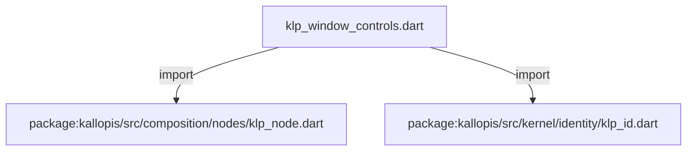
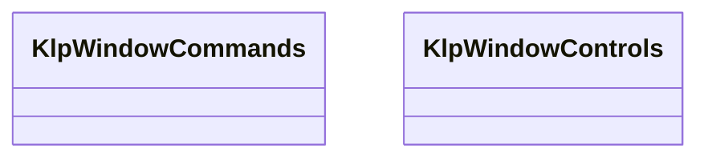
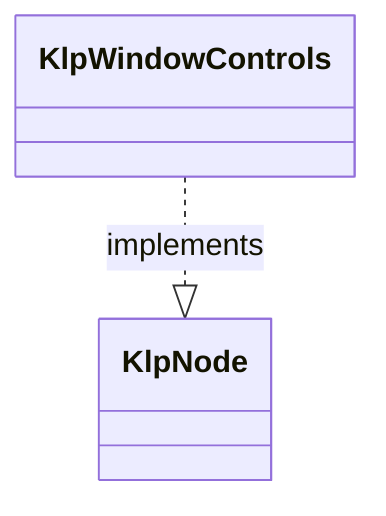

# klp_window_controls.dart：直接依賴與宣告架構

[回到目錄](README.md) · [來源檔案](../../../../../../lib/src/features/workspace/components/klp_window_controls.dart)

## 範圍

核心是 `lib/src/features/workspace/components/klp_window_controls.dart`。主要視角為該檔案明寫的 import／export／part；輔助視角為本檔宣告及 extends／implements／with／on 關係。只展開一層外部邊界。

## 直接依賴圖

## 依賴證據

| 關係 | 原始 directive | 來源 |
|---|---|---|
| import | <code>import &#x27;package:kallopis/src/composition/nodes/klp_node.dart&#x27;;</code> | [lib/src/features/workspace/components/klp_window_controls.dart:1](../../../../../../lib/src/features/workspace/components/klp_window_controls.dart#L1) |
| import | <code>import &#x27;package:kallopis/src/kernel/identity/klp_id.dart&#x27;;</code> | [lib/src/features/workspace/components/klp_window_controls.dart:2](../../../../../../lib/src/features/workspace/components/klp_window_controls.dart#L2) |

## 宣告關係圖

本組節點是本檔宣告；沒有箭頭的宣告未在此圖主張互相依賴。

## 宣告與成員證據

成員包含 public 與 private；簽章取自來源，省略函式本體與欄位初始值。`(inferred)` 表示來源未明寫型別；建構子只顯示參數部分，不含初始化列表。

### KlpWindowCommands

ClassDeclaration · public · [lib/src/features/workspace/components/klp_window_controls.dart:4](../../../../../../lib/src/features/workspace/components/klp_window_controls.dart#L4)

<code>final class KlpWindowCommands</code>

來源註解摘要：Host 提供的視窗命令；Kallopis 不擁有作業系統 runner 通道。

| 成員 | 可見性 | 簽章／型別 | 來源註解摘要 | 證據 |
|---|---|---|---|---|
| field <code>minimize</code> | public | <code>final void Function()? minimize</code> |  | [lib/src/features/workspace/components/klp_window_controls.dart:6](../../../../../../lib/src/features/workspace/components/klp_window_controls.dart#L6) |
| field <code>toggleMaximize</code> | public | <code>final void Function()? toggleMaximize</code> |  | [lib/src/features/workspace/components/klp_window_controls.dart:7](../../../../../../lib/src/features/workspace/components/klp_window_controls.dart#L7) |
| field <code>close</code> | public | <code>final void Function()? close</code> |  | [lib/src/features/workspace/components/klp_window_controls.dart:8](../../../../../../lib/src/features/workspace/components/klp_window_controls.dart#L8) |
| constructor <code>KlpWindowCommands</code> | public | <code>const KlpWindowCommands({this.minimize, this.toggleMaximize, this.close})</code> |  | [lib/src/features/workspace/components/klp_window_controls.dart:9](../../../../../../lib/src/features/workspace/components/klp_window_controls.dart#L9) |

### KlpWindowControls

ClassDeclaration · public · [lib/src/features/workspace/components/klp_window_controls.dart:12](../../../../../../lib/src/features/workspace/components/klp_window_controls.dart#L12)

<code>final class KlpWindowControls implements KlpNode</code>

來源註解摘要：視窗控制列的呈現資料；實際視窗操作由 host callback 擁有。

- `implements` → <code>KlpNode</code>：[lib/src/features/workspace/components/klp_window_controls.dart:13](../../../../../../lib/src/features/workspace/components/klp_window_controls.dart#L13)

| 成員 | 可見性 | 簽章／型別 | 來源註解摘要 | 證據 |
|---|---|---|---|---|
| field <code>typeId</code> | public | <code>static const (inferred) typeId</code> |  | [lib/src/features/workspace/components/klp_window_controls.dart:14](../../../../../../lib/src/features/workspace/components/klp_window_controls.dart#L14) |
| field <code>id</code> | public | <code>final KlpId id</code> |  | [lib/src/features/workspace/components/klp_window_controls.dart:16](../../../../../../lib/src/features/workspace/components/klp_window_controls.dart#L16) |
| field <code>isMaximized</code> | public | <code>final bool isMaximized</code> |  | [lib/src/features/workspace/components/klp_window_controls.dart:17](../../../../../../lib/src/features/workspace/components/klp_window_controls.dart#L17) |
| field <code>commands</code> | public | <code>final KlpWindowCommands commands</code> |  | [lib/src/features/workspace/components/klp_window_controls.dart:18](../../../../../../lib/src/features/workspace/components/klp_window_controls.dart#L18) |
| constructor <code>KlpWindowControls</code> | public | <code>KlpWindowControls({required this.id, required void Function()? onMinimize, required void Function()? onToggleMaximize, required void Function()? onClose, this.isMaximized = false})</code> |  | [lib/src/features/workspace/components/klp_window_controls.dart:19](../../../../../../lib/src/features/workspace/components/klp_window_controls.dart#L19) |
| getter <code>children</code> | public | <code>Iterable&lt;KlpNode&gt; get children</code> |  | [lib/src/features/workspace/components/klp_window_controls.dart:21](../../../../../../lib/src/features/workspace/components/klp_window_controls.dart#L21) |
| getter <code>definitionId</code> | public | <code>String get definitionId</code> |  | [lib/src/features/workspace/components/klp_window_controls.dart:23](../../../../../../lib/src/features/workspace/components/klp_window_controls.dart#L23) |

## 閱讀說明與限制

箭頭只表示來源明寫的靜態關係；import 不等於呼叫。未分析動態呼叫、欄位的實際物件擁有權、狀態轉移或渲染流程；型別未進行語意解析，繼承目標保留原始型別拼寫。public／private 依 Dart 名稱前綴判斷；public 宣告不代表已由 `lib/kallopis.dart` 匯出。

本頁由 `tool/architecture_atlas` 產生；編輯來源或生成工具後重新產生，避免手改本頁。
