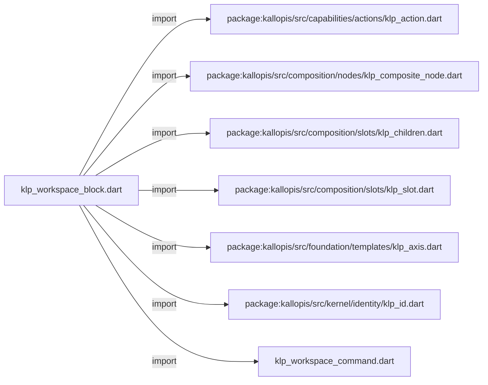
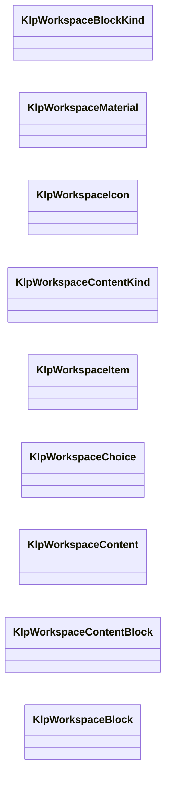
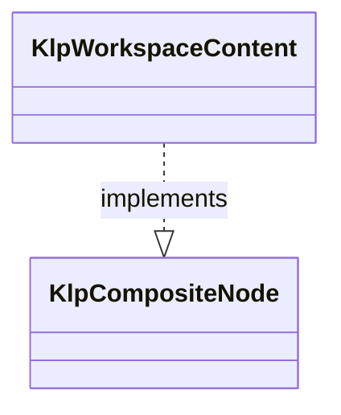
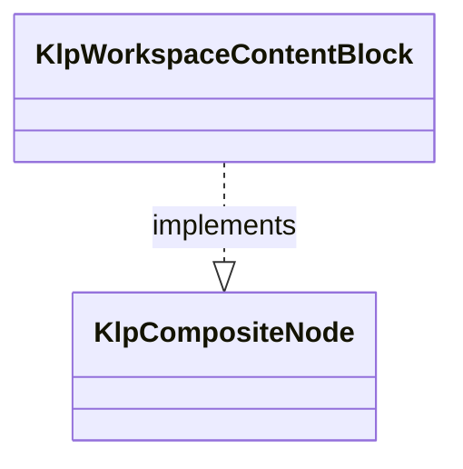
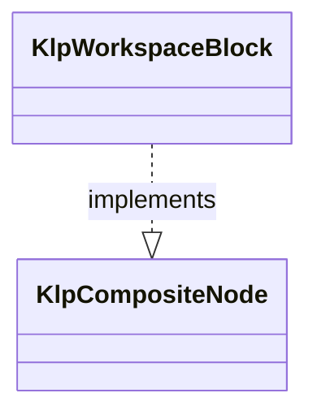

# klp_workspace_block.dart：直接依賴與宣告架構

[回到目錄](README.md) · [來源檔案](../../../../../../lib/src/features/workspace/components/klp_workspace_block.dart)

## 範圍

核心是 `lib/src/features/workspace/components/klp_workspace_block.dart`。主要視角為該檔案明寫的 import／export／part；輔助視角為本檔宣告及 extends／implements／with／on 關係。只展開一層外部邊界。

## 直接依賴圖

## 依賴證據

| 關係 | 原始 directive | 來源 |
|---|---|---|
| import | <code>import &#x27;package:kallopis/src/capabilities/actions/klp_action.dart&#x27;;</code> | [lib/src/features/workspace/components/klp_workspace_block.dart:1](../../../../../../lib/src/features/workspace/components/klp_workspace_block.dart#L1) |
| import | <code>import &#x27;package:kallopis/src/composition/nodes/klp_composite_node.dart&#x27;;</code> | [lib/src/features/workspace/components/klp_workspace_block.dart:2](../../../../../../lib/src/features/workspace/components/klp_workspace_block.dart#L2) |
| import | <code>import &#x27;package:kallopis/src/composition/slots/klp_children.dart&#x27;;</code> | [lib/src/features/workspace/components/klp_workspace_block.dart:3](../../../../../../lib/src/features/workspace/components/klp_workspace_block.dart#L3) |
| import | <code>import &#x27;package:kallopis/src/composition/slots/klp_slot.dart&#x27;;</code> | [lib/src/features/workspace/components/klp_workspace_block.dart:4](../../../../../../lib/src/features/workspace/components/klp_workspace_block.dart#L4) |
| import | <code>import &#x27;package:kallopis/src/foundation/templates/klp_axis.dart&#x27;;</code> | [lib/src/features/workspace/components/klp_workspace_block.dart:5](../../../../../../lib/src/features/workspace/components/klp_workspace_block.dart#L5) |
| import | <code>import &#x27;package:kallopis/src/kernel/identity/klp_id.dart&#x27;;</code> | [lib/src/features/workspace/components/klp_workspace_block.dart:6](../../../../../../lib/src/features/workspace/components/klp_workspace_block.dart#L6) |
| import | <code>import &#x27;klp_workspace_command.dart&#x27;;</code> | [lib/src/features/workspace/components/klp_workspace_block.dart:7](../../../../../../lib/src/features/workspace/components/klp_workspace_block.dart#L7) |

## 宣告關係圖

本組節點是本檔宣告；沒有箭頭的宣告未在此圖主張互相依賴。

## 宣告與成員證據

成員包含 public 與 private；簽章取自來源，省略函式本體與欄位初始值。`(inferred)` 表示來源未明寫型別；建構子只顯示參數部分，不含初始化列表。

### KlpWorkspaceBlockKind

EnumDeclaration · public · [lib/src/features/workspace/components/klp_workspace_block.dart:9](../../../../../../lib/src/features/workspace/components/klp_workspace_block.dart#L9)

<code>enum KlpWorkspaceBlockKind</code>

來源註解摘要：工作區區塊的封閉語意種類；不定義產品資料模型或提供自訂渲染器。

| 成員 | 可見性 | 簽章／型別 | 來源註解摘要 | 證據 |
|---|---|---|---|---|
| enum value <code>identity</code> | public | <code>identity</code> |  | [lib/src/features/workspace/components/klp_workspace_block.dart:10](../../../../../../lib/src/features/workspace/components/klp_workspace_block.dart#L10) |
| enum value <code>action</code> | public | <code>action</code> |  | [lib/src/features/workspace/components/klp_workspace_block.dart:10](../../../../../../lib/src/features/workspace/components/klp_workspace_block.dart#L10) |
| enum value <code>paper</code> | public | <code>paper</code> |  | [lib/src/features/workspace/components/klp_workspace_block.dart:10](../../../../../../lib/src/features/workspace/components/klp_workspace_block.dart#L10) |
| enum value <code>sticky</code> | public | <code>sticky</code> |  | [lib/src/features/workspace/components/klp_workspace_block.dart:10](../../../../../../lib/src/features/workspace/components/klp_workspace_block.dart#L10) |
| enum value <code>search</code> | public | <code>search</code> |  | [lib/src/features/workspace/components/klp_workspace_block.dart:10](../../../../../../lib/src/features/workspace/components/klp_workspace_block.dart#L10) |
| enum value <code>settings</code> | public | <code>settings</code> |  | [lib/src/features/workspace/components/klp_workspace_block.dart:10](../../../../../../lib/src/features/workspace/components/klp_workspace_block.dart#L10) |
| enum value <code>board</code> | public | <code>board</code> |  | [lib/src/features/workspace/components/klp_workspace_block.dart:10](../../../../../../lib/src/features/workspace/components/klp_workspace_block.dart#L10) |
| enum value <code>cards</code> | public | <code>cards</code> |  | [lib/src/features/workspace/components/klp_workspace_block.dart:10](../../../../../../lib/src/features/workspace/components/klp_workspace_block.dart#L10) |
| enum value <code>dialog</code> | public | <code>dialog</code> |  | [lib/src/features/workspace/components/klp_workspace_block.dart:10](../../../../../../lib/src/features/workspace/components/klp_workspace_block.dart#L10) |
| enum value <code>toolbar</code> | public | <code>toolbar</code> |  | [lib/src/features/workspace/components/klp_workspace_block.dart:10](../../../../../../lib/src/features/workspace/components/klp_workspace_block.dart#L10) |

### KlpWorkspaceMaterial

EnumDeclaration · public · [lib/src/features/workspace/components/klp_workspace_block.dart:11](../../../../../../lib/src/features/workspace/components/klp_workspace_block.dart#L11)

<code>enum KlpWorkspaceMaterial</code>

來源註解摘要：工作區區塊的材質語意選項；不保存色彩值或建立另一份主題。

| 成員 | 可見性 | 簽章／型別 | 來源註解摘要 | 證據 |
|---|---|---|---|---|
| enum value <code>standard</code> | public | <code>standard</code> |  | [lib/src/features/workspace/components/klp_workspace_block.dart:12](../../../../../../lib/src/features/workspace/components/klp_workspace_block.dart#L12) |
| enum value <code>sage</code> | public | <code>sage</code> |  | [lib/src/features/workspace/components/klp_workspace_block.dart:12](../../../../../../lib/src/features/workspace/components/klp_workspace_block.dart#L12) |

### KlpWorkspaceIcon

EnumDeclaration · public · [lib/src/features/workspace/components/klp_workspace_block.dart:13](../../../../../../lib/src/features/workspace/components/klp_workspace_block.dart#L13)

<code>enum KlpWorkspaceIcon</code>

來源註解摘要：工作區可選用的封閉圖示語意；不接受外部資產路徑或原生元件。

| 成員 | 可見性 | 簽章／型別 | 來源註解摘要 | 證據 |
|---|---|---|---|---|
| enum value <code>search</code> | public | <code>search</code> |  | [lib/src/features/workspace/components/klp_workspace_block.dart:14](../../../../../../lib/src/features/workspace/components/klp_workspace_block.dart#L14) |
| enum value <code>settings</code> | public | <code>settings</code> |  | [lib/src/features/workspace/components/klp_workspace_block.dart:14](../../../../../../lib/src/features/workspace/components/klp_workspace_block.dart#L14) |
| enum value <code>inbox</code> | public | <code>inbox</code> |  | [lib/src/features/workspace/components/klp_workspace_block.dart:14](../../../../../../lib/src/features/workspace/components/klp_workspace_block.dart#L14) |
| enum value <code>calendar</code> | public | <code>calendar</code> |  | [lib/src/features/workspace/components/klp_workspace_block.dart:14](../../../../../../lib/src/features/workspace/components/klp_workspace_block.dart#L14) |
| enum value <code>clipboard</code> | public | <code>clipboard</code> |  | [lib/src/features/workspace/components/klp_workspace_block.dart:14](../../../../../../lib/src/features/workspace/components/klp_workspace_block.dart#L14) |
| enum value <code>archive</code> | public | <code>archive</code> |  | [lib/src/features/workspace/components/klp_workspace_block.dart:14](../../../../../../lib/src/features/workspace/components/klp_workspace_block.dart#L14) |
| enum value <code>disclosure</code> | public | <code>disclosure</code> |  | [lib/src/features/workspace/components/klp_workspace_block.dart:14](../../../../../../lib/src/features/workspace/components/klp_workspace_block.dart#L14) |
| enum value <code>folder</code> | public | <code>folder</code> |  | [lib/src/features/workspace/components/klp_workspace_block.dart:14](../../../../../../lib/src/features/workspace/components/klp_workspace_block.dart#L14) |
| enum value <code>file</code> | public | <code>file</code> |  | [lib/src/features/workspace/components/klp_workspace_block.dart:14](../../../../../../lib/src/features/workspace/components/klp_workspace_block.dart#L14) |
| enum value <code>minimize</code> | public | <code>minimize</code> |  | [lib/src/features/workspace/components/klp_workspace_block.dart:14](../../../../../../lib/src/features/workspace/components/klp_workspace_block.dart#L14) |
| enum value <code>maximize</code> | public | <code>maximize</code> |  | [lib/src/features/workspace/components/klp_workspace_block.dart:14](../../../../../../lib/src/features/workspace/components/klp_workspace_block.dart#L14) |
| enum value <code>restore</code> | public | <code>restore</code> |  | [lib/src/features/workspace/components/klp_workspace_block.dart:14](../../../../../../lib/src/features/workspace/components/klp_workspace_block.dart#L14) |
| enum value <code>close</code> | public | <code>close</code> |  | [lib/src/features/workspace/components/klp_workspace_block.dart:14](../../../../../../lib/src/features/workspace/components/klp_workspace_block.dart#L14) |
| enum value <code>check</code> | public | <code>check</code> |  | [lib/src/features/workspace/components/klp_workspace_block.dart:14](../../../../../../lib/src/features/workspace/components/klp_workspace_block.dart#L14) |
| enum value <code>link</code> | public | <code>link</code> |  | [lib/src/features/workspace/components/klp_workspace_block.dart:14](../../../../../../lib/src/features/workspace/components/klp_workspace_block.dart#L14) |
| enum value <code>info</code> | public | <code>info</code> |  | [lib/src/features/workspace/components/klp_workspace_block.dart:14](../../../../../../lib/src/features/workspace/components/klp_workspace_block.dart#L14) |
| enum value <code>sparkles</code> | public | <code>sparkles</code> |  | [lib/src/features/workspace/components/klp_workspace_block.dart:14](../../../../../../lib/src/features/workspace/components/klp_workspace_block.dart#L14) |
| enum value <code>image</code> | public | <code>image</code> |  | [lib/src/features/workspace/components/klp_workspace_block.dart:14](../../../../../../lib/src/features/workspace/components/klp_workspace_block.dart#L14) |
| enum value <code>music</code> | public | <code>music</code> |  | [lib/src/features/workspace/components/klp_workspace_block.dart:14](../../../../../../lib/src/features/workspace/components/klp_workspace_block.dart#L14) |
| enum value <code>board</code> | public | <code>board</code> |  | [lib/src/features/workspace/components/klp_workspace_block.dart:14](../../../../../../lib/src/features/workspace/components/klp_workspace_block.dart#L14) |
| enum value <code>lightbulb</code> | public | <code>lightbulb</code> |  | [lib/src/features/workspace/components/klp_workspace_block.dart:14](../../../../../../lib/src/features/workspace/components/klp_workspace_block.dart#L14) |
| enum value <code>calendarCheck</code> | public | <code>calendarCheck</code> |  | [lib/src/features/workspace/components/klp_workspace_block.dart:14](../../../../../../lib/src/features/workspace/components/klp_workspace_block.dart#L14) |

### KlpWorkspaceContentKind

EnumDeclaration · public · [lib/src/features/workspace/components/klp_workspace_block.dart:15](../../../../../../lib/src/features/workspace/components/klp_workspace_block.dart#L15)

<code>enum KlpWorkspaceContentKind</code>

來源註解摘要：工作區內容區塊的封閉語意種類；不提供正文編輯引擎或自訂排版規則。

| 成員 | 可見性 | 簽章／型別 | 來源註解摘要 | 證據 |
|---|---|---|---|---|
| enum value <code>text</code> | public | <code>text</code> |  | [lib/src/features/workspace/components/klp_workspace_block.dart:16](../../../../../../lib/src/features/workspace/components/klp_workspace_block.dart#L16) |
| enum value <code>heading</code> | public | <code>heading</code> |  | [lib/src/features/workspace/components/klp_workspace_block.dart:16](../../../../../../lib/src/features/workspace/components/klp_workspace_block.dart#L16) |
| enum value <code>callout</code> | public | <code>callout</code> |  | [lib/src/features/workspace/components/klp_workspace_block.dart:16](../../../../../../lib/src/features/workspace/components/klp_workspace_block.dart#L16) |
| enum value <code>divider</code> | public | <code>divider</code> |  | [lib/src/features/workspace/components/klp_workspace_block.dart:16](../../../../../../lib/src/features/workspace/components/klp_workspace_block.dart#L16) |
| enum value <code>link</code> | public | <code>link</code> |  | [lib/src/features/workspace/components/klp_workspace_block.dart:16](../../../../../../lib/src/features/workspace/components/klp_workspace_block.dart#L16) |
| enum value <code>checklist</code> | public | <code>checklist</code> |  | [lib/src/features/workspace/components/klp_workspace_block.dart:16](../../../../../../lib/src/features/workspace/components/klp_workspace_block.dart#L16) |
| enum value <code>group</code> | public | <code>group</code> |  | [lib/src/features/workspace/components/klp_workspace_block.dart:16](../../../../../../lib/src/features/workspace/components/klp_workspace_block.dart#L16) |
| enum value <code>lead</code> | public | <code>lead</code> |  | [lib/src/features/workspace/components/klp_workspace_block.dart:16](../../../../../../lib/src/features/workspace/components/klp_workspace_block.dart#L16) |

### KlpWorkspaceItem

ClassDeclaration · public · [lib/src/features/workspace/components/klp_workspace_block.dart:18](../../../../../../lib/src/features/workspace/components/klp_workspace_block.dart#L18)

<code>final class KlpWorkspaceItem</code>

來源註解摘要：工作區項目的文字、圖示、勾選與選取輸入及事件回呼；不自行維護產品狀態。

| 成員 | 可見性 | 簽章／型別 | 來源註解摘要 | 證據 |
|---|---|---|---|---|
| field <code>title</code> | public | <code>final String title</code> |  | [lib/src/features/workspace/components/klp_workspace_block.dart:20](../../../../../../lib/src/features/workspace/components/klp_workspace_block.dart#L20) |
| field <code>subtitle</code> | public | <code>final String? subtitle</code> |  | [lib/src/features/workspace/components/klp_workspace_block.dart:21](../../../../../../lib/src/features/workspace/components/klp_workspace_block.dart#L21) |
| field <code>symbol</code> | public | <code>final String? symbol</code> |  | [lib/src/features/workspace/components/klp_workspace_block.dart:22](../../../../../../lib/src/features/workspace/components/klp_workspace_block.dart#L22) |
| field <code>icon</code> | public | <code>final KlpWorkspaceIcon? icon</code> |  | [lib/src/features/workspace/components/klp_workspace_block.dart:23](../../../../../../lib/src/features/workspace/components/klp_workspace_block.dart#L23) |
| field <code>checked</code> | public | <code>final bool? checked</code> |  | [lib/src/features/workspace/components/klp_workspace_block.dart:24](../../../../../../lib/src/features/workspace/components/klp_workspace_block.dart#L24) |
| field <code>selected</code> | public | <code>final bool selected</code> |  | [lib/src/features/workspace/components/klp_workspace_block.dart:25](../../../../../../lib/src/features/workspace/components/klp_workspace_block.dart#L25) |
| field <code>onPressed</code> | public | <code>final void Function()? onPressed</code> |  | [lib/src/features/workspace/components/klp_workspace_block.dart:26](../../../../../../lib/src/features/workspace/components/klp_workspace_block.dart#L26) |
| field <code>onCheckedChanged</code> | public | <code>final void Function(bool)? onCheckedChanged</code> |  | [lib/src/features/workspace/components/klp_workspace_block.dart:27](../../../../../../lib/src/features/workspace/components/klp_workspace_block.dart#L27) |
| constructor <code>KlpWorkspaceItem</code> | public | <code>const KlpWorkspaceItem({required this.title, this.subtitle, this.symbol, this.icon, this.checked, this.selected = false, this.onPressed, this.onCheckedChanged})</code> |  | [lib/src/features/workspace/components/klp_workspace_block.dart:28](../../../../../../lib/src/features/workspace/components/klp_workspace_block.dart#L28) |

### KlpWorkspaceChoice

ClassDeclaration · public · [lib/src/features/workspace/components/klp_workspace_block.dart:31](../../../../../../lib/src/features/workspace/components/klp_workspace_block.dart#L31)

<code>final class KlpWorkspaceChoice</code>

來源註解摘要：工作區選項的標籤、選取輸入與通知回呼；不自行變更選取權威。

| 成員 | 可見性 | 簽章／型別 | 來源註解摘要 | 證據 |
|---|---|---|---|---|
| field <code>label</code> | public | <code>final String label</code> |  | [lib/src/features/workspace/components/klp_workspace_block.dart:33](../../../../../../lib/src/features/workspace/components/klp_workspace_block.dart#L33) |
| field <code>selected</code> | public | <code>final bool selected</code> |  | [lib/src/features/workspace/components/klp_workspace_block.dart:34](../../../../../../lib/src/features/workspace/components/klp_workspace_block.dart#L34) |
| field <code>onSelected</code> | public | <code>final void Function()? onSelected</code> |  | [lib/src/features/workspace/components/klp_workspace_block.dart:35](../../../../../../lib/src/features/workspace/components/klp_workspace_block.dart#L35) |
| constructor <code>KlpWorkspaceChoice</code> | public | <code>const KlpWorkspaceChoice({required this.label, required this.selected, this.onSelected})</code> |  | [lib/src/features/workspace/components/klp_workspace_block.dart:36](../../../../../../lib/src/features/workspace/components/klp_workspace_block.dart#L36) |

### KlpWorkspaceContent

ClassDeclaration · public · [lib/src/features/workspace/components/klp_workspace_block.dart:39](../../../../../../lib/src/features/workspace/components/klp_workspace_block.dart#L39)

<code>final class KlpWorkspaceContent implements KlpCompositeNode</code>

來源註解摘要：paper 內容唯一可用的受控線性容器。

- `implements` → <code>KlpCompositeNode</code>：[lib/src/features/workspace/components/klp_workspace_block.dart:40](../../../../../../lib/src/features/workspace/components/klp_workspace_block.dart#L40)

| 成員 | 可見性 | 簽章／型別 | 來源註解摘要 | 證據 |
|---|---|---|---|---|
| field <code>typeId</code> | public | <code>static const (inferred) typeId</code> |  | [lib/src/features/workspace/components/klp_workspace_block.dart:41](../../../../../../lib/src/features/workspace/components/klp_workspace_block.dart#L41) |
| field <code>childSlot</code> | public | <code>static final (inferred) childSlot</code> |  | [lib/src/features/workspace/components/klp_workspace_block.dart:42](../../../../../../lib/src/features/workspace/components/klp_workspace_block.dart#L42) |
| field <code>id</code> | public | <code>final KlpId id</code> |  | [lib/src/features/workspace/components/klp_workspace_block.dart:45](../../../../../../lib/src/features/workspace/components/klp_workspace_block.dart#L45) |
| field <code>axis</code> | public | <code>final KlpAxis axis</code> |  | [lib/src/features/workspace/components/klp_workspace_block.dart:46](../../../../../../lib/src/features/workspace/components/klp_workspace_block.dart#L46) |
| field <code>content</code> | public | <code>final List&lt;KlpWorkspaceContentBlock&gt; content</code> |  | [lib/src/features/workspace/components/klp_workspace_block.dart:47](../../../../../../lib/src/features/workspace/components/klp_workspace_block.dart#L47) |
| field <code>children</code> | public | <code>final KlpChildren children</code> |  | [lib/src/features/workspace/components/klp_workspace_block.dart:49](../../../../../../lib/src/features/workspace/components/klp_workspace_block.dart#L49) |
| constructor <code>KlpWorkspaceContent</code> | public | <code>KlpWorkspaceContent({required this.id, required List&lt;KlpWorkspaceContentBlock&gt; children, this.axis = KlpAxis.vertical})</code> |  | [lib/src/features/workspace/components/klp_workspace_block.dart:51](../../../../../../lib/src/features/workspace/components/klp_workspace_block.dart#L51) |
| getter <code>definitionId</code> | public | <code>String get definitionId</code> |  | [lib/src/features/workspace/components/klp_workspace_block.dart:55](../../../../../../lib/src/features/workspace/components/klp_workspace_block.dart#L55) |

### KlpWorkspaceContentBlock

ClassDeclaration · public · [lib/src/features/workspace/components/klp_workspace_block.dart:59](../../../../../../lib/src/features/workspace/components/klp_workspace_block.dart#L59)

<code>final class KlpWorkspaceContentBlock implements KlpCompositeNode</code>

來源註解摘要：paper 內的封閉語意節點；巢狀 row／column／callout 仍由 [children] 表達。

- `implements` → <code>KlpCompositeNode</code>：[lib/src/features/workspace/components/klp_workspace_block.dart:60](../../../../../../lib/src/features/workspace/components/klp_workspace_block.dart#L60)

| 成員 | 可見性 | 簽章／型別 | 來源註解摘要 | 證據 |
|---|---|---|---|---|
| field <code>typeId</code> | public | <code>static const (inferred) typeId</code> |  | [lib/src/features/workspace/components/klp_workspace_block.dart:61](../../../../../../lib/src/features/workspace/components/klp_workspace_block.dart#L61) |
| field <code>childSlot</code> | public | <code>static final (inferred) childSlot</code> |  | [lib/src/features/workspace/components/klp_workspace_block.dart:62](../../../../../../lib/src/features/workspace/components/klp_workspace_block.dart#L62) |
| field <code>id</code> | public | <code>final KlpId id</code> |  | [lib/src/features/workspace/components/klp_workspace_block.dart:65](../../../../../../lib/src/features/workspace/components/klp_workspace_block.dart#L65) |
| field <code>kind</code> | public | <code>final KlpWorkspaceContentKind kind</code> |  | [lib/src/features/workspace/components/klp_workspace_block.dart:66](../../../../../../lib/src/features/workspace/components/klp_workspace_block.dart#L66) |
| field <code>text</code> | public | <code>final String text</code> |  | [lib/src/features/workspace/components/klp_workspace_block.dart:67](../../../../../../lib/src/features/workspace/components/klp_workspace_block.dart#L67) |
| field <code>subtitle</code> | public | <code>final String? subtitle</code> |  | [lib/src/features/workspace/components/klp_workspace_block.dart:68](../../../../../../lib/src/features/workspace/components/klp_workspace_block.dart#L68) |
| field <code>icon</code> | public | <code>final KlpWorkspaceIcon? icon</code> |  | [lib/src/features/workspace/components/klp_workspace_block.dart:69](../../../../../../lib/src/features/workspace/components/klp_workspace_block.dart#L69) |
| field <code>checked</code> | public | <code>final bool? checked</code> |  | [lib/src/features/workspace/components/klp_workspace_block.dart:70](../../../../../../lib/src/features/workspace/components/klp_workspace_block.dart#L70) |
| field <code>onPressed</code> | public | <code>final void Function()? onPressed</code> |  | [lib/src/features/workspace/components/klp_workspace_block.dart:71](../../../../../../lib/src/features/workspace/components/klp_workspace_block.dart#L71) |
| field <code>onCheckedChanged</code> | public | <code>final void Function(bool)? onCheckedChanged</code> |  | [lib/src/features/workspace/components/klp_workspace_block.dart:72](../../../../../../lib/src/features/workspace/components/klp_workspace_block.dart#L72) |
| field <code>axis</code> | public | <code>final KlpAxis axis</code> |  | [lib/src/features/workspace/components/klp_workspace_block.dart:73](../../../../../../lib/src/features/workspace/components/klp_workspace_block.dart#L73) |
| field <code>content</code> | public | <code>final List&lt;KlpWorkspaceContentBlock&gt; content</code> |  | [lib/src/features/workspace/components/klp_workspace_block.dart:74](../../../../../../lib/src/features/workspace/components/klp_workspace_block.dart#L74) |
| field <code>children</code> | public | <code>final KlpChildren children</code> |  | [lib/src/features/workspace/components/klp_workspace_block.dart:76](../../../../../../lib/src/features/workspace/components/klp_workspace_block.dart#L76) |
| constructor <code>KlpWorkspaceContentBlock</code> | public | <code>KlpWorkspaceContentBlock({ required this.id, required this.kind, this.text = &#x27;&#x27;, this.subtitle, this.icon, this.checked, this.onPressed, this.onCheckedChanged, this.axis = KlpAxis.vertical, List&lt;KlpWorkspaceContentBlock&gt; children = const [], })</code> |  | [lib/src/features/workspace/components/klp_workspace_block.dart:78](../../../../../../lib/src/features/workspace/components/klp_workspace_block.dart#L78) |
| getter <code>definitionId</code> | public | <code>String get definitionId</code> |  | [lib/src/features/workspace/components/klp_workspace_block.dart:95](../../../../../../lib/src/features/workspace/components/klp_workspace_block.dart#L95) |

### KlpWorkspaceBlock

ClassDeclaration · public · [lib/src/features/workspace/components/klp_workspace_block.dart:99](../../../../../../lib/src/features/workspace/components/klp_workspace_block.dart#L99)

<code>final class KlpWorkspaceBlock implements KlpCompositeNode</code>

來源註解摘要：通用工作區文字區塊；布局與視覺由 kind 的語意 recipe 決定。

- `implements` → <code>KlpCompositeNode</code>：[lib/src/features/workspace/components/klp_workspace_block.dart:100](../../../../../../lib/src/features/workspace/components/klp_workspace_block.dart#L100)

| 成員 | 可見性 | 簽章／型別 | 來源註解摘要 | 證據 |
|---|---|---|---|---|
| field <code>typeId</code> | public | <code>static const (inferred) typeId</code> |  | [lib/src/features/workspace/components/klp_workspace_block.dart:101](../../../../../../lib/src/features/workspace/components/klp_workspace_block.dart#L101) |
| field <code>contentSlot</code> | public | <code>static final (inferred) contentSlot</code> |  | [lib/src/features/workspace/components/klp_workspace_block.dart:102](../../../../../../lib/src/features/workspace/components/klp_workspace_block.dart#L102) |
| field <code>id</code> | public | <code>final KlpId id</code> |  | [lib/src/features/workspace/components/klp_workspace_block.dart:105](../../../../../../lib/src/features/workspace/components/klp_workspace_block.dart#L105) |
| field <code>kind</code> | public | <code>final KlpWorkspaceBlockKind kind</code> |  | [lib/src/features/workspace/components/klp_workspace_block.dart:106](../../../../../../lib/src/features/workspace/components/klp_workspace_block.dart#L106) |
| field <code>title</code> | public | <code>final String title</code> |  | [lib/src/features/workspace/components/klp_workspace_block.dart:107](../../../../../../lib/src/features/workspace/components/klp_workspace_block.dart#L107) |
| field <code>symbol</code> | public | <code>final String? symbol</code> |  | [lib/src/features/workspace/components/klp_workspace_block.dart:108](../../../../../../lib/src/features/workspace/components/klp_workspace_block.dart#L108) |
| field <code>icon</code> | public | <code>final KlpWorkspaceIcon? icon</code> |  | [lib/src/features/workspace/components/klp_workspace_block.dart:109](../../../../../../lib/src/features/workspace/components/klp_workspace_block.dart#L109) |
| field <code>subtitle</code> | public | <code>final String? subtitle</code> |  | [lib/src/features/workspace/components/klp_workspace_block.dart:110](../../../../../../lib/src/features/workspace/components/klp_workspace_block.dart#L110) |
| field <code>lines</code> | public | <code>final List&lt;String&gt; lines</code> |  | [lib/src/features/workspace/components/klp_workspace_block.dart:111](../../../../../../lib/src/features/workspace/components/klp_workspace_block.dart#L111) |
| field <code>checklist</code> | public | <code>final List&lt;String&gt; checklist</code> |  | [lib/src/features/workspace/components/klp_workspace_block.dart:112](../../../../../../lib/src/features/workspace/components/klp_workspace_block.dart#L112) |
| field <code>checklistTitle</code> | public | <code>final String? checklistTitle</code> |  | [lib/src/features/workspace/components/klp_workspace_block.dart:113](../../../../../../lib/src/features/workspace/components/klp_workspace_block.dart#L113) |
| field <code>items</code> | public | <code>final List&lt;KlpWorkspaceItem&gt; items</code> |  | [lib/src/features/workspace/components/klp_workspace_block.dart:114](../../../../../../lib/src/features/workspace/components/klp_workspace_block.dart#L114) |
| field <code>choices</code> | public | <code>final List&lt;KlpWorkspaceChoice&gt; choices</code> |  | [lib/src/features/workspace/components/klp_workspace_block.dart:115](../../../../../../lib/src/features/workspace/components/klp_workspace_block.dart#L115) |
| field <code>query</code> | public | <code>final String? query</code> |  | [lib/src/features/workspace/components/klp_workspace_block.dart:116](../../../../../../lib/src/features/workspace/components/klp_workspace_block.dart#L116) |
| field <code>hint</code> | public | <code>final String? hint</code> |  | [lib/src/features/workspace/components/klp_workspace_block.dart:117](../../../../../../lib/src/features/workspace/components/klp_workspace_block.dart#L117) |
| field <code>onQueryChanged</code> | public | <code>final void Function(String)? onQueryChanged</code> |  | [lib/src/features/workspace/components/klp_workspace_block.dart:118](../../../../../../lib/src/features/workspace/components/klp_workspace_block.dart#L118) |
| field <code>toggleLabel</code> | public | <code>final String? toggleLabel</code> |  | [lib/src/features/workspace/components/klp_workspace_block.dart:119](../../../../../../lib/src/features/workspace/components/klp_workspace_block.dart#L119) |
| field <code>toggleValue</code> | public | <code>final bool? toggleValue</code> |  | [lib/src/features/workspace/components/klp_workspace_block.dart:120](../../../../../../lib/src/features/workspace/components/klp_workspace_block.dart#L120) |
| field <code>onToggleChanged</code> | public | <code>final void Function(bool)? onToggleChanged</code> |  | [lib/src/features/workspace/components/klp_workspace_block.dart:121](../../../../../../lib/src/features/workspace/components/klp_workspace_block.dart#L121) |
| field <code>material</code> | public | <code>final KlpWorkspaceMaterial material</code> |  | [lib/src/features/workspace/components/klp_workspace_block.dart:122](../../../../../../lib/src/features/workspace/components/klp_workspace_block.dart#L122) |
| field <code>shadowed</code> | public | <code>final bool shadowed</code> |  | [lib/src/features/workspace/components/klp_workspace_block.dart:123](../../../../../../lib/src/features/workspace/components/klp_workspace_block.dart#L123) |
| field <code>selected</code> | public | <code>final bool selected</code> |  | [lib/src/features/workspace/components/klp_workspace_block.dart:124](../../../../../../lib/src/features/workspace/components/klp_workspace_block.dart#L124) |
| field <code>action</code> | public | <code>final KlpAction? action</code> |  | [lib/src/features/workspace/components/klp_workspace_block.dart:125](../../../../../../lib/src/features/workspace/components/klp_workspace_block.dart#L125) |
| field <code>onPressed</code> | public | <code>final void Function()? onPressed</code> |  | [lib/src/features/workspace/components/klp_workspace_block.dart:126](../../../../../../lib/src/features/workspace/components/klp_workspace_block.dart#L126) |
| field <code>secondaryActionLabel</code> | public | <code>final String? secondaryActionLabel</code> |  | [lib/src/features/workspace/components/klp_workspace_block.dart:127](../../../../../../lib/src/features/workspace/components/klp_workspace_block.dart#L127) |
| field <code>onSecondaryAction</code> | public | <code>final void Function()? onSecondaryAction</code> |  | [lib/src/features/workspace/components/klp_workspace_block.dart:128](../../../../../../lib/src/features/workspace/components/klp_workspace_block.dart#L128) |
| field <code>tertiaryActionLabel</code> | public | <code>final String? tertiaryActionLabel</code> |  | [lib/src/features/workspace/components/klp_workspace_block.dart:129](../../../../../../lib/src/features/workspace/components/klp_workspace_block.dart#L129) |
| field <code>onTertiaryAction</code> | public | <code>final void Function()? onTertiaryAction</code> |  | [lib/src/features/workspace/components/klp_workspace_block.dart:130](../../../../../../lib/src/features/workspace/components/klp_workspace_block.dart#L130) |
| field <code>content</code> | public | <code>final KlpWorkspaceContent? content</code> |  | [lib/src/features/workspace/components/klp_workspace_block.dart:131](../../../../../../lib/src/features/workspace/components/klp_workspace_block.dart#L131) |
| field <code>actions</code> | public | <code>final List&lt;KlpWorkspaceCommand&gt; actions</code> |  | [lib/src/features/workspace/components/klp_workspace_block.dart:132](../../../../../../lib/src/features/workspace/components/klp_workspace_block.dart#L132) |
| field <code>actionsLabel</code> | public | <code>final String actionsLabel</code> |  | [lib/src/features/workspace/components/klp_workspace_block.dart:133](../../../../../../lib/src/features/workspace/components/klp_workspace_block.dart#L133) |
| field <code>children</code> | public | <code>final KlpChildren children</code> |  | [lib/src/features/workspace/components/klp_workspace_block.dart:135](../../../../../../lib/src/features/workspace/components/klp_workspace_block.dart#L135) |
| constructor <code>KlpWorkspaceBlock</code> | public | <code>KlpWorkspaceBlock({required this.id, required this.kind, required this.title, this.symbol, this.icon, this.subtitle, this.lines = const [], this.checklist = const [], this.checklistTitle, this.items = const [], this.choices = const [], this.query, this.hint, this.onQueryChanged, this.toggleLabel, this.toggleValue, this.onToggleChanged, this.material = KlpWorkspaceMaterial.standard, this.shadowed = true, this.selected = false, this.action, this.onPressed, this.secondaryActionLabel, this.onSecondaryAction, this.tertiaryActionLabel, this.onTertiaryAction, this.actions = const [], this.actionsLabel = &#x27;More actions&#x27;, this.content})</code> |  | [lib/src/features/workspace/components/klp_workspace_block.dart:137](../../../../../../lib/src/features/workspace/components/klp_workspace_block.dart#L137) |
| getter <code>definitionId</code> | public | <code>String get definitionId</code> |  | [lib/src/features/workspace/components/klp_workspace_block.dart:144](../../../../../../lib/src/features/workspace/components/klp_workspace_block.dart#L144) |

## 閱讀說明與限制

箭頭只表示來源明寫的靜態關係；import 不等於呼叫。未分析動態呼叫、欄位的實際物件擁有權、狀態轉移或渲染流程；型別未進行語意解析，繼承目標保留原始型別拼寫。public／private 依 Dart 名稱前綴判斷；public 宣告不代表已由 `lib/kallopis.dart` 匯出。

本頁由 `tool/architecture_atlas` 產生；編輯來源或生成工具後重新產生，避免手改本頁。
