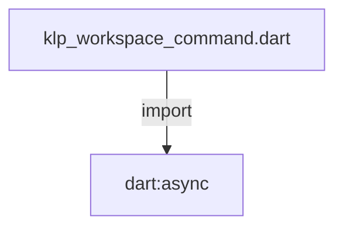
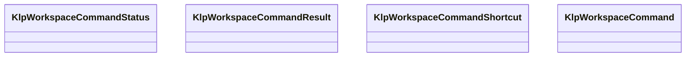

# klp_workspace_command.dart：直接依賴與宣告架構

[回到目錄](README.md) · [來源檔案](../../../../../../lib/src/features/workspace/components/klp_workspace_command.dart)

## 範圍

核心是 `lib/src/features/workspace/components/klp_workspace_command.dart`。主要視角為該檔案明寫的 import／export／part；輔助視角為本檔宣告及 extends／implements／with／on 關係。只展開一層外部邊界。

## 直接依賴圖

## 依賴證據

| 關係 | 原始 directive | 來源 |
|---|---|---|
| import | <code>import &#x27;dart:async&#x27;;</code> | [lib/src/features/workspace/components/klp_workspace_command.dart:1](../../../../../../lib/src/features/workspace/components/klp_workspace_command.dart#L1) |

## 宣告關係圖

本組節點是本檔宣告；沒有箭頭的宣告未在此圖主張互相依賴。

## 宣告與成員證據

成員包含 public 與 private；簽章取自來源，省略函式本體與欄位初始值。`(inferred)` 表示來源未明寫型別；建構子只顯示參數部分，不含初始化列表。

### KlpWorkspaceCommandStatus

EnumDeclaration · public · [lib/src/features/workspace/components/klp_workspace_command.dart:3](../../../../../../lib/src/features/workspace/components/klp_workspace_command.dart#L3)

<code>enum KlpWorkspaceCommandStatus</code>

| 成員 | 可見性 | 簽章／型別 | 來源註解摘要 | 證據 |
|---|---|---|---|---|
| enum value <code>completed</code> | public | <code>completed</code> |  | [lib/src/features/workspace/components/klp_workspace_command.dart:3](../../../../../../lib/src/features/workspace/components/klp_workspace_command.dart#L3) |
| enum value <code>canceled</code> | public | <code>canceled</code> |  | [lib/src/features/workspace/components/klp_workspace_command.dart:3](../../../../../../lib/src/features/workspace/components/klp_workspace_command.dart#L3) |
| enum value <code>failed</code> | public | <code>failed</code> |  | [lib/src/features/workspace/components/klp_workspace_command.dart:3](../../../../../../lib/src/features/workspace/components/klp_workspace_command.dart#L3) |

### KlpWorkspaceCommandResult

ClassDeclaration · public · [lib/src/features/workspace/components/klp_workspace_command.dart:5](../../../../../../lib/src/features/workspace/components/klp_workspace_command.dart#L5)

<code>final class KlpWorkspaceCommandResult</code>

來源註解摘要：呈現流程的結果；不宣稱產品已持久化。

| 成員 | 可見性 | 簽章／型別 | 來源註解摘要 | 證據 |
|---|---|---|---|---|
| field <code>status</code> | public | <code>final KlpWorkspaceCommandStatus status</code> |  | [lib/src/features/workspace/components/klp_workspace_command.dart:8](../../../../../../lib/src/features/workspace/components/klp_workspace_command.dart#L8) |
| field <code>error</code> | public | <code>final Object? error</code> |  | [lib/src/features/workspace/components/klp_workspace_command.dart:9](../../../../../../lib/src/features/workspace/components/klp_workspace_command.dart#L9) |
| field <code>stackTrace</code> | public | <code>final StackTrace? stackTrace</code> |  | [lib/src/features/workspace/components/klp_workspace_command.dart:10](../../../../../../lib/src/features/workspace/components/klp_workspace_command.dart#L10) |
| constructor <code>completed</code> | public | <code>const KlpWorkspaceCommandResult.completed()</code> |  | [lib/src/features/workspace/components/klp_workspace_command.dart:12](../../../../../../lib/src/features/workspace/components/klp_workspace_command.dart#L12) |
| constructor <code>canceled</code> | public | <code>const KlpWorkspaceCommandResult.canceled()</code> |  | [lib/src/features/workspace/components/klp_workspace_command.dart:13](../../../../../../lib/src/features/workspace/components/klp_workspace_command.dart#L13) |
| constructor <code>failed</code> | public | <code>const KlpWorkspaceCommandResult.failed(this.error, this.stackTrace)</code> |  | [lib/src/features/workspace/components/klp_workspace_command.dart:14](../../../../../../lib/src/features/workspace/components/klp_workspace_command.dart#L14) |

### KlpWorkspaceCommandShortcut

EnumDeclaration · public · [lib/src/features/workspace/components/klp_workspace_command.dart:17](../../../../../../lib/src/features/workspace/components/klp_workspace_command.dart#L17)

<code>enum KlpWorkspaceCommandShortcut</code>

來源註解摘要：可選快捷鍵語意；renderer 不從顯示文字推測命令用途。

| 成員 | 可見性 | 簽章／型別 | 來源註解摘要 | 證據 |
|---|---|---|---|---|
| enum value <code>rename</code> | public | <code>rename</code> |  | [lib/src/features/workspace/components/klp_workspace_command.dart:18](../../../../../../lib/src/features/workspace/components/klp_workspace_command.dart#L18) |
| enum value <code>delete</code> | public | <code>delete</code> |  | [lib/src/features/workspace/components/klp_workspace_command.dart:18](../../../../../../lib/src/features/workspace/components/klp_workspace_command.dart#L18) |

### KlpWorkspaceCommand

ClassDeclaration · public · [lib/src/features/workspace/components/klp_workspace_command.dart:20](../../../../../../lib/src/features/workspace/components/klp_workspace_command.dart#L20)

<code>final class KlpWorkspaceCommand</code>

來源註解摘要：工作區選單命令；互動流程由 Kallopis 呈現，資料變更仍由 consumer 執行。

| 成員 | 可見性 | 簽章／型別 | 來源註解摘要 | 證據 |
|---|---|---|---|---|
| field <code>label</code> | public | <code>final String label</code> |  | [lib/src/features/workspace/components/klp_workspace_command.dart:22](../../../../../../lib/src/features/workspace/components/klp_workspace_command.dart#L22) |
| field <code>enabled</code> | public | <code>final bool enabled</code> |  | [lib/src/features/workspace/components/klp_workspace_command.dart:23](../../../../../../lib/src/features/workspace/components/klp_workspace_command.dart#L23) |
| field <code>destructive</code> | public | <code>final bool destructive</code> |  | [lib/src/features/workspace/components/klp_workspace_command.dart:24](../../../../../../lib/src/features/workspace/components/klp_workspace_command.dart#L24) |
| field <code>inputLabel</code> | public | <code>final String? inputLabel</code> |  | [lib/src/features/workspace/components/klp_workspace_command.dart:25](../../../../../../lib/src/features/workspace/components/klp_workspace_command.dart#L25) |
| field <code>initialValue</code> | public | <code>final String? initialValue</code> |  | [lib/src/features/workspace/components/klp_workspace_command.dart:26](../../../../../../lib/src/features/workspace/components/klp_workspace_command.dart#L26) |
| field <code>confirmation</code> | public | <code>final String? confirmation</code> |  | [lib/src/features/workspace/components/klp_workspace_command.dart:27](../../../../../../lib/src/features/workspace/components/klp_workspace_command.dart#L27) |
| field <code>submitLabel</code> | public | <code>final String submitLabel</code> |  | [lib/src/features/workspace/components/klp_workspace_command.dart:28](../../../../../../lib/src/features/workspace/components/klp_workspace_command.dart#L28) |
| field <code>cancelLabel</code> | public | <code>final String cancelLabel</code> |  | [lib/src/features/workspace/components/klp_workspace_command.dart:29](../../../../../../lib/src/features/workspace/components/klp_workspace_command.dart#L29) |
| field <code>shortcut</code> | public | <code>final KlpWorkspaceCommandShortcut? shortcut</code> |  | [lib/src/features/workspace/components/klp_workspace_command.dart:30](../../../../../../lib/src/features/workspace/components/klp_workspace_command.dart#L30) |
| field <code>onInvoke</code> | public | <code>final FutureOr&lt;void&gt; Function(String?) onInvoke</code> |  | [lib/src/features/workspace/components/klp_workspace_command.dart:31](../../../../../../lib/src/features/workspace/components/klp_workspace_command.dart#L31) |
| field <code>onResult</code> | public | <code>final void Function(KlpWorkspaceCommandResult)? onResult</code> |  | [lib/src/features/workspace/components/klp_workspace_command.dart:32](../../../../../../lib/src/features/workspace/components/klp_workspace_command.dart#L32) |
| constructor <code>KlpWorkspaceCommand</code> | public | <code>KlpWorkspaceCommand({required this.label, this.enabled = true, this.destructive = false, this.inputLabel, this.initialValue, this.confirmation, this.submitLabel = &#x27;OK&#x27;, this.cancelLabel = &#x27;Cancel&#x27;, this.shortcut, required this.onInvoke, this.onResult})</code> |  | [lib/src/features/workspace/components/klp_workspace_command.dart:34](../../../../../../lib/src/features/workspace/components/klp_workspace_command.dart#L34) |

## 閱讀說明與限制

箭頭只表示來源明寫的靜態關係；import 不等於呼叫。未分析動態呼叫、欄位的實際物件擁有權、狀態轉移或渲染流程；型別未進行語意解析，繼承目標保留原始型別拼寫。public／private 依 Dart 名稱前綴判斷；public 宣告不代表已由 `lib/kallopis.dart` 匯出。

本頁由 `tool/architecture_atlas` 產生；編輯來源或生成工具後重新產生，避免手改本頁。
