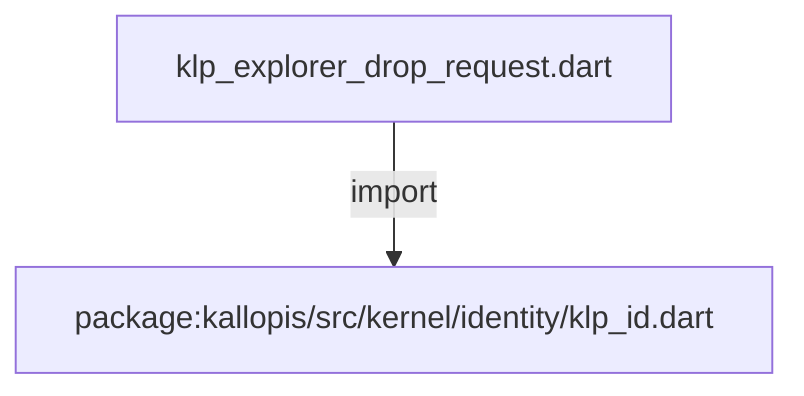
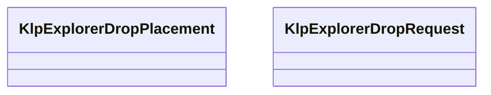

# klp_explorer_drop_request.dart：直接依賴與宣告架構

[回到目錄](README.md) · [來源檔案](../../../../../../../lib/src/features/workspace/explorer/contracts/klp_explorer_drop_request.dart)

## 範圍

核心是 `lib/src/features/workspace/explorer/contracts/klp_explorer_drop_request.dart`。主要視角為該檔案明寫的 import／export／part；輔助視角為本檔宣告及 extends／implements／with／on 關係。只展開一層外部邊界。

## 直接依賴圖

## 依賴證據

| 關係 | 原始 directive | 來源 |
|---|---|---|
| import | <code>import &#x27;package:kallopis/src/kernel/identity/klp_id.dart&#x27;;</code> | [lib/src/features/workspace/explorer/contracts/klp_explorer_drop_request.dart:1](../../../../../../../lib/src/features/workspace/explorer/contracts/klp_explorer_drop_request.dart#L1) |

## 宣告關係圖

本組節點是本檔宣告；沒有箭頭的宣告未在此圖主張互相依賴。

## 宣告與成員證據

成員包含 public 與 private；簽章取自來源，省略函式本體與欄位初始值。`(inferred)` 表示來源未明寫型別；建構子只顯示參數部分，不含初始化列表。

### KlpExplorerDropPlacement

EnumDeclaration · public · [lib/src/features/workspace/explorer/contracts/klp_explorer_drop_request.dart:3](../../../../../../../lib/src/features/workspace/explorer/contracts/klp_explorer_drop_request.dart#L3)

<code>enum KlpExplorerDropPlacement</code>

| 成員 | 可見性 | 簽章／型別 | 來源註解摘要 | 證據 |
|---|---|---|---|---|
| enum value <code>before</code> | public | <code>before</code> |  | [lib/src/features/workspace/explorer/contracts/klp_explorer_drop_request.dart:3](../../../../../../../lib/src/features/workspace/explorer/contracts/klp_explorer_drop_request.dart#L3) |
| enum value <code>inside</code> | public | <code>inside</code> |  | [lib/src/features/workspace/explorer/contracts/klp_explorer_drop_request.dart:3](../../../../../../../lib/src/features/workspace/explorer/contracts/klp_explorer_drop_request.dart#L3) |
| enum value <code>after</code> | public | <code>after</code> |  | [lib/src/features/workspace/explorer/contracts/klp_explorer_drop_request.dart:3](../../../../../../../lib/src/features/workspace/explorer/contracts/klp_explorer_drop_request.dart#L3) |

### KlpExplorerDropRequest

ClassDeclaration · public · [lib/src/features/workspace/explorer/contracts/klp_explorer_drop_request.dart:5](../../../../../../../lib/src/features/workspace/explorer/contracts/klp_explorer_drop_request.dart#L5)

<code>final class KlpExplorerDropRequest</code>

來源註解摘要：手勢的不可變語意資料，不決定移動、引用或持久化。

| 成員 | 可見性 | 簽章／型別 | 來源註解摘要 | 證據 |
|---|---|---|---|---|
| field <code>sourceIds</code> | public | <code>final Set&lt;KlpId&gt; sourceIds</code> |  | [lib/src/features/workspace/explorer/contracts/klp_explorer_drop_request.dart:8](../../../../../../../lib/src/features/workspace/explorer/contracts/klp_explorer_drop_request.dart#L8) |
| field <code>targetId</code> | public | <code>final KlpId targetId</code> |  | [lib/src/features/workspace/explorer/contracts/klp_explorer_drop_request.dart:9](../../../../../../../lib/src/features/workspace/explorer/contracts/klp_explorer_drop_request.dart#L9) |
| field <code>position</code> | public | <code>final KlpExplorerDropPlacement position</code> |  | [lib/src/features/workspace/explorer/contracts/klp_explorer_drop_request.dart:10](../../../../../../../lib/src/features/workspace/explorer/contracts/klp_explorer_drop_request.dart#L10) |
| constructor <code>KlpExplorerDropRequest</code> | public | <code>KlpExplorerDropRequest({required Set&lt;KlpId&gt; sourceIds, required this.targetId, required this.position})</code> |  | [lib/src/features/workspace/explorer/contracts/klp_explorer_drop_request.dart:12](../../../../../../../lib/src/features/workspace/explorer/contracts/klp_explorer_drop_request.dart#L12) |

### KlpExplorerDropPermission

GenericTypeAlias · public · [lib/src/features/workspace/explorer/contracts/klp_explorer_drop_request.dart:16](../../../../../../../lib/src/features/workspace/explorer/contracts/klp_explorer_drop_request.dart#L16)

<code>typedef KlpExplorerDropPermission = bool Function(KlpExplorerDropRequest request);</code>

## 閱讀說明與限制

箭頭只表示來源明寫的靜態關係；import 不等於呼叫。未分析動態呼叫、欄位的實際物件擁有權、狀態轉移或渲染流程；型別未進行語意解析，繼承目標保留原始型別拼寫。public／private 依 Dart 名稱前綴判斷；public 宣告不代表已由 `lib/kallopis.dart` 匯出。

本頁由 `tool/architecture_atlas` 產生；編輯來源或生成工具後重新產生，避免手改本頁。
