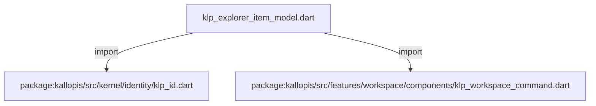
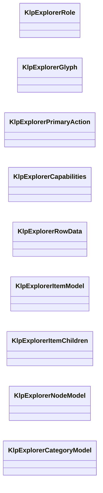
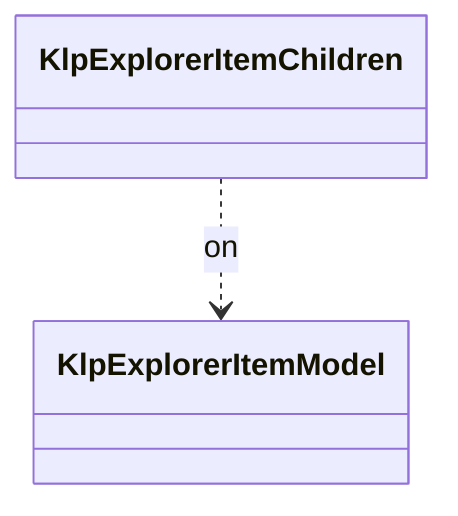
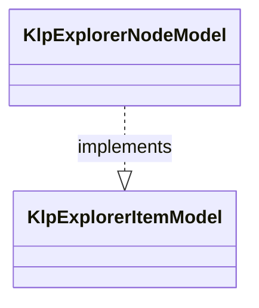
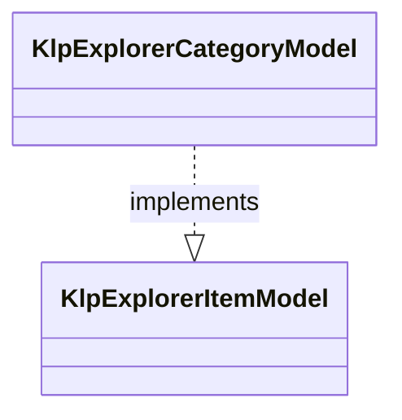

# klp_explorer_item_model.dart：直接依賴與宣告架構

[回到目錄](README.md) · [來源檔案](../../../../../../../lib/src/features/workspace/explorer/contracts/klp_explorer_item_model.dart)

## 範圍

核心是 `lib/src/features/workspace/explorer/contracts/klp_explorer_item_model.dart`。主要視角為該檔案明寫的 import／export／part；輔助視角為本檔宣告及 extends／implements／with／on 關係。只展開一層外部邊界。

## 直接依賴圖

## 依賴證據

| 關係 | 原始 directive | 來源 |
|---|---|---|
| import | <code>import &#x27;package:kallopis/src/kernel/identity/klp_id.dart&#x27;;</code> | [lib/src/features/workspace/explorer/contracts/klp_explorer_item_model.dart:1](../../../../../../../lib/src/features/workspace/explorer/contracts/klp_explorer_item_model.dart#L1) |
| import | <code>import &#x27;package:kallopis/src/features/workspace/components/klp_workspace_command.dart&#x27;;</code> | [lib/src/features/workspace/explorer/contracts/klp_explorer_item_model.dart:2](../../../../../../../lib/src/features/workspace/explorer/contracts/klp_explorer_item_model.dart#L2) |

## 宣告關係圖

本組節點是本檔宣告；沒有箭頭的宣告未在此圖主張互相依賴。

## 宣告與成員證據

成員包含 public 與 private；簽章取自來源，省略函式本體與欄位初始值。`(inferred)` 表示來源未明寫型別；建構子只顯示參數部分，不含初始化列表。

### KlpExplorerRole

EnumDeclaration · public · [lib/src/features/workspace/explorer/contracts/klp_explorer_item_model.dart:4](../../../../../../../lib/src/features/workspace/explorer/contracts/klp_explorer_item_model.dart#L4)

<code>enum KlpExplorerRole</code>

來源註解摘要：結構角色與產品種類分離；圖示不決定角色或互動能力。

| 成員 | 可見性 | 簽章／型別 | 來源註解摘要 | 證據 |
|---|---|---|---|---|
| enum value <code>category</code> | public | <code>category</code> |  | [lib/src/features/workspace/explorer/contracts/klp_explorer_item_model.dart:5](../../../../../../../lib/src/features/workspace/explorer/contracts/klp_explorer_item_model.dart#L5) |
| enum value <code>node</code> | public | <code>node</code> |  | [lib/src/features/workspace/explorer/contracts/klp_explorer_item_model.dart:5](../../../../../../../lib/src/features/workspace/explorer/contracts/klp_explorer_item_model.dart#L5) |

### KlpExplorerGlyph

EnumDeclaration · public · [lib/src/features/workspace/explorer/contracts/klp_explorer_item_model.dart:6](../../../../../../../lib/src/features/workspace/explorer/contracts/klp_explorer_item_model.dart#L6)

<code>enum KlpExplorerGlyph</code>

| 成員 | 可見性 | 簽章／型別 | 來源註解摘要 | 證據 |
|---|---|---|---|---|
| enum value <code>file</code> | public | <code>file</code> |  | [lib/src/features/workspace/explorer/contracts/klp_explorer_item_model.dart:6](../../../../../../../lib/src/features/workspace/explorer/contracts/klp_explorer_item_model.dart#L6) |
| enum value <code>folder</code> | public | <code>folder</code> |  | [lib/src/features/workspace/explorer/contracts/klp_explorer_item_model.dart:6](../../../../../../../lib/src/features/workspace/explorer/contracts/klp_explorer_item_model.dart#L6) |
| enum value <code>image</code> | public | <code>image</code> |  | [lib/src/features/workspace/explorer/contracts/klp_explorer_item_model.dart:6](../../../../../../../lib/src/features/workspace/explorer/contracts/klp_explorer_item_model.dart#L6) |
| enum value <code>music</code> | public | <code>music</code> |  | [lib/src/features/workspace/explorer/contracts/klp_explorer_item_model.dart:6](../../../../../../../lib/src/features/workspace/explorer/contracts/klp_explorer_item_model.dart#L6) |
| enum value <code>board</code> | public | <code>board</code> |  | [lib/src/features/workspace/explorer/contracts/klp_explorer_item_model.dart:6](../../../../../../../lib/src/features/workspace/explorer/contracts/klp_explorer_item_model.dart#L6) |

### KlpExplorerPrimaryAction

EnumDeclaration · public · [lib/src/features/workspace/explorer/contracts/klp_explorer_item_model.dart:7](../../../../../../../lib/src/features/workspace/explorer/contracts/klp_explorer_item_model.dart#L7)

<code>enum KlpExplorerPrimaryAction</code>

| 成員 | 可見性 | 簽章／型別 | 來源註解摘要 | 證據 |
|---|---|---|---|---|
| enum value <code>none</code> | public | <code>none</code> |  | [lib/src/features/workspace/explorer/contracts/klp_explorer_item_model.dart:7](../../../../../../../lib/src/features/workspace/explorer/contracts/klp_explorer_item_model.dart#L7) |
| enum value <code>activate</code> | public | <code>activate</code> |  | [lib/src/features/workspace/explorer/contracts/klp_explorer_item_model.dart:7](../../../../../../../lib/src/features/workspace/explorer/contracts/klp_explorer_item_model.dart#L7) |
| enum value <code>toggleExpansion</code> | public | <code>toggleExpansion</code> |  | [lib/src/features/workspace/explorer/contracts/klp_explorer_item_model.dart:7](../../../../../../../lib/src/features/workspace/explorer/contracts/klp_explorer_item_model.dart#L7) |

### KlpExplorerCapabilities

ClassDeclaration · public · [lib/src/features/workspace/explorer/contracts/klp_explorer_item_model.dart:9](../../../../../../../lib/src/features/workspace/explorer/contracts/klp_explorer_item_model.dart#L9)

<code>final class KlpExplorerCapabilities</code>

來源註解摘要：Consumer 只選擇既有能力，互動實現仍屬於 Kallopis。

| 成員 | 可見性 | 簽章／型別 | 來源註解摘要 | 證據 |
|---|---|---|---|---|
| field <code>selectable</code> | public | <code>final bool selectable</code> |  | [lib/src/features/workspace/explorer/contracts/klp_explorer_item_model.dart:12](../../../../../../../lib/src/features/workspace/explorer/contracts/klp_explorer_item_model.dart#L12) |
| field <code>collapsible</code> | public | <code>final bool collapsible</code> |  | [lib/src/features/workspace/explorer/contracts/klp_explorer_item_model.dart:13](../../../../../../../lib/src/features/workspace/explorer/contracts/klp_explorer_item_model.dart#L13) |
| field <code>draggable</code> | public | <code>final bool draggable</code> |  | [lib/src/features/workspace/explorer/contracts/klp_explorer_item_model.dart:14](../../../../../../../lib/src/features/workspace/explorer/contracts/klp_explorer_item_model.dart#L14) |
| field <code>primaryAction</code> | public | <code>final KlpExplorerPrimaryAction primaryAction</code> |  | [lib/src/features/workspace/explorer/contracts/klp_explorer_item_model.dart:15](../../../../../../../lib/src/features/workspace/explorer/contracts/klp_explorer_item_model.dart#L15) |
| constructor <code>KlpExplorerCapabilities</code> | public | <code>const KlpExplorerCapabilities({this.selectable = false, this.collapsible = false, this.draggable = false, this.primaryAction = KlpExplorerPrimaryAction.none})</code> |  | [lib/src/features/workspace/explorer/contracts/klp_explorer_item_model.dart:17](../../../../../../../lib/src/features/workspace/explorer/contracts/klp_explorer_item_model.dart#L17) |

### KlpExplorerRowData

ClassDeclaration · public · [lib/src/features/workspace/explorer/contracts/klp_explorer_item_model.dart:20](../../../../../../../lib/src/features/workspace/explorer/contracts/klp_explorer_item_model.dart#L20)

<code>final class KlpExplorerRowData</code>

來源註解摘要：固定列插槽的內容資料；兩種命令入口互不推導。

| 成員 | 可見性 | 簽章／型別 | 來源註解摘要 | 證據 |
|---|---|---|---|---|
| field <code>title</code> | public | <code>final String title</code> |  | [lib/src/features/workspace/explorer/contracts/klp_explorer_item_model.dart:23](../../../../../../../lib/src/features/workspace/explorer/contracts/klp_explorer_item_model.dart#L23) |
| field <code>icon</code> | public | <code>final KlpExplorerGlyph? icon</code> |  | [lib/src/features/workspace/explorer/contracts/klp_explorer_item_model.dart:24](../../../../../../../lib/src/features/workspace/explorer/contracts/klp_explorer_item_model.dart#L24) |
| field <code>badge</code> | public | <code>final String? badge</code> |  | [lib/src/features/workspace/explorer/contracts/klp_explorer_item_model.dart:25](../../../../../../../lib/src/features/workspace/explorer/contracts/klp_explorer_item_model.dart#L25) |
| field <code>inlineActions</code> | public | <code>final List&lt;KlpWorkspaceCommand&gt; inlineActions</code> |  | [lib/src/features/workspace/explorer/contracts/klp_explorer_item_model.dart:26](../../../../../../../lib/src/features/workspace/explorer/contracts/klp_explorer_item_model.dart#L26) |
| field <code>contextActions</code> | public | <code>final List&lt;KlpWorkspaceCommand&gt; contextActions</code> |  | [lib/src/features/workspace/explorer/contracts/klp_explorer_item_model.dart:27](../../../../../../../lib/src/features/workspace/explorer/contracts/klp_explorer_item_model.dart#L27) |
| constructor <code>KlpExplorerRowData</code> | public | <code>KlpExplorerRowData({required this.title, this.icon, this.badge, List&lt;KlpWorkspaceCommand&gt; inlineActions = const [], List&lt;KlpWorkspaceCommand&gt; contextActions = const []})</code> |  | [lib/src/features/workspace/explorer/contracts/klp_explorer_item_model.dart:29](../../../../../../../lib/src/features/workspace/explorer/contracts/klp_explorer_item_model.dart#L29) |

### KlpExplorerItemModel

ClassDeclaration · public · [lib/src/features/workspace/explorer/contracts/klp_explorer_item_model.dart:34](../../../../../../../lib/src/features/workspace/explorer/contracts/klp_explorer_item_model.dart#L34)

<code>abstract interface class KlpExplorerItemModel</code>

來源註解摘要：可由 consumer 實作的資料介面；不具有元件身分、Widget 或 renderer 插槽。

| 成員 | 可見性 | 簽章／型別 | 來源註解摘要 | 證據 |
|---|---|---|---|---|
| getter <code>id</code> | public | <code>KlpId get id</code> |  | [lib/src/features/workspace/explorer/contracts/klp_explorer_item_model.dart:37](../../../../../../../lib/src/features/workspace/explorer/contracts/klp_explorer_item_model.dart#L37) |
| getter <code>role</code> | public | <code>KlpExplorerRole get role</code> |  | [lib/src/features/workspace/explorer/contracts/klp_explorer_item_model.dart:38](../../../../../../../lib/src/features/workspace/explorer/contracts/klp_explorer_item_model.dart#L38) |
| getter <code>canHaveChildren</code> | public | <code>bool get canHaveChildren</code> |  | [lib/src/features/workspace/explorer/contracts/klp_explorer_item_model.dart:39](../../../../../../../lib/src/features/workspace/explorer/contracts/klp_explorer_item_model.dart#L39) |
| getter <code>row</code> | public | <code>KlpExplorerRowData get row</code> |  | [lib/src/features/workspace/explorer/contracts/klp_explorer_item_model.dart:40](../../../../../../../lib/src/features/workspace/explorer/contracts/klp_explorer_item_model.dart#L40) |
| getter <code>capabilities</code> | public | <code>KlpExplorerCapabilities get capabilities</code> |  | [lib/src/features/workspace/explorer/contracts/klp_explorer_item_model.dart:41](../../../../../../../lib/src/features/workspace/explorer/contracts/klp_explorer_item_model.dart#L41) |
| getter <code>children</code> | public | <code>List&lt;KlpExplorerItemModel&gt; get children</code> |  | [lib/src/features/workspace/explorer/contracts/klp_explorer_item_model.dart:42](../../../../../../../lib/src/features/workspace/explorer/contracts/klp_explorer_item_model.dart#L42) |

### KlpExplorerItemChildren

ExtensionDeclaration · public · [lib/src/features/workspace/explorer/contracts/klp_explorer_item_model.dart:45](../../../../../../../lib/src/features/workspace/explorer/contracts/klp_explorer_item_model.dart#L45)

<code>extension KlpExplorerItemChildren on KlpExplorerItemModel</code>

來源註解摘要：是否已有子項只由完整 children 推導，不作為另一份輸入。

- `on` → <code>KlpExplorerItemModel</code>：[lib/src/features/workspace/explorer/contracts/klp_explorer_item_model.dart:46](../../../../../../../lib/src/features/workspace/explorer/contracts/klp_explorer_item_model.dart#L46)

| 成員 | 可見性 | 簽章／型別 | 來源註解摘要 | 證據 |
|---|---|---|---|---|
| getter <code>hasChildren</code> | public | <code>bool get hasChildren</code> |  | [lib/src/features/workspace/explorer/contracts/klp_explorer_item_model.dart:48](../../../../../../../lib/src/features/workspace/explorer/contracts/klp_explorer_item_model.dart#L48) |

### KlpExplorerNodeModel

ClassDeclaration · public · [lib/src/features/workspace/explorer/contracts/klp_explorer_item_model.dart:51](../../../../../../../lib/src/features/workspace/explorer/contracts/klp_explorer_item_model.dart#L51)

<code>final class KlpExplorerNodeModel implements KlpExplorerItemModel</code>

來源註解摘要：通用節點資料；consumer 可用 method 固定特定產品種類的能力。

- `implements` → <code>KlpExplorerItemModel</code>：[lib/src/features/workspace/explorer/contracts/klp_explorer_item_model.dart:52](../../../../../../../lib/src/features/workspace/explorer/contracts/klp_explorer_item_model.dart#L52)

| 成員 | 可見性 | 簽章／型別 | 來源註解摘要 | 證據 |
|---|---|---|---|---|
| field <code>id</code> | public | <code>final KlpId id</code> |  | [lib/src/features/workspace/explorer/contracts/klp_explorer_item_model.dart:55](../../../../../../../lib/src/features/workspace/explorer/contracts/klp_explorer_item_model.dart#L55) |
| field <code>row</code> | public | <code>final KlpExplorerRowData row</code> |  | [lib/src/features/workspace/explorer/contracts/klp_explorer_item_model.dart:57](../../../../../../../lib/src/features/workspace/explorer/contracts/klp_explorer_item_model.dart#L57) |
| field <code>canHaveChildren</code> | public | <code>final bool canHaveChildren</code> |  | [lib/src/features/workspace/explorer/contracts/klp_explorer_item_model.dart:59](../../../../../../../lib/src/features/workspace/explorer/contracts/klp_explorer_item_model.dart#L59) |
| field <code>capabilities</code> | public | <code>final KlpExplorerCapabilities capabilities</code> |  | [lib/src/features/workspace/explorer/contracts/klp_explorer_item_model.dart:61](../../../../../../../lib/src/features/workspace/explorer/contracts/klp_explorer_item_model.dart#L61) |
| field <code>children</code> | public | <code>final List&lt;KlpExplorerItemModel&gt; children</code> |  | [lib/src/features/workspace/explorer/contracts/klp_explorer_item_model.dart:63](../../../../../../../lib/src/features/workspace/explorer/contracts/klp_explorer_item_model.dart#L63) |
| constructor <code>KlpExplorerNodeModel</code> | public | <code>KlpExplorerNodeModel({required this.id, required this.row, required this.canHaveChildren, this.capabilities = const KlpExplorerCapabilities(), List&lt;KlpExplorerItemModel&gt; children = const []})</code> |  | [lib/src/features/workspace/explorer/contracts/klp_explorer_item_model.dart:65](../../../../../../../lib/src/features/workspace/explorer/contracts/klp_explorer_item_model.dart#L65) |
| getter <code>role</code> | public | <code>KlpExplorerRole get role</code> |  | [lib/src/features/workspace/explorer/contracts/klp_explorer_item_model.dart:68](../../../../../../../lib/src/features/workspace/explorer/contracts/klp_explorer_item_model.dart#L68) |

### KlpExplorerCategoryModel

ClassDeclaration · public · [lib/src/features/workspace/explorer/contracts/klp_explorer_item_model.dart:72](../../../../../../../lib/src/features/workspace/explorer/contracts/klp_explorer_item_model.dart#L72)

<code>final class KlpExplorerCategoryModel implements KlpExplorerItemModel</code>

來源註解摘要：分類只提供結構角色，不暗自覆蓋 consumer 的選取或收合能力。

- `implements` → <code>KlpExplorerItemModel</code>：[lib/src/features/workspace/explorer/contracts/klp_explorer_item_model.dart:73](../../../../../../../lib/src/features/workspace/explorer/contracts/klp_explorer_item_model.dart#L73)

| 成員 | 可見性 | 簽章／型別 | 來源註解摘要 | 證據 |
|---|---|---|---|---|
| field <code>id</code> | public | <code>final KlpId id</code> |  | [lib/src/features/workspace/explorer/contracts/klp_explorer_item_model.dart:76](../../../../../../../lib/src/features/workspace/explorer/contracts/klp_explorer_item_model.dart#L76) |
| field <code>row</code> | public | <code>final KlpExplorerRowData row</code> |  | [lib/src/features/workspace/explorer/contracts/klp_explorer_item_model.dart:78](../../../../../../../lib/src/features/workspace/explorer/contracts/klp_explorer_item_model.dart#L78) |
| field <code>capabilities</code> | public | <code>final KlpExplorerCapabilities capabilities</code> |  | [lib/src/features/workspace/explorer/contracts/klp_explorer_item_model.dart:80](../../../../../../../lib/src/features/workspace/explorer/contracts/klp_explorer_item_model.dart#L80) |
| field <code>children</code> | public | <code>final List&lt;KlpExplorerItemModel&gt; children</code> |  | [lib/src/features/workspace/explorer/contracts/klp_explorer_item_model.dart:82](../../../../../../../lib/src/features/workspace/explorer/contracts/klp_explorer_item_model.dart#L82) |
| constructor <code>KlpExplorerCategoryModel</code> | public | <code>KlpExplorerCategoryModel({required this.id, required this.row, this.capabilities = const KlpExplorerCapabilities(), List&lt;KlpExplorerItemModel&gt; children = const []})</code> |  | [lib/src/features/workspace/explorer/contracts/klp_explorer_item_model.dart:84](../../../../../../../lib/src/features/workspace/explorer/contracts/klp_explorer_item_model.dart#L84) |
| getter <code>role</code> | public | <code>KlpExplorerRole get role</code> |  | [lib/src/features/workspace/explorer/contracts/klp_explorer_item_model.dart:87](../../../../../../../lib/src/features/workspace/explorer/contracts/klp_explorer_item_model.dart#L87) |
| getter <code>canHaveChildren</code> | public | <code>bool get canHaveChildren</code> |  | [lib/src/features/workspace/explorer/contracts/klp_explorer_item_model.dart:89](../../../../../../../lib/src/features/workspace/explorer/contracts/klp_explorer_item_model.dart#L89) |

## 閱讀說明與限制

箭頭只表示來源明寫的靜態關係；import 不等於呼叫。未分析動態呼叫、欄位的實際物件擁有權、狀態轉移或渲染流程；型別未進行語意解析，繼承目標保留原始型別拼寫。public／private 依 Dart 名稱前綴判斷；public 宣告不代表已由 `lib/kallopis.dart` 匯出。

本頁由 `tool/architecture_atlas` 產生；編輯來源或生成工具後重新產生，避免手改本頁。
