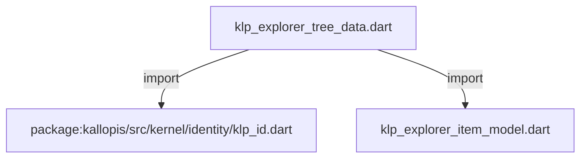

# klp_explorer_tree_data.dart：直接依賴與宣告架構

[回到目錄](README.md) · [來源檔案](../../../../../../../lib/src/features/workspace/explorer/contracts/klp_explorer_tree_data.dart)

## 範圍

核心是 `lib/src/features/workspace/explorer/contracts/klp_explorer_tree_data.dart`。主要視角為該檔案明寫的 import／export／part；輔助視角為本檔宣告及 extends／implements／with／on 關係。只展開一層外部邊界。

## 直接依賴圖

## 依賴證據

| 關係 | 原始 directive | 來源 |
|---|---|---|
| import | <code>import &#x27;package:kallopis/src/kernel/identity/klp_id.dart&#x27;;</code> | [lib/src/features/workspace/explorer/contracts/klp_explorer_tree_data.dart:1](../../../../../../../lib/src/features/workspace/explorer/contracts/klp_explorer_tree_data.dart#L1) |
| import | <code>import &#x27;klp_explorer_item_model.dart&#x27;;</code> | [lib/src/features/workspace/explorer/contracts/klp_explorer_tree_data.dart:2](../../../../../../../lib/src/features/workspace/explorer/contracts/klp_explorer_tree_data.dart#L2) |

## 宣告關係圖

本組節點是本檔宣告；沒有箭頭的宣告未在此圖主張互相依賴。

## 宣告與成員證據

成員包含 public 與 private；簽章取自來源，省略函式本體與欄位初始值。`(inferred)` 表示來源未明寫型別；建構子只顯示參數部分，不含初始化列表。

### KlpExplorerSelectionMode

EnumDeclaration · public · [lib/src/features/workspace/explorer/contracts/klp_explorer_tree_data.dart:4](../../../../../../../lib/src/features/workspace/explorer/contracts/klp_explorer_tree_data.dart#L4)

<code>enum KlpExplorerSelectionMode</code>

| 成員 | 可見性 | 簽章／型別 | 來源註解摘要 | 證據 |
|---|---|---|---|---|
| enum value <code>none</code> | public | <code>none</code> |  | [lib/src/features/workspace/explorer/contracts/klp_explorer_tree_data.dart:4](../../../../../../../lib/src/features/workspace/explorer/contracts/klp_explorer_tree_data.dart#L4) |
| enum value <code>single</code> | public | <code>single</code> |  | [lib/src/features/workspace/explorer/contracts/klp_explorer_tree_data.dart:4](../../../../../../../lib/src/features/workspace/explorer/contracts/klp_explorer_tree_data.dart#L4) |
| enum value <code>multiple</code> | public | <code>multiple</code> |  | [lib/src/features/workspace/explorer/contracts/klp_explorer_tree_data.dart:4](../../../../../../../lib/src/features/workspace/explorer/contracts/klp_explorer_tree_data.dart#L4) |

### KlpExplorerTreeData

ClassDeclaration · public · [lib/src/features/workspace/explorer/contracts/klp_explorer_tree_data.dart:6](../../../../../../../lib/src/features/workspace/explorer/contracts/klp_explorer_tree_data.dart#L6)

<code>final class KlpExplorerTreeData</code>

來源註解摘要：一棵完整樹及其受控展開狀態；捕捉時一併驗證。

| 成員 | 可見性 | 簽章／型別 | 來源註解摘要 | 證據 |
|---|---|---|---|---|
| field <code>id</code> | public | <code>final KlpId id</code> |  | [lib/src/features/workspace/explorer/contracts/klp_explorer_tree_data.dart:9](../../../../../../../lib/src/features/workspace/explorer/contracts/klp_explorer_tree_data.dart#L9) |
| field <code>items</code> | public | <code>final List&lt;KlpExplorerItemModel&gt; items</code> |  | [lib/src/features/workspace/explorer/contracts/klp_explorer_tree_data.dart:10](../../../../../../../lib/src/features/workspace/explorer/contracts/klp_explorer_tree_data.dart#L10) |
| field <code>expandedIds</code> | public | <code>final Set&lt;KlpId&gt; expandedIds</code> |  | [lib/src/features/workspace/explorer/contracts/klp_explorer_tree_data.dart:11](../../../../../../../lib/src/features/workspace/explorer/contracts/klp_explorer_tree_data.dart#L11) |
| constructor <code>KlpExplorerTreeData</code> | public | <code>KlpExplorerTreeData({required this.id, required List&lt;KlpExplorerItemModel&gt; items, Set&lt;KlpId&gt; expandedIds = const {}})</code> |  | [lib/src/features/workspace/explorer/contracts/klp_explorer_tree_data.dart:13](../../../../../../../lib/src/features/workspace/explorer/contracts/klp_explorer_tree_data.dart#L13) |

### KlpExplorerSelectionScope

ClassDeclaration · public · [lib/src/features/workspace/explorer/contracts/klp_explorer_tree_data.dart:18](../../../../../../../lib/src/features/workspace/explorer/contracts/klp_explorer_tree_data.dart#L18)

<code>final class KlpExplorerSelectionScope</code>

來源註解摘要：每棵樹恰屬一個範圍；treeIds 順序定義跨樹的可見順序。

| 成員 | 可見性 | 簽章／型別 | 來源註解摘要 | 證據 |
|---|---|---|---|---|
| field <code>id</code> | public | <code>final KlpId id</code> |  | [lib/src/features/workspace/explorer/contracts/klp_explorer_tree_data.dart:21](../../../../../../../lib/src/features/workspace/explorer/contracts/klp_explorer_tree_data.dart#L21) |
| field <code>treeIds</code> | public | <code>final List&lt;KlpId&gt; treeIds</code> |  | [lib/src/features/workspace/explorer/contracts/klp_explorer_tree_data.dart:22](../../../../../../../lib/src/features/workspace/explorer/contracts/klp_explorer_tree_data.dart#L22) |
| field <code>mode</code> | public | <code>final KlpExplorerSelectionMode mode</code> |  | [lib/src/features/workspace/explorer/contracts/klp_explorer_tree_data.dart:23](../../../../../../../lib/src/features/workspace/explorer/contracts/klp_explorer_tree_data.dart#L23) |
| field <code>selectedIds</code> | public | <code>final Set&lt;KlpId&gt; selectedIds</code> |  | [lib/src/features/workspace/explorer/contracts/klp_explorer_tree_data.dart:24](../../../../../../../lib/src/features/workspace/explorer/contracts/klp_explorer_tree_data.dart#L24) |
| field <code>anchorId</code> | public | <code>final KlpId? anchorId</code> |  | [lib/src/features/workspace/explorer/contracts/klp_explorer_tree_data.dart:25](../../../../../../../lib/src/features/workspace/explorer/contracts/klp_explorer_tree_data.dart#L25) |
| constructor <code>KlpExplorerSelectionScope</code> | public | <code>KlpExplorerSelectionScope({required this.id, required List&lt;KlpId&gt; treeIds, required this.mode, Set&lt;KlpId&gt; selectedIds = const {}, this.anchorId})</code> |  | [lib/src/features/workspace/explorer/contracts/klp_explorer_tree_data.dart:27](../../../../../../../lib/src/features/workspace/explorer/contracts/klp_explorer_tree_data.dart#L27) |

### KlpExplorerSelectionChange

ClassDeclaration · public · [lib/src/features/workspace/explorer/contracts/klp_explorer_tree_data.dart:32](../../../../../../../lib/src/features/workspace/explorer/contracts/klp_explorer_tree_data.dart#L32)

<code>final class KlpExplorerSelectionChange</code>

來源註解摘要：完整選取提案；consumer 同批更新集合與跨樹錨點。

| 成員 | 可見性 | 簽章／型別 | 來源註解摘要 | 證據 |
|---|---|---|---|---|
| field <code>scopeId</code> | public | <code>final KlpId scopeId</code> |  | [lib/src/features/workspace/explorer/contracts/klp_explorer_tree_data.dart:35](../../../../../../../lib/src/features/workspace/explorer/contracts/klp_explorer_tree_data.dart#L35) |
| field <code>selectedIds</code> | public | <code>final Set&lt;KlpId&gt; selectedIds</code> |  | [lib/src/features/workspace/explorer/contracts/klp_explorer_tree_data.dart:36](../../../../../../../lib/src/features/workspace/explorer/contracts/klp_explorer_tree_data.dart#L36) |
| field <code>anchorId</code> | public | <code>final KlpId? anchorId</code> |  | [lib/src/features/workspace/explorer/contracts/klp_explorer_tree_data.dart:37](../../../../../../../lib/src/features/workspace/explorer/contracts/klp_explorer_tree_data.dart#L37) |
| constructor <code>KlpExplorerSelectionChange</code> | public | <code>KlpExplorerSelectionChange({required this.scopeId, required Set&lt;KlpId&gt; selectedIds, required this.anchorId})</code> |  | [lib/src/features/workspace/explorer/contracts/klp_explorer_tree_data.dart:39](../../../../../../../lib/src/features/workspace/explorer/contracts/klp_explorer_tree_data.dart#L39) |

## 閱讀說明與限制

箭頭只表示來源明寫的靜態關係；import 不等於呼叫。未分析動態呼叫、欄位的實際物件擁有權、狀態轉移或渲染流程；型別未進行語意解析，繼承目標保留原始型別拼寫。public／private 依 Dart 名稱前綴判斷；public 宣告不代表已由 `lib/kallopis.dart` 匯出。

本頁由 `tool/architecture_atlas` 產生；編輯來源或生成工具後重新產生，避免手改本頁。
