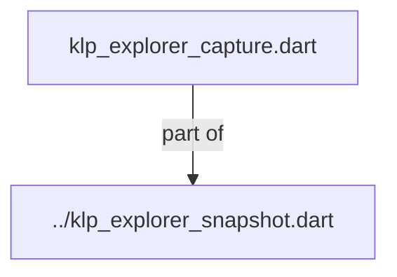
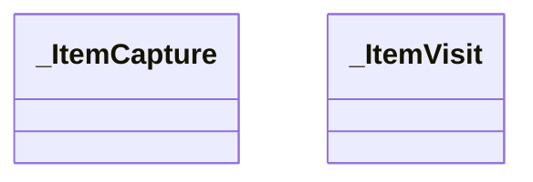

# klp_explorer_capture.dart：直接依賴與宣告架構

[回到目錄](README.md) · [來源檔案](../../../../../../../lib/src/features/workspace/explorer/internal/klp_explorer_capture.dart)

## 範圍

核心是 `lib/src/features/workspace/explorer/internal/klp_explorer_capture.dart`。主要視角為該檔案明寫的 import／export／part；輔助視角為本檔宣告及 extends／implements／with／on 關係。只展開一層外部邊界。

## 直接依賴圖

## 依賴證據

| 關係 | 原始 directive | 來源 |
|---|---|---|
| part of | <code>part of &#x27;../klp_explorer_snapshot.dart&#x27;;</code> | [lib/src/features/workspace/explorer/internal/klp_explorer_capture.dart:1](../../../../../../../lib/src/features/workspace/explorer/internal/klp_explorer_capture.dart#L1) |

## 宣告關係圖

本組節點是本檔宣告；沒有箭頭的宣告未在此圖主張互相依賴。

## 宣告與成員證據

成員包含 public 與 private；簽章取自來源，省略函式本體與欄位初始值。`(inferred)` 表示來源未明寫型別；建構子只顯示參數部分，不含初始化列表。

### _ItemCapture

ClassDeclaration · private · [lib/src/features/workspace/explorer/internal/klp_explorer_capture.dart:3](../../../../../../../lib/src/features/workspace/explorer/internal/klp_explorer_capture.dart#L3)

<code>final class _ItemCapture</code>

來源註解摘要：捕捉中的暫存只存在於本次呼叫，成功後轉成不可變紀錄。

| 成員 | 可見性 | 簽章／型別 | 來源註解摘要 | 證據 |
|---|---|---|---|---|
| field <code>id</code> | public | <code>final KlpId id</code> |  | [lib/src/features/workspace/explorer/internal/klp_explorer_capture.dart:6](../../../../../../../lib/src/features/workspace/explorer/internal/klp_explorer_capture.dart#L6) |
| field <code>role</code> | public | <code>final KlpExplorerRole role</code> |  | [lib/src/features/workspace/explorer/internal/klp_explorer_capture.dart:7](../../../../../../../lib/src/features/workspace/explorer/internal/klp_explorer_capture.dart#L7) |
| field <code>canHaveChildren</code> | public | <code>final bool canHaveChildren</code> |  | [lib/src/features/workspace/explorer/internal/klp_explorer_capture.dart:8](../../../../../../../lib/src/features/workspace/explorer/internal/klp_explorer_capture.dart#L8) |
| field <code>row</code> | public | <code>final KlpExplorerRowData row</code> |  | [lib/src/features/workspace/explorer/internal/klp_explorer_capture.dart:9](../../../../../../../lib/src/features/workspace/explorer/internal/klp_explorer_capture.dart#L9) |
| field <code>capabilities</code> | public | <code>final KlpExplorerCapabilities capabilities</code> |  | [lib/src/features/workspace/explorer/internal/klp_explorer_capture.dart:10](../../../../../../../lib/src/features/workspace/explorer/internal/klp_explorer_capture.dart#L10) |
| field <code>parentId</code> | public | <code>final KlpId? parentId</code> |  | [lib/src/features/workspace/explorer/internal/klp_explorer_capture.dart:11](../../../../../../../lib/src/features/workspace/explorer/internal/klp_explorer_capture.dart#L11) |
| field <code>treeId</code> | public | <code>final KlpId treeId</code> |  | [lib/src/features/workspace/explorer/internal/klp_explorer_capture.dart:12](../../../../../../../lib/src/features/workspace/explorer/internal/klp_explorer_capture.dart#L12) |
| field <code>childIds</code> | public | <code>final List&lt;KlpId&gt; childIds</code> |  | [lib/src/features/workspace/explorer/internal/klp_explorer_capture.dart:13](../../../../../../../lib/src/features/workspace/explorer/internal/klp_explorer_capture.dart#L13) |
| constructor <code>_ItemCapture</code> | private | <code>_ItemCapture({required this.id, required this.role, required this.canHaveChildren, required this.row, required this.capabilities, required this.parentId, required this.treeId})</code> |  | [lib/src/features/workspace/explorer/internal/klp_explorer_capture.dart:15](../../../../../../../lib/src/features/workspace/explorer/internal/klp_explorer_capture.dart#L15) |
| method <code>freeze</code> | public | <code>KlpExplorerItemSnapshot freeze()</code> |  | [lib/src/features/workspace/explorer/internal/klp_explorer_capture.dart:17](../../../../../../../lib/src/features/workspace/explorer/internal/klp_explorer_capture.dart#L17) |

### _ItemVisit

ClassDeclaration · private · [lib/src/features/workspace/explorer/internal/klp_explorer_capture.dart:29](../../../../../../../lib/src/features/workspace/explorer/internal/klp_explorer_capture.dart#L29)

<code>final class _ItemVisit</code>

來源註解摘要：顯式進出堆疊可辨識物件循環，且不以遞迴呼叫深度限制產品階層。

| 成員 | 可見性 | 簽章／型別 | 來源註解摘要 | 證據 |
|---|---|---|---|---|
| field <code>source</code> | public | <code>final KlpExplorerItemModel source</code> |  | [lib/src/features/workspace/explorer/internal/klp_explorer_capture.dart:32](../../../../../../../lib/src/features/workspace/explorer/internal/klp_explorer_capture.dart#L32) |
| field <code>parent</code> | public | <code>final _ItemCapture? parent</code> |  | [lib/src/features/workspace/explorer/internal/klp_explorer_capture.dart:33](../../../../../../../lib/src/features/workspace/explorer/internal/klp_explorer_capture.dart#L33) |
| field <code>exiting</code> | public | <code>final bool exiting</code> |  | [lib/src/features/workspace/explorer/internal/klp_explorer_capture.dart:34](../../../../../../../lib/src/features/workspace/explorer/internal/klp_explorer_capture.dart#L34) |
| constructor <code>_ItemVisit</code> | private | <code>const _ItemVisit(this.source, this.parent, {this.exiting = false})</code> |  | [lib/src/features/workspace/explorer/internal/klp_explorer_capture.dart:36](../../../../../../../lib/src/features/workspace/explorer/internal/klp_explorer_capture.dart#L36) |

### _captureExplorer

FunctionDeclaration · private · [lib/src/features/workspace/explorer/internal/klp_explorer_capture.dart:39](../../../../../../../lib/src/features/workspace/explorer/internal/klp_explorer_capture.dart#L39)

<code>KlpExplorerSnapshot _captureExplorer(List&lt;KlpExplorerTreeData&gt; treeInput, List&lt;KlpExplorerSelectionScope&gt; scopeInput)</code>

## 閱讀說明與限制

箭頭只表示來源明寫的靜態關係；import 不等於呼叫。未分析動態呼叫、欄位的實際物件擁有權、狀態轉移或渲染流程；型別未進行語意解析，繼承目標保留原始型別拼寫。public／private 依 Dart 名稱前綴判斷；public 宣告不代表已由 `lib/kallopis.dart` 匯出。

本頁由 `tool/architecture_atlas` 產生；編輯來源或生成工具後重新產生，避免手改本頁。
