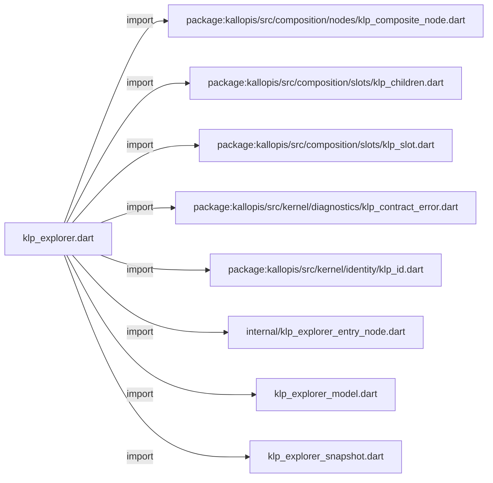
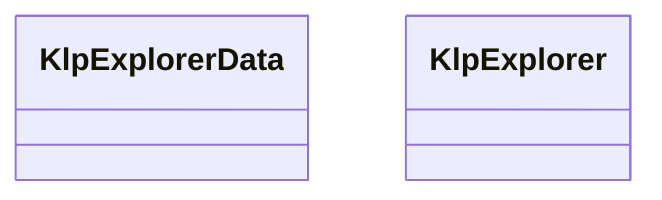
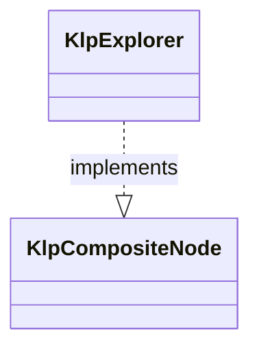

# klp_explorer.dart：直接依賴與宣告架構

[回到目錄](README.md) · [來源檔案](../../../../../../lib/src/features/workspace/explorer/klp_explorer.dart)

## 範圍

核心是 `lib/src/features/workspace/explorer/klp_explorer.dart`。主要視角為該檔案明寫的 import／export／part；輔助視角為本檔宣告及 extends／implements／with／on 關係。只展開一層外部邊界。

## 直接依賴圖

## 依賴證據

| 關係 | 原始 directive | 來源 |
|---|---|---|
| import | <code>import &#x27;package:kallopis/src/composition/nodes/klp_composite_node.dart&#x27;;</code> | [lib/src/features/workspace/explorer/klp_explorer.dart:1](../../../../../../lib/src/features/workspace/explorer/klp_explorer.dart#L1) |
| import | <code>import &#x27;package:kallopis/src/composition/slots/klp_children.dart&#x27;;</code> | [lib/src/features/workspace/explorer/klp_explorer.dart:2](../../../../../../lib/src/features/workspace/explorer/klp_explorer.dart#L2) |
| import | <code>import &#x27;package:kallopis/src/composition/slots/klp_slot.dart&#x27;;</code> | [lib/src/features/workspace/explorer/klp_explorer.dart:3](../../../../../../lib/src/features/workspace/explorer/klp_explorer.dart#L3) |
| import | <code>import &#x27;package:kallopis/src/kernel/diagnostics/klp_contract_error.dart&#x27;;</code> | [lib/src/features/workspace/explorer/klp_explorer.dart:4](../../../../../../lib/src/features/workspace/explorer/klp_explorer.dart#L4) |
| import | <code>import &#x27;package:kallopis/src/kernel/identity/klp_id.dart&#x27;;</code> | [lib/src/features/workspace/explorer/klp_explorer.dart:5](../../../../../../lib/src/features/workspace/explorer/klp_explorer.dart#L5) |
| import | <code>import &#x27;internal/klp_explorer_entry_node.dart&#x27;;</code> | [lib/src/features/workspace/explorer/klp_explorer.dart:6](../../../../../../lib/src/features/workspace/explorer/klp_explorer.dart#L6) |
| import | <code>import &#x27;klp_explorer_model.dart&#x27;;</code> | [lib/src/features/workspace/explorer/klp_explorer.dart:7](../../../../../../lib/src/features/workspace/explorer/klp_explorer.dart#L7) |
| import | <code>import &#x27;klp_explorer_snapshot.dart&#x27;;</code> | [lib/src/features/workspace/explorer/klp_explorer.dart:8](../../../../../../lib/src/features/workspace/explorer/klp_explorer.dart#L8) |

## 宣告關係圖

本組節點是本檔宣告；沒有箭頭的宣告未在此圖主張互相依賴。

## 宣告與成員證據

成員包含 public 與 private；簽章取自來源，省略函式本體與欄位初始值。`(inferred)` 表示來源未明寫型別；建構子只顯示參數部分，不含初始化列表。

### KlpExplorerData

ClassDeclaration · public · [lib/src/features/workspace/explorer/klp_explorer.dart:10](../../../../../../lib/src/features/workspace/explorer/klp_explorer.dart#L10)

<code>final class KlpExplorerData</code>

來源註解摘要：同一森林的完整宣告；首次 capture 固定內容，更新須建立新宣告。

| 成員 | 可見性 | 簽章／型別 | 來源註解摘要 | 證據 |
|---|---|---|---|---|
| field <code>trees</code> | public | <code>final List&lt;KlpExplorerTreeData&gt; trees</code> |  | [lib/src/features/workspace/explorer/klp_explorer.dart:13](../../../../../../lib/src/features/workspace/explorer/klp_explorer.dart#L13) |
| field <code>selectionScopes</code> | public | <code>final List&lt;KlpExplorerSelectionScope&gt; selectionScopes</code> |  | [lib/src/features/workspace/explorer/klp_explorer.dart:14](../../../../../../lib/src/features/workspace/explorer/klp_explorer.dart#L14) |
| field <code>snapshot</code> | public | <code>late final KlpExplorerSnapshot snapshot</code> |  | [lib/src/features/workspace/explorer/klp_explorer.dart:15](../../../../../../lib/src/features/workspace/explorer/klp_explorer.dart#L15) |
| constructor <code>KlpExplorerData</code> | public | <code>KlpExplorerData({required List&lt;KlpExplorerTreeData&gt; trees, required List&lt;KlpExplorerSelectionScope&gt; selectionScopes})</code> |  | [lib/src/features/workspace/explorer/klp_explorer.dart:17](../../../../../../lib/src/features/workspace/explorer/klp_explorer.dart#L17) |

### KlpExplorer

ClassDeclaration · public · [lib/src/features/workspace/explorer/klp_explorer.dart:22](../../../../../../lib/src/features/workspace/explorer/klp_explorer.dart#L22)

<code>final class KlpExplorer implements KlpCompositeNode</code>

來源註解摘要：封閉的樹呈現入口；consumer 只提供資料及語意事件。

- `implements` → <code>KlpCompositeNode</code>：[lib/src/features/workspace/explorer/klp_explorer.dart:23](../../../../../../lib/src/features/workspace/explorer/klp_explorer.dart#L23)

| 成員 | 可見性 | 簽章／型別 | 來源註解摘要 | 證據 |
|---|---|---|---|---|
| field <code>typeId</code> | public | <code>static const (inferred) typeId</code> |  | [lib/src/features/workspace/explorer/klp_explorer.dart:25](../../../../../../lib/src/features/workspace/explorer/klp_explorer.dart#L25) |
| field <code>itemSlot</code> | public | <code>static final (inferred) itemSlot</code> |  | [lib/src/features/workspace/explorer/klp_explorer.dart:26](../../../../../../lib/src/features/workspace/explorer/klp_explorer.dart#L26) |
| field <code>id</code> | public | <code>final KlpId id</code> |  | [lib/src/features/workspace/explorer/klp_explorer.dart:28](../../../../../../lib/src/features/workspace/explorer/klp_explorer.dart#L28) |
| field <code>data</code> | public | <code>final KlpExplorerData data</code> |  | [lib/src/features/workspace/explorer/klp_explorer.dart:29](../../../../../../lib/src/features/workspace/explorer/klp_explorer.dart#L29) |
| field <code>actionsLabel</code> | public | <code>final String actionsLabel</code> |  | [lib/src/features/workspace/explorer/klp_explorer.dart:30](../../../../../../lib/src/features/workspace/explorer/klp_explorer.dart#L30) |
| field <code>expandLabel</code> | public | <code>final String expandLabel</code> |  | [lib/src/features/workspace/explorer/klp_explorer.dart:30](../../../../../../lib/src/features/workspace/explorer/klp_explorer.dart#L30) |
| field <code>collapseLabel</code> | public | <code>final String collapseLabel</code> |  | [lib/src/features/workspace/explorer/klp_explorer.dart:30](../../../../../../lib/src/features/workspace/explorer/klp_explorer.dart#L30) |
| field <code>onSelectionChanged</code> | public | <code>final void Function(KlpExplorerSelectionChange)? onSelectionChanged</code> |  | [lib/src/features/workspace/explorer/klp_explorer.dart:31](../../../../../../lib/src/features/workspace/explorer/klp_explorer.dart#L31) |
| field <code>onActivate</code> | public | <code>final void Function(KlpId)? onActivate</code> |  | [lib/src/features/workspace/explorer/klp_explorer.dart:32](../../../../../../lib/src/features/workspace/explorer/klp_explorer.dart#L32) |
| field <code>onExpandedChanged</code> | public | <code>final void Function(KlpId, bool)? onExpandedChanged</code> |  | [lib/src/features/workspace/explorer/klp_explorer.dart:33](../../../../../../lib/src/features/workspace/explorer/klp_explorer.dart#L33) |
| field <code>canDrop</code> | public | <code>final KlpExplorerDropPermission? canDrop</code> |  | [lib/src/features/workspace/explorer/klp_explorer.dart:34](../../../../../../lib/src/features/workspace/explorer/klp_explorer.dart#L34) |
| field <code>onDrop</code> | public | <code>final void Function(KlpExplorerDropRequest)? onDrop</code> |  | [lib/src/features/workspace/explorer/klp_explorer.dart:35](../../../../../../lib/src/features/workspace/explorer/klp_explorer.dart#L35) |
| field <code>children</code> | public | <code>late final KlpChildren children</code> |  | [lib/src/features/workspace/explorer/klp_explorer.dart:37](../../../../../../lib/src/features/workspace/explorer/klp_explorer.dart#L37) |
| constructor <code>KlpExplorer</code> | public | <code>KlpExplorer({required this.id, required this.data, this.actionsLabel = &#x27;Actions&#x27;, this.expandLabel = &#x27;Expand&#x27;, this.collapseLabel = &#x27;Collapse&#x27;, this.onSelectionChanged, this.onActivate, this.onExpandedChanged, this.canDrop, this.onDrop})</code> |  | [lib/src/features/workspace/explorer/klp_explorer.dart:39](../../../../../../lib/src/features/workspace/explorer/klp_explorer.dart#L39) |
| getter <code>definitionId</code> | public | <code>String get definitionId</code> |  | [lib/src/features/workspace/explorer/klp_explorer.dart:41](../../../../../../lib/src/features/workspace/explorer/klp_explorer.dart#L41) |
| method <code>_captureChildren</code> | private | <code>KlpChildren _captureChildren()</code> |  | [lib/src/features/workspace/explorer/klp_explorer.dart:44](../../../../../../lib/src/features/workspace/explorer/klp_explorer.dart#L44) |

## 閱讀說明與限制

箭頭只表示來源明寫的靜態關係；import 不等於呼叫。未分析動態呼叫、欄位的實際物件擁有權、狀態轉移或渲染流程；型別未進行語意解析，繼承目標保留原始型別拼寫。public／private 依 Dart 名稱前綴判斷；public 宣告不代表已由 `lib/kallopis.dart` 匯出。

本頁由 `tool/architecture_atlas` 產生；編輯來源或生成工具後重新產生，避免手改本頁。
