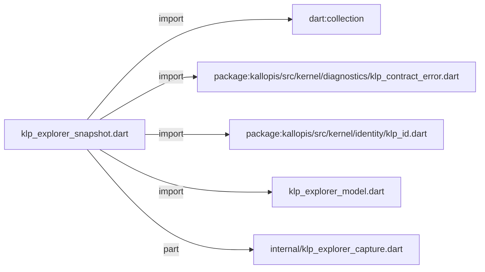
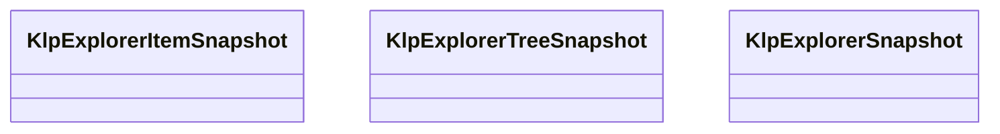

# klp_explorer_snapshot.dart：直接依賴與宣告架構

[回到目錄](README.md) · [來源檔案](../../../../../../lib/src/features/workspace/explorer/klp_explorer_snapshot.dart)

## 範圍

核心是 `lib/src/features/workspace/explorer/klp_explorer_snapshot.dart`。主要視角為該檔案明寫的 import／export／part；輔助視角為本檔宣告及 extends／implements／with／on 關係。只展開一層外部邊界。

## 直接依賴圖

## 依賴證據

| 關係 | 原始 directive | 來源 |
|---|---|---|
| import | <code>import &#x27;dart:collection&#x27;;</code> | [lib/src/features/workspace/explorer/klp_explorer_snapshot.dart:1](../../../../../../lib/src/features/workspace/explorer/klp_explorer_snapshot.dart#L1) |
| import | <code>import &#x27;package:kallopis/src/kernel/diagnostics/klp_contract_error.dart&#x27;;</code> | [lib/src/features/workspace/explorer/klp_explorer_snapshot.dart:3](../../../../../../lib/src/features/workspace/explorer/klp_explorer_snapshot.dart#L3) |
| import | <code>import &#x27;package:kallopis/src/kernel/identity/klp_id.dart&#x27;;</code> | [lib/src/features/workspace/explorer/klp_explorer_snapshot.dart:4](../../../../../../lib/src/features/workspace/explorer/klp_explorer_snapshot.dart#L4) |
| import | <code>import &#x27;klp_explorer_model.dart&#x27;;</code> | [lib/src/features/workspace/explorer/klp_explorer_snapshot.dart:5](../../../../../../lib/src/features/workspace/explorer/klp_explorer_snapshot.dart#L5) |
| part | <code>part &#x27;internal/klp_explorer_capture.dart&#x27;;</code> | [lib/src/features/workspace/explorer/klp_explorer_snapshot.dart:7](../../../../../../lib/src/features/workspace/explorer/klp_explorer_snapshot.dart#L7) |

## 宣告關係圖

本組節點是本檔宣告；沒有箭頭的宣告未在此圖主張互相依賴。

## 宣告與成員證據

成員包含 public 與 private；簽章取自來源，省略函式本體與欄位初始值。`(inferred)` 表示來源未明寫型別；建構子只顯示參數部分，不含初始化列表。

### KlpExplorerItemSnapshot

ClassDeclaration · public · [lib/src/features/workspace/explorer/klp_explorer_snapshot.dart:9](../../../../../../lib/src/features/workspace/explorer/klp_explorer_snapshot.dart#L9)

<code>final class KlpExplorerItemSnapshot</code>

來源註解摘要：已驗證的單一出現位置；不持有 consumer 的可變 item 實例。

| 成員 | 可見性 | 簽章／型別 | 來源註解摘要 | 證據 |
|---|---|---|---|---|
| field <code>id</code> | public | <code>final KlpId id</code> |  | [lib/src/features/workspace/explorer/klp_explorer_snapshot.dart:12](../../../../../../lib/src/features/workspace/explorer/klp_explorer_snapshot.dart#L12) |
| field <code>role</code> | public | <code>final KlpExplorerRole role</code> |  | [lib/src/features/workspace/explorer/klp_explorer_snapshot.dart:13](../../../../../../lib/src/features/workspace/explorer/klp_explorer_snapshot.dart#L13) |
| field <code>canHaveChildren</code> | public | <code>final bool canHaveChildren</code> |  | [lib/src/features/workspace/explorer/klp_explorer_snapshot.dart:14](../../../../../../lib/src/features/workspace/explorer/klp_explorer_snapshot.dart#L14) |
| field <code>row</code> | public | <code>final KlpExplorerRowData row</code> |  | [lib/src/features/workspace/explorer/klp_explorer_snapshot.dart:15](../../../../../../lib/src/features/workspace/explorer/klp_explorer_snapshot.dart#L15) |
| field <code>capabilities</code> | public | <code>final KlpExplorerCapabilities capabilities</code> |  | [lib/src/features/workspace/explorer/klp_explorer_snapshot.dart:16](../../../../../../lib/src/features/workspace/explorer/klp_explorer_snapshot.dart#L16) |
| field <code>parentId</code> | public | <code>final KlpId? parentId</code> |  | [lib/src/features/workspace/explorer/klp_explorer_snapshot.dart:17](../../../../../../lib/src/features/workspace/explorer/klp_explorer_snapshot.dart#L17) |
| field <code>treeId</code> | public | <code>final KlpId treeId</code> |  | [lib/src/features/workspace/explorer/klp_explorer_snapshot.dart:18](../../../../../../lib/src/features/workspace/explorer/klp_explorer_snapshot.dart#L18) |
| field <code>childIds</code> | public | <code>final List&lt;KlpId&gt; childIds</code> |  | [lib/src/features/workspace/explorer/klp_explorer_snapshot.dart:19](../../../../../../lib/src/features/workspace/explorer/klp_explorer_snapshot.dart#L19) |
| constructor <code>_</code> | private | <code>KlpExplorerItemSnapshot._({required this.id, required this.role, required this.canHaveChildren, required this.row, required this.capabilities, required this.parentId, required this.treeId, required List&lt;KlpId&gt; childIds})</code> |  | [lib/src/features/workspace/explorer/klp_explorer_snapshot.dart:21](../../../../../../lib/src/features/workspace/explorer/klp_explorer_snapshot.dart#L21) |
| getter <code>hasChildren</code> | public | <code>bool get hasChildren</code> |  | [lib/src/features/workspace/explorer/klp_explorer_snapshot.dart:24](../../../../../../lib/src/features/workspace/explorer/klp_explorer_snapshot.dart#L24) |

### KlpExplorerTreeSnapshot

ClassDeclaration · public · [lib/src/features/workspace/explorer/klp_explorer_snapshot.dart:27](../../../../../../lib/src/features/workspace/explorer/klp_explorer_snapshot.dart#L27)

<code>final class KlpExplorerTreeSnapshot</code>

來源註解摘要：根順序、展開集合與可見順序均來自同一次完整驗證。

| 成員 | 可見性 | 簽章／型別 | 來源註解摘要 | 證據 |
|---|---|---|---|---|
| field <code>id</code> | public | <code>final KlpId id</code> |  | [lib/src/features/workspace/explorer/klp_explorer_snapshot.dart:30](../../../../../../lib/src/features/workspace/explorer/klp_explorer_snapshot.dart#L30) |
| field <code>rootIds</code> | public | <code>final List&lt;KlpId&gt; rootIds</code> |  | [lib/src/features/workspace/explorer/klp_explorer_snapshot.dart:31](../../../../../../lib/src/features/workspace/explorer/klp_explorer_snapshot.dart#L31) |
| field <code>expandedIds</code> | public | <code>final Set&lt;KlpId&gt; expandedIds</code> |  | [lib/src/features/workspace/explorer/klp_explorer_snapshot.dart:32](../../../../../../lib/src/features/workspace/explorer/klp_explorer_snapshot.dart#L32) |
| field <code>visibleIds</code> | public | <code>final List&lt;KlpId&gt; visibleIds</code> |  | [lib/src/features/workspace/explorer/klp_explorer_snapshot.dart:33](../../../../../../lib/src/features/workspace/explorer/klp_explorer_snapshot.dart#L33) |
| constructor <code>_</code> | private | <code>KlpExplorerTreeSnapshot._({required this.id, required List&lt;KlpId&gt; rootIds, required Set&lt;KlpId&gt; expandedIds, required List&lt;KlpId&gt; visibleIds})</code> |  | [lib/src/features/workspace/explorer/klp_explorer_snapshot.dart:35](../../../../../../lib/src/features/workspace/explorer/klp_explorer_snapshot.dart#L35) |

### KlpExplorerSnapshot

ClassDeclaration · public · [lib/src/features/workspace/explorer/klp_explorer_snapshot.dart:41](../../../../../../lib/src/features/workspace/explorer/klp_explorer_snapshot.dart#L41)

<code>final class KlpExplorerSnapshot</code>

來源註解摘要：全量驗證邊界；失敗時不回傳局部樹，也不維護另一份已提交狀態。

| 成員 | 可見性 | 簽章／型別 | 來源註解摘要 | 證據 |
|---|---|---|---|---|
| field <code>items</code> | public | <code>final Map&lt;KlpId, KlpExplorerItemSnapshot&gt; items</code> |  | [lib/src/features/workspace/explorer/klp_explorer_snapshot.dart:44](../../../../../../lib/src/features/workspace/explorer/klp_explorer_snapshot.dart#L44) |
| field <code>trees</code> | public | <code>final Map&lt;KlpId, KlpExplorerTreeSnapshot&gt; trees</code> |  | [lib/src/features/workspace/explorer/klp_explorer_snapshot.dart:45](../../../../../../lib/src/features/workspace/explorer/klp_explorer_snapshot.dart#L45) |
| field <code>selectionScopes</code> | public | <code>final Map&lt;KlpId, KlpExplorerSelectionScope&gt; selectionScopes</code> |  | [lib/src/features/workspace/explorer/klp_explorer_snapshot.dart:46](../../../../../../lib/src/features/workspace/explorer/klp_explorer_snapshot.dart#L46) |
| field <code>scopeByTree</code> | public | <code>final Map&lt;KlpId, KlpId&gt; scopeByTree</code> |  | [lib/src/features/workspace/explorer/klp_explorer_snapshot.dart:47](../../../../../../lib/src/features/workspace/explorer/klp_explorer_snapshot.dart#L47) |
| constructor <code>_</code> | private | <code>KlpExplorerSnapshot._({required Map&lt;KlpId, KlpExplorerItemSnapshot&gt; items, required Map&lt;KlpId, KlpExplorerTreeSnapshot&gt; trees, required Map&lt;KlpId, KlpExplorerSelectionScope&gt; selectionScopes, required Map&lt;KlpId, KlpId&gt; scopeByTree})</code> |  | [lib/src/features/workspace/explorer/klp_explorer_snapshot.dart:49](../../../../../../lib/src/features/workspace/explorer/klp_explorer_snapshot.dart#L49) |
| constructor <code>capture</code> | public | <code>factory KlpExplorerSnapshot.capture({required List&lt;KlpExplorerTreeData&gt; trees, required List&lt;KlpExplorerSelectionScope&gt; selectionScopes})</code> |  | [lib/src/features/workspace/explorer/klp_explorer_snapshot.dart:55](../../../../../../lib/src/features/workspace/explorer/klp_explorer_snapshot.dart#L55) |
| method <code>visibleIdsForScope</code> | public | <code>List&lt;KlpId&gt; visibleIdsForScope(KlpId scopeId)</code> |  | [lib/src/features/workspace/explorer/klp_explorer_snapshot.dart:57](../../../../../../lib/src/features/workspace/explorer/klp_explorer_snapshot.dart#L57) |
| method <code>selectableIdsForScope</code> | public | <code>List&lt;KlpId&gt; selectableIdsForScope(KlpId scopeId)</code> |  | [lib/src/features/workspace/explorer/klp_explorer_snapshot.dart:66](../../../../../../lib/src/features/workspace/explorer/klp_explorer_snapshot.dart#L66) |
| method <code>permitsDrop</code> | public | <code>bool permitsDrop(KlpExplorerDropRequest request, {KlpExplorerDropPermission? permission})</code> | 預覽與提交均呼叫此方法；不快取 consumer 許可，不執行業務操作。 | [lib/src/features/workspace/explorer/klp_explorer_snapshot.dart:68](../../../../../../lib/src/features/workspace/explorer/klp_explorer_snapshot.dart#L68) |

## 閱讀說明與限制

箭頭只表示來源明寫的靜態關係；import 不等於呼叫。未分析動態呼叫、欄位的實際物件擁有權、狀態轉移或渲染流程；型別未進行語意解析，繼承目標保留原始型別拼寫。public／private 依 Dart 名稱前綴判斷；public 宣告不代表已由 `lib/kallopis.dart` 匯出。

本頁由 `tool/architecture_atlas` 產生；編輯來源或生成工具後重新產生，避免手改本頁。
