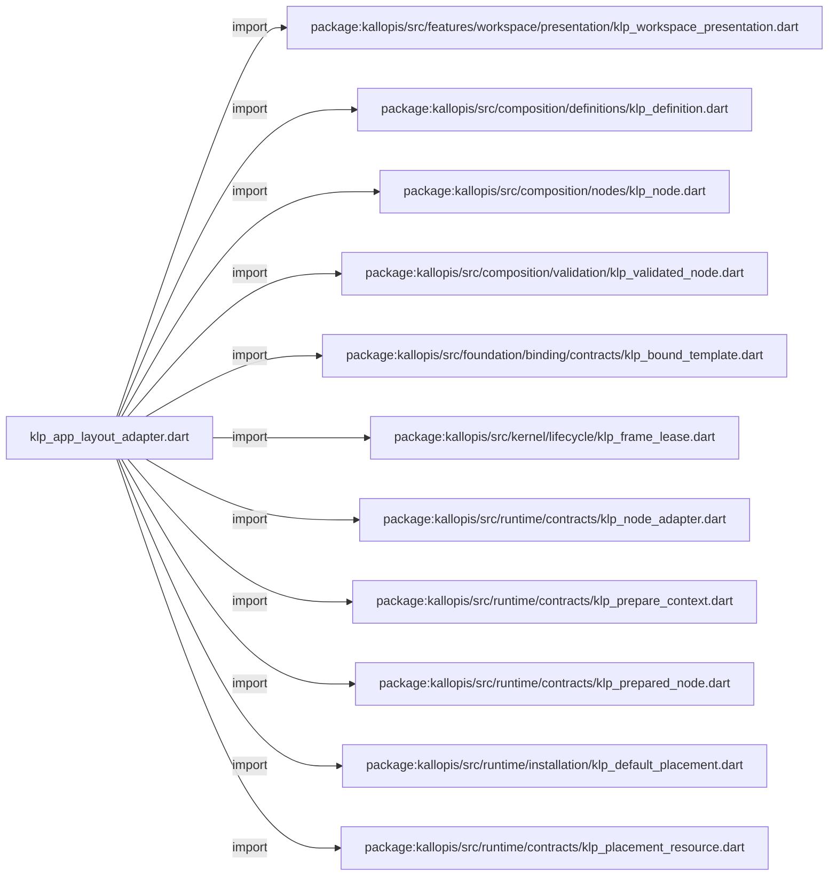
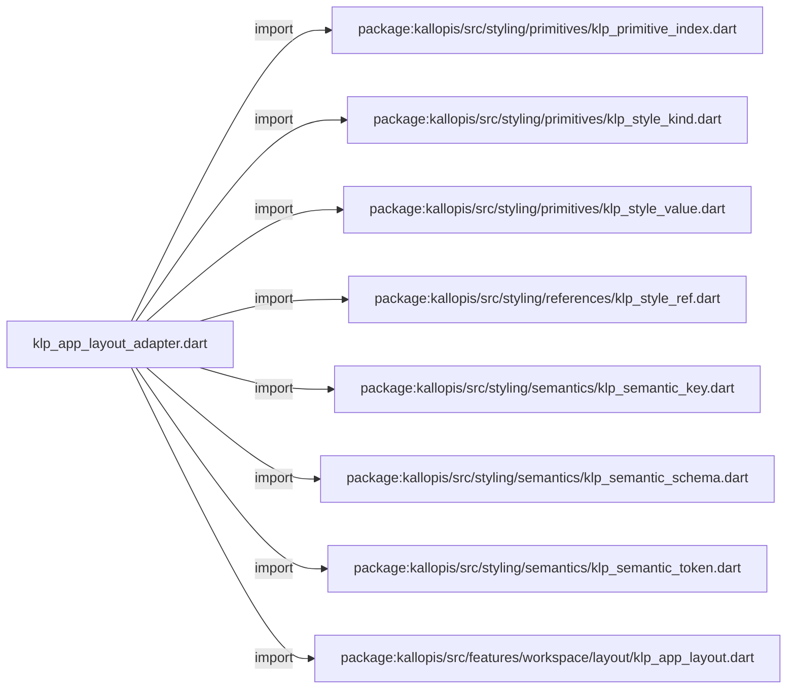
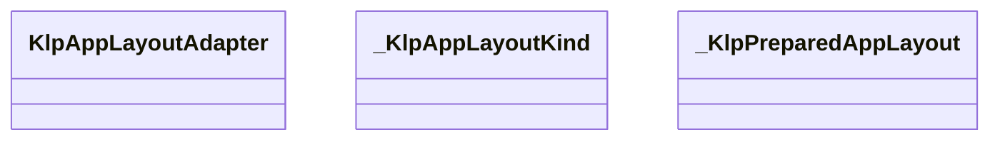
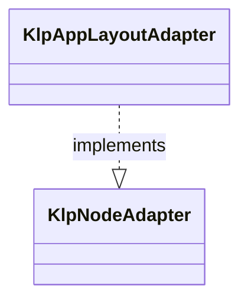
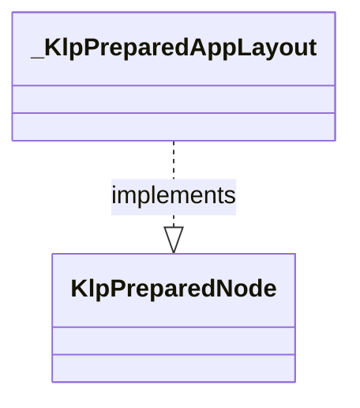

# klp_app_layout_adapter.dart：直接依賴與宣告架構

[回到目錄](README.md) · [來源檔案](../../../../../../../lib/src/features/workspace/layout/adapters/klp_app_layout_adapter.dart)

## 範圍

核心是 `lib/src/features/workspace/layout/adapters/klp_app_layout_adapter.dart`。主要視角為該檔案明寫的 import／export／part；輔助視角為本檔宣告及 extends／implements／with／on 關係。只展開一層外部邊界。

## 直接依賴圖

## 依賴證據

| 關係 | 原始 directive | 來源 |
|---|---|---|
| import | <code>import &#x27;package:kallopis/src/features/workspace/presentation/klp_workspace_presentation.dart&#x27;;</code> | [lib/src/features/workspace/layout/adapters/klp_app_layout_adapter.dart:1](../../../../../../../lib/src/features/workspace/layout/adapters/klp_app_layout_adapter.dart#L1) |
| import | <code>import &#x27;package:kallopis/src/composition/definitions/klp_definition.dart&#x27;;</code> | [lib/src/features/workspace/layout/adapters/klp_app_layout_adapter.dart:2](../../../../../../../lib/src/features/workspace/layout/adapters/klp_app_layout_adapter.dart#L2) |
| import | <code>import &#x27;package:kallopis/src/composition/nodes/klp_node.dart&#x27;;</code> | [lib/src/features/workspace/layout/adapters/klp_app_layout_adapter.dart:3](../../../../../../../lib/src/features/workspace/layout/adapters/klp_app_layout_adapter.dart#L3) |
| import | <code>import &#x27;package:kallopis/src/composition/validation/klp_validated_node.dart&#x27;;</code> | [lib/src/features/workspace/layout/adapters/klp_app_layout_adapter.dart:4](../../../../../../../lib/src/features/workspace/layout/adapters/klp_app_layout_adapter.dart#L4) |
| import | <code>import &#x27;package:kallopis/src/foundation/binding/contracts/klp_bound_template.dart&#x27;;</code> | [lib/src/features/workspace/layout/adapters/klp_app_layout_adapter.dart:5](../../../../../../../lib/src/features/workspace/layout/adapters/klp_app_layout_adapter.dart#L5) |
| import | <code>import &#x27;package:kallopis/src/kernel/lifecycle/klp_frame_lease.dart&#x27;;</code> | [lib/src/features/workspace/layout/adapters/klp_app_layout_adapter.dart:6](../../../../../../../lib/src/features/workspace/layout/adapters/klp_app_layout_adapter.dart#L6) |
| import | <code>import &#x27;package:kallopis/src/runtime/contracts/klp_node_adapter.dart&#x27;;</code> | [lib/src/features/workspace/layout/adapters/klp_app_layout_adapter.dart:7](../../../../../../../lib/src/features/workspace/layout/adapters/klp_app_layout_adapter.dart#L7) |
| import | <code>import &#x27;package:kallopis/src/runtime/contracts/klp_prepare_context.dart&#x27;;</code> | [lib/src/features/workspace/layout/adapters/klp_app_layout_adapter.dart:8](../../../../../../../lib/src/features/workspace/layout/adapters/klp_app_layout_adapter.dart#L8) |
| import | <code>import &#x27;package:kallopis/src/runtime/contracts/klp_prepared_node.dart&#x27;;</code> | [lib/src/features/workspace/layout/adapters/klp_app_layout_adapter.dart:9](../../../../../../../lib/src/features/workspace/layout/adapters/klp_app_layout_adapter.dart#L9) |
| import | <code>import &#x27;package:kallopis/src/runtime/installation/klp_default_placement.dart&#x27;;</code> | [lib/src/features/workspace/layout/adapters/klp_app_layout_adapter.dart:10](../../../../../../../lib/src/features/workspace/layout/adapters/klp_app_layout_adapter.dart#L10) |
| import | <code>import &#x27;package:kallopis/src/runtime/contracts/klp_placement_resource.dart&#x27;;</code> | [lib/src/features/workspace/layout/adapters/klp_app_layout_adapter.dart:11](../../../../../../../lib/src/features/workspace/layout/adapters/klp_app_layout_adapter.dart#L11) |
| import | <code>import &#x27;package:kallopis/src/styling/primitives/klp_primitive_index.dart&#x27;;</code> | [lib/src/features/workspace/layout/adapters/klp_app_layout_adapter.dart:12](../../../../../../../lib/src/features/workspace/layout/adapters/klp_app_layout_adapter.dart#L12) |
| import | <code>import &#x27;package:kallopis/src/styling/primitives/klp_style_kind.dart&#x27;;</code> | [lib/src/features/workspace/layout/adapters/klp_app_layout_adapter.dart:13](../../../../../../../lib/src/features/workspace/layout/adapters/klp_app_layout_adapter.dart#L13) |
| import | <code>import &#x27;package:kallopis/src/styling/primitives/klp_style_value.dart&#x27;;</code> | [lib/src/features/workspace/layout/adapters/klp_app_layout_adapter.dart:14](../../../../../../../lib/src/features/workspace/layout/adapters/klp_app_layout_adapter.dart#L14) |
| import | <code>import &#x27;package:kallopis/src/styling/references/klp_style_ref.dart&#x27;;</code> | [lib/src/features/workspace/layout/adapters/klp_app_layout_adapter.dart:15](../../../../../../../lib/src/features/workspace/layout/adapters/klp_app_layout_adapter.dart#L15) |
| import | <code>import &#x27;package:kallopis/src/styling/semantics/klp_semantic_key.dart&#x27;;</code> | [lib/src/features/workspace/layout/adapters/klp_app_layout_adapter.dart:16](../../../../../../../lib/src/features/workspace/layout/adapters/klp_app_layout_adapter.dart#L16) |
| import | <code>import &#x27;package:kallopis/src/styling/semantics/klp_semantic_schema.dart&#x27;;</code> | [lib/src/features/workspace/layout/adapters/klp_app_layout_adapter.dart:17](../../../../../../../lib/src/features/workspace/layout/adapters/klp_app_layout_adapter.dart#L17) |
| import | <code>import &#x27;package:kallopis/src/styling/semantics/klp_semantic_token.dart&#x27;;</code> | [lib/src/features/workspace/layout/adapters/klp_app_layout_adapter.dart:18](../../../../../../../lib/src/features/workspace/layout/adapters/klp_app_layout_adapter.dart#L18) |
| import | <code>import &#x27;package:kallopis/src/features/workspace/layout/klp_app_layout.dart&#x27;;</code> | [lib/src/features/workspace/layout/adapters/klp_app_layout_adapter.dart:19](../../../../../../../lib/src/features/workspace/layout/adapters/klp_app_layout_adapter.dart#L19) |

## 宣告關係圖

本組節點是本檔宣告；沒有箭頭的宣告未在此圖主張互相依賴。

## 宣告與成員證據

成員包含 public 與 private；簽章取自來源，省略函式本體與欄位初始值。`(inferred)` 表示來源未明寫型別；建構子只顯示參數部分，不含初始化列表。

### KlpAppLayoutAdapter

ClassDeclaration · public · [lib/src/features/workspace/layout/adapters/klp_app_layout_adapter.dart:21](../../../../../../../lib/src/features/workspace/layout/adapters/klp_app_layout_adapter.dart#L21)

<code>final class KlpAppLayoutAdapter implements KlpNodeAdapter</code>

來源註解摘要：將 app layout 純資料降為封閉的 Flutter 呈現資料。

- `implements` → <code>KlpNodeAdapter</code>：[lib/src/features/workspace/layout/adapters/klp_app_layout_adapter.dart:22](../../../../../../../lib/src/features/workspace/layout/adapters/klp_app_layout_adapter.dart#L22)

| 成員 | 可見性 | 簽章／型別 | 來源註解摘要 | 證據 |
|---|---|---|---|---|
| field <code>headerExtent</code> | public | <code>static final (inferred) headerExtent</code> |  | [lib/src/features/workspace/layout/adapters/klp_app_layout_adapter.dart:24](../../../../../../../lib/src/features/workspace/layout/adapters/klp_app_layout_adapter.dart#L24) |
| field <code>frameInset</code> | public | <code>static final (inferred) frameInset</code> |  | [lib/src/features/workspace/layout/adapters/klp_app_layout_adapter.dart:25](../../../../../../../lib/src/features/workspace/layout/adapters/klp_app_layout_adapter.dart#L25) |
| field <code>frameBackground</code> | public | <code>static final (inferred) frameBackground</code> |  | [lib/src/features/workspace/layout/adapters/klp_app_layout_adapter.dart:26](../../../../../../../lib/src/features/workspace/layout/adapters/klp_app_layout_adapter.dart#L26) |
| field <code>auxiliaryBackground</code> | public | <code>static final (inferred) auxiliaryBackground</code> |  | [lib/src/features/workspace/layout/adapters/klp_app_layout_adapter.dart:27](../../../../../../../lib/src/features/workspace/layout/adapters/klp_app_layout_adapter.dart#L27) |
| field <code>frameRadius</code> | public | <code>static final (inferred) frameRadius</code> |  | [lib/src/features/workspace/layout/adapters/klp_app_layout_adapter.dart:28](../../../../../../../lib/src/features/workspace/layout/adapters/klp_app_layout_adapter.dart#L28) |
| field <code>laneUnit</code> | public | <code>static final (inferred) laneUnit</code> |  | [lib/src/features/workspace/layout/adapters/klp_app_layout_adapter.dart:29](../../../../../../../lib/src/features/workspace/layout/adapters/klp_app_layout_adapter.dart#L29) |
| field <code>compactGap</code> | public | <code>static final (inferred) compactGap</code> |  | [lib/src/features/workspace/layout/adapters/klp_app_layout_adapter.dart:30](../../../../../../../lib/src/features/workspace/layout/adapters/klp_app_layout_adapter.dart#L30) |
| field <code>contract</code> | public | <code>final KlpDefinition&lt;KlpNode&gt; contract</code> |  | [lib/src/features/workspace/layout/adapters/klp_app_layout_adapter.dart:33](../../../../../../../lib/src/features/workspace/layout/adapters/klp_app_layout_adapter.dart#L33) |
| constructor <code>_</code> | private | <code>KlpAppLayoutAdapter._(this.contract)</code> |  | [lib/src/features/workspace/layout/adapters/klp_app_layout_adapter.dart:35](../../../../../../../lib/src/features/workspace/layout/adapters/klp_app_layout_adapter.dart#L35) |
| method <code>createAll</code> | public | <code>static List&lt;KlpNodeAdapter&gt; createAll()</code> |  | [lib/src/features/workspace/layout/adapters/klp_app_layout_adapter.dart:37](../../../../../../../lib/src/features/workspace/layout/adapters/klp_app_layout_adapter.dart#L37) |
| method <code>prepare</code> | public | <code>KlpPreparedNode prepare(KlpNode node, KlpValidatedNode snapshot, KlpPrepareContext context)</code> |  | [lib/src/features/workspace/layout/adapters/klp_app_layout_adapter.dart:47](../../../../../../../lib/src/features/workspace/layout/adapters/klp_app_layout_adapter.dart#L47) |

### _KlpAppLayoutKind

EnumDeclaration · private · [lib/src/features/workspace/layout/adapters/klp_app_layout_adapter.dart:72](../../../../../../../lib/src/features/workspace/layout/adapters/klp_app_layout_adapter.dart#L72)

<code>enum _KlpAppLayoutKind</code>

| 成員 | 可見性 | 簽章／型別 | 來源註解摘要 | 證據 |
|---|---|---|---|---|
| enum value <code>root</code> | public | <code>root</code> |  | [lib/src/features/workspace/layout/adapters/klp_app_layout_adapter.dart:72](../../../../../../../lib/src/features/workspace/layout/adapters/klp_app_layout_adapter.dart#L72) |
| enum value <code>row</code> | public | <code>row</code> |  | [lib/src/features/workspace/layout/adapters/klp_app_layout_adapter.dart:72](../../../../../../../lib/src/features/workspace/layout/adapters/klp_app_layout_adapter.dart#L72) |
| enum value <code>column</code> | public | <code>column</code> |  | [lib/src/features/workspace/layout/adapters/klp_app_layout_adapter.dart:72](../../../../../../../lib/src/features/workspace/layout/adapters/klp_app_layout_adapter.dart#L72) |
| enum value <code>handle</code> | public | <code>handle</code> |  | [lib/src/features/workspace/layout/adapters/klp_app_layout_adapter.dart:72](../../../../../../../lib/src/features/workspace/layout/adapters/klp_app_layout_adapter.dart#L72) |
| enum value <code>frame</code> | public | <code>frame</code> |  | [lib/src/features/workspace/layout/adapters/klp_app_layout_adapter.dart:72](../../../../../../../lib/src/features/workspace/layout/adapters/klp_app_layout_adapter.dart#L72) |
| enum value <code>spacer</code> | public | <code>spacer</code> |  | [lib/src/features/workspace/layout/adapters/klp_app_layout_adapter.dart:72](../../../../../../../lib/src/features/workspace/layout/adapters/klp_app_layout_adapter.dart#L72) |
| enum value <code>pane</code> | public | <code>pane</code> |  | [lib/src/features/workspace/layout/adapters/klp_app_layout_adapter.dart:72](../../../../../../../lib/src/features/workspace/layout/adapters/klp_app_layout_adapter.dart#L72) |

### _KlpPreparedAppLayout

ClassDeclaration · private · [lib/src/features/workspace/layout/adapters/klp_app_layout_adapter.dart:74](../../../../../../../lib/src/features/workspace/layout/adapters/klp_app_layout_adapter.dart#L74)

<code>final class _KlpPreparedAppLayout implements KlpPreparedNode</code>

- `implements` → <code>KlpPreparedNode</code>：[lib/src/features/workspace/layout/adapters/klp_app_layout_adapter.dart:74](../../../../../../../lib/src/features/workspace/layout/adapters/klp_app_layout_adapter.dart#L74)

| 成員 | 可見性 | 簽章／型別 | 來源註解摘要 | 證據 |
|---|---|---|---|---|
| field <code>kind</code> | public | <code>final _KlpAppLayoutKind kind</code> |  | [lib/src/features/workspace/layout/adapters/klp_app_layout_adapter.dart:76](../../../../../../../lib/src/features/workspace/layout/adapters/klp_app_layout_adapter.dart#L76) |
| field <code>inset</code> | public | <code>final KlpDistance inset</code> |  | [lib/src/features/workspace/layout/adapters/klp_app_layout_adapter.dart:77](../../../../../../../lib/src/features/workspace/layout/adapters/klp_app_layout_adapter.dart#L77) |
| field <code>headerExtent</code> | public | <code>final KlpDistance headerExtent</code> |  | [lib/src/features/workspace/layout/adapters/klp_app_layout_adapter.dart:78](../../../../../../../lib/src/features/workspace/layout/adapters/klp_app_layout_adapter.dart#L78) |
| field <code>onHeaderDrag</code> | public | <code>final void Function()? onHeaderDrag</code> |  | [lib/src/features/workspace/layout/adapters/klp_app_layout_adapter.dart:79](../../../../../../../lib/src/features/workspace/layout/adapters/klp_app_layout_adapter.dart#L79) |
| field <code>background</code> | public | <code>final KlpColor background</code> |  | [lib/src/features/workspace/layout/adapters/klp_app_layout_adapter.dart:80](../../../../../../../lib/src/features/workspace/layout/adapters/klp_app_layout_adapter.dart#L80) |
| field <code>radius</code> | public | <code>final KlpRadius radius</code> |  | [lib/src/features/workspace/layout/adapters/klp_app_layout_adapter.dart:81](../../../../../../../lib/src/features/workspace/layout/adapters/klp_app_layout_adapter.dart#L81) |
| field <code>flex</code> | public | <code>final int flex</code> |  | [lib/src/features/workspace/layout/adapters/klp_app_layout_adapter.dart:82](../../../../../../../lib/src/features/workspace/layout/adapters/klp_app_layout_adapter.dart#L82) |
| field <code>laneExtent</code> | public | <code>final KlpDistance? laneExtent</code> |  | [lib/src/features/workspace/layout/adapters/klp_app_layout_adapter.dart:83](../../../../../../../lib/src/features/workspace/layout/adapters/klp_app_layout_adapter.dart#L83) |
| field <code>bare</code> | public | <code>final bool bare</code> |  | [lib/src/features/workspace/layout/adapters/klp_app_layout_adapter.dart:84](../../../../../../../lib/src/features/workspace/layout/adapters/klp_app_layout_adapter.dart#L84) |
| field <code>alignment</code> | public | <code>final int alignment</code> |  | [lib/src/features/workspace/layout/adapters/klp_app_layout_adapter.dart:85](../../../../../../../lib/src/features/workspace/layout/adapters/klp_app_layout_adapter.dart#L85) |
| field <code>gapless</code> | public | <code>final bool gapless</code> |  | [lib/src/features/workspace/layout/adapters/klp_app_layout_adapter.dart:86](../../../../../../../lib/src/features/workspace/layout/adapters/klp_app_layout_adapter.dart#L86) |
| constructor <code>_KlpPreparedAppLayout</code> | private | <code>const _KlpPreparedAppLayout({required this.kind, required this.inset, required this.headerExtent, required this.onHeaderDrag, required this.background, required this.radius, required this.flex, required this.laneExtent, required this.bare, required this.alignment, required this.gapless})</code> |  | [lib/src/features/workspace/layout/adapters/klp_app_layout_adapter.dart:87](../../../../../../../lib/src/features/workspace/layout/adapters/klp_app_layout_adapter.dart#L87) |
| method <code>createResource</code> | public | <code>KlpPlacementResource createResource(KlpValidatedNode node)</code> |  | [lib/src/features/workspace/layout/adapters/klp_app_layout_adapter.dart:89](../../../../../../../lib/src/features/workspace/layout/adapters/klp_app_layout_adapter.dart#L89) |
| method <code>materialize</code> | public | <code>KlpBoundTemplate materialize(KlpPlacementResource resource, List&lt;KlpBoundTemplate&gt; children, KlpFrameLease lease)</code> |  | [lib/src/features/workspace/layout/adapters/klp_app_layout_adapter.dart:92](../../../../../../../lib/src/features/workspace/layout/adapters/klp_app_layout_adapter.dart#L92) |

## 閱讀說明與限制

箭頭只表示來源明寫的靜態關係；import 不等於呼叫。未分析動態呼叫、欄位的實際物件擁有權、狀態轉移或渲染流程；型別未進行語意解析，繼承目標保留原始型別拼寫。public／private 依 Dart 名稱前綴判斷；public 宣告不代表已由 `lib/kallopis.dart` 匯出。

本頁由 `tool/architecture_atlas` 產生；編輯來源或生成工具後重新產生，避免手改本頁。
