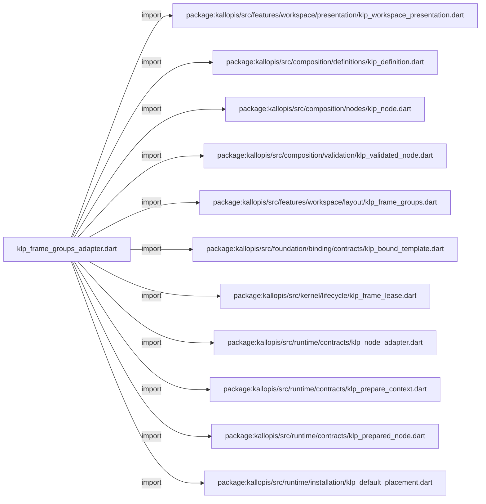
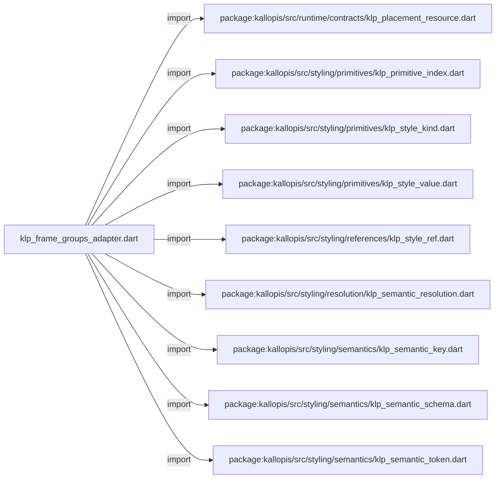
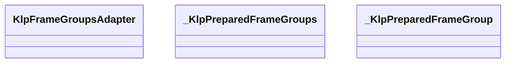
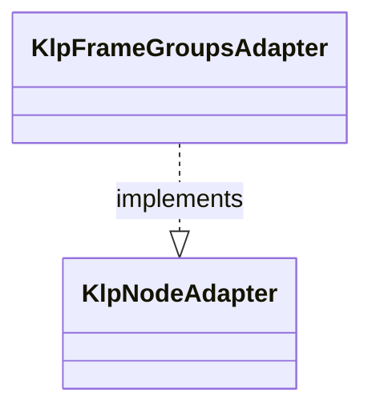
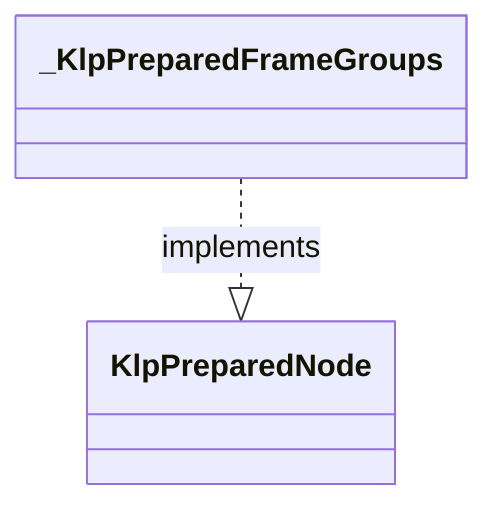
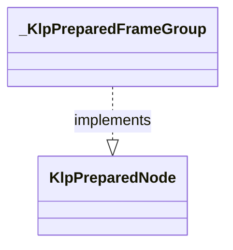

# klp_frame_groups_adapter.dart：直接依賴與宣告架構

[回到目錄](README.md) · [來源檔案](../../../../../../../lib/src/features/workspace/layout/adapters/klp_frame_groups_adapter.dart)

## 範圍

核心是 `lib/src/features/workspace/layout/adapters/klp_frame_groups_adapter.dart`。主要視角為該檔案明寫的 import／export／part；輔助視角為本檔宣告及 extends／implements／with／on 關係。只展開一層外部邊界。

## 直接依賴圖

## 依賴證據

| 關係 | 原始 directive | 來源 |
|---|---|---|
| import | <code>import &#x27;package:kallopis/src/features/workspace/presentation/klp_workspace_presentation.dart&#x27;;</code> | [lib/src/features/workspace/layout/adapters/klp_frame_groups_adapter.dart:1](../../../../../../../lib/src/features/workspace/layout/adapters/klp_frame_groups_adapter.dart#L1) |
| import | <code>import &#x27;package:kallopis/src/composition/definitions/klp_definition.dart&#x27;;</code> | [lib/src/features/workspace/layout/adapters/klp_frame_groups_adapter.dart:2](../../../../../../../lib/src/features/workspace/layout/adapters/klp_frame_groups_adapter.dart#L2) |
| import | <code>import &#x27;package:kallopis/src/composition/nodes/klp_node.dart&#x27;;</code> | [lib/src/features/workspace/layout/adapters/klp_frame_groups_adapter.dart:3](../../../../../../../lib/src/features/workspace/layout/adapters/klp_frame_groups_adapter.dart#L3) |
| import | <code>import &#x27;package:kallopis/src/composition/validation/klp_validated_node.dart&#x27;;</code> | [lib/src/features/workspace/layout/adapters/klp_frame_groups_adapter.dart:4](../../../../../../../lib/src/features/workspace/layout/adapters/klp_frame_groups_adapter.dart#L4) |
| import | <code>import &#x27;package:kallopis/src/features/workspace/layout/klp_frame_groups.dart&#x27;;</code> | [lib/src/features/workspace/layout/adapters/klp_frame_groups_adapter.dart:5](../../../../../../../lib/src/features/workspace/layout/adapters/klp_frame_groups_adapter.dart#L5) |
| import | <code>import &#x27;package:kallopis/src/foundation/binding/contracts/klp_bound_template.dart&#x27;;</code> | [lib/src/features/workspace/layout/adapters/klp_frame_groups_adapter.dart:6](../../../../../../../lib/src/features/workspace/layout/adapters/klp_frame_groups_adapter.dart#L6) |
| import | <code>import &#x27;package:kallopis/src/kernel/lifecycle/klp_frame_lease.dart&#x27;;</code> | [lib/src/features/workspace/layout/adapters/klp_frame_groups_adapter.dart:7](../../../../../../../lib/src/features/workspace/layout/adapters/klp_frame_groups_adapter.dart#L7) |
| import | <code>import &#x27;package:kallopis/src/runtime/contracts/klp_node_adapter.dart&#x27;;</code> | [lib/src/features/workspace/layout/adapters/klp_frame_groups_adapter.dart:8](../../../../../../../lib/src/features/workspace/layout/adapters/klp_frame_groups_adapter.dart#L8) |
| import | <code>import &#x27;package:kallopis/src/runtime/contracts/klp_prepare_context.dart&#x27;;</code> | [lib/src/features/workspace/layout/adapters/klp_frame_groups_adapter.dart:9](../../../../../../../lib/src/features/workspace/layout/adapters/klp_frame_groups_adapter.dart#L9) |
| import | <code>import &#x27;package:kallopis/src/runtime/contracts/klp_prepared_node.dart&#x27;;</code> | [lib/src/features/workspace/layout/adapters/klp_frame_groups_adapter.dart:10](../../../../../../../lib/src/features/workspace/layout/adapters/klp_frame_groups_adapter.dart#L10) |
| import | <code>import &#x27;package:kallopis/src/runtime/installation/klp_default_placement.dart&#x27;;</code> | [lib/src/features/workspace/layout/adapters/klp_frame_groups_adapter.dart:11](../../../../../../../lib/src/features/workspace/layout/adapters/klp_frame_groups_adapter.dart#L11) |
| import | <code>import &#x27;package:kallopis/src/runtime/contracts/klp_placement_resource.dart&#x27;;</code> | [lib/src/features/workspace/layout/adapters/klp_frame_groups_adapter.dart:12](../../../../../../../lib/src/features/workspace/layout/adapters/klp_frame_groups_adapter.dart#L12) |
| import | <code>import &#x27;package:kallopis/src/styling/primitives/klp_primitive_index.dart&#x27;;</code> | [lib/src/features/workspace/layout/adapters/klp_frame_groups_adapter.dart:13](../../../../../../../lib/src/features/workspace/layout/adapters/klp_frame_groups_adapter.dart#L13) |
| import | <code>import &#x27;package:kallopis/src/styling/primitives/klp_style_kind.dart&#x27;;</code> | [lib/src/features/workspace/layout/adapters/klp_frame_groups_adapter.dart:14](../../../../../../../lib/src/features/workspace/layout/adapters/klp_frame_groups_adapter.dart#L14) |
| import | <code>import &#x27;package:kallopis/src/styling/primitives/klp_style_value.dart&#x27;;</code> | [lib/src/features/workspace/layout/adapters/klp_frame_groups_adapter.dart:15](../../../../../../../lib/src/features/workspace/layout/adapters/klp_frame_groups_adapter.dart#L15) |
| import | <code>import &#x27;package:kallopis/src/styling/references/klp_style_ref.dart&#x27;;</code> | [lib/src/features/workspace/layout/adapters/klp_frame_groups_adapter.dart:16](../../../../../../../lib/src/features/workspace/layout/adapters/klp_frame_groups_adapter.dart#L16) |
| import | <code>import &#x27;package:kallopis/src/styling/resolution/klp_semantic_resolution.dart&#x27;;</code> | [lib/src/features/workspace/layout/adapters/klp_frame_groups_adapter.dart:17](../../../../../../../lib/src/features/workspace/layout/adapters/klp_frame_groups_adapter.dart#L17) |
| import | <code>import &#x27;package:kallopis/src/styling/semantics/klp_semantic_key.dart&#x27;;</code> | [lib/src/features/workspace/layout/adapters/klp_frame_groups_adapter.dart:18](../../../../../../../lib/src/features/workspace/layout/adapters/klp_frame_groups_adapter.dart#L18) |
| import | <code>import &#x27;package:kallopis/src/styling/semantics/klp_semantic_schema.dart&#x27;;</code> | [lib/src/features/workspace/layout/adapters/klp_frame_groups_adapter.dart:19](../../../../../../../lib/src/features/workspace/layout/adapters/klp_frame_groups_adapter.dart#L19) |
| import | <code>import &#x27;package:kallopis/src/styling/semantics/klp_semantic_token.dart&#x27;;</code> | [lib/src/features/workspace/layout/adapters/klp_frame_groups_adapter.dart:20](../../../../../../../lib/src/features/workspace/layout/adapters/klp_frame_groups_adapter.dart#L20) |

## 宣告關係圖

本組節點是本檔宣告；沒有箭頭的宣告未在此圖主張互相依賴。

## 宣告與成員證據

成員包含 public 與 private；簽章取自來源，省略函式本體與欄位初始值。`(inferred)` 表示來源未明寫型別；建構子只顯示參數部分，不含初始化列表。

### KlpFrameGroupsAdapter

ClassDeclaration · public · [lib/src/features/workspace/layout/adapters/klp_frame_groups_adapter.dart:22](../../../../../../../lib/src/features/workspace/layout/adapters/klp_frame_groups_adapter.dart#L22)

<code>final class KlpFrameGroupsAdapter implements KlpNodeAdapter</code>

來源註解摘要：將 Frame 的群組與內距樣式解析成封閉呈現資料。

- `implements` → <code>KlpNodeAdapter</code>：[lib/src/features/workspace/layout/adapters/klp_frame_groups_adapter.dart:23](../../../../../../../lib/src/features/workspace/layout/adapters/klp_frame_groups_adapter.dart#L23)

| 成員 | 可見性 | 簽章／型別 | 來源註解摘要 | 證據 |
|---|---|---|---|---|
| field <code>horizontalPadding</code> | public | <code>static final (inferred) horizontalPadding</code> |  | [lib/src/features/workspace/layout/adapters/klp_frame_groups_adapter.dart:25](../../../../../../../lib/src/features/workspace/layout/adapters/klp_frame_groups_adapter.dart#L25) |
| field <code>noHorizontalPadding</code> | public | <code>static final (inferred) noHorizontalPadding</code> |  | [lib/src/features/workspace/layout/adapters/klp_frame_groups_adapter.dart:26](../../../../../../../lib/src/features/workspace/layout/adapters/klp_frame_groups_adapter.dart#L26) |
| field <code>dividerColor</code> | public | <code>static final (inferred) dividerColor</code> |  | [lib/src/features/workspace/layout/adapters/klp_frame_groups_adapter.dart:27](../../../../../../../lib/src/features/workspace/layout/adapters/klp_frame_groups_adapter.dart#L27) |
| field <code>dividerStroke</code> | public | <code>static final (inferred) dividerStroke</code> |  | [lib/src/features/workspace/layout/adapters/klp_frame_groups_adapter.dart:28](../../../../../../../lib/src/features/workspace/layout/adapters/klp_frame_groups_adapter.dart#L28) |
| field <code>groupGap</code> | public | <code>static final (inferred) groupGap</code> |  | [lib/src/features/workspace/layout/adapters/klp_frame_groups_adapter.dart:29](../../../../../../../lib/src/features/workspace/layout/adapters/klp_frame_groups_adapter.dart#L29) |
| field <code>contentGap</code> | public | <code>static final (inferred) contentGap</code> |  | [lib/src/features/workspace/layout/adapters/klp_frame_groups_adapter.dart:30](../../../../../../../lib/src/features/workspace/layout/adapters/klp_frame_groups_adapter.dart#L30) |
| field <code>_contract</code> | private | <code>final KlpDefinition&lt;KlpNode&gt; _contract</code> |  | [lib/src/features/workspace/layout/adapters/klp_frame_groups_adapter.dart:32](../../../../../../../lib/src/features/workspace/layout/adapters/klp_frame_groups_adapter.dart#L32) |
| constructor <code>_</code> | private | <code>KlpFrameGroupsAdapter._(this._contract)</code> |  | [lib/src/features/workspace/layout/adapters/klp_frame_groups_adapter.dart:34](../../../../../../../lib/src/features/workspace/layout/adapters/klp_frame_groups_adapter.dart#L34) |
| getter <code>contract</code> | public | <code>KlpDefinition&lt;KlpNode&gt; get contract</code> |  | [lib/src/features/workspace/layout/adapters/klp_frame_groups_adapter.dart:36](../../../../../../../lib/src/features/workspace/layout/adapters/klp_frame_groups_adapter.dart#L36) |
| method <code>createAll</code> | public | <code>static List&lt;KlpNodeAdapter&gt; createAll()</code> |  | [lib/src/features/workspace/layout/adapters/klp_frame_groups_adapter.dart:39](../../../../../../../lib/src/features/workspace/layout/adapters/klp_frame_groups_adapter.dart#L39) |
| method <code>prepare</code> | public | <code>KlpPreparedNode prepare(KlpNode node, KlpValidatedNode snapshot, KlpPrepareContext context)</code> |  | [lib/src/features/workspace/layout/adapters/klp_frame_groups_adapter.dart:51](../../../../../../../lib/src/features/workspace/layout/adapters/klp_frame_groups_adapter.dart#L51) |
| method <code>_prepareGroup</code> | private | <code>KlpPreparedNode _prepareGroup(KlpFrameGroup group, KlpSemanticResolution style)</code> |  | [lib/src/features/workspace/layout/adapters/klp_frame_groups_adapter.dart:58](../../../../../../../lib/src/features/workspace/layout/adapters/klp_frame_groups_adapter.dart#L58) |

### _KlpPreparedFrameGroups

ClassDeclaration · private · [lib/src/features/workspace/layout/adapters/klp_frame_groups_adapter.dart:73](../../../../../../../lib/src/features/workspace/layout/adapters/klp_frame_groups_adapter.dart#L73)

<code>final class _KlpPreparedFrameGroups implements KlpPreparedNode</code>

- `implements` → <code>KlpPreparedNode</code>：[lib/src/features/workspace/layout/adapters/klp_frame_groups_adapter.dart:73](../../../../../../../lib/src/features/workspace/layout/adapters/klp_frame_groups_adapter.dart#L73)

| 成員 | 可見性 | 簽章／型別 | 來源註解摘要 | 證據 |
|---|---|---|---|---|
| field <code>hasFooter</code> | public | <code>final bool hasFooter</code> |  | [lib/src/features/workspace/layout/adapters/klp_frame_groups_adapter.dart:75](../../../../../../../lib/src/features/workspace/layout/adapters/klp_frame_groups_adapter.dart#L75) |
| constructor <code>_KlpPreparedFrameGroups</code> | private | <code>const _KlpPreparedFrameGroups({required this.hasFooter})</code> |  | [lib/src/features/workspace/layout/adapters/klp_frame_groups_adapter.dart:76](../../../../../../../lib/src/features/workspace/layout/adapters/klp_frame_groups_adapter.dart#L76) |
| method <code>createResource</code> | public | <code>KlpPlacementResource createResource(KlpValidatedNode node)</code> |  | [lib/src/features/workspace/layout/adapters/klp_frame_groups_adapter.dart:78](../../../../../../../lib/src/features/workspace/layout/adapters/klp_frame_groups_adapter.dart#L78) |
| method <code>materialize</code> | public | <code>KlpBoundTemplate materialize(KlpPlacementResource resource, List&lt;KlpBoundTemplate&gt; children, KlpFrameLease lease)</code> |  | [lib/src/features/workspace/layout/adapters/klp_frame_groups_adapter.dart:81](../../../../../../../lib/src/features/workspace/layout/adapters/klp_frame_groups_adapter.dart#L81) |

### _KlpPreparedFrameGroup

ClassDeclaration · private · [lib/src/features/workspace/layout/adapters/klp_frame_groups_adapter.dart:85](../../../../../../../lib/src/features/workspace/layout/adapters/klp_frame_groups_adapter.dart#L85)

<code>final class _KlpPreparedFrameGroup implements KlpPreparedNode</code>

- `implements` → <code>KlpPreparedNode</code>：[lib/src/features/workspace/layout/adapters/klp_frame_groups_adapter.dart:85](../../../../../../../lib/src/features/workspace/layout/adapters/klp_frame_groups_adapter.dart#L85)

| 成員 | 可見性 | 簽章／型別 | 來源註解摘要 | 證據 |
|---|---|---|---|---|
| field <code>horizontalInset</code> | public | <code>final KlpDistance horizontalInset</code> |  | [lib/src/features/workspace/layout/adapters/klp_frame_groups_adapter.dart:87](../../../../../../../lib/src/features/workspace/layout/adapters/klp_frame_groups_adapter.dart#L87) |
| field <code>divider</code> | public | <code>final int divider</code> |  | [lib/src/features/workspace/layout/adapters/klp_frame_groups_adapter.dart:88](../../../../../../../lib/src/features/workspace/layout/adapters/klp_frame_groups_adapter.dart#L88) |
| field <code>dividerColor</code> | public | <code>final KlpColor dividerColor</code> |  | [lib/src/features/workspace/layout/adapters/klp_frame_groups_adapter.dart:89](../../../../../../../lib/src/features/workspace/layout/adapters/klp_frame_groups_adapter.dart#L89) |
| field <code>dividerStroke</code> | public | <code>final KlpStrokeWidth dividerStroke</code> |  | [lib/src/features/workspace/layout/adapters/klp_frame_groups_adapter.dart:90](../../../../../../../lib/src/features/workspace/layout/adapters/klp_frame_groups_adapter.dart#L90) |
| field <code>groupGap</code> | public | <code>final KlpDistance groupGap</code> |  | [lib/src/features/workspace/layout/adapters/klp_frame_groups_adapter.dart:91](../../../../../../../lib/src/features/workspace/layout/adapters/klp_frame_groups_adapter.dart#L91) |
| field <code>contentGap</code> | public | <code>final KlpDistance contentGap</code> |  | [lib/src/features/workspace/layout/adapters/klp_frame_groups_adapter.dart:92](../../../../../../../lib/src/features/workspace/layout/adapters/klp_frame_groups_adapter.dart#L92) |
| constructor <code>_KlpPreparedFrameGroup</code> | private | <code>const _KlpPreparedFrameGroup({ required this.horizontalInset, required this.divider, required this.dividerColor, required this.dividerStroke, required this.groupGap, required this.contentGap, })</code> |  | [lib/src/features/workspace/layout/adapters/klp_frame_groups_adapter.dart:94](../../../../../../../lib/src/features/workspace/layout/adapters/klp_frame_groups_adapter.dart#L94) |
| method <code>createResource</code> | public | <code>KlpPlacementResource createResource(KlpValidatedNode node)</code> |  | [lib/src/features/workspace/layout/adapters/klp_frame_groups_adapter.dart:103](../../../../../../../lib/src/features/workspace/layout/adapters/klp_frame_groups_adapter.dart#L103) |
| method <code>materialize</code> | public | <code>KlpBoundTemplate materialize(KlpPlacementResource resource, List&lt;KlpBoundTemplate&gt; children, KlpFrameLease lease)</code> |  | [lib/src/features/workspace/layout/adapters/klp_frame_groups_adapter.dart:106](../../../../../../../lib/src/features/workspace/layout/adapters/klp_frame_groups_adapter.dart#L106) |

## 閱讀說明與限制

箭頭只表示來源明寫的靜態關係；import 不等於呼叫。未分析動態呼叫、欄位的實際物件擁有權、狀態轉移或渲染流程；型別未進行語意解析，繼承目標保留原始型別拼寫。public／private 依 Dart 名稱前綴判斷；public 宣告不代表已由 `lib/kallopis.dart` 匯出。

本頁由 `tool/architecture_atlas` 產生；編輯來源或生成工具後重新產生，避免手改本頁。
