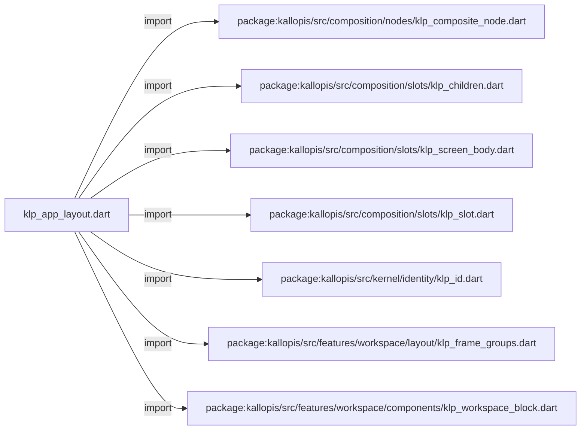
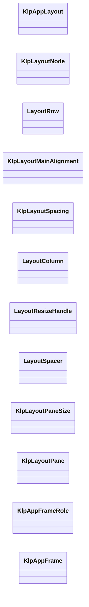
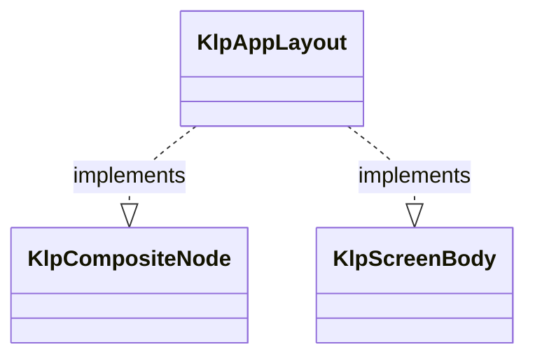
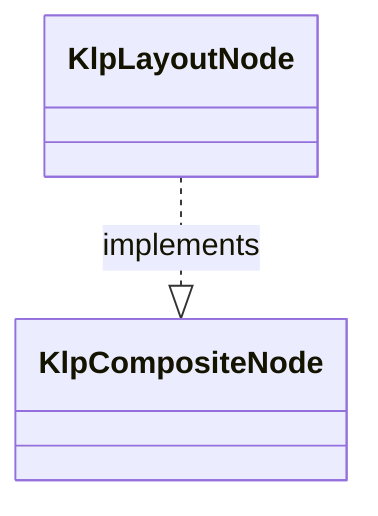
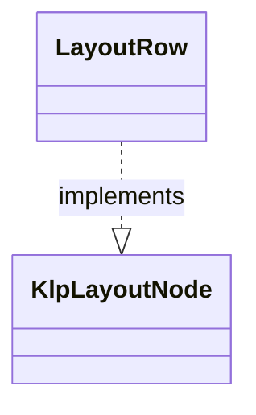
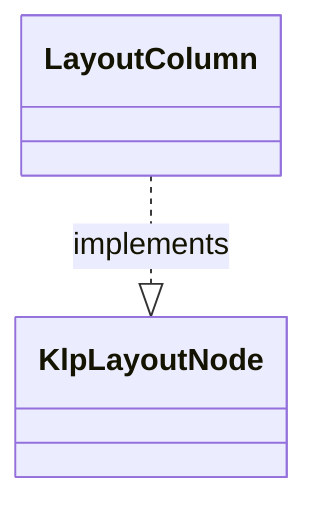
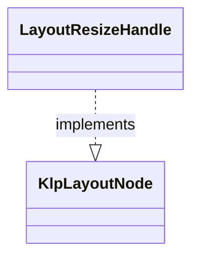
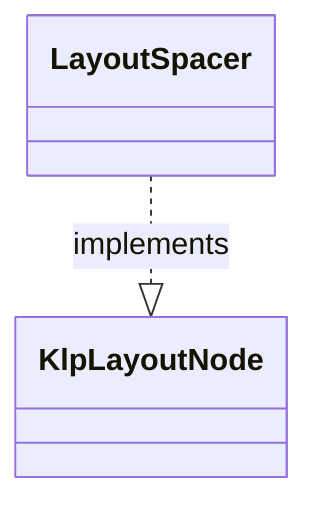
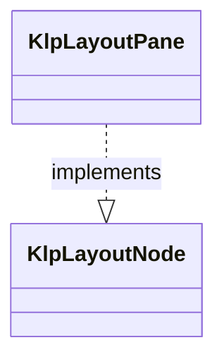
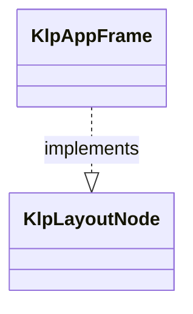

# klp_app_layout.dart：直接依賴與宣告架構

[回到目錄](README.md) · [來源檔案](../../../../../../lib/src/features/workspace/layout/klp_app_layout.dart)

## 範圍

核心是 `lib/src/features/workspace/layout/klp_app_layout.dart`。主要視角為該檔案明寫的 import／export／part；輔助視角為本檔宣告及 extends／implements／with／on 關係。只展開一層外部邊界。

## 直接依賴圖

## 依賴證據

| 關係 | 原始 directive | 來源 |
|---|---|---|
| import | <code>import &#x27;package:kallopis/src/composition/nodes/klp_composite_node.dart&#x27;;</code> | [lib/src/features/workspace/layout/klp_app_layout.dart:1](../../../../../../lib/src/features/workspace/layout/klp_app_layout.dart#L1) |
| import | <code>import &#x27;package:kallopis/src/composition/slots/klp_children.dart&#x27;;</code> | [lib/src/features/workspace/layout/klp_app_layout.dart:2](../../../../../../lib/src/features/workspace/layout/klp_app_layout.dart#L2) |
| import | <code>import &#x27;package:kallopis/src/composition/slots/klp_screen_body.dart&#x27;;</code> | [lib/src/features/workspace/layout/klp_app_layout.dart:3](../../../../../../lib/src/features/workspace/layout/klp_app_layout.dart#L3) |
| import | <code>import &#x27;package:kallopis/src/composition/slots/klp_slot.dart&#x27;;</code> | [lib/src/features/workspace/layout/klp_app_layout.dart:4](../../../../../../lib/src/features/workspace/layout/klp_app_layout.dart#L4) |
| import | <code>import &#x27;package:kallopis/src/kernel/identity/klp_id.dart&#x27;;</code> | [lib/src/features/workspace/layout/klp_app_layout.dart:5](../../../../../../lib/src/features/workspace/layout/klp_app_layout.dart#L5) |
| import | <code>import &#x27;package:kallopis/src/features/workspace/layout/klp_frame_groups.dart&#x27;;</code> | [lib/src/features/workspace/layout/klp_app_layout.dart:6](../../../../../../lib/src/features/workspace/layout/klp_app_layout.dart#L6) |
| import | <code>import &#x27;package:kallopis/src/features/workspace/components/klp_workspace_block.dart&#x27;;</code> | [lib/src/features/workspace/layout/klp_app_layout.dart:7](../../../../../../lib/src/features/workspace/layout/klp_app_layout.dart#L7) |

## 宣告關係圖

本組節點是本檔宣告；沒有箭頭的宣告未在此圖主張互相依賴。

## 宣告與成員證據

成員包含 public 與 private；簽章取自來源，省略函式本體與欄位初始值。`(inferred)` 表示來源未明寫型別；建構子只顯示參數部分，不含初始化列表。

### KlpAppLayout

ClassDeclaration · public · [lib/src/features/workspace/layout/klp_app_layout.dart:9](../../../../../../lib/src/features/workspace/layout/klp_app_layout.dart#L9)

<code>final class KlpAppLayout implements KlpCompositeNode, KlpScreenBody</code>

來源註解摘要：App background 上第一層的受控布局根；不建立預設 Header。

- `implements` → <code>KlpCompositeNode</code>：[lib/src/features/workspace/layout/klp_app_layout.dart:10](../../../../../../lib/src/features/workspace/layout/klp_app_layout.dart#L10)
- `implements` → <code>KlpScreenBody</code>：[lib/src/features/workspace/layout/klp_app_layout.dart:10](../../../../../../lib/src/features/workspace/layout/klp_app_layout.dart#L10)

| 成員 | 可見性 | 簽章／型別 | 來源註解摘要 | 證據 |
|---|---|---|---|---|
| field <code>typeId</code> | public | <code>static const String typeId</code> |  | [lib/src/features/workspace/layout/klp_app_layout.dart:12](../../../../../../lib/src/features/workspace/layout/klp_app_layout.dart#L12) |
| field <code>childSlot</code> | public | <code>static final (inferred) childSlot</code> |  | [lib/src/features/workspace/layout/klp_app_layout.dart:13](../../../../../../lib/src/features/workspace/layout/klp_app_layout.dart#L13) |
| field <code>floatingActionSlot</code> | public | <code>static final (inferred) floatingActionSlot</code> |  | [lib/src/features/workspace/layout/klp_app_layout.dart:14](../../../../../../lib/src/features/workspace/layout/klp_app_layout.dart#L14) |
| field <code>id</code> | public | <code>final KlpId id</code> |  | [lib/src/features/workspace/layout/klp_app_layout.dart:17](../../../../../../lib/src/features/workspace/layout/klp_app_layout.dart#L17) |
| field <code>child</code> | public | <code>final KlpLayoutNode child</code> |  | [lib/src/features/workspace/layout/klp_app_layout.dart:18](../../../../../../lib/src/features/workspace/layout/klp_app_layout.dart#L18) |
| field <code>floatingAction</code> | public | <code>final KlpWorkspaceBlock? floatingAction</code> | 可拖曳的浮動操作；位置由呈現層維護，內容仍屬同一棵結構樹。 | [lib/src/features/workspace/layout/klp_app_layout.dart:20](../../../../../../lib/src/features/workspace/layout/klp_app_layout.dart#L20) |
| field <code>onHeaderDrag</code> | public | <code>final void Function()? onHeaderDrag</code> | 頂部空白區要求宿主開始原生拖曳；互動元件不觸發。 | [lib/src/features/workspace/layout/klp_app_layout.dart:22](../../../../../../lib/src/features/workspace/layout/klp_app_layout.dart#L22) |
| field <code>children</code> | public | <code>final KlpChildren children</code> |  | [lib/src/features/workspace/layout/klp_app_layout.dart:24](../../../../../../lib/src/features/workspace/layout/klp_app_layout.dart#L24) |
| constructor <code>KlpAppLayout</code> | public | <code>KlpAppLayout({required this.id, required this.child, this.onHeaderDrag, this.floatingAction})</code> |  | [lib/src/features/workspace/layout/klp_app_layout.dart:26](../../../../../../lib/src/features/workspace/layout/klp_app_layout.dart#L26) |
| getter <code>definitionId</code> | public | <code>String get definitionId</code> |  | [lib/src/features/workspace/layout/klp_app_layout.dart:30](../../../../../../lib/src/features/workspace/layout/klp_app_layout.dart#L30) |

### KlpLayoutNode

ClassDeclaration · public · [lib/src/features/workspace/layout/klp_app_layout.dart:34](../../../../../../lib/src/features/workspace/layout/klp_app_layout.dart#L34)

<code>abstract interface class KlpLayoutNode implements KlpCompositeNode</code>

來源註解摘要：可置於 [KlpAppLayout] 的純資料布局節點資格。

- `implements` → <code>KlpCompositeNode</code>：[lib/src/features/workspace/layout/klp_app_layout.dart:35](../../../../../../lib/src/features/workspace/layout/klp_app_layout.dart#L35)

### LayoutRow

ClassDeclaration · public · [lib/src/features/workspace/layout/klp_app_layout.dart:37](../../../../../../lib/src/features/workspace/layout/klp_app_layout.dart#L37)

<code>final class LayoutRow implements KlpLayoutNode</code>

來源註解摘要：在主軸上水平排列受控布局節點。

- `implements` → <code>KlpLayoutNode</code>：[lib/src/features/workspace/layout/klp_app_layout.dart:38](../../../../../../lib/src/features/workspace/layout/klp_app_layout.dart#L38)

| 成員 | 可見性 | 簽章／型別 | 來源註解摘要 | 證據 |
|---|---|---|---|---|
| field <code>typeId</code> | public | <code>static const String typeId</code> |  | [lib/src/features/workspace/layout/klp_app_layout.dart:40](../../../../../../lib/src/features/workspace/layout/klp_app_layout.dart#L40) |
| field <code>childSlot</code> | public | <code>static final (inferred) childSlot</code> |  | [lib/src/features/workspace/layout/klp_app_layout.dart:41](../../../../../../lib/src/features/workspace/layout/klp_app_layout.dart#L41) |
| field <code>id</code> | public | <code>final KlpId id</code> |  | [lib/src/features/workspace/layout/klp_app_layout.dart:44](../../../../../../lib/src/features/workspace/layout/klp_app_layout.dart#L44) |
| field <code>flex</code> | public | <code>final int flex</code> |  | [lib/src/features/workspace/layout/klp_app_layout.dart:45](../../../../../../lib/src/features/workspace/layout/klp_app_layout.dart#L45) |
| field <code>alignment</code> | public | <code>final KlpLayoutMainAlignment alignment</code> |  | [lib/src/features/workspace/layout/klp_app_layout.dart:46](../../../../../../lib/src/features/workspace/layout/klp_app_layout.dart#L46) |
| field <code>spacing</code> | public | <code>final KlpLayoutSpacing spacing</code> |  | [lib/src/features/workspace/layout/klp_app_layout.dart:47](../../../../../../lib/src/features/workspace/layout/klp_app_layout.dart#L47) |
| field <code>children</code> | public | <code>final KlpChildren children</code> |  | [lib/src/features/workspace/layout/klp_app_layout.dart:49](../../../../../../lib/src/features/workspace/layout/klp_app_layout.dart#L49) |
| constructor <code>LayoutRow</code> | public | <code>LayoutRow({required this.id, required List&lt;KlpLayoutNode&gt; children, this.flex = 1, this.alignment = KlpLayoutMainAlignment.start, this.spacing = KlpLayoutSpacing.standard})</code> |  | [lib/src/features/workspace/layout/klp_app_layout.dart:51](../../../../../../lib/src/features/workspace/layout/klp_app_layout.dart#L51) |
| getter <code>definitionId</code> | public | <code>String get definitionId</code> |  | [lib/src/features/workspace/layout/klp_app_layout.dart:55](../../../../../../lib/src/features/workspace/layout/klp_app_layout.dart#L55) |

### KlpLayoutMainAlignment

EnumDeclaration · public · [lib/src/features/workspace/layout/klp_app_layout.dart:59](../../../../../../lib/src/features/workspace/layout/klp_app_layout.dart#L59)

<code>enum KlpLayoutMainAlignment</code>

來源註解摘要：水平布局的主軸起端或末端對齊選項；不定義原始幾何位置。

| 成員 | 可見性 | 簽章／型別 | 來源註解摘要 | 證據 |
|---|---|---|---|---|
| enum value <code>start</code> | public | <code>start</code> |  | [lib/src/features/workspace/layout/klp_app_layout.dart:60](../../../../../../lib/src/features/workspace/layout/klp_app_layout.dart#L60) |
| enum value <code>end</code> | public | <code>end</code> |  | [lib/src/features/workspace/layout/klp_app_layout.dart:60](../../../../../../lib/src/features/workspace/layout/klp_app_layout.dart#L60) |

### KlpLayoutSpacing

EnumDeclaration · public · [lib/src/features/workspace/layout/klp_app_layout.dart:61](../../../../../../lib/src/features/workspace/layout/klp_app_layout.dart#L61)

<code>enum KlpLayoutSpacing</code>

來源註解摘要：線性布局的標準或無間距選項；實際距離由本庫語意樣式決定。

| 成員 | 可見性 | 簽章／型別 | 來源註解摘要 | 證據 |
|---|---|---|---|---|
| enum value <code>standard</code> | public | <code>standard</code> |  | [lib/src/features/workspace/layout/klp_app_layout.dart:62](../../../../../../lib/src/features/workspace/layout/klp_app_layout.dart#L62) |
| enum value <code>none</code> | public | <code>none</code> |  | [lib/src/features/workspace/layout/klp_app_layout.dart:62](../../../../../../lib/src/features/workspace/layout/klp_app_layout.dart#L62) |

### LayoutColumn

ClassDeclaration · public · [lib/src/features/workspace/layout/klp_app_layout.dart:64](../../../../../../lib/src/features/workspace/layout/klp_app_layout.dart#L64)

<code>final class LayoutColumn implements KlpLayoutNode</code>

來源註解摘要：在主軸上垂直排列受控布局節點。

- `implements` → <code>KlpLayoutNode</code>：[lib/src/features/workspace/layout/klp_app_layout.dart:65](../../../../../../lib/src/features/workspace/layout/klp_app_layout.dart#L65)

| 成員 | 可見性 | 簽章／型別 | 來源註解摘要 | 證據 |
|---|---|---|---|---|
| field <code>typeId</code> | public | <code>static const String typeId</code> |  | [lib/src/features/workspace/layout/klp_app_layout.dart:67](../../../../../../lib/src/features/workspace/layout/klp_app_layout.dart#L67) |
| field <code>childSlot</code> | public | <code>static final (inferred) childSlot</code> |  | [lib/src/features/workspace/layout/klp_app_layout.dart:68](../../../../../../lib/src/features/workspace/layout/klp_app_layout.dart#L68) |
| field <code>id</code> | public | <code>final KlpId id</code> |  | [lib/src/features/workspace/layout/klp_app_layout.dart:71](../../../../../../lib/src/features/workspace/layout/klp_app_layout.dart#L71) |
| field <code>flex</code> | public | <code>final int flex</code> |  | [lib/src/features/workspace/layout/klp_app_layout.dart:72](../../../../../../lib/src/features/workspace/layout/klp_app_layout.dart#L72) |
| field <code>spacing</code> | public | <code>final KlpLayoutSpacing spacing</code> |  | [lib/src/features/workspace/layout/klp_app_layout.dart:73](../../../../../../lib/src/features/workspace/layout/klp_app_layout.dart#L73) |
| field <code>children</code> | public | <code>final KlpChildren children</code> |  | [lib/src/features/workspace/layout/klp_app_layout.dart:75](../../../../../../lib/src/features/workspace/layout/klp_app_layout.dart#L75) |
| constructor <code>LayoutColumn</code> | public | <code>LayoutColumn({required this.id, required List&lt;KlpLayoutNode&gt; children, this.flex = 1, this.spacing = KlpLayoutSpacing.standard})</code> |  | [lib/src/features/workspace/layout/klp_app_layout.dart:77](../../../../../../lib/src/features/workspace/layout/klp_app_layout.dart#L77) |
| getter <code>definitionId</code> | public | <code>String get definitionId</code> |  | [lib/src/features/workspace/layout/klp_app_layout.dart:81](../../../../../../lib/src/features/workspace/layout/klp_app_layout.dart#L81) |

### LayoutResizeHandle

ClassDeclaration · public · [lib/src/features/workspace/layout/klp_app_layout.dart:85](../../../../../../lib/src/features/workspace/layout/klp_app_layout.dart#L85)

<code>final class LayoutResizeHandle implements KlpLayoutNode</code>

來源註解摘要：取代相鄰 node 自動 gutter 的固定尺寸 resize 槽；本輪不提供手勢。

- `implements` → <code>KlpLayoutNode</code>：[lib/src/features/workspace/layout/klp_app_layout.dart:86](../../../../../../lib/src/features/workspace/layout/klp_app_layout.dart#L86)

| 成員 | 可見性 | 簽章／型別 | 來源註解摘要 | 證據 |
|---|---|---|---|---|
| field <code>typeId</code> | public | <code>static const String typeId</code> |  | [lib/src/features/workspace/layout/klp_app_layout.dart:88](../../../../../../lib/src/features/workspace/layout/klp_app_layout.dart#L88) |
| field <code>id</code> | public | <code>final KlpId id</code> |  | [lib/src/features/workspace/layout/klp_app_layout.dart:91](../../../../../../lib/src/features/workspace/layout/klp_app_layout.dart#L91) |
| constructor <code>LayoutResizeHandle</code> | public | <code>const LayoutResizeHandle({required this.id})</code> |  | [lib/src/features/workspace/layout/klp_app_layout.dart:93](../../../../../../lib/src/features/workspace/layout/klp_app_layout.dart#L93) |
| getter <code>children</code> | public | <code>KlpChildren get children</code> |  | [lib/src/features/workspace/layout/klp_app_layout.dart:95](../../../../../../lib/src/features/workspace/layout/klp_app_layout.dart#L95) |
| getter <code>definitionId</code> | public | <code>String get definitionId</code> |  | [lib/src/features/workspace/layout/klp_app_layout.dart:98](../../../../../../lib/src/features/workspace/layout/klp_app_layout.dart#L98) |

### LayoutSpacer

ClassDeclaration · public · [lib/src/features/workspace/layout/klp_app_layout.dart:102](../../../../../../lib/src/features/workspace/layout/klp_app_layout.dart#L102)

<code>final class LayoutSpacer implements KlpLayoutNode</code>

來源註解摘要：線性布局中不承載內容的彈性空間。

- `implements` → <code>KlpLayoutNode</code>：[lib/src/features/workspace/layout/klp_app_layout.dart:103](../../../../../../lib/src/features/workspace/layout/klp_app_layout.dart#L103)

| 成員 | 可見性 | 簽章／型別 | 來源註解摘要 | 證據 |
|---|---|---|---|---|
| field <code>typeId</code> | public | <code>static const String typeId</code> |  | [lib/src/features/workspace/layout/klp_app_layout.dart:104](../../../../../../lib/src/features/workspace/layout/klp_app_layout.dart#L104) |
| field <code>id</code> | public | <code>final KlpId id</code> |  | [lib/src/features/workspace/layout/klp_app_layout.dart:106](../../../../../../lib/src/features/workspace/layout/klp_app_layout.dart#L106) |
| field <code>flex</code> | public | <code>final int flex</code> |  | [lib/src/features/workspace/layout/klp_app_layout.dart:107](../../../../../../lib/src/features/workspace/layout/klp_app_layout.dart#L107) |
| constructor <code>LayoutSpacer</code> | public | <code>LayoutSpacer({required this.id, this.flex = 1})</code> |  | [lib/src/features/workspace/layout/klp_app_layout.dart:108](../../../../../../lib/src/features/workspace/layout/klp_app_layout.dart#L108) |
| getter <code>children</code> | public | <code>KlpChildren get children</code> |  | [lib/src/features/workspace/layout/klp_app_layout.dart:111](../../../../../../lib/src/features/workspace/layout/klp_app_layout.dart#L111) |
| getter <code>definitionId</code> | public | <code>String get definitionId</code> |  | [lib/src/features/workspace/layout/klp_app_layout.dart:113](../../../../../../lib/src/features/workspace/layout/klp_app_layout.dart#L113) |

### KlpLayoutPaneSize

EnumDeclaration · public · [lib/src/features/workspace/layout/klp_app_layout.dart:117](../../../../../../lib/src/features/workspace/layout/klp_app_layout.dart#L117)

<code>enum KlpLayoutPaneSize</code>

來源註解摘要：布局欄的尺寸角色選項；不承載原始寬度或自行管理拖曳尺寸。

| 成員 | 可見性 | 簽章／型別 | 來源註解摘要 | 證據 |
|---|---|---|---|---|
| enum value <code>trailing</code> | public | <code>trailing</code> |  | [lib/src/features/workspace/layout/klp_app_layout.dart:118](../../../../../../lib/src/features/workspace/layout/klp_app_layout.dart#L118) |
| enum value <code>content</code> | public | <code>content</code> |  | [lib/src/features/workspace/layout/klp_app_layout.dart:118](../../../../../../lib/src/features/workspace/layout/klp_app_layout.dart#L118) |
| enum value <code>expand</code> | public | <code>expand</code> |  | [lib/src/features/workspace/layout/klp_app_layout.dart:118](../../../../../../lib/src/features/workspace/layout/klp_app_layout.dart#L118) |

### KlpLayoutPane

ClassDeclaration · public · [lib/src/features/workspace/layout/klp_app_layout.dart:120](../../../../../../lib/src/features/workspace/layout/klp_app_layout.dart#L120)

<code>final class KlpLayoutPane implements KlpLayoutNode</code>

來源註解摘要：不帶材質的受控布局欄，可承載具水平內距的群組。

- `implements` → <code>KlpLayoutNode</code>：[lib/src/features/workspace/layout/klp_app_layout.dart:121](../../../../../../lib/src/features/workspace/layout/klp_app_layout.dart#L121)

| 成員 | 可見性 | 簽章／型別 | 來源註解摘要 | 證據 |
|---|---|---|---|---|
| field <code>typeId</code> | public | <code>static const String typeId</code> |  | [lib/src/features/workspace/layout/klp_app_layout.dart:122](../../../../../../lib/src/features/workspace/layout/klp_app_layout.dart#L122) |
| field <code>childSlot</code> | public | <code>static final (inferred) childSlot</code> |  | [lib/src/features/workspace/layout/klp_app_layout.dart:123](../../../../../../lib/src/features/workspace/layout/klp_app_layout.dart#L123) |
| field <code>id</code> | public | <code>final KlpId id</code> |  | [lib/src/features/workspace/layout/klp_app_layout.dart:125](../../../../../../lib/src/features/workspace/layout/klp_app_layout.dart#L125) |
| field <code>child</code> | public | <code>final KlpFrameGroups child</code> |  | [lib/src/features/workspace/layout/klp_app_layout.dart:126](../../../../../../lib/src/features/workspace/layout/klp_app_layout.dart#L126) |
| field <code>size</code> | public | <code>final KlpLayoutPaneSize size</code> |  | [lib/src/features/workspace/layout/klp_app_layout.dart:127](../../../../../../lib/src/features/workspace/layout/klp_app_layout.dart#L127) |
| field <code>flex</code> | public | <code>final int flex</code> |  | [lib/src/features/workspace/layout/klp_app_layout.dart:128](../../../../../../lib/src/features/workspace/layout/klp_app_layout.dart#L128) |
| field <code>children</code> | public | <code>final KlpChildren children</code> |  | [lib/src/features/workspace/layout/klp_app_layout.dart:130](../../../../../../lib/src/features/workspace/layout/klp_app_layout.dart#L130) |
| constructor <code>KlpLayoutPane</code> | public | <code>KlpLayoutPane({required this.id, required this.child, this.size = KlpLayoutPaneSize.trailing, int? flex})</code> |  | [lib/src/features/workspace/layout/klp_app_layout.dart:131](../../../../../../lib/src/features/workspace/layout/klp_app_layout.dart#L131) |
| getter <code>definitionId</code> | public | <code>String get definitionId</code> |  | [lib/src/features/workspace/layout/klp_app_layout.dart:136](../../../../../../lib/src/features/workspace/layout/klp_app_layout.dart#L136) |

### KlpAppFrameRole

EnumDeclaration · public · [lib/src/features/workspace/layout/klp_app_layout.dart:140](../../../../../../lib/src/features/workspace/layout/klp_app_layout.dart#L140)

<code>enum KlpAppFrameRole</code>

來源註解摘要：Frame 的內容主次角色，不綁定左右位置。

| 成員 | 可見性 | 簽章／型別 | 來源註解摘要 | 證據 |
|---|---|---|---|---|
| enum value <code>content</code> | public | <code>content</code> |  | [lib/src/features/workspace/layout/klp_app_layout.dart:141](../../../../../../lib/src/features/workspace/layout/klp_app_layout.dart#L141) |
| enum value <code>auxiliary</code> | public | <code>auxiliary</code> |  | [lib/src/features/workspace/layout/klp_app_layout.dart:141](../../../../../../lib/src/features/workspace/layout/klp_app_layout.dart#L141) |
| enum value <code>sidebar</code> | public | <code>sidebar</code> |  | [lib/src/features/workspace/layout/klp_app_layout.dart:141](../../../../../../lib/src/features/workspace/layout/klp_app_layout.dart#L141) |
| enum value <code>rightSidebar</code> | public | <code>rightSidebar</code> |  | [lib/src/features/workspace/layout/klp_app_layout.dart:141](../../../../../../lib/src/features/workspace/layout/klp_app_layout.dart#L141) |
| enum value <code>toolbarControls</code> | public | <code>toolbarControls</code> |  | [lib/src/features/workspace/layout/klp_app_layout.dart:141](../../../../../../lib/src/features/workspace/layout/klp_app_layout.dart#L141) |

### KlpAppFrame

ClassDeclaration · public · [lib/src/features/workspace/layout/klp_app_layout.dart:143](../../../../../../lib/src/features/workspace/layout/klp_app_layout.dart#L143)

<code>final class KlpAppFrame implements KlpLayoutNode</code>

來源註解摘要：僅可作為 app background 第一層布局節點的具名 frame。

- `implements` → <code>KlpLayoutNode</code>：[lib/src/features/workspace/layout/klp_app_layout.dart:144](../../../../../../lib/src/features/workspace/layout/klp_app_layout.dart#L144)

| 成員 | 可見性 | 簽章／型別 | 來源註解摘要 | 證據 |
|---|---|---|---|---|
| field <code>typeId</code> | public | <code>static const String typeId</code> |  | [lib/src/features/workspace/layout/klp_app_layout.dart:146](../../../../../../lib/src/features/workspace/layout/klp_app_layout.dart#L146) |
| field <code>childSlot</code> | public | <code>static final (inferred) childSlot</code> |  | [lib/src/features/workspace/layout/klp_app_layout.dart:147](../../../../../../lib/src/features/workspace/layout/klp_app_layout.dart#L147) |
| field <code>id</code> | public | <code>final KlpId id</code> |  | [lib/src/features/workspace/layout/klp_app_layout.dart:150](../../../../../../lib/src/features/workspace/layout/klp_app_layout.dart#L150) |
| field <code>child</code> | public | <code>final KlpFrameGroups child</code> |  | [lib/src/features/workspace/layout/klp_app_layout.dart:151](../../../../../../lib/src/features/workspace/layout/klp_app_layout.dart#L151) |
| field <code>role</code> | public | <code>final KlpAppFrameRole role</code> |  | [lib/src/features/workspace/layout/klp_app_layout.dart:152](../../../../../../lib/src/features/workspace/layout/klp_app_layout.dart#L152) |
| field <code>flex</code> | public | <code>final int flex</code> |  | [lib/src/features/workspace/layout/klp_app_layout.dart:153](../../../../../../lib/src/features/workspace/layout/klp_app_layout.dart#L153) |
| field <code>children</code> | public | <code>final KlpChildren children</code> |  | [lib/src/features/workspace/layout/klp_app_layout.dart:155](../../../../../../lib/src/features/workspace/layout/klp_app_layout.dart#L155) |
| constructor <code>KlpAppFrame</code> | public | <code>KlpAppFrame({required this.id, required this.child, this.flex = 1, this.role = KlpAppFrameRole.content})</code> |  | [lib/src/features/workspace/layout/klp_app_layout.dart:157](../../../../../../lib/src/features/workspace/layout/klp_app_layout.dart#L157) |
| getter <code>definitionId</code> | public | <code>String get definitionId</code> |  | [lib/src/features/workspace/layout/klp_app_layout.dart:161](../../../../../../lib/src/features/workspace/layout/klp_app_layout.dart#L161) |

## 閱讀說明與限制

箭頭只表示來源明寫的靜態關係；import 不等於呼叫。未分析動態呼叫、欄位的實際物件擁有權、狀態轉移或渲染流程；型別未進行語意解析，繼承目標保留原始型別拼寫。public／private 依 Dart 名稱前綴判斷；public 宣告不代表已由 `lib/kallopis.dart` 匯出。

本頁由 `tool/architecture_atlas` 產生；編輯來源或生成工具後重新產生，避免手改本頁。
