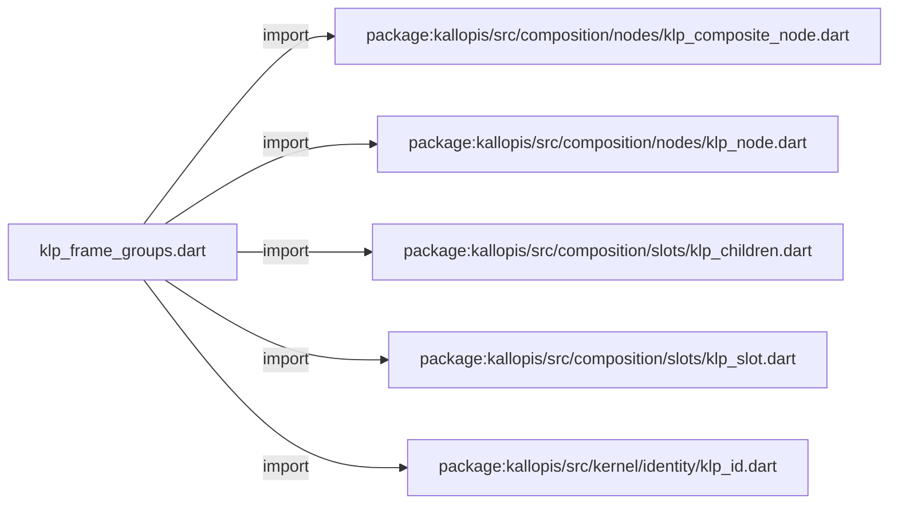
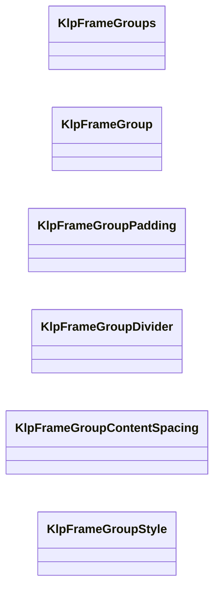
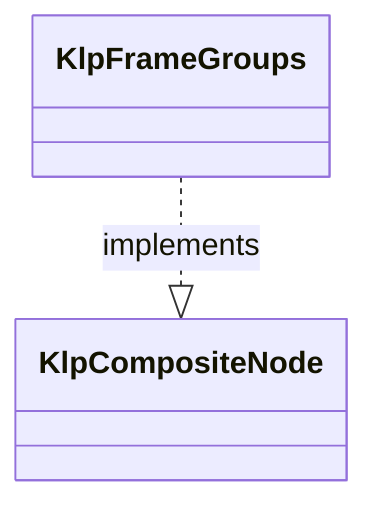
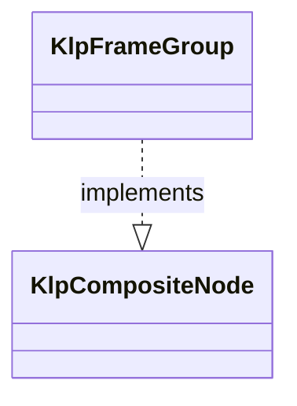

# klp_frame_groups.dart：直接依賴與宣告架構

[回到目錄](README.md) · [來源檔案](../../../../../../lib/src/features/workspace/layout/klp_frame_groups.dart)

## 範圍

核心是 `lib/src/features/workspace/layout/klp_frame_groups.dart`。主要視角為該檔案明寫的 import／export／part；輔助視角為本檔宣告及 extends／implements／with／on 關係。只展開一層外部邊界。

## 直接依賴圖

## 依賴證據

| 關係 | 原始 directive | 來源 |
|---|---|---|
| import | <code>import &#x27;package:kallopis/src/composition/nodes/klp_composite_node.dart&#x27;;</code> | [lib/src/features/workspace/layout/klp_frame_groups.dart:1](../../../../../../lib/src/features/workspace/layout/klp_frame_groups.dart#L1) |
| import | <code>import &#x27;package:kallopis/src/composition/nodes/klp_node.dart&#x27;;</code> | [lib/src/features/workspace/layout/klp_frame_groups.dart:2](../../../../../../lib/src/features/workspace/layout/klp_frame_groups.dart#L2) |
| import | <code>import &#x27;package:kallopis/src/composition/slots/klp_children.dart&#x27;;</code> | [lib/src/features/workspace/layout/klp_frame_groups.dart:3](../../../../../../lib/src/features/workspace/layout/klp_frame_groups.dart#L3) |
| import | <code>import &#x27;package:kallopis/src/composition/slots/klp_slot.dart&#x27;;</code> | [lib/src/features/workspace/layout/klp_frame_groups.dart:4](../../../../../../lib/src/features/workspace/layout/klp_frame_groups.dart#L4) |
| import | <code>import &#x27;package:kallopis/src/kernel/identity/klp_id.dart&#x27;;</code> | [lib/src/features/workspace/layout/klp_frame_groups.dart:5](../../../../../../lib/src/features/workspace/layout/klp_frame_groups.dart#L5) |

## 宣告關係圖

本組節點是本檔宣告；沒有箭頭的宣告未在此圖主張互相依賴。

## 宣告與成員證據

成員包含 public 與 private；簽章取自來源，省略函式本體與欄位初始值。`(inferred)` 表示來源未明寫型別；建構子只顯示參數部分，不含初始化列表。

### KlpFrameGroups

ClassDeclaration · public · [lib/src/features/workspace/layout/klp_frame_groups.dart:7](../../../../../../lib/src/features/workspace/layout/klp_frame_groups.dart#L7)

<code>final class KlpFrameGroups implements KlpCompositeNode</code>

來源註解摘要：Frame 內的內容群組容器；Frame 自身繼續維持零內距。

- `implements` → <code>KlpCompositeNode</code>：[lib/src/features/workspace/layout/klp_frame_groups.dart:8](../../../../../../lib/src/features/workspace/layout/klp_frame_groups.dart#L8)

| 成員 | 可見性 | 簽章／型別 | 來源註解摘要 | 證據 |
|---|---|---|---|---|
| field <code>typeId</code> | public | <code>static const String typeId</code> |  | [lib/src/features/workspace/layout/klp_frame_groups.dart:10](../../../../../../lib/src/features/workspace/layout/klp_frame_groups.dart#L10) |
| field <code>groupSlot</code> | public | <code>static final (inferred) groupSlot</code> |  | [lib/src/features/workspace/layout/klp_frame_groups.dart:11](../../../../../../lib/src/features/workspace/layout/klp_frame_groups.dart#L11) |
| field <code>footerSlot</code> | public | <code>static final (inferred) footerSlot</code> |  | [lib/src/features/workspace/layout/klp_frame_groups.dart:12](../../../../../../lib/src/features/workspace/layout/klp_frame_groups.dart#L12) |
| field <code>id</code> | public | <code>final KlpId id</code> |  | [lib/src/features/workspace/layout/klp_frame_groups.dart:15](../../../../../../lib/src/features/workspace/layout/klp_frame_groups.dart#L15) |
| field <code>groups</code> | public | <code>final List&lt;KlpFrameGroup&gt; groups</code> |  | [lib/src/features/workspace/layout/klp_frame_groups.dart:16](../../../../../../lib/src/features/workspace/layout/klp_frame_groups.dart#L16) |
| field <code>footer</code> | public | <code>final KlpFrameGroup? footer</code> | 固定於底部置中的操作群組；其餘群組於可用高度內捲動。 | [lib/src/features/workspace/layout/klp_frame_groups.dart:18](../../../../../../lib/src/features/workspace/layout/klp_frame_groups.dart#L18) |
| field <code>children</code> | public | <code>final KlpChildren children</code> |  | [lib/src/features/workspace/layout/klp_frame_groups.dart:20](../../../../../../lib/src/features/workspace/layout/klp_frame_groups.dart#L20) |
| constructor <code>KlpFrameGroups</code> | public | <code>KlpFrameGroups({required this.id, required List&lt;KlpFrameGroup&gt; groups, this.footer})</code> |  | [lib/src/features/workspace/layout/klp_frame_groups.dart:22](../../../../../../lib/src/features/workspace/layout/klp_frame_groups.dart#L22) |
| getter <code>definitionId</code> | public | <code>String get definitionId</code> |  | [lib/src/features/workspace/layout/klp_frame_groups.dart:26](../../../../../../lib/src/features/workspace/layout/klp_frame_groups.dart#L26) |

### KlpFrameGroup

ClassDeclaration · public · [lib/src/features/workspace/layout/klp_frame_groups.dart:30](../../../../../../lib/src/features/workspace/layout/klp_frame_groups.dart#L30)

<code>final class KlpFrameGroup implements KlpCompositeNode</code>

來源註解摘要：Frame 中一段具名內容；水平內距與前置分隔線由 [style] 決定。

- `implements` → <code>KlpCompositeNode</code>：[lib/src/features/workspace/layout/klp_frame_groups.dart:31](../../../../../../lib/src/features/workspace/layout/klp_frame_groups.dart#L31)

| 成員 | 可見性 | 簽章／型別 | 來源註解摘要 | 證據 |
|---|---|---|---|---|
| field <code>typeId</code> | public | <code>static const String typeId</code> |  | [lib/src/features/workspace/layout/klp_frame_groups.dart:33](../../../../../../lib/src/features/workspace/layout/klp_frame_groups.dart#L33) |
| field <code>childSlot</code> | public | <code>static final (inferred) childSlot</code> |  | [lib/src/features/workspace/layout/klp_frame_groups.dart:34](../../../../../../lib/src/features/workspace/layout/klp_frame_groups.dart#L34) |
| field <code>id</code> | public | <code>final KlpId id</code> |  | [lib/src/features/workspace/layout/klp_frame_groups.dart:37](../../../../../../lib/src/features/workspace/layout/klp_frame_groups.dart#L37) |
| field <code>style</code> | public | <code>final KlpFrameGroupStyle style</code> |  | [lib/src/features/workspace/layout/klp_frame_groups.dart:38](../../../../../../lib/src/features/workspace/layout/klp_frame_groups.dart#L38) |
| field <code>content</code> | public | <code>final List&lt;KlpNode&gt; content</code> |  | [lib/src/features/workspace/layout/klp_frame_groups.dart:39](../../../../../../lib/src/features/workspace/layout/klp_frame_groups.dart#L39) |
| field <code>children</code> | public | <code>final KlpChildren children</code> |  | [lib/src/features/workspace/layout/klp_frame_groups.dart:41](../../../../../../lib/src/features/workspace/layout/klp_frame_groups.dart#L41) |
| constructor <code>KlpFrameGroup</code> | public | <code>KlpFrameGroup({ required this.id, required List&lt;KlpNode&gt; content, this.style = KlpFrameGroupStyle.defaultHorizontal, })</code> |  | [lib/src/features/workspace/layout/klp_frame_groups.dart:43](../../../../../../lib/src/features/workspace/layout/klp_frame_groups.dart#L43) |
| getter <code>definitionId</code> | public | <code>String get definitionId</code> |  | [lib/src/features/workspace/layout/klp_frame_groups.dart:51](../../../../../../lib/src/features/workspace/layout/klp_frame_groups.dart#L51) |

### KlpPadding

GenericTypeAlias · public · [lib/src/features/workspace/layout/klp_frame_groups.dart:55](../../../../../../lib/src/features/workspace/layout/klp_frame_groups.dart#L55)

<code>typedef KlpPadding = KlpFrameGroup;</code>

來源註解摘要：Frame 中用來建立功能分群與水平內距的公開 padding 元件。 不接受原始幾何值；請以 [KlpPaddingStyle] 選取已核准的群組樣式。

### KlpFrameGroupPadding

EnumDeclaration · public · [lib/src/features/workspace/layout/klp_frame_groups.dart:60](../../../../../../lib/src/features/workspace/layout/klp_frame_groups.dart#L60)

<code>enum KlpFrameGroupPadding</code>

來源註解摘要：群組內容可使用的水平內距；垂直節奏仍由內容元件擁有。

| 成員 | 可見性 | 簽章／型別 | 來源註解摘要 | 證據 |
|---|---|---|---|---|
| enum value <code>none</code> | public | <code>none</code> |  | [lib/src/features/workspace/layout/klp_frame_groups.dart:61](../../../../../../lib/src/features/workspace/layout/klp_frame_groups.dart#L61) |
| enum value <code>standard</code> | public | <code>standard</code> |  | [lib/src/features/workspace/layout/klp_frame_groups.dart:61](../../../../../../lib/src/features/workspace/layout/klp_frame_groups.dart#L61) |

### KlpPaddingHorizontal

GenericTypeAlias · public · [lib/src/features/workspace/layout/klp_frame_groups.dart:63](../../../../../../lib/src/features/workspace/layout/klp_frame_groups.dart#L63)

<code>typedef KlpPaddingHorizontal = KlpFrameGroupPadding;</code>

來源註解摘要：[KlpPadding] 可選用的水平內距樣式。

### KlpFrameGroupDivider

EnumDeclaration · public · [lib/src/features/workspace/layout/klp_frame_groups.dart:66](../../../../../../lib/src/features/workspace/layout/klp_frame_groups.dart#L66)

<code>enum KlpFrameGroupDivider</code>

來源註解摘要：群組前的分隔線。第一群通常採 [invisible]。

| 成員 | 可見性 | 簽章／型別 | 來源註解摘要 | 證據 |
|---|---|---|---|---|
| enum value <code>invisible</code> | public | <code>invisible</code> |  | [lib/src/features/workspace/layout/klp_frame_groups.dart:67](../../../../../../lib/src/features/workspace/layout/klp_frame_groups.dart#L67) |
| enum value <code>dashed</code> | public | <code>dashed</code> |  | [lib/src/features/workspace/layout/klp_frame_groups.dart:67](../../../../../../lib/src/features/workspace/layout/klp_frame_groups.dart#L67) |
| enum value <code>solid</code> | public | <code>solid</code> |  | [lib/src/features/workspace/layout/klp_frame_groups.dart:67](../../../../../../lib/src/features/workspace/layout/klp_frame_groups.dart#L67) |
| enum value <code>transparentGap</code> | public | <code>transparentGap</code> |  | [lib/src/features/workspace/layout/klp_frame_groups.dart:67](../../../../../../lib/src/features/workspace/layout/klp_frame_groups.dart#L67) |
| enum value <code>sectionGap</code> | public | <code>sectionGap</code> |  | [lib/src/features/workspace/layout/klp_frame_groups.dart:67](../../../../../../lib/src/features/workspace/layout/klp_frame_groups.dart#L67) |

### KlpFrameGroupContentSpacing

EnumDeclaration · public · [lib/src/features/workspace/layout/klp_frame_groups.dart:68](../../../../../../lib/src/features/workspace/layout/klp_frame_groups.dart#L68)

<code>enum KlpFrameGroupContentSpacing</code>

來源註解摘要：群組內容之間的標準或無間距選項；不改變群組內距或定義原始距離。

| 成員 | 可見性 | 簽章／型別 | 來源註解摘要 | 證據 |
|---|---|---|---|---|
| enum value <code>none</code> | public | <code>none</code> |  | [lib/src/features/workspace/layout/klp_frame_groups.dart:69](../../../../../../lib/src/features/workspace/layout/klp_frame_groups.dart#L69) |
| enum value <code>standard</code> | public | <code>standard</code> |  | [lib/src/features/workspace/layout/klp_frame_groups.dart:69](../../../../../../lib/src/features/workspace/layout/klp_frame_groups.dart#L69) |

### KlpPaddingDivider

GenericTypeAlias · public · [lib/src/features/workspace/layout/klp_frame_groups.dart:71](../../../../../../lib/src/features/workspace/layout/klp_frame_groups.dart#L71)

<code>typedef KlpPaddingDivider = KlpFrameGroupDivider;</code>

來源註解摘要：[KlpPadding] 在群組前可選用的分隔線樣式。

### KlpFrameGroupStyle

ClassDeclaration · public · [lib/src/features/workspace/layout/klp_frame_groups.dart:74](../../../../../../lib/src/features/workspace/layout/klp_frame_groups.dart#L74)

<code>final class KlpFrameGroupStyle</code>

來源註解摘要：Frame 內容群組的封閉樣式；不接受原始色彩、距離或 Flutter padding。

| 成員 | 可見性 | 簽章／型別 | 來源註解摘要 | 證據 |
|---|---|---|---|---|
| field <code>defaultHorizontal</code> | public | <code>static const (inferred) defaultHorizontal</code> |  | [lib/src/features/workspace/layout/klp_frame_groups.dart:77](../../../../../../lib/src/features/workspace/layout/klp_frame_groups.dart#L77) |
| field <code>noHorizontalPadding</code> | public | <code>static const (inferred) noHorizontalPadding</code> |  | [lib/src/features/workspace/layout/klp_frame_groups.dart:78](../../../../../../lib/src/features/workspace/layout/klp_frame_groups.dart#L78) |
| field <code>padding</code> | public | <code>final KlpFrameGroupPadding padding</code> |  | [lib/src/features/workspace/layout/klp_frame_groups.dart:80](../../../../../../lib/src/features/workspace/layout/klp_frame_groups.dart#L80) |
| field <code>divider</code> | public | <code>final KlpFrameGroupDivider divider</code> |  | [lib/src/features/workspace/layout/klp_frame_groups.dart:81](../../../../../../lib/src/features/workspace/layout/klp_frame_groups.dart#L81) |
| field <code>contentSpacing</code> | public | <code>final KlpFrameGroupContentSpacing contentSpacing</code> |  | [lib/src/features/workspace/layout/klp_frame_groups.dart:82](../../../../../../lib/src/features/workspace/layout/klp_frame_groups.dart#L82) |
| constructor <code>KlpFrameGroupStyle</code> | public | <code>const KlpFrameGroupStyle({ this.padding = KlpFrameGroupPadding.standard, this.divider = KlpFrameGroupDivider.invisible, this.contentSpacing = KlpFrameGroupContentSpacing.none, })</code> |  | [lib/src/features/workspace/layout/klp_frame_groups.dart:84](../../../../../../lib/src/features/workspace/layout/klp_frame_groups.dart#L84) |
| method <code>copyWith</code> | public | <code>KlpFrameGroupStyle copyWith({KlpFrameGroupPadding? padding, KlpFrameGroupDivider? divider, KlpFrameGroupContentSpacing? contentSpacing})</code> |  | [lib/src/features/workspace/layout/klp_frame_groups.dart:90](../../../../../../lib/src/features/workspace/layout/klp_frame_groups.dart#L90) |

### KlpPaddingStyle

GenericTypeAlias · public · [lib/src/features/workspace/layout/klp_frame_groups.dart:97](../../../../../../lib/src/features/workspace/layout/klp_frame_groups.dart#L97)

<code>typedef KlpPaddingStyle = KlpFrameGroupStyle;</code>

來源註解摘要：[KlpPadding] 的封閉樣式；不開放外部傳入原始 padding 或分隔線色彩。

## 閱讀說明與限制

箭頭只表示來源明寫的靜態關係；import 不等於呼叫。未分析動態呼叫、欄位的實際物件擁有權、狀態轉移或渲染流程；型別未進行語意解析，繼承目標保留原始型別拼寫。public／private 依 Dart 名稱前綴判斷；public 宣告不代表已由 `lib/kallopis.dart` 匯出。

本頁由 `tool/architecture_atlas` 產生；編輯來源或生成工具後重新產生，避免手改本頁。
