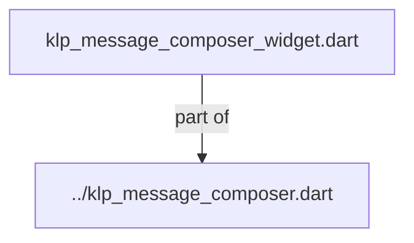
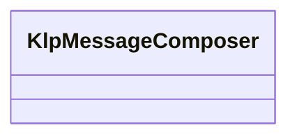
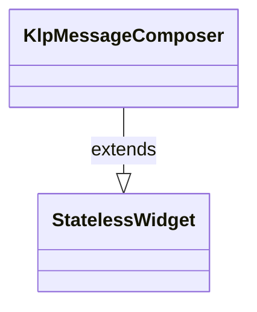

# klp_message_composer_widget.dart：直接依賴與宣告架構

[回到目錄](README.md) · [來源檔案](../../../../../../../lib/src/features/workspace/message_composer/internal/klp_message_composer_widget.dart)

## 範圍

核心是 `lib/src/features/workspace/message_composer/internal/klp_message_composer_widget.dart`。主要視角為該檔案明寫的 import／export／part；輔助視角為本檔宣告及 extends／implements／with／on 關係。只展開一層外部邊界。

## 直接依賴圖

## 依賴證據

| 關係 | 原始 directive | 來源 |
|---|---|---|
| part of | <code>part of &#x27;../klp_message_composer.dart&#x27;;</code> | [lib/src/features/workspace/message_composer/internal/klp_message_composer_widget.dart:1](../../../../../../../lib/src/features/workspace/message_composer/internal/klp_message_composer_widget.dart#L1) |

## 宣告關係圖

本組節點是本檔宣告；沒有箭頭的宣告未在此圖主張互相依賴。

## 宣告與成員證據

成員包含 public 與 private；簽章取自來源，省略函式本體與欄位初始值。`(inferred)` 表示來源未明寫型別；建構子只顯示參數部分，不含初始化列表。

### KlpMessageComposer

ClassDeclaration · public · [lib/src/features/workspace/message_composer/internal/klp_message_composer_widget.dart:3](../../../../../../../lib/src/features/workspace/message_composer/internal/klp_message_composer_widget.dart#L3)

<code>class KlpMessageComposer extends StatelessWidget</code>

來源註解摘要：帶有範圍標籤、附件動作與提交動作的多行訊息輸入器。

- `extends` → <code>StatelessWidget</code>：[lib/src/features/workspace/message_composer/internal/klp_message_composer_widget.dart:4](../../../../../../../lib/src/features/workspace/message_composer/internal/klp_message_composer_widget.dart#L4)

| 成員 | 可見性 | 簽章／型別 | 來源註解摘要 | 證據 |
|---|---|---|---|---|
| constructor <code>KlpMessageComposer</code> | public | <code>const KlpMessageComposer({ super.key, required this.placeholder, required this.sendLabel, required this.attachLabel, required this.onSend, required this.onAttach, this.tags = const [], this.value, this.onChanged, this.dense = false, this.inlineActions = false, this.outlined = false, this.minLines = 1, this.maxLines = 5, })</code> |  | [lib/src/features/workspace/message_composer/internal/klp_message_composer_widget.dart:5](../../../../../../../lib/src/features/workspace/message_composer/internal/klp_message_composer_widget.dart#L5) |
| field <code>placeholder</code> | public | <code>final String placeholder</code> |  | [lib/src/features/workspace/message_composer/internal/klp_message_composer_widget.dart:22](../../../../../../../lib/src/features/workspace/message_composer/internal/klp_message_composer_widget.dart#L22) |
| field <code>sendLabel</code> | public | <code>final String sendLabel</code> |  | [lib/src/features/workspace/message_composer/internal/klp_message_composer_widget.dart:23](../../../../../../../lib/src/features/workspace/message_composer/internal/klp_message_composer_widget.dart#L23) |
| field <code>attachLabel</code> | public | <code>final String attachLabel</code> |  | [lib/src/features/workspace/message_composer/internal/klp_message_composer_widget.dart:24](../../../../../../../lib/src/features/workspace/message_composer/internal/klp_message_composer_widget.dart#L24) |
| field <code>onSend</code> | public | <code>final VoidCallback? onSend</code> |  | [lib/src/features/workspace/message_composer/internal/klp_message_composer_widget.dart:25](../../../../../../../lib/src/features/workspace/message_composer/internal/klp_message_composer_widget.dart#L25) |
| field <code>onAttach</code> | public | <code>final VoidCallback? onAttach</code> |  | [lib/src/features/workspace/message_composer/internal/klp_message_composer_widget.dart:26](../../../../../../../lib/src/features/workspace/message_composer/internal/klp_message_composer_widget.dart#L26) |
| field <code>tags</code> | public | <code>final List&lt;String&gt; tags</code> |  | [lib/src/features/workspace/message_composer/internal/klp_message_composer_widget.dart:27](../../../../../../../lib/src/features/workspace/message_composer/internal/klp_message_composer_widget.dart#L27) |
| field <code>value</code> | public | <code>final String? value</code> |  | [lib/src/features/workspace/message_composer/internal/klp_message_composer_widget.dart:28](../../../../../../../lib/src/features/workspace/message_composer/internal/klp_message_composer_widget.dart#L28) |
| field <code>onChanged</code> | public | <code>final ValueChanged&lt;String&gt;? onChanged</code> |  | [lib/src/features/workspace/message_composer/internal/klp_message_composer_widget.dart:29](../../../../../../../lib/src/features/workspace/message_composer/internal/klp_message_composer_widget.dart#L29) |
| field <code>dense</code> | public | <code>final bool dense</code> |  | [lib/src/features/workspace/message_composer/internal/klp_message_composer_widget.dart:30](../../../../../../../lib/src/features/workspace/message_composer/internal/klp_message_composer_widget.dart#L30) |
| field <code>inlineActions</code> | public | <code>final bool inlineActions</code> |  | [lib/src/features/workspace/message_composer/internal/klp_message_composer_widget.dart:31](../../../../../../../lib/src/features/workspace/message_composer/internal/klp_message_composer_widget.dart#L31) |
| field <code>outlined</code> | public | <code>final bool outlined</code> |  | [lib/src/features/workspace/message_composer/internal/klp_message_composer_widget.dart:32](../../../../../../../lib/src/features/workspace/message_composer/internal/klp_message_composer_widget.dart#L32) |
| field <code>minLines</code> | public | <code>final int minLines</code> |  | [lib/src/features/workspace/message_composer/internal/klp_message_composer_widget.dart:33](../../../../../../../lib/src/features/workspace/message_composer/internal/klp_message_composer_widget.dart#L33) |
| field <code>maxLines</code> | public | <code>final int? maxLines</code> |  | [lib/src/features/workspace/message_composer/internal/klp_message_composer_widget.dart:34](../../../../../../../lib/src/features/workspace/message_composer/internal/klp_message_composer_widget.dart#L34) |
| method <code>build</code> | public | <code>Widget build(BuildContext context)</code> |  | [lib/src/features/workspace/message_composer/internal/klp_message_composer_widget.dart:36](../../../../../../../lib/src/features/workspace/message_composer/internal/klp_message_composer_widget.dart#L36) |

## 閱讀說明與限制

箭頭只表示來源明寫的靜態關係；import 不等於呼叫。未分析動態呼叫、欄位的實際物件擁有權、狀態轉移或渲染流程；型別未進行語意解析，繼承目標保留原始型別拼寫。public／private 依 Dart 名稱前綴判斷；public 宣告不代表已由 `lib/kallopis.dart` 匯出。

本頁由 `tool/architecture_atlas` 產生；編輯來源或生成工具後重新產生，避免手改本頁。
