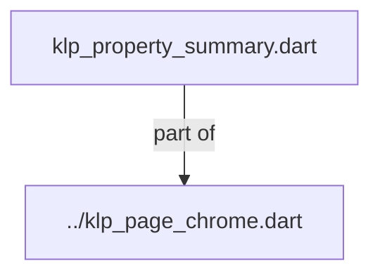
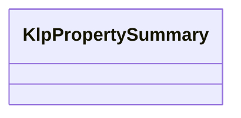
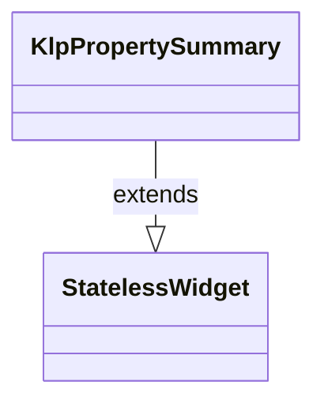

# klp_property_summary.dart：直接依賴與宣告架構

[回到目錄](README.md) · [來源檔案](../../../../../../../lib/src/features/workspace/page_chrome/internal/klp_property_summary.dart)

## 範圍

核心是 `lib/src/features/workspace/page_chrome/internal/klp_property_summary.dart`。主要視角為該檔案明寫的 import／export／part；輔助視角為本檔宣告及 extends／implements／with／on 關係。只展開一層外部邊界。

## 直接依賴圖

## 依賴證據

| 關係 | 原始 directive | 來源 |
|---|---|---|
| part of | <code>part of &#x27;../klp_page_chrome.dart&#x27;;</code> | [lib/src/features/workspace/page_chrome/internal/klp_property_summary.dart:1](../../../../../../../lib/src/features/workspace/page_chrome/internal/klp_property_summary.dart#L1) |

## 宣告關係圖

本組節點是本檔宣告；沒有箭頭的宣告未在此圖主張互相依賴。

## 宣告與成員證據

成員包含 public 與 private；簽章取自來源，省略函式本體與欄位初始值。`(inferred)` 表示來源未明寫型別；建構子只顯示參數部分，不含初始化列表。

### KlpPropertySummary

ClassDeclaration · public · [lib/src/features/workspace/page_chrome/internal/klp_property_summary.dart:3](../../../../../../../lib/src/features/workspace/page_chrome/internal/klp_property_summary.dart#L3)

<code>class KlpPropertySummary extends StatelessWidget</code>

來源註解摘要：實體的屬性摘要卡片：一排狀態徽章、一排標籤，再加一行中繼資料文字， 依序垂直排列。 三段固定按這個順序（badges → tags → metadata）呈現，不是各自獨立可 重排的插槽；若版面需要不同順序或省略某一段，請直接組合 [KlpBadge]／[KlpTag]／[KlpText] 而不是硬塞空清單進來。

- `extends` → <code>StatelessWidget</code>：[lib/src/features/workspace/page_chrome/internal/klp_property_summary.dart:9](../../../../../../../lib/src/features/workspace/page_chrome/internal/klp_property_summary.dart#L9)

| 成員 | 可見性 | 簽章／型別 | 來源註解摘要 | 證據 |
|---|---|---|---|---|
| constructor <code>KlpPropertySummary</code> | public | <code>const KlpPropertySummary({ super.key, required this.badges, required this.tags, required this.metadata, })</code> |  | [lib/src/features/workspace/page_chrome/internal/klp_property_summary.dart:10](../../../../../../../lib/src/features/workspace/page_chrome/internal/klp_property_summary.dart#L10) |
| field <code>badges</code> | public | <code>final List&lt;KlpPropertyBadgeData&gt; badges</code> |  | [lib/src/features/workspace/page_chrome/internal/klp_property_summary.dart:17](../../../../../../../lib/src/features/workspace/page_chrome/internal/klp_property_summary.dart#L17) |
| field <code>tags</code> | public | <code>final List&lt;String&gt; tags</code> |  | [lib/src/features/workspace/page_chrome/internal/klp_property_summary.dart:18](../../../../../../../lib/src/features/workspace/page_chrome/internal/klp_property_summary.dart#L18) |
| field <code>metadata</code> | public | <code>final String metadata</code> |  | [lib/src/features/workspace/page_chrome/internal/klp_property_summary.dart:19](../../../../../../../lib/src/features/workspace/page_chrome/internal/klp_property_summary.dart#L19) |
| method <code>build</code> | public | <code>Widget build(BuildContext context)</code> |  | [lib/src/features/workspace/page_chrome/internal/klp_property_summary.dart:21](../../../../../../../lib/src/features/workspace/page_chrome/internal/klp_property_summary.dart#L21) |

## 閱讀說明與限制

箭頭只表示來源明寫的靜態關係；import 不等於呼叫。未分析動態呼叫、欄位的實際物件擁有權、狀態轉移或渲染流程；型別未進行語意解析，繼承目標保留原始型別拼寫。public／private 依 Dart 名稱前綴判斷；public 宣告不代表已由 `lib/kallopis.dart` 匯出。

本頁由 `tool/architecture_atlas` 產生；編輯來源或生成工具後重新產生，避免手改本頁。
