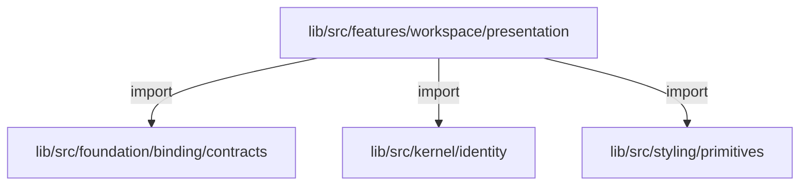
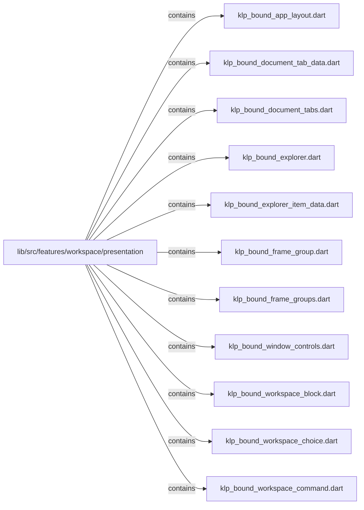
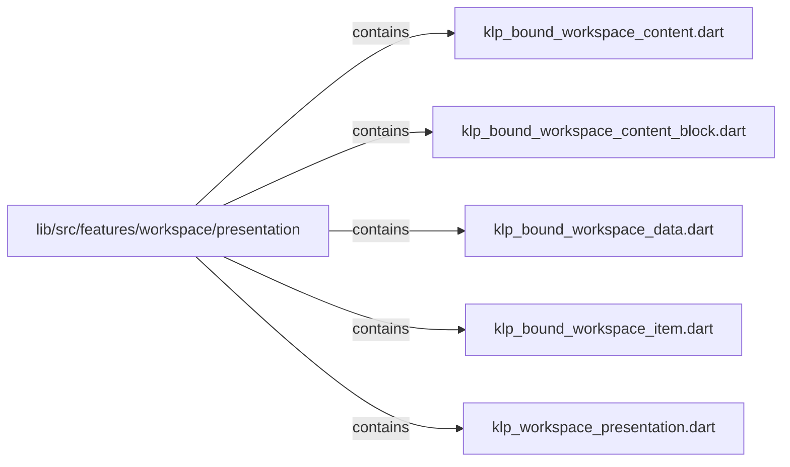

# lib/src/features/workspace/presentation：架構分析入口

[上一層](../README.md)

## 範圍

閱讀 `lib/src/features/workspace/presentation` 的直接子目錄與 Dart 檔案。結構圖表示實際檔案包含關係；依賴圖表示本層檔案明寫的 directives。每個檔案頁另列直接依賴、宣告、欄位、方法、建構子及行號證據。

## 本層直接依賴圖

箭頭以本層 Dart 檔案明寫的 directive 彙總到目標所在目錄或外部套件邊界；不遞迴將子目錄依賴算入本層。相同目標的不同 directive 類型分開計數。

| 目標邊界 | 關係 | directive 數 | 第一筆來源證據 |
|---|---|---|---|
| <code>lib/src/foundation/binding/contracts</code> | import | 2 | [lib/src/features/workspace/presentation/klp_workspace_presentation.dart:4](../../../../../../lib/src/features/workspace/presentation/klp_workspace_presentation.dart#L4) |
| <code>lib/src/kernel/identity</code> | import | 2 | [lib/src/features/workspace/presentation/klp_workspace_presentation.dart:1](../../../../../../lib/src/features/workspace/presentation/klp_workspace_presentation.dart#L1) |
| <code>lib/src/styling/primitives</code> | import | 1 | [lib/src/features/workspace/presentation/klp_workspace_presentation.dart:3](../../../../../../lib/src/features/workspace/presentation/klp_workspace_presentation.dart#L3) |

### 同目錄依賴

| 來源 → 目標 | 關係 | 證據 |
|---|---|---|
| <code>klp_bound_app_layout.dart → klp_workspace_presentation.dart</code> | part of | [lib/src/features/workspace/presentation/klp_bound_app_layout.dart:1](../../../../../../lib/src/features/workspace/presentation/klp_bound_app_layout.dart#L1) |
| <code>klp_bound_document_tab_data.dart → klp_workspace_presentation.dart</code> | part of | [lib/src/features/workspace/presentation/klp_bound_document_tab_data.dart:1](../../../../../../lib/src/features/workspace/presentation/klp_bound_document_tab_data.dart#L1) |
| <code>klp_bound_document_tabs.dart → klp_workspace_presentation.dart</code> | part of | [lib/src/features/workspace/presentation/klp_bound_document_tabs.dart:1](../../../../../../lib/src/features/workspace/presentation/klp_bound_document_tabs.dart#L1) |
| <code>klp_bound_explorer.dart → klp_workspace_presentation.dart</code> | part of | [lib/src/features/workspace/presentation/klp_bound_explorer.dart:1](../../../../../../lib/src/features/workspace/presentation/klp_bound_explorer.dart#L1) |
| <code>klp_bound_explorer_item_data.dart → klp_workspace_presentation.dart</code> | part of | [lib/src/features/workspace/presentation/klp_bound_explorer_item_data.dart:1](../../../../../../lib/src/features/workspace/presentation/klp_bound_explorer_item_data.dart#L1) |
| <code>klp_bound_frame_group.dart → klp_workspace_presentation.dart</code> | part of | [lib/src/features/workspace/presentation/klp_bound_frame_group.dart:1](../../../../../../lib/src/features/workspace/presentation/klp_bound_frame_group.dart#L1) |
| <code>klp_bound_frame_groups.dart → klp_workspace_presentation.dart</code> | part of | [lib/src/features/workspace/presentation/klp_bound_frame_groups.dart:1](../../../../../../lib/src/features/workspace/presentation/klp_bound_frame_groups.dart#L1) |
| <code>klp_bound_window_controls.dart → klp_workspace_presentation.dart</code> | part of | [lib/src/features/workspace/presentation/klp_bound_window_controls.dart:1](../../../../../../lib/src/features/workspace/presentation/klp_bound_window_controls.dart#L1) |
| <code>klp_bound_workspace_block.dart → klp_workspace_presentation.dart</code> | part of | [lib/src/features/workspace/presentation/klp_bound_workspace_block.dart:1](../../../../../../lib/src/features/workspace/presentation/klp_bound_workspace_block.dart#L1) |
| <code>klp_bound_workspace_choice.dart → klp_workspace_presentation.dart</code> | part of | [lib/src/features/workspace/presentation/klp_bound_workspace_choice.dart:1](../../../../../../lib/src/features/workspace/presentation/klp_bound_workspace_choice.dart#L1) |
| <code>klp_bound_workspace_command.dart → klp_workspace_presentation.dart</code> | part of | [lib/src/features/workspace/presentation/klp_bound_workspace_command.dart:1](../../../../../../lib/src/features/workspace/presentation/klp_bound_workspace_command.dart#L1) |
| <code>klp_bound_workspace_content.dart → klp_workspace_presentation.dart</code> | part of | [lib/src/features/workspace/presentation/klp_bound_workspace_content.dart:1](../../../../../../lib/src/features/workspace/presentation/klp_bound_workspace_content.dart#L1) |
| <code>klp_bound_workspace_content_block.dart → klp_workspace_presentation.dart</code> | part of | [lib/src/features/workspace/presentation/klp_bound_workspace_content_block.dart:1](../../../../../../lib/src/features/workspace/presentation/klp_bound_workspace_content_block.dart#L1) |
| <code>klp_bound_workspace_data.dart → klp_workspace_presentation.dart</code> | part of | [lib/src/features/workspace/presentation/klp_bound_workspace_data.dart:1](../../../../../../lib/src/features/workspace/presentation/klp_bound_workspace_data.dart#L1) |
| <code>klp_bound_workspace_item.dart → klp_workspace_presentation.dart</code> | part of | [lib/src/features/workspace/presentation/klp_bound_workspace_item.dart:1](../../../../../../lib/src/features/workspace/presentation/klp_bound_workspace_item.dart#L1) |
| <code>klp_workspace_presentation.dart → klp_bound_app_layout.dart</code> | part | [lib/src/features/workspace/presentation/klp_workspace_presentation.dart:8](../../../../../../lib/src/features/workspace/presentation/klp_workspace_presentation.dart#L8) |
| <code>klp_workspace_presentation.dart → klp_bound_frame_groups.dart</code> | part | [lib/src/features/workspace/presentation/klp_workspace_presentation.dart:9](../../../../../../lib/src/features/workspace/presentation/klp_workspace_presentation.dart#L9) |
| <code>klp_workspace_presentation.dart → klp_bound_frame_group.dart</code> | part | [lib/src/features/workspace/presentation/klp_workspace_presentation.dart:10](../../../../../../lib/src/features/workspace/presentation/klp_workspace_presentation.dart#L10) |
| <code>klp_workspace_presentation.dart → klp_bound_explorer_item_data.dart</code> | part | [lib/src/features/workspace/presentation/klp_workspace_presentation.dart:11](../../../../../../lib/src/features/workspace/presentation/klp_workspace_presentation.dart#L11) |
| <code>klp_workspace_presentation.dart → klp_bound_explorer.dart</code> | part | [lib/src/features/workspace/presentation/klp_workspace_presentation.dart:12](../../../../../../lib/src/features/workspace/presentation/klp_workspace_presentation.dart#L12) |
| <code>klp_workspace_presentation.dart → klp_bound_document_tab_data.dart</code> | part | [lib/src/features/workspace/presentation/klp_workspace_presentation.dart:13](../../../../../../lib/src/features/workspace/presentation/klp_workspace_presentation.dart#L13) |
| <code>klp_workspace_presentation.dart → klp_bound_document_tabs.dart</code> | part | [lib/src/features/workspace/presentation/klp_workspace_presentation.dart:14](../../../../../../lib/src/features/workspace/presentation/klp_workspace_presentation.dart#L14) |
| <code>klp_workspace_presentation.dart → klp_bound_window_controls.dart</code> | part | [lib/src/features/workspace/presentation/klp_workspace_presentation.dart:15](../../../../../../lib/src/features/workspace/presentation/klp_workspace_presentation.dart#L15) |
| <code>klp_workspace_presentation.dart → klp_bound_workspace_data.dart</code> | part | [lib/src/features/workspace/presentation/klp_workspace_presentation.dart:16](../../../../../../lib/src/features/workspace/presentation/klp_workspace_presentation.dart#L16) |
| <code>klp_workspace_presentation.dart → klp_bound_workspace_item.dart</code> | part | [lib/src/features/workspace/presentation/klp_workspace_presentation.dart:17](../../../../../../lib/src/features/workspace/presentation/klp_workspace_presentation.dart#L17) |
| <code>klp_workspace_presentation.dart → klp_bound_workspace_choice.dart</code> | part | [lib/src/features/workspace/presentation/klp_workspace_presentation.dart:18](../../../../../../lib/src/features/workspace/presentation/klp_workspace_presentation.dart#L18) |
| <code>klp_workspace_presentation.dart → klp_bound_workspace_content.dart</code> | part | [lib/src/features/workspace/presentation/klp_workspace_presentation.dart:19](../../../../../../lib/src/features/workspace/presentation/klp_workspace_presentation.dart#L19) |
| <code>klp_workspace_presentation.dart → klp_bound_workspace_content_block.dart</code> | part | [lib/src/features/workspace/presentation/klp_workspace_presentation.dart:20](../../../../../../lib/src/features/workspace/presentation/klp_workspace_presentation.dart#L20) |
| <code>klp_workspace_presentation.dart → klp_bound_workspace_block.dart</code> | part | [lib/src/features/workspace/presentation/klp_workspace_presentation.dart:21](../../../../../../lib/src/features/workspace/presentation/klp_workspace_presentation.dart#L21) |
| <code>klp_workspace_presentation.dart → klp_bound_workspace_command.dart</code> | part | [lib/src/features/workspace/presentation/klp_workspace_presentation.dart:22](../../../../../../lib/src/features/workspace/presentation/klp_workspace_presentation.dart#L22) |

## 目錄結構圖

## 子目錄

| 目錄 | 導航 | 來源證據 |
|---|---|---|
| 無 | 目前沒有下一層目錄 | — |

## 本層檔案

| 檔案 | 宣告 | 細節 | 來源證據 |
|---|---|---|---|
| `klp_bound_app_layout.dart` | KlpBoundAppLayout | [架構與 API](klp_bound_app_layout.md) | [lib/src/features/workspace/presentation/klp_bound_app_layout.dart:1](../../../../../../lib/src/features/workspace/presentation/klp_bound_app_layout.dart#L1) |
| `klp_bound_document_tab_data.dart` | KlpBoundDocumentTabData | [架構與 API](klp_bound_document_tab_data.md) | [lib/src/features/workspace/presentation/klp_bound_document_tab_data.dart:1](../../../../../../lib/src/features/workspace/presentation/klp_bound_document_tab_data.dart#L1) |
| `klp_bound_document_tabs.dart` | KlpBoundDocumentTabs | [架構與 API](klp_bound_document_tabs.md) | [lib/src/features/workspace/presentation/klp_bound_document_tabs.dart:1](../../../../../../lib/src/features/workspace/presentation/klp_bound_document_tabs.dart#L1) |
| `klp_bound_explorer.dart` | KlpBoundExplorer | [架構與 API](klp_bound_explorer.md) | [lib/src/features/workspace/presentation/klp_bound_explorer.dart:1](../../../../../../lib/src/features/workspace/presentation/klp_bound_explorer.dart#L1) |
| `klp_bound_explorer_item_data.dart` | KlpBoundExplorerItemData | [架構與 API](klp_bound_explorer_item_data.md) | [lib/src/features/workspace/presentation/klp_bound_explorer_item_data.dart:1](../../../../../../lib/src/features/workspace/presentation/klp_bound_explorer_item_data.dart#L1) |
| `klp_bound_frame_group.dart` | KlpBoundFrameGroup | [架構與 API](klp_bound_frame_group.md) | [lib/src/features/workspace/presentation/klp_bound_frame_group.dart:1](../../../../../../lib/src/features/workspace/presentation/klp_bound_frame_group.dart#L1) |
| `klp_bound_frame_groups.dart` | KlpBoundFrameGroups | [架構與 API](klp_bound_frame_groups.md) | [lib/src/features/workspace/presentation/klp_bound_frame_groups.dart:1](../../../../../../lib/src/features/workspace/presentation/klp_bound_frame_groups.dart#L1) |
| `klp_bound_window_controls.dart` | KlpBoundWindowControls | [架構與 API](klp_bound_window_controls.md) | [lib/src/features/workspace/presentation/klp_bound_window_controls.dart:1](../../../../../../lib/src/features/workspace/presentation/klp_bound_window_controls.dart#L1) |
| `klp_bound_workspace_block.dart` | KlpBoundWorkspaceBlock | [架構與 API](klp_bound_workspace_block.md) | [lib/src/features/workspace/presentation/klp_bound_workspace_block.dart:1](../../../../../../lib/src/features/workspace/presentation/klp_bound_workspace_block.dart#L1) |
| `klp_bound_workspace_choice.dart` | KlpBoundWorkspaceChoice | [架構與 API](klp_bound_workspace_choice.md) | [lib/src/features/workspace/presentation/klp_bound_workspace_choice.dart:1](../../../../../../lib/src/features/workspace/presentation/klp_bound_workspace_choice.dart#L1) |
| `klp_bound_workspace_command.dart` | KlpBoundWorkspaceCommand | [架構與 API](klp_bound_workspace_command.md) | [lib/src/features/workspace/presentation/klp_bound_workspace_command.dart:1](../../../../../../lib/src/features/workspace/presentation/klp_bound_workspace_command.dart#L1) |
| `klp_bound_workspace_content.dart` | KlpBoundWorkspaceContent | [架構與 API](klp_bound_workspace_content.md) | [lib/src/features/workspace/presentation/klp_bound_workspace_content.dart:1](../../../../../../lib/src/features/workspace/presentation/klp_bound_workspace_content.dart#L1) |
| `klp_bound_workspace_content_block.dart` | KlpBoundWorkspaceContentBlock | [架構與 API](klp_bound_workspace_content_block.md) | [lib/src/features/workspace/presentation/klp_bound_workspace_content_block.dart:1](../../../../../../lib/src/features/workspace/presentation/klp_bound_workspace_content_block.dart#L1) |
| `klp_bound_workspace_data.dart` | KlpBoundWorkspaceData | [架構與 API](klp_bound_workspace_data.md) | [lib/src/features/workspace/presentation/klp_bound_workspace_data.dart:1](../../../../../../lib/src/features/workspace/presentation/klp_bound_workspace_data.dart#L1) |
| `klp_bound_workspace_item.dart` | KlpBoundWorkspaceItem | [架構與 API](klp_bound_workspace_item.md) | [lib/src/features/workspace/presentation/klp_bound_workspace_item.dart:1](../../../../../../lib/src/features/workspace/presentation/klp_bound_workspace_item.dart#L1) |
| `klp_workspace_presentation.dart` | 無頂層宣告 | [架構與 API](klp_workspace_presentation.md) | [lib/src/features/workspace/presentation/klp_workspace_presentation.dart:1](../../../../../../lib/src/features/workspace/presentation/klp_workspace_presentation.dart#L1) |

## 閱讀說明

箭頭只表示來源明寫的靜態關係；import 不等於呼叫。未分析動態呼叫、欄位的實際物件擁有權、狀態轉移或渲染流程；型別未進行語意解析，繼承目標保留原始型別拼寫。public／private 依 Dart 名稱前綴判斷；public 宣告不代表已由 `lib/kallopis.dart` 匯出。

本頁的目錄與檔案由來源清冊產生；`manifest.json` 位於本圖集根目錄，可核對 SHA-256 與覆蓋數。人工模組摘要存於 `tool/architecture_atlas/briefs/`，重新生成時保留。
