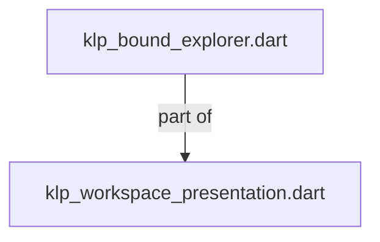
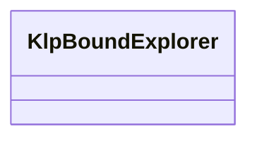
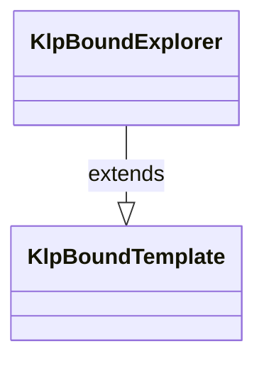

# klp_bound_explorer.dart：直接依賴與宣告架構

[回到目錄](README.md) · [來源檔案](../../../../../../lib/src/features/workspace/presentation/klp_bound_explorer.dart)

## 範圍

核心是 `lib/src/features/workspace/presentation/klp_bound_explorer.dart`。主要視角為該檔案明寫的 import／export／part；輔助視角為本檔宣告及 extends／implements／with／on 關係。只展開一層外部邊界。

## 直接依賴圖

## 依賴證據

| 關係 | 原始 directive | 來源 |
|---|---|---|
| part of | <code>part of &#x27;klp_workspace_presentation.dart&#x27;;</code> | [lib/src/features/workspace/presentation/klp_bound_explorer.dart:1](../../../../../../lib/src/features/workspace/presentation/klp_bound_explorer.dart#L1) |

## 宣告關係圖

本組節點是本檔宣告；沒有箭頭的宣告未在此圖主張互相依賴。

## 宣告與成員證據

成員包含 public 與 private；簽章取自來源，省略函式本體與欄位初始值。`(inferred)` 表示來源未明寫型別；建構子只顯示參數部分，不含初始化列表。

### KlpBoundExplorer

ClassDeclaration · public · [lib/src/features/workspace/presentation/klp_bound_explorer.dart:3](../../../../../../lib/src/features/workspace/presentation/klp_bound_explorer.dart#L3)

<code>final class KlpBoundExplorer extends KlpBoundTemplate</code>

來源註解摘要：已驗證資料、語意樣式與有效影格事件，不保留產品種類分支。

- `extends` → <code>KlpBoundTemplate</code>：[lib/src/features/workspace/presentation/klp_bound_explorer.dart:4](../../../../../../lib/src/features/workspace/presentation/klp_bound_explorer.dart#L4)

| 成員 | 可見性 | 簽章／型別 | 來源註解摘要 | 證據 |
|---|---|---|---|---|
| field <code>treeId</code> | public | <code>final KlpId treeId</code> |  | [lib/src/features/workspace/presentation/klp_bound_explorer.dart:6](../../../../../../lib/src/features/workspace/presentation/klp_bound_explorer.dart#L6) |
| field <code>snapshot</code> | public | <code>final KlpExplorerSnapshot snapshot</code> |  | [lib/src/features/workspace/presentation/klp_bound_explorer.dart:7](../../../../../../lib/src/features/workspace/presentation/klp_bound_explorer.dart#L7) |
| field <code>actionsLabel</code> | public | <code>final String actionsLabel</code> |  | [lib/src/features/workspace/presentation/klp_bound_explorer.dart:8](../../../../../../lib/src/features/workspace/presentation/klp_bound_explorer.dart#L8) |
| field <code>expandLabel</code> | public | <code>final String expandLabel</code> |  | [lib/src/features/workspace/presentation/klp_bound_explorer.dart:8](../../../../../../lib/src/features/workspace/presentation/klp_bound_explorer.dart#L8) |
| field <code>collapseLabel</code> | public | <code>final String collapseLabel</code> |  | [lib/src/features/workspace/presentation/klp_bound_explorer.dart:8](../../../../../../lib/src/features/workspace/presentation/klp_bound_explorer.dart#L8) |
| field <code>onSelectionChanged</code> | public | <code>final void Function(KlpExplorerSelectionChange)? onSelectionChanged</code> |  | [lib/src/features/workspace/presentation/klp_bound_explorer.dart:9](../../../../../../lib/src/features/workspace/presentation/klp_bound_explorer.dart#L9) |
| field <code>onActivate</code> | public | <code>final void Function(KlpId)? onActivate</code> |  | [lib/src/features/workspace/presentation/klp_bound_explorer.dart:10](../../../../../../lib/src/features/workspace/presentation/klp_bound_explorer.dart#L10) |
| field <code>onExpandedChanged</code> | public | <code>final void Function(KlpId, bool)? onExpandedChanged</code> |  | [lib/src/features/workspace/presentation/klp_bound_explorer.dart:11](../../../../../../lib/src/features/workspace/presentation/klp_bound_explorer.dart#L11) |
| field <code>canDrop</code> | public | <code>final KlpExplorerDropPermission canDrop</code> |  | [lib/src/features/workspace/presentation/klp_bound_explorer.dart:12](../../../../../../lib/src/features/workspace/presentation/klp_bound_explorer.dart#L12) |
| field <code>onDrop</code> | public | <code>final void Function(KlpExplorerDropRequest)? onDrop</code> |  | [lib/src/features/workspace/presentation/klp_bound_explorer.dart:13](../../../../../../lib/src/features/workspace/presentation/klp_bound_explorer.dart#L13) |
| field <code>isActive</code> | public | <code>final bool Function() isActive</code> |  | [lib/src/features/workspace/presentation/klp_bound_explorer.dart:14](../../../../../../lib/src/features/workspace/presentation/klp_bound_explorer.dart#L14) |
| field <code>surface</code> | public | <code>final KlpColor surface</code> |  | [lib/src/features/workspace/presentation/klp_bound_explorer.dart:15](../../../../../../lib/src/features/workspace/presentation/klp_bound_explorer.dart#L15) |
| field <code>foreground</code> | public | <code>final KlpColor foreground</code> |  | [lib/src/features/workspace/presentation/klp_bound_explorer.dart:15](../../../../../../lib/src/features/workspace/presentation/klp_bound_explorer.dart#L15) |
| field <code>mutedForeground</code> | public | <code>final KlpColor mutedForeground</code> |  | [lib/src/features/workspace/presentation/klp_bound_explorer.dart:15](../../../../../../lib/src/features/workspace/presentation/klp_bound_explorer.dart#L15) |
| field <code>selectedBackground</code> | public | <code>final KlpColor selectedBackground</code> |  | [lib/src/features/workspace/presentation/klp_bound_explorer.dart:15](../../../../../../lib/src/features/workspace/presentation/klp_bound_explorer.dart#L15) |
| field <code>focusColor</code> | public | <code>final KlpColor focusColor</code> |  | [lib/src/features/workspace/presentation/klp_bound_explorer.dart:15](../../../../../../lib/src/features/workspace/presentation/klp_bound_explorer.dart#L15) |
| field <code>nodeExtent</code> | public | <code>final KlpDistance nodeExtent</code> |  | [lib/src/features/workspace/presentation/klp_bound_explorer.dart:16](../../../../../../lib/src/features/workspace/presentation/klp_bound_explorer.dart#L16) |
| field <code>categoryExtent</code> | public | <code>final KlpDistance categoryExtent</code> |  | [lib/src/features/workspace/presentation/klp_bound_explorer.dart:16](../../../../../../lib/src/features/workspace/presentation/klp_bound_explorer.dart#L16) |
| field <code>iconExtent</code> | public | <code>final KlpDistance iconExtent</code> |  | [lib/src/features/workspace/presentation/klp_bound_explorer.dart:16](../../../../../../lib/src/features/workspace/presentation/klp_bound_explorer.dart#L16) |
| field <code>indent</code> | public | <code>final KlpDistance indent</code> |  | [lib/src/features/workspace/presentation/klp_bound_explorer.dart:16](../../../../../../lib/src/features/workspace/presentation/klp_bound_explorer.dart#L16) |
| field <code>inset</code> | public | <code>final KlpDistance inset</code> |  | [lib/src/features/workspace/presentation/klp_bound_explorer.dart:16](../../../../../../lib/src/features/workspace/presentation/klp_bound_explorer.dart#L16) |
| field <code>gap</code> | public | <code>final KlpDistance gap</code> |  | [lib/src/features/workspace/presentation/klp_bound_explorer.dart:16](../../../../../../lib/src/features/workspace/presentation/klp_bound_explorer.dart#L16) |
| field <code>disclosureExtent</code> | public | <code>final KlpDistance disclosureExtent</code> |  | [lib/src/features/workspace/presentation/klp_bound_explorer.dart:16](../../../../../../lib/src/features/workspace/presentation/klp_bound_explorer.dart#L16) |
| field <code>actionExtent</code> | public | <code>final KlpDistance actionExtent</code> |  | [lib/src/features/workspace/presentation/klp_bound_explorer.dart:16](../../../../../../lib/src/features/workspace/presentation/klp_bound_explorer.dart#L16) |
| field <code>categoryFontSize</code> | public | <code>final KlpFontSize categoryFontSize</code> |  | [lib/src/features/workspace/presentation/klp_bound_explorer.dart:17](../../../../../../lib/src/features/workspace/presentation/klp_bound_explorer.dart#L17) |
| field <code>radius</code> | public | <code>final KlpRadius radius</code> |  | [lib/src/features/workspace/presentation/klp_bound_explorer.dart:18](../../../../../../lib/src/features/workspace/presentation/klp_bound_explorer.dart#L18) |
| field <code>focusWidth</code> | public | <code>final KlpStrokeWidth focusWidth</code> |  | [lib/src/features/workspace/presentation/klp_bound_explorer.dart:19](../../../../../../lib/src/features/workspace/presentation/klp_bound_explorer.dart#L19) |
| field <code>textStyle</code> | public | <code>final KlpBoundTextStyle textStyle</code> |  | [lib/src/features/workspace/presentation/klp_bound_explorer.dart:20](../../../../../../lib/src/features/workspace/presentation/klp_bound_explorer.dart#L20) |
| constructor <code>KlpBoundExplorer</code> | public | <code>const KlpBoundExplorer({required this.treeId, required this.snapshot, required this.actionsLabel, required this.expandLabel, required this.collapseLabel, required this.onSelectionChanged, required this.onActivate, required this.onExpandedChanged, required this.canDrop, required this.onDrop, required this.isActive, required this.surface, required this.foreground, required this.mutedForeground, required this.selectedBackground, required this.focusColor, required this.nodeExtent, required this.categoryExtent, required this.iconExtent, required this.categoryFontSize, required this.indent, required this.inset, required this.gap, required this.disclosureExtent, required this.actionExtent, required this.radius, required this.focusWidth, required this.textStyle})</code> |  | [lib/src/features/workspace/presentation/klp_bound_explorer.dart:22](../../../../../../lib/src/features/workspace/presentation/klp_bound_explorer.dart#L22) |
| getter <code>tree</code> | public | <code>KlpExplorerTreeSnapshot get tree</code> |  | [lib/src/features/workspace/presentation/klp_bound_explorer.dart:24](../../../../../../lib/src/features/workspace/presentation/klp_bound_explorer.dart#L24) |
| getter <code>selection</code> | public | <code>KlpExplorerSelectionScope get selection</code> |  | [lib/src/features/workspace/presentation/klp_bound_explorer.dart:25](../../../../../../lib/src/features/workspace/presentation/klp_bound_explorer.dart#L25) |

## 閱讀說明與限制

箭頭只表示來源明寫的靜態關係；import 不等於呼叫。未分析動態呼叫、欄位的實際物件擁有權、狀態轉移或渲染流程；型別未進行語意解析，繼承目標保留原始型別拼寫。public／private 依 Dart 名稱前綴判斷；public 宣告不代表已由 `lib/kallopis.dart` 匯出。

本頁由 `tool/architecture_atlas` 產生；編輯來源或生成工具後重新產生，避免手改本頁。
