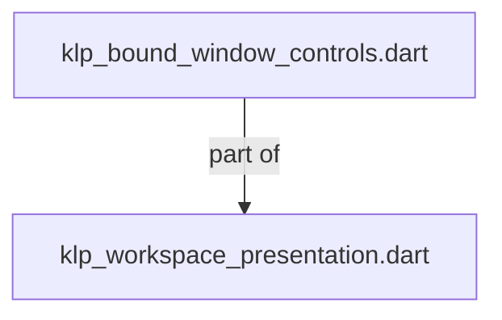
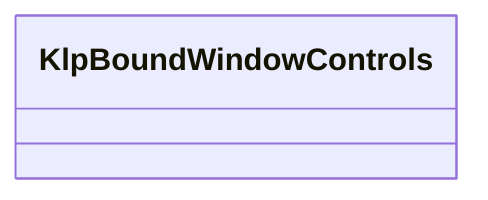
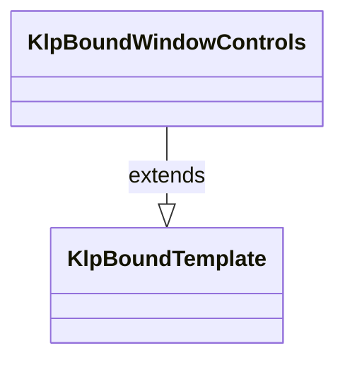

# klp_bound_window_controls.dart：直接依賴與宣告架構

[回到目錄](README.md) · [來源檔案](../../../../../../lib/src/features/workspace/presentation/klp_bound_window_controls.dart)

## 範圍

核心是 `lib/src/features/workspace/presentation/klp_bound_window_controls.dart`。主要視角為該檔案明寫的 import／export／part；輔助視角為本檔宣告及 extends／implements／with／on 關係。只展開一層外部邊界。

## 直接依賴圖

## 依賴證據

| 關係 | 原始 directive | 來源 |
|---|---|---|
| part of | <code>part of &#x27;klp_workspace_presentation.dart&#x27;;</code> | [lib/src/features/workspace/presentation/klp_bound_window_controls.dart:1](../../../../../../lib/src/features/workspace/presentation/klp_bound_window_controls.dart#L1) |

## 宣告關係圖

本組節點是本檔宣告；沒有箭頭的宣告未在此圖主張互相依賴。

## 宣告與成員證據

成員包含 public 與 private；簽章取自來源，省略函式本體與欄位初始值。`(inferred)` 表示來源未明寫型別；建構子只顯示參數部分，不含初始化列表。

### KlpBoundWindowControls

ClassDeclaration · public · [lib/src/features/workspace/presentation/klp_bound_window_controls.dart:3](../../../../../../lib/src/features/workspace/presentation/klp_bound_window_controls.dart#L3)

<code>final class KlpBoundWindowControls extends KlpBoundTemplate</code>

來源註解摘要：套件內部的唯讀視窗控制呈現紀錄，攜帶最大化輸入、操作回呼及已解析樣式。 不屬使用端 API，不擁有原生視窗狀態或執行平台操作。

- `extends` → <code>KlpBoundTemplate</code>：[lib/src/features/workspace/presentation/klp_bound_window_controls.dart:5](../../../../../../lib/src/features/workspace/presentation/klp_bound_window_controls.dart#L5)

| 成員 | 可見性 | 簽章／型別 | 來源註解摘要 | 證據 |
|---|---|---|---|---|
| field <code>isMaximized</code> | public | <code>final bool isMaximized</code> |  | [lib/src/features/workspace/presentation/klp_bound_window_controls.dart:6](../../../../../../lib/src/features/workspace/presentation/klp_bound_window_controls.dart#L6) |
| field <code>onMinimize</code> | public | <code>final void Function()? onMinimize</code> |  | [lib/src/features/workspace/presentation/klp_bound_window_controls.dart:7](../../../../../../lib/src/features/workspace/presentation/klp_bound_window_controls.dart#L7) |
| field <code>onToggleMaximize</code> | public | <code>final void Function()? onToggleMaximize</code> |  | [lib/src/features/workspace/presentation/klp_bound_window_controls.dart:8](../../../../../../lib/src/features/workspace/presentation/klp_bound_window_controls.dart#L8) |
| field <code>onClose</code> | public | <code>final void Function()? onClose</code> |  | [lib/src/features/workspace/presentation/klp_bound_window_controls.dart:9](../../../../../../lib/src/features/workspace/presentation/klp_bound_window_controls.dart#L9) |
| field <code>background</code> | public | <code>final KlpColor background</code> |  | [lib/src/features/workspace/presentation/klp_bound_window_controls.dart:10](../../../../../../lib/src/features/workspace/presentation/klp_bound_window_controls.dart#L10) |
| field <code>foreground</code> | public | <code>final KlpColor foreground</code> |  | [lib/src/features/workspace/presentation/klp_bound_window_controls.dart:11](../../../../../../lib/src/features/workspace/presentation/klp_bound_window_controls.dart#L11) |
| field <code>closeHover</code> | public | <code>final KlpColor closeHover</code> |  | [lib/src/features/workspace/presentation/klp_bound_window_controls.dart:12](../../../../../../lib/src/features/workspace/presentation/klp_bound_window_controls.dart#L12) |
| field <code>focusColor</code> | public | <code>final KlpColor focusColor</code> |  | [lib/src/features/workspace/presentation/klp_bound_window_controls.dart:13](../../../../../../lib/src/features/workspace/presentation/klp_bound_window_controls.dart#L13) |
| field <code>extent</code> | public | <code>final KlpDistance extent</code> |  | [lib/src/features/workspace/presentation/klp_bound_window_controls.dart:14](../../../../../../lib/src/features/workspace/presentation/klp_bound_window_controls.dart#L14) |
| field <code>buttonExtent</code> | public | <code>final KlpDistance buttonExtent</code> |  | [lib/src/features/workspace/presentation/klp_bound_window_controls.dart:15](../../../../../../lib/src/features/workspace/presentation/klp_bound_window_controls.dart#L15) |
| field <code>gap</code> | public | <code>final KlpDistance gap</code> |  | [lib/src/features/workspace/presentation/klp_bound_window_controls.dart:16](../../../../../../lib/src/features/workspace/presentation/klp_bound_window_controls.dart#L16) |
| field <code>radius</code> | public | <code>final KlpRadius radius</code> |  | [lib/src/features/workspace/presentation/klp_bound_window_controls.dart:17](../../../../../../lib/src/features/workspace/presentation/klp_bound_window_controls.dart#L17) |
| field <code>focusWidth</code> | public | <code>final KlpStrokeWidth focusWidth</code> |  | [lib/src/features/workspace/presentation/klp_bound_window_controls.dart:18](../../../../../../lib/src/features/workspace/presentation/klp_bound_window_controls.dart#L18) |
| constructor <code>KlpBoundWindowControls</code> | public | <code>const KlpBoundWindowControls({required this.isMaximized, required this.onMinimize, required this.onToggleMaximize, required this.onClose, required this.background, required this.foreground, required this.closeHover, required this.focusColor, required this.extent, required this.buttonExtent, required this.gap, required this.radius, required this.focusWidth})</code> |  | [lib/src/features/workspace/presentation/klp_bound_window_controls.dart:19](../../../../../../lib/src/features/workspace/presentation/klp_bound_window_controls.dart#L19) |

## 閱讀說明與限制

箭頭只表示來源明寫的靜態關係；import 不等於呼叫。未分析動態呼叫、欄位的實際物件擁有權、狀態轉移或渲染流程；型別未進行語意解析，繼承目標保留原始型別拼寫。public／private 依 Dart 名稱前綴判斷；public 宣告不代表已由 `lib/kallopis.dart` 匯出。

本頁由 `tool/architecture_atlas` 產生；編輯來源或生成工具後重新產生，避免手改本頁。
