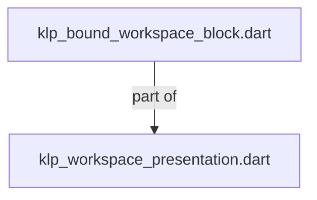
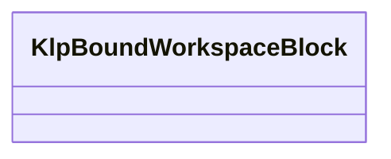
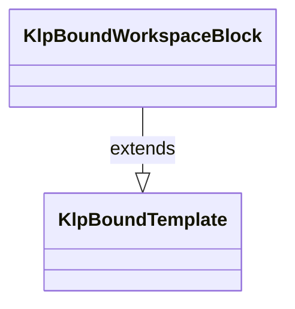

# klp_bound_workspace_block.dart：直接依賴與宣告架構

[回到目錄](README.md) · [來源檔案](../../../../../../lib/src/features/workspace/presentation/klp_bound_workspace_block.dart)

## 範圍

核心是 `lib/src/features/workspace/presentation/klp_bound_workspace_block.dart`。主要視角為該檔案明寫的 import／export／part；輔助視角為本檔宣告及 extends／implements／with／on 關係。只展開一層外部邊界。

## 直接依賴圖

## 依賴證據

| 關係 | 原始 directive | 來源 |
|---|---|---|
| part of | <code>part of &#x27;klp_workspace_presentation.dart&#x27;;</code> | [lib/src/features/workspace/presentation/klp_bound_workspace_block.dart:1](../../../../../../lib/src/features/workspace/presentation/klp_bound_workspace_block.dart#L1) |

## 宣告關係圖

本組節點是本檔宣告；沒有箭頭的宣告未在此圖主張互相依賴。

## 宣告與成員證據

成員包含 public 與 private；簽章取自來源，省略函式本體與欄位初始值。`(inferred)` 表示來源未明寫型別；建構子只顯示參數部分，不含初始化列表。

### KlpBoundWorkspaceBlock

ClassDeclaration · public · [lib/src/features/workspace/presentation/klp_bound_workspace_block.dart:3](../../../../../../lib/src/features/workspace/presentation/klp_bound_workspace_block.dart#L3)

<code>final class KlpBoundWorkspaceBlock extends KlpBoundTemplate</code>

來源註解摘要：套件內部的唯讀工作區區塊呈現紀錄，彙整內容、事件回呼及已解析樣式。 不屬使用端 API，不另建產品狀態或主題來源。

- `extends` → <code>KlpBoundTemplate</code>：[lib/src/features/workspace/presentation/klp_bound_workspace_block.dart:5](../../../../../../lib/src/features/workspace/presentation/klp_bound_workspace_block.dart#L5)

| 成員 | 可見性 | 簽章／型別 | 來源註解摘要 | 證據 |
|---|---|---|---|---|
| field <code>kind</code> | public | <code>final int kind</code> |  | [lib/src/features/workspace/presentation/klp_bound_workspace_block.dart:6](../../../../../../lib/src/features/workspace/presentation/klp_bound_workspace_block.dart#L6) |
| field <code>title</code> | public | <code>final String title</code> |  | [lib/src/features/workspace/presentation/klp_bound_workspace_block.dart:7](../../../../../../lib/src/features/workspace/presentation/klp_bound_workspace_block.dart#L7) |
| field <code>symbol</code> | public | <code>final String? symbol</code> |  | [lib/src/features/workspace/presentation/klp_bound_workspace_block.dart:8](../../../../../../lib/src/features/workspace/presentation/klp_bound_workspace_block.dart#L8) |
| field <code>icon</code> | public | <code>final int? icon</code> |  | [lib/src/features/workspace/presentation/klp_bound_workspace_block.dart:9](../../../../../../lib/src/features/workspace/presentation/klp_bound_workspace_block.dart#L9) |
| field <code>subtitle</code> | public | <code>final String? subtitle</code> |  | [lib/src/features/workspace/presentation/klp_bound_workspace_block.dart:10](../../../../../../lib/src/features/workspace/presentation/klp_bound_workspace_block.dart#L10) |
| field <code>lines</code> | public | <code>final List&lt;String&gt; lines</code> |  | [lib/src/features/workspace/presentation/klp_bound_workspace_block.dart:11](../../../../../../lib/src/features/workspace/presentation/klp_bound_workspace_block.dart#L11) |
| field <code>checklist</code> | public | <code>final List&lt;String&gt; checklist</code> |  | [lib/src/features/workspace/presentation/klp_bound_workspace_block.dart:12](../../../../../../lib/src/features/workspace/presentation/klp_bound_workspace_block.dart#L12) |
| field <code>checklistTitle</code> | public | <code>final String? checklistTitle</code> |  | [lib/src/features/workspace/presentation/klp_bound_workspace_block.dart:13](../../../../../../lib/src/features/workspace/presentation/klp_bound_workspace_block.dart#L13) |
| field <code>items</code> | public | <code>final List&lt;KlpBoundWorkspaceItem&gt; items</code> |  | [lib/src/features/workspace/presentation/klp_bound_workspace_block.dart:14](../../../../../../lib/src/features/workspace/presentation/klp_bound_workspace_block.dart#L14) |
| field <code>choices</code> | public | <code>final List&lt;KlpBoundWorkspaceChoice&gt; choices</code> |  | [lib/src/features/workspace/presentation/klp_bound_workspace_block.dart:15](../../../../../../lib/src/features/workspace/presentation/klp_bound_workspace_block.dart#L15) |
| field <code>query</code> | public | <code>final String? query</code> |  | [lib/src/features/workspace/presentation/klp_bound_workspace_block.dart:16](../../../../../../lib/src/features/workspace/presentation/klp_bound_workspace_block.dart#L16) |
| field <code>hint</code> | public | <code>final String? hint</code> |  | [lib/src/features/workspace/presentation/klp_bound_workspace_block.dart:17](../../../../../../lib/src/features/workspace/presentation/klp_bound_workspace_block.dart#L17) |
| field <code>onQueryChanged</code> | public | <code>final void Function(String)? onQueryChanged</code> |  | [lib/src/features/workspace/presentation/klp_bound_workspace_block.dart:18](../../../../../../lib/src/features/workspace/presentation/klp_bound_workspace_block.dart#L18) |
| field <code>toggleLabel</code> | public | <code>final String? toggleLabel</code> |  | [lib/src/features/workspace/presentation/klp_bound_workspace_block.dart:19](../../../../../../lib/src/features/workspace/presentation/klp_bound_workspace_block.dart#L19) |
| field <code>toggleValue</code> | public | <code>final bool? toggleValue</code> |  | [lib/src/features/workspace/presentation/klp_bound_workspace_block.dart:20](../../../../../../lib/src/features/workspace/presentation/klp_bound_workspace_block.dart#L20) |
| field <code>onToggleChanged</code> | public | <code>final void Function(bool)? onToggleChanged</code> |  | [lib/src/features/workspace/presentation/klp_bound_workspace_block.dart:21](../../../../../../lib/src/features/workspace/presentation/klp_bound_workspace_block.dart#L21) |
| field <code>selected</code> | public | <code>final bool selected</code> |  | [lib/src/features/workspace/presentation/klp_bound_workspace_block.dart:22](../../../../../../lib/src/features/workspace/presentation/klp_bound_workspace_block.dart#L22) |
| field <code>onPressed</code> | public | <code>final void Function()? onPressed</code> |  | [lib/src/features/workspace/presentation/klp_bound_workspace_block.dart:23](../../../../../../lib/src/features/workspace/presentation/klp_bound_workspace_block.dart#L23) |
| field <code>secondaryActionLabel</code> | public | <code>final String? secondaryActionLabel</code> |  | [lib/src/features/workspace/presentation/klp_bound_workspace_block.dart:24](../../../../../../lib/src/features/workspace/presentation/klp_bound_workspace_block.dart#L24) |
| field <code>onSecondaryAction</code> | public | <code>final void Function()? onSecondaryAction</code> |  | [lib/src/features/workspace/presentation/klp_bound_workspace_block.dart:25](../../../../../../lib/src/features/workspace/presentation/klp_bound_workspace_block.dart#L25) |
| field <code>tertiaryActionLabel</code> | public | <code>final String? tertiaryActionLabel</code> |  | [lib/src/features/workspace/presentation/klp_bound_workspace_block.dart:26](../../../../../../lib/src/features/workspace/presentation/klp_bound_workspace_block.dart#L26) |
| field <code>onTertiaryAction</code> | public | <code>final void Function()? onTertiaryAction</code> |  | [lib/src/features/workspace/presentation/klp_bound_workspace_block.dart:27](../../../../../../lib/src/features/workspace/presentation/klp_bound_workspace_block.dart#L27) |
| field <code>material</code> | public | <code>final int material</code> |  | [lib/src/features/workspace/presentation/klp_bound_workspace_block.dart:28](../../../../../../lib/src/features/workspace/presentation/klp_bound_workspace_block.dart#L28) |
| field <code>shadowed</code> | public | <code>final bool shadowed</code> |  | [lib/src/features/workspace/presentation/klp_bound_workspace_block.dart:29](../../../../../../lib/src/features/workspace/presentation/klp_bound_workspace_block.dart#L29) |
| field <code>materialBackground</code> | public | <code>final KlpColor materialBackground</code> |  | [lib/src/features/workspace/presentation/klp_bound_workspace_block.dart:30](../../../../../../lib/src/features/workspace/presentation/klp_bound_workspace_block.dart#L30) |
| field <code>calloutBackground</code> | public | <code>final KlpColor calloutBackground</code> |  | [lib/src/features/workspace/presentation/klp_bound_workspace_block.dart:31](../../../../../../lib/src/features/workspace/presentation/klp_bound_workspace_block.dart#L31) |
| field <code>content</code> | public | <code>final KlpBoundTemplate? content</code> |  | [lib/src/features/workspace/presentation/klp_bound_workspace_block.dart:32](../../../../../../lib/src/features/workspace/presentation/klp_bound_workspace_block.dart#L32) |
| field <code>actions</code> | public | <code>final List&lt;KlpBoundWorkspaceCommand&gt; actions</code> |  | [lib/src/features/workspace/presentation/klp_bound_workspace_block.dart:33](../../../../../../lib/src/features/workspace/presentation/klp_bound_workspace_block.dart#L33) |
| field <code>actionsLabel</code> | public | <code>final String actionsLabel</code> |  | [lib/src/features/workspace/presentation/klp_bound_workspace_block.dart:34](../../../../../../lib/src/features/workspace/presentation/klp_bound_workspace_block.dart#L34) |
| field <code>background</code> | public | <code>final KlpColor background</code> |  | [lib/src/features/workspace/presentation/klp_bound_workspace_block.dart:35](../../../../../../lib/src/features/workspace/presentation/klp_bound_workspace_block.dart#L35) |
| field <code>foreground</code> | public | <code>final KlpColor foreground</code> |  | [lib/src/features/workspace/presentation/klp_bound_workspace_block.dart:36](../../../../../../lib/src/features/workspace/presentation/klp_bound_workspace_block.dart#L36) |
| field <code>mutedForeground</code> | public | <code>final KlpColor mutedForeground</code> |  | [lib/src/features/workspace/presentation/klp_bound_workspace_block.dart:37](../../../../../../lib/src/features/workspace/presentation/klp_bound_workspace_block.dart#L37) |
| field <code>selectedBackground</code> | public | <code>final KlpColor selectedBackground</code> |  | [lib/src/features/workspace/presentation/klp_bound_workspace_block.dart:38](../../../../../../lib/src/features/workspace/presentation/klp_bound_workspace_block.dart#L38) |
| field <code>shadowColor</code> | public | <code>final KlpColor shadowColor</code> |  | [lib/src/features/workspace/presentation/klp_bound_workspace_block.dart:39](../../../../../../lib/src/features/workspace/presentation/klp_bound_workspace_block.dart#L39) |
| field <code>compactGap</code> | public | <code>final KlpDistance compactGap</code> |  | [lib/src/features/workspace/presentation/klp_bound_workspace_block.dart:40](../../../../../../lib/src/features/workspace/presentation/klp_bound_workspace_block.dart#L40) |
| field <code>gap</code> | public | <code>final KlpDistance gap</code> |  | [lib/src/features/workspace/presentation/klp_bound_workspace_block.dart:41](../../../../../../lib/src/features/workspace/presentation/klp_bound_workspace_block.dart#L41) |
| field <code>rowExtent</code> | public | <code>final KlpDistance rowExtent</code> |  | [lib/src/features/workspace/presentation/klp_bound_workspace_block.dart:42](../../../../../../lib/src/features/workspace/presentation/klp_bound_workspace_block.dart#L42) |
| field <code>headerExtent</code> | public | <code>final KlpDistance headerExtent</code> |  | [lib/src/features/workspace/presentation/klp_bound_workspace_block.dart:43](../../../../../../lib/src/features/workspace/presentation/klp_bound_workspace_block.dart#L43) |
| field <code>inset</code> | public | <code>final KlpDistance inset</code> |  | [lib/src/features/workspace/presentation/klp_bound_workspace_block.dart:44](../../../../../../lib/src/features/workspace/presentation/klp_bound_workspace_block.dart#L44) |
| field <code>radius</code> | public | <code>final KlpRadius radius</code> |  | [lib/src/features/workspace/presentation/klp_bound_workspace_block.dart:45](../../../../../../lib/src/features/workspace/presentation/klp_bound_workspace_block.dart#L45) |
| field <code>stickyRadius</code> | public | <code>final KlpRadius stickyRadius</code> |  | [lib/src/features/workspace/presentation/klp_bound_workspace_block.dart:46](../../../../../../lib/src/features/workspace/presentation/klp_bound_workspace_block.dart#L46) |
| field <code>textStyle</code> | public | <code>final KlpBoundTextStyle textStyle</code> |  | [lib/src/features/workspace/presentation/klp_bound_workspace_block.dart:47](../../../../../../lib/src/features/workspace/presentation/klp_bound_workspace_block.dart#L47) |
| field <code>eyebrowSize</code> | public | <code>final KlpFontSize eyebrowSize</code> |  | [lib/src/features/workspace/presentation/klp_bound_workspace_block.dart:48](../../../../../../lib/src/features/workspace/presentation/klp_bound_workspace_block.dart#L48) |
| field <code>titleSize</code> | public | <code>final KlpFontSize titleSize</code> |  | [lib/src/features/workspace/presentation/klp_bound_workspace_block.dart:49](../../../../../../lib/src/features/workspace/presentation/klp_bound_workspace_block.dart#L49) |
| field <code>bodySize</code> | public | <code>final KlpFontSize bodySize</code> |  | [lib/src/features/workspace/presentation/klp_bound_workspace_block.dart:50](../../../../../../lib/src/features/workspace/presentation/klp_bound_workspace_block.dart#L50) |
| field <code>sectionSize</code> | public | <code>final KlpFontSize sectionSize</code> |  | [lib/src/features/workspace/presentation/klp_bound_workspace_block.dart:51](../../../../../../lib/src/features/workspace/presentation/klp_bound_workspace_block.dart#L51) |
| field <code>bodyLineHeight</code> | public | <code>final KlpLineHeight bodyLineHeight</code> |  | [lib/src/features/workspace/presentation/klp_bound_workspace_block.dart:52](../../../../../../lib/src/features/workspace/presentation/klp_bound_workspace_block.dart#L52) |
| field <code>shadowOffset</code> | public | <code>final KlpDistance shadowOffset</code> |  | [lib/src/features/workspace/presentation/klp_bound_workspace_block.dart:53](../../../../../../lib/src/features/workspace/presentation/klp_bound_workspace_block.dart#L53) |
| field <code>shadowBlur</code> | public | <code>final KlpDistance shadowBlur</code> |  | [lib/src/features/workspace/presentation/klp_bound_workspace_block.dart:54](../../../../../../lib/src/features/workspace/presentation/klp_bound_workspace_block.dart#L54) |
| field <code>dividerStroke</code> | public | <code>final KlpStrokeWidth dividerStroke</code> |  | [lib/src/features/workspace/presentation/klp_bound_workspace_block.dart:55](../../../../../../lib/src/features/workspace/presentation/klp_bound_workspace_block.dart#L55) |
| field <code>brandFamily</code> | public | <code>final KlpFontFamily brandFamily</code> |  | [lib/src/features/workspace/presentation/klp_bound_workspace_block.dart:56](../../../../../../lib/src/features/workspace/presentation/klp_bound_workspace_block.dart#L56) |
| field <code>brandMarkSize</code> | public | <code>final KlpFontSize brandMarkSize</code> |  | [lib/src/features/workspace/presentation/klp_bound_workspace_block.dart:57](../../../../../../lib/src/features/workspace/presentation/klp_bound_workspace_block.dart#L57) |
| field <code>brandNameSize</code> | public | <code>final KlpFontSize brandNameSize</code> |  | [lib/src/features/workspace/presentation/klp_bound_workspace_block.dart:58](../../../../../../lib/src/features/workspace/presentation/klp_bound_workspace_block.dart#L58) |
| field <code>accentColor</code> | public | <code>final KlpColor accentColor</code> |  | [lib/src/features/workspace/presentation/klp_bound_workspace_block.dart:59](../../../../../../lib/src/features/workspace/presentation/klp_bound_workspace_block.dart#L59) |
| field <code>detailSize</code> | public | <code>final KlpFontSize detailSize</code> |  | [lib/src/features/workspace/presentation/klp_bound_workspace_block.dart:60](../../../../../../lib/src/features/workspace/presentation/klp_bound_workspace_block.dart#L60) |
| field <code>detailLineHeight</code> | public | <code>final KlpLineHeight detailLineHeight</code> |  | [lib/src/features/workspace/presentation/klp_bound_workspace_block.dart:61](../../../../../../lib/src/features/workspace/presentation/klp_bound_workspace_block.dart#L61) |
| field <code>controlExtent</code> | public | <code>final KlpDistance controlExtent</code> |  | [lib/src/features/workspace/presentation/klp_bound_workspace_block.dart:62](../../../../../../lib/src/features/workspace/presentation/klp_bound_workspace_block.dart#L62) |
| field <code>controlRadius</code> | public | <code>final KlpRadius controlRadius</code> |  | [lib/src/features/workspace/presentation/klp_bound_workspace_block.dart:63](../../../../../../lib/src/features/workspace/presentation/klp_bound_workspace_block.dart#L63) |
| field <code>controlGap</code> | public | <code>final KlpDistance controlGap</code> |  | [lib/src/features/workspace/presentation/klp_bound_workspace_block.dart:64](../../../../../../lib/src/features/workspace/presentation/klp_bound_workspace_block.dart#L64) |
| field <code>iconExtent</code> | public | <code>final KlpDistance iconExtent</code> |  | [lib/src/features/workspace/presentation/klp_bound_workspace_block.dart:65](../../../../../../lib/src/features/workspace/presentation/klp_bound_workspace_block.dart#L65) |
| field <code>columnGap</code> | public | <code>final KlpDistance columnGap</code> |  | [lib/src/features/workspace/presentation/klp_bound_workspace_block.dart:66](../../../../../../lib/src/features/workspace/presentation/klp_bound_workspace_block.dart#L66) |
| constructor <code>KlpBoundWorkspaceBlock</code> | public | <code>KlpBoundWorkspaceBlock({required this.kind, required this.title, this.symbol, this.icon, this.subtitle, required Iterable&lt;String&gt; lines, required Iterable&lt;String&gt; checklist, this.checklistTitle, Iterable&lt;KlpBoundWorkspaceItem&gt; items = const [], Iterable&lt;KlpBoundWorkspaceChoice&gt; choices = const [], this.query, this.hint, this.onQueryChanged, this.toggleLabel, this.toggleValue, this.onToggleChanged, required this.selected, this.onPressed, this.secondaryActionLabel, this.onSecondaryAction, this.tertiaryActionLabel, this.onTertiaryAction, required this.material, required this.shadowed, required this.materialBackground, required this.calloutBackground, this.content, this.actions = const [], this.actionsLabel = &#x27;More actions&#x27;, required this.background, required this.foreground, required this.mutedForeground, required this.selectedBackground, required this.shadowColor, required this.compactGap, required this.gap, required this.rowExtent, required this.headerExtent, required this.inset, required this.radius, required this.stickyRadius, required this.textStyle, required this.eyebrowSize, required this.titleSize, required this.bodySize, required this.sectionSize, required this.bodyLineHeight, required this.shadowOffset, required this.shadowBlur, required this.dividerStroke, required this.brandFamily, required this.brandMarkSize, required this.brandNameSize, required this.accentColor, required this.detailSize, required this.detailLineHeight, required this.controlExtent, required this.controlRadius, required this.controlGap, required this.iconExtent, required this.columnGap})</code> |  | [lib/src/features/workspace/presentation/klp_bound_workspace_block.dart:68](../../../../../../lib/src/features/workspace/presentation/klp_bound_workspace_block.dart#L68) |

## 閱讀說明與限制

箭頭只表示來源明寫的靜態關係；import 不等於呼叫。未分析動態呼叫、欄位的實際物件擁有權、狀態轉移或渲染流程；型別未進行語意解析，繼承目標保留原始型別拼寫。public／private 依 Dart 名稱前綴判斷；public 宣告不代表已由 `lib/kallopis.dart` 匯出。

本頁由 `tool/architecture_atlas` 產生；編輯來源或生成工具後重新產生，避免手改本頁。
