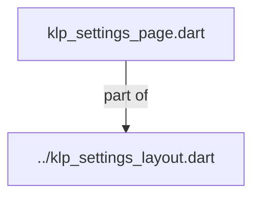
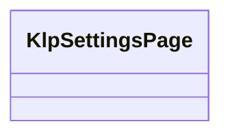
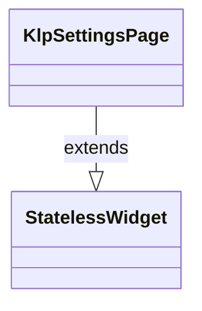

# klp_settings_page.dart：直接依賴與宣告架構

[回到目錄](README.md) · [來源檔案](../../../../../../../lib/src/features/workspace/settings/layout/klp_settings_page.dart)

## 範圍

核心是 `lib/src/features/workspace/settings/layout/klp_settings_page.dart`。主要視角為該檔案明寫的 import／export／part；輔助視角為本檔宣告及 extends／implements／with／on 關係。只展開一層外部邊界。

## 直接依賴圖

## 依賴證據

| 關係 | 原始 directive | 來源 |
|---|---|---|
| part of | <code>part of &#x27;../klp_settings_layout.dart&#x27;;</code> | [lib/src/features/workspace/settings/layout/klp_settings_page.dart:1](../../../../../../../lib/src/features/workspace/settings/layout/klp_settings_page.dart#L1) |

## 宣告關係圖

本組節點是本檔宣告；沒有箭頭的宣告未在此圖主張互相依賴。

## 宣告與成員證據

成員包含 public 與 private；簽章取自來源，省略函式本體與欄位初始值。`(inferred)` 表示來源未明寫型別；建構子只顯示參數部分，不含初始化列表。

### KlpSettingsPage

ClassDeclaration · public · [lib/src/features/workspace/settings/layout/klp_settings_page.dart:3](../../../../../../../lib/src/features/workspace/settings/layout/klp_settings_page.dart#L3)

<code>class KlpSettingsPage extends StatelessWidget</code>

來源註解摘要：設定頁的自適應雙 pane 版面。 只安排 navigation 與 content；route、Popup 與設定狀態由產品層負責。

- `extends` → <code>StatelessWidget</code>：[lib/src/features/workspace/settings/layout/klp_settings_page.dart:6](../../../../../../../lib/src/features/workspace/settings/layout/klp_settings_page.dart#L6)

| 成員 | 可見性 | 簽章／型別 | 來源註解摘要 | 證據 |
|---|---|---|---|---|
| constructor <code>KlpSettingsPage</code> | public | <code>const KlpSettingsPage({ super.key, required this.navigation, required this.content, this.navigationWidth, this.twoColumnBreakpoint, this.onNavigationWidthChanged, this.navigationResizeLabel, })</code> |  | [lib/src/features/workspace/settings/layout/klp_settings_page.dart:7](../../../../../../../lib/src/features/workspace/settings/layout/klp_settings_page.dart#L7) |
| field <code>navigation</code> | public | <code>final Widget navigation</code> |  | [lib/src/features/workspace/settings/layout/klp_settings_page.dart:17](../../../../../../../lib/src/features/workspace/settings/layout/klp_settings_page.dart#L17) |
| field <code>content</code> | public | <code>final Widget content</code> |  | [lib/src/features/workspace/settings/layout/klp_settings_page.dart:18](../../../../../../../lib/src/features/workspace/settings/layout/klp_settings_page.dart#L18) |
| field <code>navigationWidth</code> | public | <code>final double? navigationWidth</code> | `null` 時使用 theme 的 settings navigation 寬度。 | [lib/src/features/workspace/settings/layout/klp_settings_page.dart:21](../../../../../../../lib/src/features/workspace/settings/layout/klp_settings_page.dart#L21) |
| field <code>twoColumnBreakpoint</code> | public | <code>final double? twoColumnBreakpoint</code> | `null` 時使用 theme 的 primary pane content breakpoint。 | [lib/src/features/workspace/settings/layout/klp_settings_page.dart:24](../../../../../../../lib/src/features/workspace/settings/layout/klp_settings_page.dart#L24) |
| field <code>onNavigationWidthChanged</code> | public | <code>final ValueChanged&lt;double&gt;? onNavigationWidthChanged</code> | 非 `null` 時寬版導覽欄可拖曳調整；寬度狀態由消費者持有。 | [lib/src/features/workspace/settings/layout/klp_settings_page.dart:27](../../../../../../../lib/src/features/workspace/settings/layout/klp_settings_page.dart#L27) |
| field <code>navigationResizeLabel</code> | public | <code>final String? navigationResizeLabel</code> | 導覽欄拖曳把手的無障礙標籤。 | [lib/src/features/workspace/settings/layout/klp_settings_page.dart:30](../../../../../../../lib/src/features/workspace/settings/layout/klp_settings_page.dart#L30) |
| method <code>build</code> | public | <code>Widget build(BuildContext context)</code> |  | [lib/src/features/workspace/settings/layout/klp_settings_page.dart:32](../../../../../../../lib/src/features/workspace/settings/layout/klp_settings_page.dart#L32) |

## 閱讀說明與限制

箭頭只表示來源明寫的靜態關係；import 不等於呼叫。未分析動態呼叫、欄位的實際物件擁有權、狀態轉移或渲染流程；型別未進行語意解析，繼承目標保留原始型別拼寫。public／private 依 Dart 名稱前綴判斷；public 宣告不代表已由 `lib/kallopis.dart` 匯出。

本頁由 `tool/architecture_atlas` 產生；編輯來源或生成工具後重新產生，避免手改本頁。
