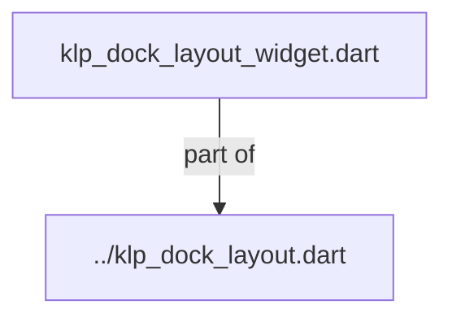
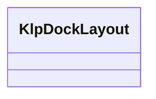
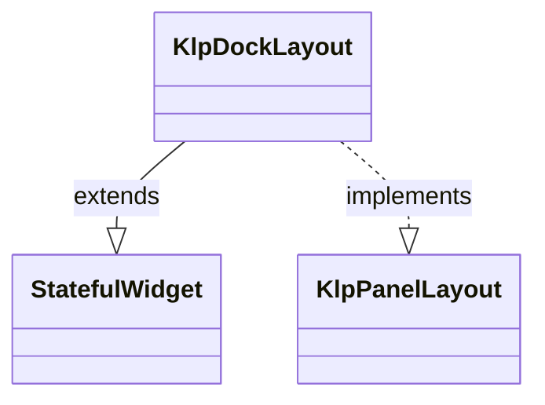

# klp_dock_layout_widget.dart：直接依賴與宣告架構

[回到目錄](README.md) · [來源檔案](../../../../../../../../lib/src/features/workspace/shell/docking/internal/klp_dock_layout_widget.dart)

## 範圍

核心是 `lib/src/features/workspace/shell/docking/internal/klp_dock_layout_widget.dart`。主要視角為該檔案明寫的 import／export／part；輔助視角為本檔宣告及 extends／implements／with／on 關係。只展開一層外部邊界。

## 直接依賴圖

## 依賴證據

| 關係 | 原始 directive | 來源 |
|---|---|---|
| part of | <code>part of &#x27;../klp_dock_layout.dart&#x27;;</code> | [lib/src/features/workspace/shell/docking/internal/klp_dock_layout_widget.dart:1](../../../../../../../../lib/src/features/workspace/shell/docking/internal/klp_dock_layout_widget.dart#L1) |

## 宣告關係圖

本組節點是本檔宣告；沒有箭頭的宣告未在此圖主張互相依賴。

## 宣告與成員證據

成員包含 public 與 private；簽章取自來源，省略函式本體與欄位初始值。`(inferred)` 表示來源未明寫型別；建構子只顯示參數部分，不含初始化列表。

### KlpDockLayout

ClassDeclaration · public · [lib/src/features/workspace/shell/docking/internal/klp_dock_layout_widget.dart:3](../../../../../../../../lib/src/features/workspace/shell/docking/internal/klp_dock_layout_widget.dart#L3)

<code>class KlpDockLayout extends StatefulWidget implements KlpPanelLayout</code>

- `extends` → <code>StatefulWidget</code>：[lib/src/features/workspace/shell/docking/internal/klp_dock_layout_widget.dart:3](../../../../../../../../lib/src/features/workspace/shell/docking/internal/klp_dock_layout_widget.dart#L3)
- `implements` → <code>KlpPanelLayout</code>：[lib/src/features/workspace/shell/docking/internal/klp_dock_layout_widget.dart:3](../../../../../../../../lib/src/features/workspace/shell/docking/internal/klp_dock_layout_widget.dart#L3)

| 成員 | 可見性 | 簽章／型別 | 來源註解摘要 | 證據 |
|---|---|---|---|---|
| constructor <code>KlpDockLayout</code> | public | <code>const KlpDockLayout({ super.key, required this.stage, required this.panels, required this.layout, required this.onLayoutChanged, required this.leftConstraints, required this.rightConstraints, this.bottomConstraints, })</code> |  | [lib/src/features/workspace/shell/docking/internal/klp_dock_layout_widget.dart:4](../../../../../../../../lib/src/features/workspace/shell/docking/internal/klp_dock_layout_widget.dart#L4) |
| field <code>stage</code> | public | <code>final KlpPanelFrame stage</code> |  | [lib/src/features/workspace/shell/docking/internal/klp_dock_layout_widget.dart:15](../../../../../../../../lib/src/features/workspace/shell/docking/internal/klp_dock_layout_widget.dart#L15) |
| field <code>panels</code> | public | <code>final List&lt;KlpDockPanel&gt; panels</code> |  | [lib/src/features/workspace/shell/docking/internal/klp_dock_layout_widget.dart:16](../../../../../../../../lib/src/features/workspace/shell/docking/internal/klp_dock_layout_widget.dart#L16) |
| field <code>layout</code> | public | <code>final KlpDockLayoutData layout</code> |  | [lib/src/features/workspace/shell/docking/internal/klp_dock_layout_widget.dart:17](../../../../../../../../lib/src/features/workspace/shell/docking/internal/klp_dock_layout_widget.dart#L17) |
| field <code>onLayoutChanged</code> | public | <code>final ValueChanged&lt;KlpDockLayoutData&gt; onLayoutChanged</code> |  | [lib/src/features/workspace/shell/docking/internal/klp_dock_layout_widget.dart:18](../../../../../../../../lib/src/features/workspace/shell/docking/internal/klp_dock_layout_widget.dart#L18) |
| field <code>leftConstraints</code> | public | <code>final KlpDockAreaConstraints leftConstraints</code> |  | [lib/src/features/workspace/shell/docking/internal/klp_dock_layout_widget.dart:19](../../../../../../../../lib/src/features/workspace/shell/docking/internal/klp_dock_layout_widget.dart#L19) |
| field <code>rightConstraints</code> | public | <code>final KlpDockAreaConstraints rightConstraints</code> |  | [lib/src/features/workspace/shell/docking/internal/klp_dock_layout_widget.dart:20](../../../../../../../../lib/src/features/workspace/shell/docking/internal/klp_dock_layout_widget.dart#L20) |
| field <code>bottomConstraints</code> | public | <code>final KlpDockAreaConstraints? bottomConstraints</code> | Bottom 可用時的高度限制；沒有任何 Bottom-capable panel 時可省略。 | [lib/src/features/workspace/shell/docking/internal/klp_dock_layout_widget.dart:23](../../../../../../../../lib/src/features/workspace/shell/docking/internal/klp_dock_layout_widget.dart#L23) |
| method <code>createState</code> | public | <code>State&lt;KlpDockLayout&gt; createState()</code> |  | [lib/src/features/workspace/shell/docking/internal/klp_dock_layout_widget.dart:25](../../../../../../../../lib/src/features/workspace/shell/docking/internal/klp_dock_layout_widget.dart#L25) |
| method <code>buildPanelLayout</code> | public | <code>Widget buildPanelLayout(BuildContext context)</code> |  | [lib/src/features/workspace/shell/docking/internal/klp_dock_layout_widget.dart:28](../../../../../../../../lib/src/features/workspace/shell/docking/internal/klp_dock_layout_widget.dart#L28) |

## 閱讀說明與限制

箭頭只表示來源明寫的靜態關係；import 不等於呼叫。未分析動態呼叫、欄位的實際物件擁有權、狀態轉移或渲染流程；型別未進行語意解析，繼承目標保留原始型別拼寫。public／private 依 Dart 名稱前綴判斷；public 宣告不代表已由 `lib/kallopis.dart` 匯出。

本頁由 `tool/architecture_atlas` 產生；編輯來源或生成工具後重新產生，避免手改本頁。
