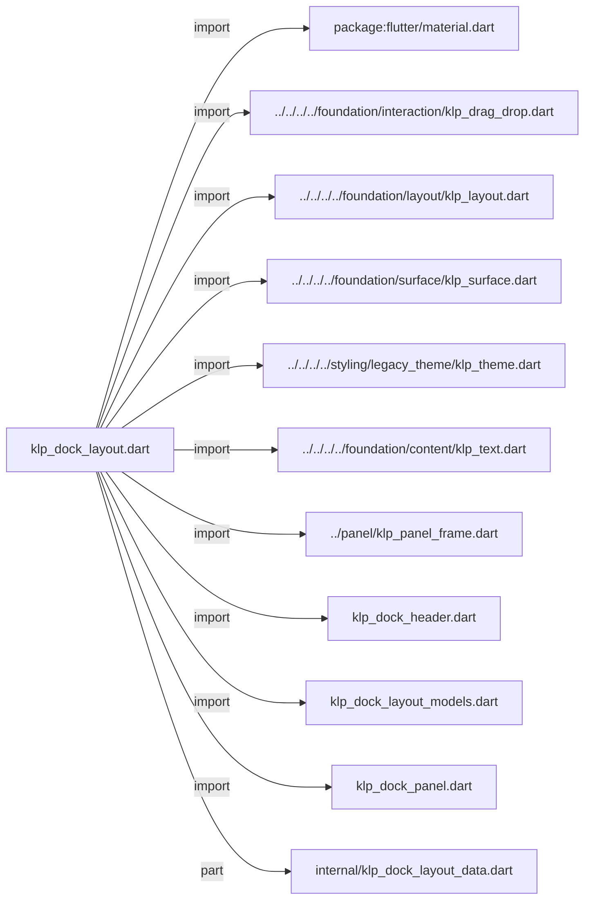
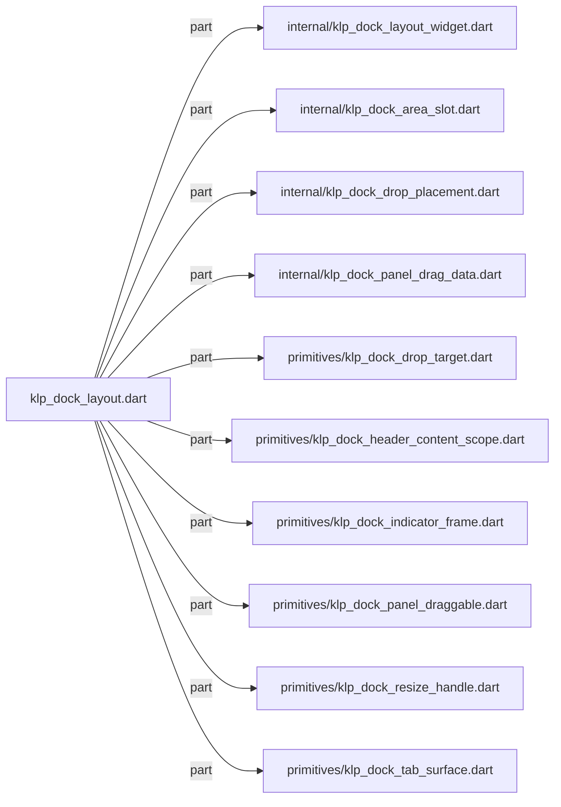
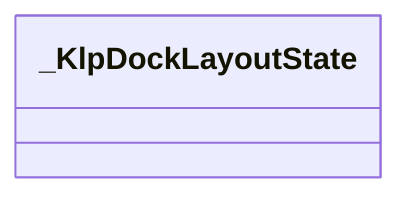
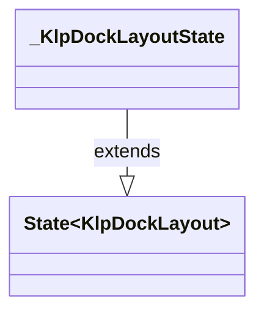

# klp_dock_layout.dart：直接依賴與宣告架構

[回到目錄](README.md) · [來源檔案](../../../../../../../lib/src/features/workspace/shell/docking/klp_dock_layout.dart)

## 範圍

核心是 `lib/src/features/workspace/shell/docking/klp_dock_layout.dart`。主要視角為該檔案明寫的 import／export／part；輔助視角為本檔宣告及 extends／implements／with／on 關係。只展開一層外部邊界。

## 直接依賴圖

## 依賴證據

| 關係 | 原始 directive | 來源 |
|---|---|---|
| import | <code>import &#x27;package:flutter/material.dart&#x27;;</code> | [lib/src/features/workspace/shell/docking/klp_dock_layout.dart:1](../../../../../../../lib/src/features/workspace/shell/docking/klp_dock_layout.dart#L1) |
| import | <code>import &#x27;../../../../foundation/interaction/klp_drag_drop.dart&#x27;;</code> | [lib/src/features/workspace/shell/docking/klp_dock_layout.dart:3](../../../../../../../lib/src/features/workspace/shell/docking/klp_dock_layout.dart#L3) |
| import | <code>import &#x27;../../../../foundation/layout/klp_layout.dart&#x27;;</code> | [lib/src/features/workspace/shell/docking/klp_dock_layout.dart:4](../../../../../../../lib/src/features/workspace/shell/docking/klp_dock_layout.dart#L4) |
| import | <code>import &#x27;../../../../foundation/surface/klp_surface.dart&#x27;;</code> | [lib/src/features/workspace/shell/docking/klp_dock_layout.dart:5](../../../../../../../lib/src/features/workspace/shell/docking/klp_dock_layout.dart#L5) |
| import | <code>import &#x27;../../../../styling/legacy_theme/klp_theme.dart&#x27;;</code> | [lib/src/features/workspace/shell/docking/klp_dock_layout.dart:6](../../../../../../../lib/src/features/workspace/shell/docking/klp_dock_layout.dart#L6) |
| import | <code>import &#x27;../../../../foundation/content/klp_text.dart&#x27;;</code> | [lib/src/features/workspace/shell/docking/klp_dock_layout.dart:7](../../../../../../../lib/src/features/workspace/shell/docking/klp_dock_layout.dart#L7) |
| import | <code>import &#x27;../panel/klp_panel_frame.dart&#x27;;</code> | [lib/src/features/workspace/shell/docking/klp_dock_layout.dart:8](../../../../../../../lib/src/features/workspace/shell/docking/klp_dock_layout.dart#L8) |
| import | <code>import &#x27;klp_dock_header.dart&#x27;;</code> | [lib/src/features/workspace/shell/docking/klp_dock_layout.dart:9](../../../../../../../lib/src/features/workspace/shell/docking/klp_dock_layout.dart#L9) |
| import | <code>import &#x27;klp_dock_layout_models.dart&#x27;;</code> | [lib/src/features/workspace/shell/docking/klp_dock_layout.dart:10](../../../../../../../lib/src/features/workspace/shell/docking/klp_dock_layout.dart#L10) |
| import | <code>import &#x27;klp_dock_panel.dart&#x27;;</code> | [lib/src/features/workspace/shell/docking/klp_dock_layout.dart:11](../../../../../../../lib/src/features/workspace/shell/docking/klp_dock_layout.dart#L11) |
| part | <code>part &#x27;internal/klp_dock_layout_data.dart&#x27;;</code> | [lib/src/features/workspace/shell/docking/klp_dock_layout.dart:13](../../../../../../../lib/src/features/workspace/shell/docking/klp_dock_layout.dart#L13) |
| part | <code>part &#x27;internal/klp_dock_layout_widget.dart&#x27;;</code> | [lib/src/features/workspace/shell/docking/klp_dock_layout.dart:14](../../../../../../../lib/src/features/workspace/shell/docking/klp_dock_layout.dart#L14) |
| part | <code>part &#x27;internal/klp_dock_area_slot.dart&#x27;;</code> | [lib/src/features/workspace/shell/docking/klp_dock_layout.dart:15](../../../../../../../lib/src/features/workspace/shell/docking/klp_dock_layout.dart#L15) |
| part | <code>part &#x27;internal/klp_dock_drop_placement.dart&#x27;;</code> | [lib/src/features/workspace/shell/docking/klp_dock_layout.dart:16](../../../../../../../lib/src/features/workspace/shell/docking/klp_dock_layout.dart#L16) |
| part | <code>part &#x27;internal/klp_dock_panel_drag_data.dart&#x27;;</code> | [lib/src/features/workspace/shell/docking/klp_dock_layout.dart:17](../../../../../../../lib/src/features/workspace/shell/docking/klp_dock_layout.dart#L17) |
| part | <code>part &#x27;primitives/klp_dock_drop_target.dart&#x27;;</code> | [lib/src/features/workspace/shell/docking/klp_dock_layout.dart:18](../../../../../../../lib/src/features/workspace/shell/docking/klp_dock_layout.dart#L18) |
| part | <code>part &#x27;primitives/klp_dock_header_content_scope.dart&#x27;;</code> | [lib/src/features/workspace/shell/docking/klp_dock_layout.dart:19](../../../../../../../lib/src/features/workspace/shell/docking/klp_dock_layout.dart#L19) |
| part | <code>part &#x27;primitives/klp_dock_indicator_frame.dart&#x27;;</code> | [lib/src/features/workspace/shell/docking/klp_dock_layout.dart:20](../../../../../../../lib/src/features/workspace/shell/docking/klp_dock_layout.dart#L20) |
| part | <code>part &#x27;primitives/klp_dock_panel_draggable.dart&#x27;;</code> | [lib/src/features/workspace/shell/docking/klp_dock_layout.dart:21](../../../../../../../lib/src/features/workspace/shell/docking/klp_dock_layout.dart#L21) |
| part | <code>part &#x27;primitives/klp_dock_resize_handle.dart&#x27;;</code> | [lib/src/features/workspace/shell/docking/klp_dock_layout.dart:22](../../../../../../../lib/src/features/workspace/shell/docking/klp_dock_layout.dart#L22) |
| part | <code>part &#x27;primitives/klp_dock_tab_surface.dart&#x27;;</code> | [lib/src/features/workspace/shell/docking/klp_dock_layout.dart:23](../../../../../../../lib/src/features/workspace/shell/docking/klp_dock_layout.dart#L23) |

## 宣告關係圖

本組節點是本檔宣告；沒有箭頭的宣告未在此圖主張互相依賴。

## 宣告與成員證據

成員包含 public 與 private；簽章取自來源，省略函式本體與欄位初始值。`(inferred)` 表示來源未明寫型別；建構子只顯示參數部分，不含初始化列表。

### _KlpDockLayoutState

ClassDeclaration · private · [lib/src/features/workspace/shell/docking/klp_dock_layout.dart:25](../../../../../../../lib/src/features/workspace/shell/docking/klp_dock_layout.dart#L25)

<code>class _KlpDockLayoutState extends State&lt;KlpDockLayout&gt;</code>

- `extends` → <code>State&lt;KlpDockLayout&gt;</code>：[lib/src/features/workspace/shell/docking/klp_dock_layout.dart:25](../../../../../../../lib/src/features/workspace/shell/docking/klp_dock_layout.dart#L25)

| 成員 | 可見性 | 簽章／型別 | 來源註解摘要 | 證據 |
|---|---|---|---|---|
| field <code>_minHorizontalGroupExtent</code> | private | <code>static const double _minHorizontalGroupExtent</code> |  | [lib/src/features/workspace/shell/docking/klp_dock_layout.dart:26](../../../../../../../lib/src/features/workspace/shell/docking/klp_dock_layout.dart#L26) |
| field <code>_openingAreaSlots</code> | private | <code>final Set&lt;_KlpDockAreaSlot&gt; _openingAreaSlots</code> |  | [lib/src/features/workspace/shell/docking/klp_dock_layout.dart:28](../../../../../../../lib/src/features/workspace/shell/docking/klp_dock_layout.dart#L28) |
| field <code>_activeDropTarget</code> | private | <code>String? _activeDropTarget</code> |  | [lib/src/features/workspace/shell/docking/klp_dock_layout.dart:29](../../../../../../../lib/src/features/workspace/shell/docking/klp_dock_layout.dart#L29) |
| field <code>_activeDropPlacement</code> | private | <code>_KlpDockDropPlacement? _activeDropPlacement</code> |  | [lib/src/features/workspace/shell/docking/klp_dock_layout.dart:30](../../../../../../../lib/src/features/workspace/shell/docking/klp_dock_layout.dart#L30) |
| field <code>_groupSequence</code> | private | <code>int _groupSequence</code> |  | [lib/src/features/workspace/shell/docking/klp_dock_layout.dart:31](../../../../../../../lib/src/features/workspace/shell/docking/klp_dock_layout.dart#L31) |
| method <code>didUpdateWidget</code> | public | <code>void didUpdateWidget(KlpDockLayout oldWidget)</code> |  | [lib/src/features/workspace/shell/docking/klp_dock_layout.dart:33](../../../../../../../lib/src/features/workspace/shell/docking/klp_dock_layout.dart#L33) |
| method <code>build</code> | public | <code>Widget build(BuildContext context)</code> |  | [lib/src/features/workspace/shell/docking/klp_dock_layout.dart:44](../../../../../../../lib/src/features/workspace/shell/docking/klp_dock_layout.dart#L44) |
| method <code>_buildStage</code> | private | <code>Widget _buildStage()</code> |  | [lib/src/features/workspace/shell/docking/klp_dock_layout.dart:152](../../../../../../../lib/src/features/workspace/shell/docking/klp_dock_layout.dart#L152) |
| method <code>_buildAreaResizeOverlay</code> | private | <code>Widget _buildAreaResizeOverlay( BuildContext dockContext, _KlpDockAreaSlot slot, KlpDockAreaData area, KlpDockAreaConstraints constraints, { required bool showIndicator, double? left, double? top, double? right, double? bottom, double? width, double? height, })</code> |  | [lib/src/features/workspace/shell/docking/klp_dock_layout.dart:176](../../../../../../../lib/src/features/workspace/shell/docking/klp_dock_layout.dart#L176) |
| method <code>_buildArea</code> | private | <code>Widget _buildArea(_KlpDockAreaSlot slot, KlpDockAreaData area)</code> |  | [lib/src/features/workspace/shell/docking/klp_dock_layout.dart:215](../../../../../../../lib/src/features/workspace/shell/docking/klp_dock_layout.dart#L215) |
| method <code>_buildAreaGroups</code> | private | <code>Widget _buildAreaGroups( BuildContext context, _KlpDockAreaSlot slot, KlpDockAreaData area, BoxConstraints constraints, )</code> |  | [lib/src/features/workspace/shell/docking/klp_dock_layout.dart:222](../../../../../../../lib/src/features/workspace/shell/docking/klp_dock_layout.dart#L222) |
| method <code>_resolveGroupExtents</code> | private | <code>List&lt;double&gt; _resolveGroupExtents( KlpDockAreaData area, double availableExtent, double handleExtent, )</code> |  | [lib/src/features/workspace/shell/docking/klp_dock_layout.dart:301](../../../../../../../lib/src/features/workspace/shell/docking/klp_dock_layout.dart#L301) |
| method <code>_resolveGroupMinExtent</code> | private | <code>double _resolveGroupMinExtent(KlpDockAreaData area)</code> |  | [lib/src/features/workspace/shell/docking/klp_dock_layout.dart:344](../../../../../../../lib/src/features/workspace/shell/docking/klp_dock_layout.dart#L344) |
| method <code>_buildGroupDropTarget</code> | private | <code>Widget _buildGroupDropTarget( BuildContext context, _KlpDockAreaSlot slot, KlpDockAreaData area, KlpDockGroupData group, double groupExtent, double handleExtent, )</code> |  | [lib/src/features/workspace/shell/docking/klp_dock_layout.dart:350](../../../../../../../lib/src/features/workspace/shell/docking/klp_dock_layout.dart#L350) |
| method <code>_buildDropIndicator</code> | private | <code>Widget _buildDropIndicator({bool vertical = false})</code> |  | [lib/src/features/workspace/shell/docking/klp_dock_layout.dart:419](../../../../../../../lib/src/features/workspace/shell/docking/klp_dock_layout.dart#L419) |
| method <code>_buildHeaderDropIndicator</code> | private | <code>Widget _buildHeaderDropIndicator()</code> | Header 內的放置線與 code 標題使用相同的行高；DragTarget 仍由外層完整 header 承擔，因此滑鼠可以在 padding 區域開始拖放。 | [lib/src/features/workspace/shell/docking/klp_dock_layout.dart:428](../../../../../../../lib/src/features/workspace/shell/docking/klp_dock_layout.dart#L428) |
| method <code>_buildGroupSplitIndicator</code> | private | <code>Widget _buildGroupSplitIndicator(KlpDockAreaData area)</code> |  | [lib/src/features/workspace/shell/docking/klp_dock_layout.dart:442](../../../../../../../lib/src/features/workspace/shell/docking/klp_dock_layout.dart#L442) |
| method <code>_buildGroup</code> | private | <code>Widget _buildGroup( _KlpDockAreaSlot slot, KlpDockAreaData area, KlpDockGroupData group, { bool showTabInsertion = false, })</code> |  | [lib/src/features/workspace/shell/docking/klp_dock_layout.dart:460](../../../../../../../lib/src/features/workspace/shell/docking/klp_dock_layout.dart#L460) |
| method <code>_buildSinglePanelHeader</code> | private | <code>Widget _buildSinglePanelHeader( KlpDockPanel panel, { bool showTabInsertion = false, })</code> |  | [lib/src/features/workspace/shell/docking/klp_dock_layout.dart:502](../../../../../../../lib/src/features/workspace/shell/docking/klp_dock_layout.dart#L502) |
| method <code>_buildGroupTabs</code> | private | <code>Widget _buildGroupTabs( _KlpDockAreaSlot slot, KlpDockAreaData area, KlpDockGroupData group, { bool showTabInsertion = false, })</code> |  | [lib/src/features/workspace/shell/docking/klp_dock_layout.dart:514](../../../../../../../lib/src/features/workspace/shell/docking/klp_dock_layout.dart#L514) |
| method <code>_buildDockTab</code> | private | <code>Widget _buildDockTab( _KlpDockAreaSlot slot, KlpDockAreaData area, KlpDockGroupData group, int index, )</code> |  | [lib/src/features/workspace/shell/docking/klp_dock_layout.dart:532](../../../../../../../lib/src/features/workspace/shell/docking/klp_dock_layout.dart#L532) |
| method <code>_buildDockTabSurface</code> | private | <code>Widget _buildDockTabSurface( KlpDockPanel? panel, String panelId, bool selected, VoidCallback onPressed, )</code> |  | [lib/src/features/workspace/shell/docking/klp_dock_layout.dart:592](../../../../../../../lib/src/features/workspace/shell/docking/klp_dock_layout.dart#L592) |
| method <code>_buildHeaderContent</code> | private | <code>Widget _buildHeaderContent(Widget child)</code> |  | [lib/src/features/workspace/shell/docking/klp_dock_layout.dart:609](../../../../../../../lib/src/features/workspace/shell/docking/klp_dock_layout.dart#L609) |
| method <code>_buildPanelDraggable</code> | private | <code>Widget _buildPanelDraggable( _KlpDockPanelDragData data, KlpDockPanel panel, Widget child, )</code> |  | [lib/src/features/workspace/shell/docking/klp_dock_layout.dart:613](../../../../../../../lib/src/features/workspace/shell/docking/klp_dock_layout.dart#L613) |
| method <code>_findPanel</code> | private | <code>KlpDockPanel? _findPanel(String panelId)</code> |  | [lib/src/features/workspace/shell/docking/klp_dock_layout.dart:628](../../../../../../../lib/src/features/workspace/shell/docking/klp_dock_layout.dart#L628) |
| method <code>_canDropPanelInSlot</code> | private | <code>bool _canDropPanelInSlot(String panelId, _KlpDockAreaSlot slot)</code> |  | [lib/src/features/workspace/shell/docking/klp_dock_layout.dart:636](../../../../../../../lib/src/features/workspace/shell/docking/klp_dock_layout.dart#L636) |
| method <code>_selectPanel</code> | private | <code>void _selectPanel( _KlpDockAreaSlot slot, KlpDockAreaData area, String groupId, String panelId, )</code> |  | [lib/src/features/workspace/shell/docking/klp_dock_layout.dart:649](../../../../../../../lib/src/features/workspace/shell/docking/klp_dock_layout.dart#L649) |
| method <code>_updateGroupDropTarget</code> | private | <code>void _updateGroupDropTarget( BuildContext targetContext, String targetId, KlpDockAreaData area, KlpDockGroupData group, Offset globalOffset, )</code> |  | [lib/src/features/workspace/shell/docking/klp_dock_layout.dart:665](../../../../../../../lib/src/features/workspace/shell/docking/klp_dock_layout.dart#L665) |
| method <code>_resolveGroupDropPlacement</code> | private | <code>_KlpDockDropPlacement? _resolveGroupDropPlacement( BuildContext targetContext, KlpDockAreaData area, KlpDockGroupData group, Offset globalOffset, )</code> |  | [lib/src/features/workspace/shell/docking/klp_dock_layout.dart:686](../../../../../../../lib/src/features/workspace/shell/docking/klp_dock_layout.dart#L686) |
| method <code>_groupHasHeader</code> | private | <code>bool _groupHasHeader(KlpDockGroupData group)</code> |  | [lib/src/features/workspace/shell/docking/klp_dock_layout.dart:714](../../../../../../../lib/src/features/workspace/shell/docking/klp_dock_layout.dart#L714) |
| method <code>_updateStageDropTarget</code> | private | <code>void _updateStageDropTarget( BuildContext targetContext, _KlpDockPanelDragData data, Offset globalOffset, )</code> |  | [lib/src/features/workspace/shell/docking/klp_dock_layout.dart:721](../../../../../../../lib/src/features/workspace/shell/docking/klp_dock_layout.dart#L721) |
| method <code>_resolveStageDestination</code> | private | <code>_KlpDockAreaSlot? _resolveStageDestination( BuildContext targetContext, _KlpDockPanelDragData data, Offset globalOffset, { required bool expandHiddenArea, })</code> |  | [lib/src/features/workspace/shell/docking/klp_dock_layout.dart:740](../../../../../../../lib/src/features/workspace/shell/docking/klp_dock_layout.dart#L740) |
| method <code>_hasStageDestination</code> | private | <code>bool _hasStageDestination(String panelId)</code> |  | [lib/src/features/workspace/shell/docking/klp_dock_layout.dart:789](../../../../../../../lib/src/features/workspace/shell/docking/klp_dock_layout.dart#L789) |
| method <code>_openAreaForDrop</code> | private | <code>void _openAreaForDrop( _KlpDockAreaSlot slot, KlpDockAreaData area, KlpDockAreaConstraints constraints, )</code> |  | [lib/src/features/workspace/shell/docking/klp_dock_layout.dart:805](../../../../../../../lib/src/features/workspace/shell/docking/klp_dock_layout.dart#L805) |
| method <code>_constraintsForSlot</code> | private | <code>KlpDockAreaConstraints _constraintsForSlot(_KlpDockAreaSlot slot)</code> |  | [lib/src/features/workspace/shell/docking/klp_dock_layout.dart:820](../../../../../../../lib/src/features/workspace/shell/docking/klp_dock_layout.dart#L820) |
| method <code>_buildStageDropIndicator</code> | private | <code>Widget _buildStageDropIndicator(String targetId)</code> |  | [lib/src/features/workspace/shell/docking/klp_dock_layout.dart:831](../../../../../../../lib/src/features/workspace/shell/docking/klp_dock_layout.dart#L831) |
| method <code>_activateDropTarget</code> | private | <code>void _activateDropTarget(String targetId, _KlpDockDropPlacement placement)</code> |  | [lib/src/features/workspace/shell/docking/klp_dock_layout.dart:867](../../../../../../../lib/src/features/workspace/shell/docking/klp_dock_layout.dart#L867) |
| method <code>_clearDropTarget</code> | private | <code>void _clearDropTarget([String? targetId])</code> |  | [lib/src/features/workspace/shell/docking/klp_dock_layout.dart:878](../../../../../../../lib/src/features/workspace/shell/docking/klp_dock_layout.dart#L878) |
| method <code>_dropTargetId</code> | private | <code>String _dropTargetId(_KlpDockAreaSlot slot, String groupId)</code> |  | [lib/src/features/workspace/shell/docking/klp_dock_layout.dart:891](../../../../../../../lib/src/features/workspace/shell/docking/klp_dock_layout.dart#L891) |
| method <code>_handleAreaResizeAt</code> | private | <code>void _handleAreaResizeAt( BuildContext dockContext, _KlpDockAreaSlot slot, KlpDockAreaData area, KlpDockAreaConstraints constraints, Offset globalPosition, )</code> |  | [lib/src/features/workspace/shell/docking/klp_dock_layout.dart:894](../../../../../../../lib/src/features/workspace/shell/docking/klp_dock_layout.dart#L894) |
| method <code>_handleGroupResizeAt</code> | private | <code>void _handleGroupResizeAt( BuildContext areaContext, _KlpDockAreaSlot slot, KlpDockAreaData area, int leadingIndex, List&lt;double&gt; groupExtents, double handleExtent, Offset globalPosition, )</code> |  | [lib/src/features/workspace/shell/docking/klp_dock_layout.dart:929](../../../../../../../lib/src/features/workspace/shell/docking/klp_dock_layout.dart#L929) |
| method <code>_emitAreaChange</code> | private | <code>void _emitAreaChange(_KlpDockAreaSlot slot, KlpDockAreaData area)</code> |  | [lib/src/features/workspace/shell/docking/klp_dock_layout.dart:979](../../../../../../../lib/src/features/workspace/shell/docking/klp_dock_layout.dart#L979) |
| method <code>_replaceArea</code> | private | <code>KlpDockLayoutData _replaceArea( KlpDockLayoutData layout, _KlpDockAreaSlot slot, KlpDockAreaData area, )</code> |  | [lib/src/features/workspace/shell/docking/klp_dock_layout.dart:983](../../../../../../../lib/src/features/workspace/shell/docking/klp_dock_layout.dart#L983) |

## 閱讀說明與限制

箭頭只表示來源明寫的靜態關係；import 不等於呼叫。未分析動態呼叫、欄位的實際物件擁有權、狀態轉移或渲染流程；型別未進行語意解析，繼承目標保留原始型別拼寫。public／private 依 Dart 名稱前綴判斷；public 宣告不代表已由 `lib/kallopis.dart` 匯出。

本頁由 `tool/architecture_atlas` 產生；編輯來源或生成工具後重新產生，避免手改本頁。
