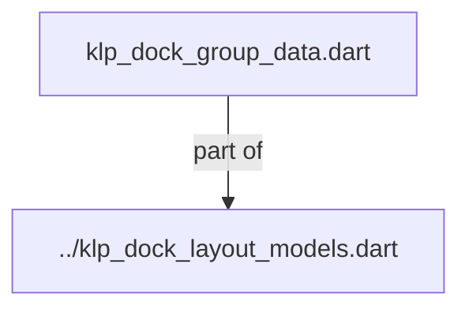
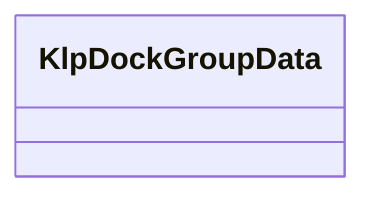

# klp_dock_group_data.dart：直接依賴與宣告架構

[回到目錄](README.md) · [來源檔案](../../../../../../../../lib/src/features/workspace/shell/docking/models/klp_dock_group_data.dart)

## 範圍

核心是 `lib/src/features/workspace/shell/docking/models/klp_dock_group_data.dart`。主要視角為該檔案明寫的 import／export／part；輔助視角為本檔宣告及 extends／implements／with／on 關係。只展開一層外部邊界。

## 直接依賴圖

## 依賴證據

| 關係 | 原始 directive | 來源 |
|---|---|---|
| part of | <code>part of &#x27;../klp_dock_layout_models.dart&#x27;;</code> | [lib/src/features/workspace/shell/docking/models/klp_dock_group_data.dart:1](../../../../../../../../lib/src/features/workspace/shell/docking/models/klp_dock_group_data.dart#L1) |

## 宣告關係圖

本組節點是本檔宣告；沒有箭頭的宣告未在此圖主張互相依賴。

## 宣告與成員證據

成員包含 public 與 private；簽章取自來源，省略函式本體與欄位初始值。`(inferred)` 表示來源未明寫型別；建構子只顯示參數部分，不含初始化列表。

### KlpDockGroupData

ClassDeclaration · public · [lib/src/features/workspace/shell/docking/models/klp_dock_group_data.dart:3](../../../../../../../../lib/src/features/workspace/shell/docking/models/klp_dock_group_data.dart#L3)

<code>class KlpDockGroupData</code>

來源註解摘要：描述同一可停駐區域內的一組分頁及目前顯示項目。

| 成員 | 可見性 | 簽章／型別 | 來源註解摘要 | 證據 |
|---|---|---|---|---|
| field <code>id</code> | public | <code>final String id</code> |  | [lib/src/features/workspace/shell/docking/models/klp_dock_group_data.dart:6](../../../../../../../../lib/src/features/workspace/shell/docking/models/klp_dock_group_data.dart#L6) |
| field <code>panelIds</code> | public | <code>final List&lt;String&gt; panelIds</code> | 群組內的分頁，由左到右排列。 | [lib/src/features/workspace/shell/docking/models/klp_dock_group_data.dart:9](../../../../../../../../lib/src/features/workspace/shell/docking/models/klp_dock_group_data.dart#L9) |
| field <code>activePanelId</code> | public | <code>final String activePanelId</code> | 目前顯示的 panel。 | [lib/src/features/workspace/shell/docking/models/klp_dock_group_data.dart:12](../../../../../../../../lib/src/features/workspace/shell/docking/models/klp_dock_group_data.dart#L12) |
| field <code>mainAxisExtent</code> | public | <code>final double mainAxisExtent</code> | Group 沿著 Area 排列方向的像素尺寸。 | [lib/src/features/workspace/shell/docking/models/klp_dock_group_data.dart:15](../../../../../../../../lib/src/features/workspace/shell/docking/models/klp_dock_group_data.dart#L15) |
| constructor <code>KlpDockGroupData</code> | public | <code>const KlpDockGroupData({ required this.id, required this.panelIds, required this.activePanelId, required this.mainAxisExtent, })</code> |  | [lib/src/features/workspace/shell/docking/models/klp_dock_group_data.dart:17](../../../../../../../../lib/src/features/workspace/shell/docking/models/klp_dock_group_data.dart#L17) |
| method <code>copyWith</code> | public | <code>KlpDockGroupData copyWith({ String? id, List&lt;String&gt;? panelIds, String? activePanelId, double? mainAxisExtent, })</code> |  | [lib/src/features/workspace/shell/docking/models/klp_dock_group_data.dart:24](../../../../../../../../lib/src/features/workspace/shell/docking/models/klp_dock_group_data.dart#L24) |

## 閱讀說明與限制

箭頭只表示來源明寫的靜態關係；import 不等於呼叫。未分析動態呼叫、欄位的實際物件擁有權、狀態轉移或渲染流程；型別未進行語意解析，繼承目標保留原始型別拼寫。public／private 依 Dart 名稱前綴判斷；public 宣告不代表已由 `lib/kallopis.dart` 匯出。

本頁由 `tool/architecture_atlas` 產生；編輯來源或生成工具後重新產生，避免手改本頁。
