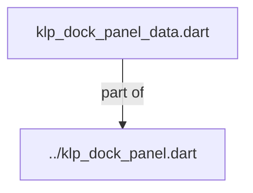
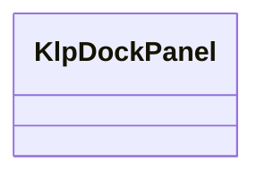

# klp_dock_panel_data.dart：直接依賴與宣告架構

[回到目錄](README.md) · [來源檔案](../../../../../../../../lib/src/features/workspace/shell/docking/models/klp_dock_panel_data.dart)

## 範圍

核心是 `lib/src/features/workspace/shell/docking/models/klp_dock_panel_data.dart`。主要視角為該檔案明寫的 import／export／part；輔助視角為本檔宣告及 extends／implements／with／on 關係。只展開一層外部邊界。

## 直接依賴圖

## 依賴證據

| 關係 | 原始 directive | 來源 |
|---|---|---|
| part of | <code>part of &#x27;../klp_dock_panel.dart&#x27;;</code> | [lib/src/features/workspace/shell/docking/models/klp_dock_panel_data.dart:1](../../../../../../../../lib/src/features/workspace/shell/docking/models/klp_dock_panel_data.dart#L1) |

## 宣告關係圖

本組節點是本檔宣告；沒有箭頭的宣告未在此圖主張互相依賴。

## 宣告與成員證據

成員包含 public 與 private；簽章取自來源，省略函式本體與欄位初始值。`(inferred)` 表示來源未明寫型別；建構子只顯示參數部分，不含初始化列表。

### KlpDockPanel

ClassDeclaration · public · [lib/src/features/workspace/shell/docking/models/klp_dock_panel_data.dart:3](../../../../../../../../lib/src/features/workspace/shell/docking/models/klp_dock_panel_data.dart#L3)

<code>class KlpDockPanel</code>

來源註解摘要：可停駐布局中的產品中立面板描述；內容與可放置方向由呼叫端提供。

| 成員 | 可見性 | 簽章／型別 | 來源註解摘要 | 證據 |
|---|---|---|---|---|
| field <code>id</code> | public | <code>final String id</code> |  | [lib/src/features/workspace/shell/docking/models/klp_dock_panel_data.dart:6](../../../../../../../../lib/src/features/workspace/shell/docking/models/klp_dock_panel_data.dart#L6) |
| field <code>header</code> | public | <code>final Widget? header</code> |  | [lib/src/features/workspace/shell/docking/models/klp_dock_panel_data.dart:7](../../../../../../../../lib/src/features/workspace/shell/docking/models/klp_dock_panel_data.dart#L7) |
| field <code>content</code> | public | <code>final Widget content</code> |  | [lib/src/features/workspace/shell/docking/models/klp_dock_panel_data.dart:8](../../../../../../../../lib/src/features/workspace/shell/docking/models/klp_dock_panel_data.dart#L8) |
| field <code>contentScrollController</code> | public | <code>final ScrollController? contentScrollController</code> |  | [lib/src/features/workspace/shell/docking/models/klp_dock_panel_data.dart:9](../../../../../../../../lib/src/features/workspace/shell/docking/models/klp_dock_panel_data.dart#L9) |
| field <code>isDraggable</code> | public | <code>final bool isDraggable</code> |  | [lib/src/features/workspace/shell/docking/models/klp_dock_panel_data.dart:10](../../../../../../../../lib/src/features/workspace/shell/docking/models/klp_dock_panel_data.dart#L10) |
| field <code>allowBottom</code> | public | <code>final bool allowBottom</code> | 是否允許放入 Stage 下方的 Bottom Area。 | [lib/src/features/workspace/shell/docking/models/klp_dock_panel_data.dart:13](../../../../../../../../lib/src/features/workspace/shell/docking/models/klp_dock_panel_data.dart#L13) |
| field <code>allowSide</code> | public | <code>final bool allowSide</code> | 是否允許放入 Stage 左右兩側的 Area。 | [lib/src/features/workspace/shell/docking/models/klp_dock_panel_data.dart:16](../../../../../../../../lib/src/features/workspace/shell/docking/models/klp_dock_panel_data.dart#L16) |
| field <code>actions</code> | public | <code>final List&lt;KlpDockHeaderAction&gt; actions</code> | Active panel 顯示於 Dock Header 右側的產品動作。 | [lib/src/features/workspace/shell/docking/models/klp_dock_panel_data.dart:19](../../../../../../../../lib/src/features/workspace/shell/docking/models/klp_dock_panel_data.dart#L19) |
| constructor <code>KlpDockPanel</code> | public | <code>const KlpDockPanel({ required this.id, this.header, required this.content, this.contentScrollController, bool isDraggable = true, this.allowBottom = true, this.allowSide = true, this.actions = const [], })</code> |  | [lib/src/features/workspace/shell/docking/models/klp_dock_panel_data.dart:21](../../../../../../../../lib/src/features/workspace/shell/docking/models/klp_dock_panel_data.dart#L21) |

## 閱讀說明與限制

箭頭只表示來源明寫的靜態關係；import 不等於呼叫。未分析動態呼叫、欄位的實際物件擁有權、狀態轉移或渲染流程；型別未進行語意解析，繼承目標保留原始型別拼寫。public／private 依 Dart 名稱前綴判斷；public 宣告不代表已由 `lib/kallopis.dart` 匯出。

本頁由 `tool/architecture_atlas` 產生；編輯來源或生成工具後重新產生，避免手改本頁。
