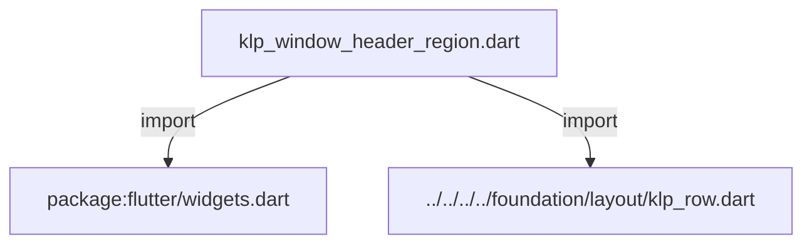

# klp_window_header_region.dart：直接依賴與宣告架構

[回到目錄](README.md) · [來源檔案](../../../../../../../lib/src/features/workspace/shell/internal/klp_window_header_region.dart)

## 範圍

核心是 `lib/src/features/workspace/shell/internal/klp_window_header_region.dart`。主要視角為該檔案明寫的 import／export／part；輔助視角為本檔宣告及 extends／implements／with／on 關係。只展開一層外部邊界。

## 直接依賴圖

## 依賴證據

| 關係 | 原始 directive | 來源 |
|---|---|---|
| import | <code>import &#x27;package:flutter/widgets.dart&#x27;;</code> | [lib/src/features/workspace/shell/internal/klp_window_header_region.dart:4](../../../../../../../lib/src/features/workspace/shell/internal/klp_window_header_region.dart#L4) |
| import | <code>import &#x27;../../../../foundation/layout/klp_row.dart&#x27;;</code> | [lib/src/features/workspace/shell/internal/klp_window_header_region.dart:5](../../../../../../../lib/src/features/workspace/shell/internal/klp_window_header_region.dart#L5) |

## 宣告關係圖

本檔沒有 class／enum／mixin／extension 宣告；頂層函式、變數與 typedef 見下表。

## 宣告與成員證據

成員包含 public 與 private；簽章取自來源，省略函式本體與欄位初始值。`(inferred)` 表示來源未明寫型別；建構子只顯示參數部分，不含初始化列表。

### buildKlpWindowHeaderRegion

FunctionDeclaration · public · [lib/src/features/workspace/shell/internal/klp_window_header_region.dart:7](../../../../../../../lib/src/features/workspace/shell/internal/klp_window_header_region.dart#L7)

<code>Widget buildKlpWindowHeaderRegion({ required List&lt;Widget&gt; children, required AlignmentGeometry alignment, })</code>

來源註解摘要：建立可保留自然寬度，並在空間不足時依方向裁切的標題列區域。

## 閱讀說明與限制

箭頭只表示來源明寫的靜態關係；import 不等於呼叫。未分析動態呼叫、欄位的實際物件擁有權、狀態轉移或渲染流程；型別未進行語意解析，繼承目標保留原始型別拼寫。public／private 依 Dart 名稱前綴判斷；public 宣告不代表已由 `lib/kallopis.dart` 匯出。

本頁由 `tool/architecture_atlas` 產生；編輯來源或生成工具後重新產生，避免手改本頁。
