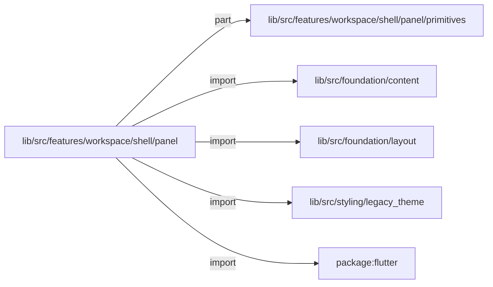
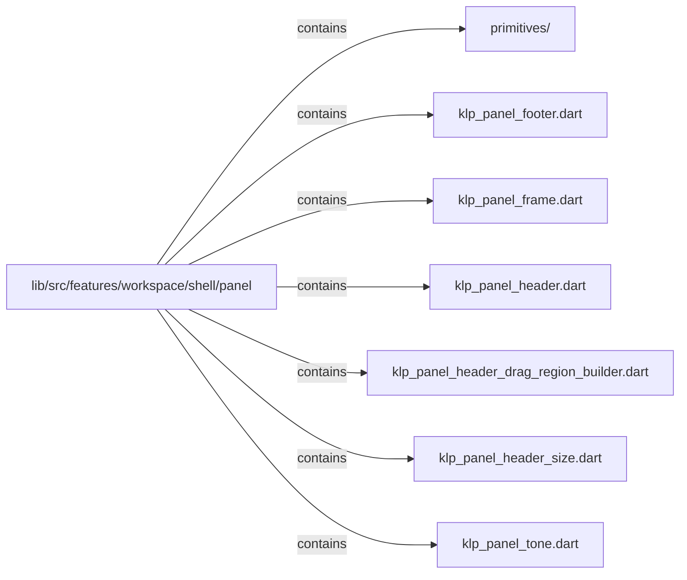

# lib/src/features/workspace/shell/panel：架構分析入口

[上一層](../README.md)

## 範圍

閱讀 `lib/src/features/workspace/shell/panel` 的直接子目錄與 Dart 檔案。結構圖表示實際檔案包含關係；依賴圖表示本層檔案明寫的 directives。每個檔案頁另列直接依賴、宣告、欄位、方法、建構子及行號證據。

## 本層直接依賴圖

箭頭以本層 Dart 檔案明寫的 directive 彙總到目標所在目錄或外部套件邊界；不遞迴將子目錄依賴算入本層。相同目標的不同 directive 類型分開計數。

| 目標邊界 | 關係 | directive 數 | 第一筆來源證據 |
|---|---|---|---|
| <code>lib/src/features/workspace/shell/panel/primitives</code> | part | 2 | [lib/src/features/workspace/shell/panel/klp_panel_frame.dart:12](../../../../../../../lib/src/features/workspace/shell/panel/klp_panel_frame.dart#L12) |
| <code>lib/src/foundation/content</code> | import | 1 | [lib/src/features/workspace/shell/panel/klp_panel_header.dart:5](../../../../../../../lib/src/features/workspace/shell/panel/klp_panel_header.dart#L5) |
| <code>lib/src/foundation/layout</code> | import | 2 | [lib/src/features/workspace/shell/panel/klp_panel_frame.dart:3](../../../../../../../lib/src/features/workspace/shell/panel/klp_panel_frame.dart#L3) |
| <code>lib/src/styling/legacy_theme</code> | import | 3 | [lib/src/features/workspace/shell/panel/klp_panel_footer.dart:3](../../../../../../../lib/src/features/workspace/shell/panel/klp_panel_footer.dart#L3) |
| <code>package:flutter</code> | import | 4 | [lib/src/features/workspace/shell/panel/klp_panel_footer.dart:1](../../../../../../../lib/src/features/workspace/shell/panel/klp_panel_footer.dart#L1) |

### 同目錄依賴

| 來源 → 目標 | 關係 | 證據 |
|---|---|---|
| <code>klp_panel_frame.dart → klp_panel_footer.dart</code> | import | [lib/src/features/workspace/shell/panel/klp_panel_frame.dart:5](../../../../../../../lib/src/features/workspace/shell/panel/klp_panel_frame.dart#L5) |
| <code>klp_panel_frame.dart → klp_panel_header_size.dart</code> | import | [lib/src/features/workspace/shell/panel/klp_panel_frame.dart:6](../../../../../../../lib/src/features/workspace/shell/panel/klp_panel_frame.dart#L6) |
| <code>klp_panel_frame.dart → klp_panel_tone.dart</code> | import | [lib/src/features/workspace/shell/panel/klp_panel_frame.dart:7](../../../../../../../lib/src/features/workspace/shell/panel/klp_panel_frame.dart#L7) |
| <code>klp_panel_frame.dart → klp_panel_header_size.dart</code> | export | [lib/src/features/workspace/shell/panel/klp_panel_frame.dart:9](../../../../../../../lib/src/features/workspace/shell/panel/klp_panel_frame.dart#L9) |
| <code>klp_panel_frame.dart → klp_panel_tone.dart</code> | export | [lib/src/features/workspace/shell/panel/klp_panel_frame.dart:10](../../../../../../../lib/src/features/workspace/shell/panel/klp_panel_frame.dart#L10) |
| <code>klp_panel_header.dart → klp_panel_header_drag_region_builder.dart</code> | import | [lib/src/features/workspace/shell/panel/klp_panel_header.dart:6](../../../../../../../lib/src/features/workspace/shell/panel/klp_panel_header.dart#L6) |
| <code>klp_panel_header.dart → klp_panel_header_drag_region_builder.dart</code> | export | [lib/src/features/workspace/shell/panel/klp_panel_header.dart:8](../../../../../../../lib/src/features/workspace/shell/panel/klp_panel_header.dart#L8) |

## 目錄結構圖

## 子目錄

| 目錄 | 導航 | 來源證據 |
|---|---|---|
| `primitives/` | [架構入口](primitives/README.md) | [來源目錄](../../../../../../../lib/src/features/workspace/shell/panel/primitives) |

## 本層檔案

| 檔案 | 宣告 | 細節 | 來源證據 |
|---|---|---|---|
| `klp_panel_footer.dart` | KlpPanelFooter | [架構與 API](klp_panel_footer.md) | [lib/src/features/workspace/shell/panel/klp_panel_footer.dart:1](../../../../../../../lib/src/features/workspace/shell/panel/klp_panel_footer.dart#L1) |
| `klp_panel_frame.dart` | KlpPanelFrame | [架構與 API](klp_panel_frame.md) | [lib/src/features/workspace/shell/panel/klp_panel_frame.dart:1](../../../../../../../lib/src/features/workspace/shell/panel/klp_panel_frame.dart#L1) |
| `klp_panel_header.dart` | KlpPanelHeader | [架構與 API](klp_panel_header.md) | [lib/src/features/workspace/shell/panel/klp_panel_header.dart:1](../../../../../../../lib/src/features/workspace/shell/panel/klp_panel_header.dart#L1) |
| `klp_panel_header_drag_region_builder.dart` | KlpPanelHeaderDragRegionBuilder | [架構與 API](klp_panel_header_drag_region_builder.md) | [lib/src/features/workspace/shell/panel/klp_panel_header_drag_region_builder.dart:1](../../../../../../../lib/src/features/workspace/shell/panel/klp_panel_header_drag_region_builder.dart#L1) |
| `klp_panel_header_size.dart` | KlpPanelHeaderSize | [架構與 API](klp_panel_header_size.md) | [lib/src/features/workspace/shell/panel/klp_panel_header_size.dart:1](../../../../../../../lib/src/features/workspace/shell/panel/klp_panel_header_size.dart#L1) |
| `klp_panel_tone.dart` | KlpPanelTone | [架構與 API](klp_panel_tone.md) | [lib/src/features/workspace/shell/panel/klp_panel_tone.dart:1](../../../../../../../lib/src/features/workspace/shell/panel/klp_panel_tone.dart#L1) |

## 閱讀說明

箭頭只表示來源明寫的靜態關係；import 不等於呼叫。未分析動態呼叫、欄位的實際物件擁有權、狀態轉移或渲染流程；型別未進行語意解析，繼承目標保留原始型別拼寫。public／private 依 Dart 名稱前綴判斷；public 宣告不代表已由 `lib/kallopis.dart` 匯出。

本頁的目錄與檔案由來源清冊產生；`manifest.json` 位於本圖集根目錄，可核對 SHA-256 與覆蓋數。人工模組摘要存於 `tool/architecture_atlas/briefs/`，重新生成時保留。
